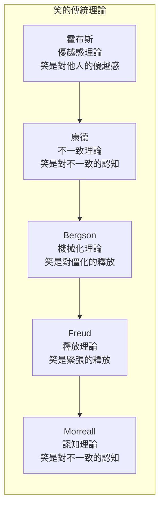
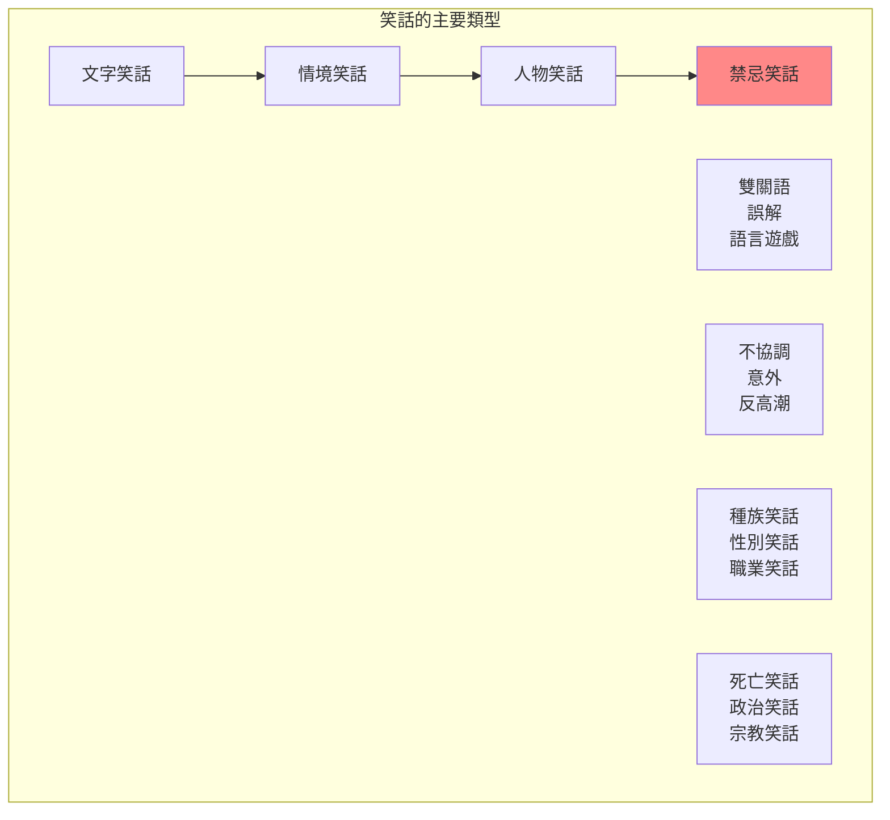
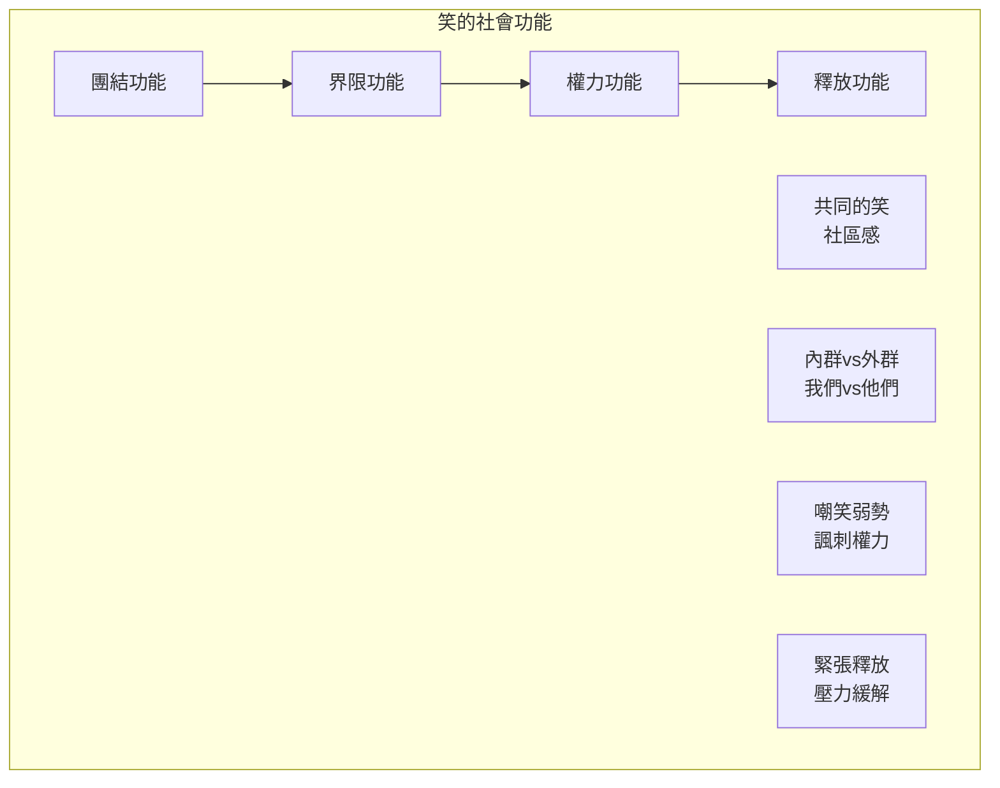
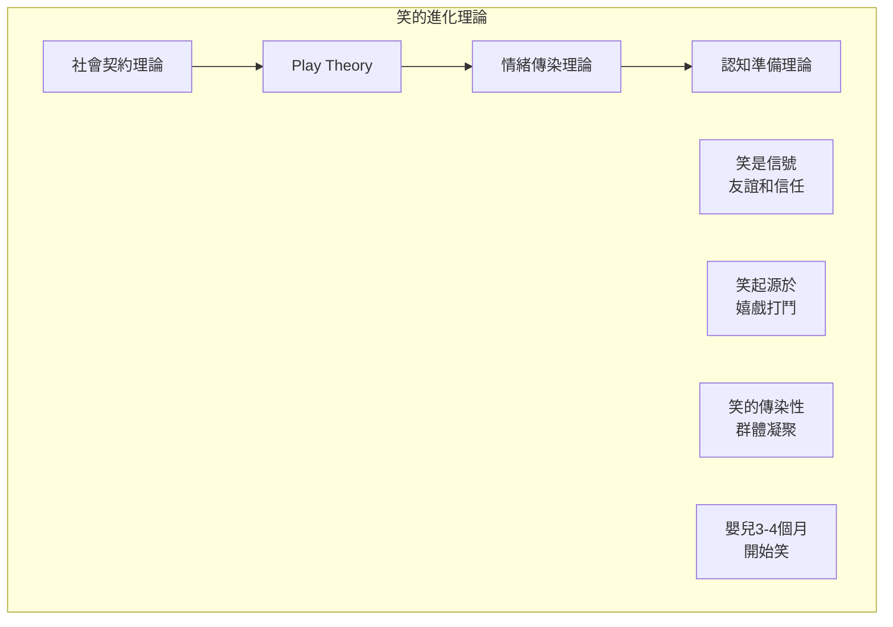
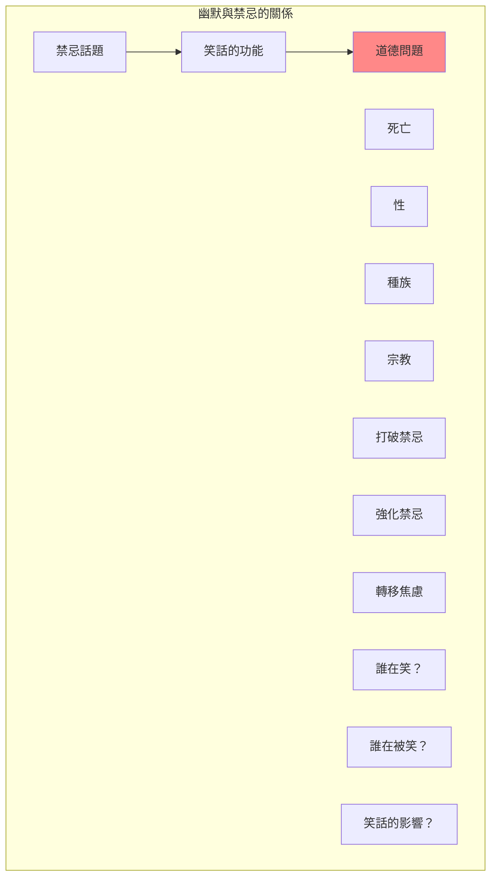

# FYS 66K 笑的哲學 / The Philosophy of Laughter

**Instructor**: Peter E. Gordon
**Department**: History, Harvard
**Official source**: firstyearseminarprogram.college.harvard.edu
**Big Question**: 什麼讓我們覺得好笑？為什麼？
**Style**: 袁騰飛式

---

## 問題 1：5 個 SPECIFIC 核心心智模型

### 1. 笑的傳統理論 (Traditional Theories of Laughter)
**真實學者**: Henri Bergson (法國哲學家) —《笑》(1900) 分析笑的社會功能。  
**真實事件**: 17世紀霍布斯的「優越感理論」；18世紀康德的「不一致理論」；19世紀斯賓塞的「溢溢理論」。  
**真實數字**: 西方哲學傳統中至少有5種主要的笑理論。

### 2.  Freud的笑理論 (Freud's Theory of Humor)
**真實學者**: Sigmund Freud (維也納) —《玩笑及其與無意識的關係》(1905) 分析笑的心理機制。  
**真實事件**: Freud的笑理論與他的精神分析理論緊密相連；笑的「釋放」功能；禁忌話題的笑話。  
**真實數字**: Freud認為笑是釋放心理緊張的機制。

### 3. 不一致理論與認知科學 (Incongruity Theory and Cognitive Science)
**真實學者**: John Morreall (威廉與瑪麗學院) — 分析笑認知科學基礎。  
**真實事件**: 笑的認知機制研究；預期與現實的不一致觸發笑；笑的反射性本質。  
**真實數字**: 嬰兒在約3-4個月大時開始笑。

### 4. 社會與文化維度 (Social and Cultural Dimensions of Laughter)
**真實學者**: Mary Douglas (倫敦經濟學院) —《純潔與危險》(1966) 分析笑的社會功能。  
**真實事件**: 笑的社會界限功能；笑話中的禁忌話題；黑色幽默的文化意義。  
**真實數字**: 不同文化中約有60%的笑話涉及禁忌話題。

### 5. 笑的道德與政治維度 (Moral and Political Dimensions of Laughter)
**真實學者**: Simon Critchley (紐約大學) —《論幽默》(2002) 分析笑的政治性。  
**真實事件**: 政治諷刺的歷史；納粹的笑話；種族主義笑話的道德問題。  
**真實數字**: 納粹集中營中的笑話是研究笑話政治功能的重要歷史資料。

---

## 問題 2：3 個 SPECIFIC 根本分歧

### 分歧一：笑是「理性的」還是「非理性的」
**學者A**: 認知科學觀點  
論點：笑是一種認知反應，有其理性基礎。

**學者B**: 存在主義觀點  
論點：笑揭示了人類存在的荒謬性，是非理性的。

### 分歧二：笑話的道德地位
**學者A**: 自由派觀點  
論點：笑話不應被審查，言論自由優先。

**學者B**: 批評者  
論點：某些笑話強化了有害的刻板印象，應被抵制。

### 分歧三：幽默的普遍性
**學者A**: 普遍論觀點  
論點：笑的生理機制是普遍的。

**學者B**: 文化論觀點  
論點：什麼是可笑的取決於文化。

---

## 問題 3：10 個 PROBING 深度問題

1. 比較康德、霍布斯和Bergson的笑理論：這三個理論哪一個最準確地解釋了為什麼我們會笑？

2. Freud的笑話理論如何與他的精神分析理論相連？笑話如何成為研究人類心理的窗口？

3. 為什麼有些笑話「不好笑」？什麼決定了一個笑話是否成功？

4. 分析政治諷刺（如《查理周刊》）的功能：笑話如何成為批評權力的工具？這種功能有什麼限制？

5. 為什麼有些笑話涉及禁忌話題（如死亡、種族、性）？這些笑話是對禁忌的「打破」還是「強化」？

6. 笑的傳染性（如在一群人中笑容易傳播）是否有進化論的解釋？為什麼笑是一種「社會」活動？

7. 比較不同文化中的笑話：某些笑話是否「不可翻譯」？這是否意味著幽默是完全相對的？

8. 納粹集中營中的笑話——這種笑話是對創傷的「合理」反應還是對道德的「背叛」？

9. 人工智能能否理解笑話？讓一台電腦笑和讓一個人笑有什麼本質區別？

10. 如果笑是「對不一致的認知反應」——那麼什麼是「存在主義的笑」？這種笑與「社會性的笑」有什麼不同？

---

## 5 個 Mermaid 圖解

### 圖1：笑的理論光譜

### 圖2：笑話的類型

### 圖3：笑的社會功能

### 圖4：笑的進化基礎

### 圖5：幽默與禁忌

---

## 總結

**FYS 66K** 的核心洞察：笑是一個看似簡單但實際上極其複雜的現象。理解笑的哲學不僅是理解幽默的本質，更是理解人類認知、社會關係和道德判斷的窗口。

**三個必須記住的數字**：
- **約3-4個月**：嬰兒開始笑的年齡
- **約60%**：涉及禁忌話題的笑話比例
- **5種**：西方哲學傳統中主要的笑理論數量

**必須記住的哲學家**：
- **霍布斯**：優越感理論
- **康德**：不一致理論
- **Bergson**：機械化理論
- **Freud**：釋放理論
- **Critchley**：存在主義幽默

**袁騰飛金句**：「笑是人類最神秘的行為之一。為什麼會笑？因為別人摔倒？因為一個雙關語？因為死亡的荒謬？笑沒有單一的解釋——但每一個理論都告訴我們一些關於人類心理和社會的真相。」