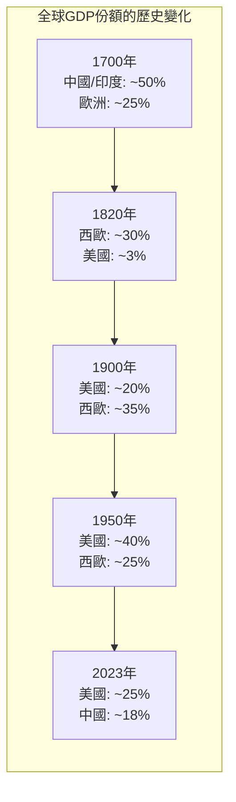
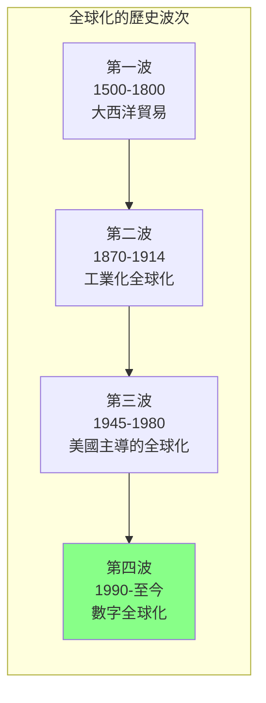
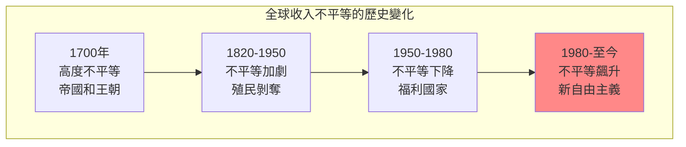
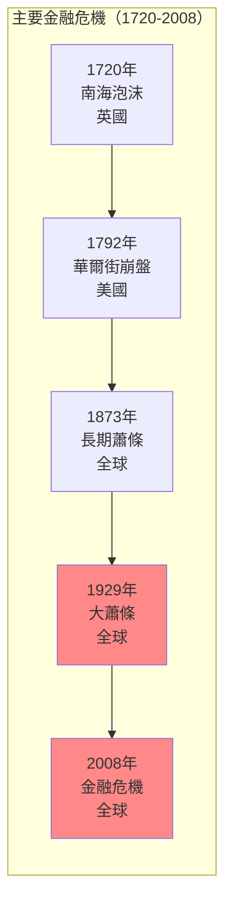
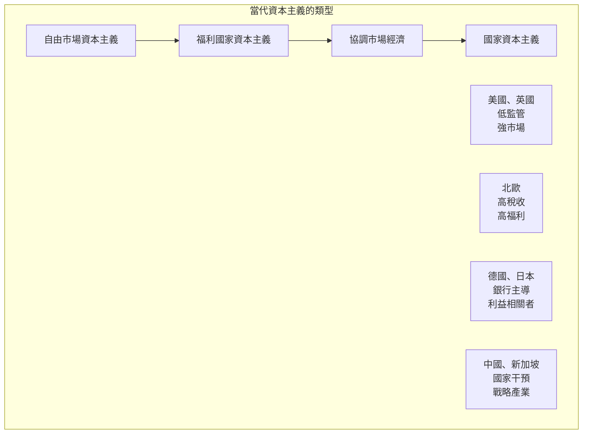

# FYS 71M 全球資本主義 / Global Capitalism: Past, Present, Future

**Instructor**: Sophus Reinert
**Department**: First-Year Seminar, Harvard Business School
**Official source**: beta.my.harvard.edu
**Big Question**: 什麼塑造了過去1000年來世界的資本主義？
**Style**: 袁騰飛式

---

## 問題 1：5 個 SPECIFIC 核心心智模型

### 1. 資本主義的歷史起源 (Historical Origins of Capitalism)
**真實學者**: Immanuel Wallerstein (耶魯大學) —《現代世界體系》(1974) 分析世界體系理論。  
**真實事件**: 15世紀地理大發現；1500年大西洋奴隸貿易開始；1602年荷蘭東印度公司成立。  
**真實數字**: 1500年大西洋奴隸貿易開始後，約1200萬非洲人被贩运。

### 2. 工業革命與資本主義轉型 (Industrial Revolution and Capitalist Transformation)
**真實學者**: Robert Allen (牛津大學) —《高工資經濟學》(2009) 分析工業革命的條件。  
**真實事件**: 1760年代英國紡織機械化；1789年法國大革命；1848年《共產黨宣言》。  
**真實數字**: 1750-1850年間，英國實際工資增長約30%。

### 3. 帝國主義與資本主義全球化 (Imperialism and Globalization of Capitalism)
**真實學者**: Kevin O'Rourke (牛津大學) — 分析全球化與民粹主義。  
**真實事件**: 1880年代殖民非洲瓜分；1914年一戰爆發；1944年布雷頓森林體系。  
**真實數字**: 1880年代「瓜分非洲」使欧洲控制了约84%的非洲大陆。

### 4. 大蕭條與福利國家 (Great Depression and the Welfare State)
**真實學者**: Ben Bernanke (聯準會前主席) — 分析大蕭條的教訓。  
**真實事件**: 1929年10月「黑色星期二」；1933年羅斯福新政；1938年《公平勞動標準法》。  
**真實數字**: 大蕭條期間，美國失業率最高達25%。

### 5. 新自由主義與當代資本主義 (Neoliberalism and Contemporary Capitalism)
**真實學者**: David Harvey (NYU) —《新自由主義簡史》(2005) 分析新自由主義的全球擴張。  
**真實事件**: 1979年柴契爾執政；1980年代華盛頓共識；2008年金融危機。  
**真實數字**: 2008年金融危機後，全球量化寬鬆政策向市場注入了约10兆美元。

---

## 問題 2：3 個 SPECIFIC 根本分歧

### 分歧一：資本主義是什麼
**學者A**: 自由市場經濟學家  
論點：資本主義是自由市場和私有財產的制度。

**學者B**: Karl Polanyi (牛津) —《巨轉》(1944)  
論點：資本主義是市場關係嵌入社會的歷史過程。

### 分歧二：工業革命的起源
**學者A**: 地理/資源解釋  
論點：英國的煤炭資源和地理條件是關鍵。

**學者B**: 制度解釋  
論點：英國的專利制度和法治是關鍵。

### 分歧三：全球化是否可逆
**學者A**: 全球化論者  
論點：全球化是技術和市場力量的自然結果，不可逆轉。

**學者B**: 民粹主義者  
論點：全球化是政治選擇，可以通過政策逆轉。

---

## 問題 3：10 個 PROBING 深度問題

1. 比較中世紀的商業革命和今天的信息革命：這兩次「革命」如何改變了經濟遊戲規則？

2. 奴隸貿易在大西洋經濟中的角色是什麼？為什麼資本主義的「道德起源」離不開奴隸勞動？

3. 為什麼工業革命發生在英國而不是中國或印度？這種「分流」對現代世界的不平等有什麼影響？

4. 1929年大蕭條和2008年金融危機有什麼相似和不同？這兩次危機如何改變了資本主義的制度？

5. 新自由主義（1970年代至今）對全球不平等有什麼影響？這種影響在已開發國家和開發中國家之間有什麼差異？

6. 為什麼中國共產黨可以實行「市場社會主義」？這種制度創新是否挑戰了我們對「資本主義」的簡單定義？

7. 比較亞當·斯密的「看不見的手」和今天的人工智慧：市場的「看不見的手」是否正在被演算法的「看得見的手」所取代？

8. 為什麼美國的貧富差距比其他已開發國家更大？這種差距與美國資本主義的「特殊主義」有什麼關係？

9. 加密貨幣和區塊鏈技術是否代表了資本主義的下一次轉型？這種轉型對國家、金融機構和個人有什麼影響？

10. 如果馬克思和恩格斯在今天寫《共產黨宣言》——他們會對21世紀的資本主義說什麼？

---

## 5 個 Mermaid 圖解

### 圖1：全球GDP的歷史變化

### 圖2：全球化的波次

### 圖3：收入不平等的「象」形

### 圖4：金融危機的歷史模式

### 圖5：資本主義制度的多樣性

---

## 總結

**FYS 71M** 的核心洞察：全球資本主義不是一個自然現象，而是一個歷史構建。從奴隸貿易到信息革命，從帝國主義到區塊鏈——每一次轉型都是權力、制度和技術互動的結果。

**三個必須記住的數字**：
- **約10兆美元**：2008年金融危機後全球量化寬鬆總量
- **約1200萬人**：大西洋奴隸貿易中被贩运的非洲人數量
- **84%**：1880年代欧洲控制的非洲大陆比例

**必須記住的日期**：
- **1500年**：大西洋奴隸貿易開始
- **1760年代**：英國工業革命開始
- **1944年7月**：布雷頓森林會議
- **2008年9月15日**：雷曼兄弟破產

**袁騰飛金句**：「資本主義不是一個有開關的機器，而是一個不斷演化的生物。從奴隸船上到華爾街，從棉紡廠到亞馬遜倉庫——資本主義的DNA一直在，但它的形式一直在變。問題不是資本主義是好是壞，而是誰在塑造它的規則，誰從中受益。」