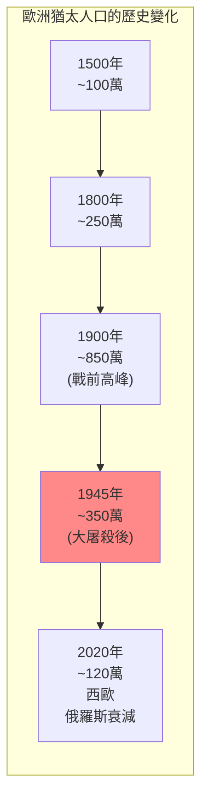
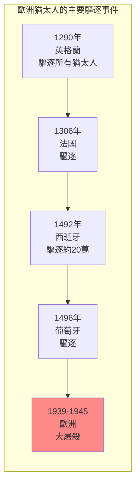
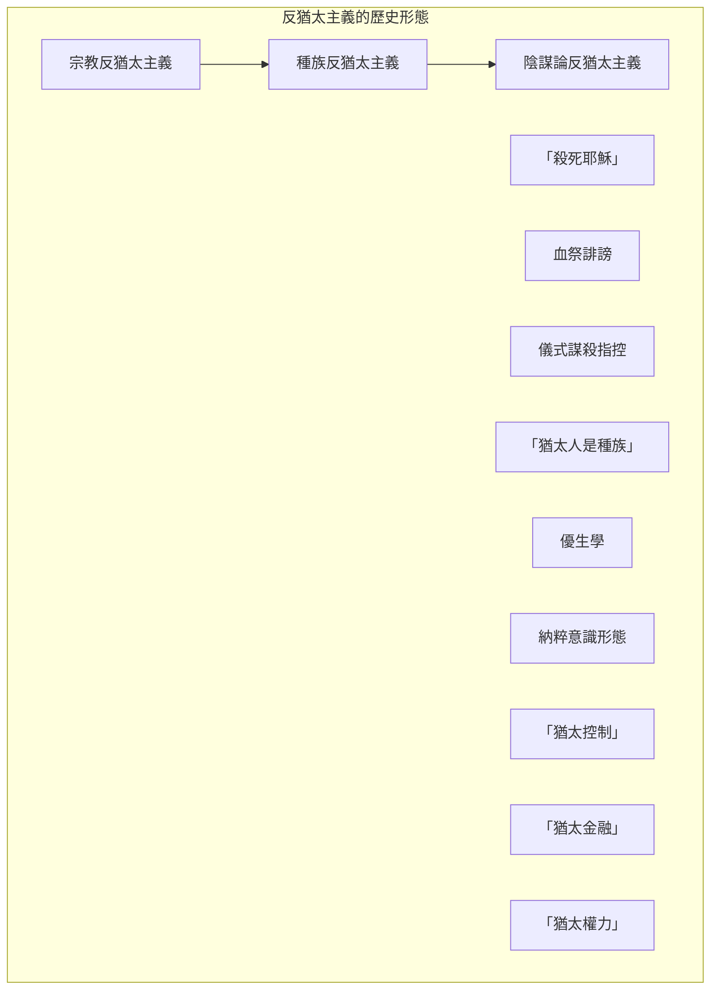
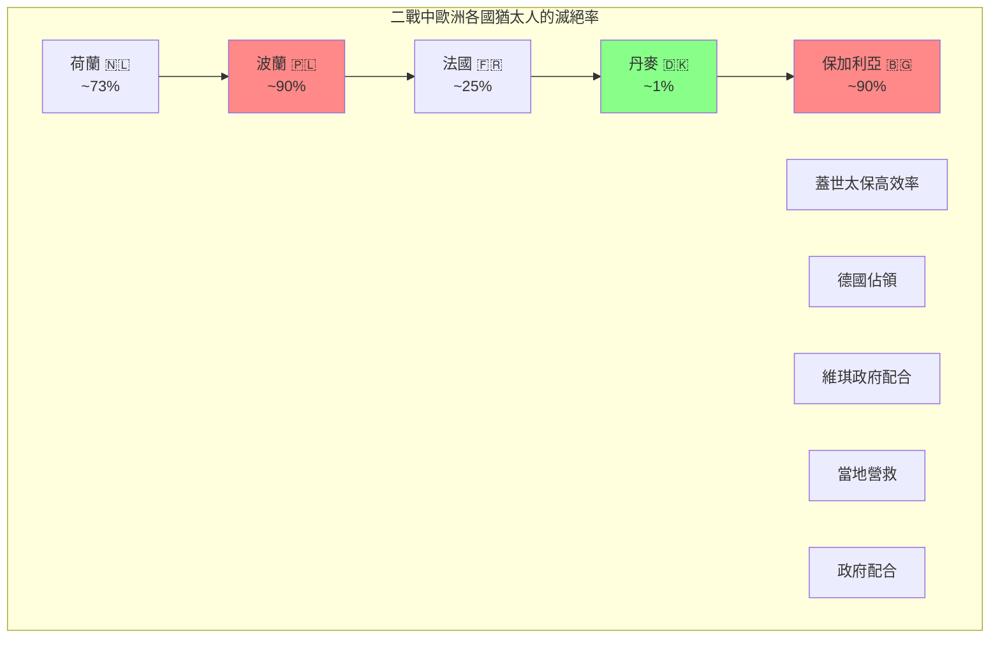
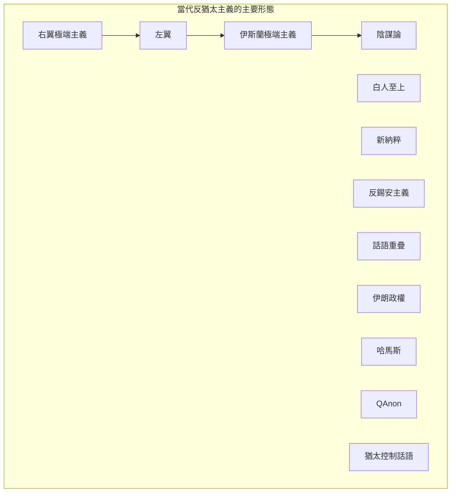

# FYS 73V 反猶太主義 / Antisemitism, Then and Now

**Instructor**: Derek Penslar
**Department**: History / Center for Jewish Studies, Harvard
**Official source**: cjs.fas.harvard.edu
**Big Question**: 人們為什麼互相仇恨？為什麼某些群體比其他群體更容易被仇恨？
**Style**: research-based

---

## 問題 1：5 個 SPECIFIC 核心心智模型

### 1. 反猶太主義的古老根源 (Ancient Roots of Antisemitism)
**真實學者**: Robert Chazan (紐約大學) — 分析中世紀反猶太主義的起源。  
**真實事件**: 70年耶路撒冷聖殿被毀；約135年巴爾科赫巴起義失敗；4世紀羅馬帝國接受基督教為國教。  
**真實數字**: 中世紀歐洲約有200-300萬猶太人。

### 2. 血祭誹謗與驅逐 (Blood Libel and Expulsions)
**真實學者**: David Nirenberg (芝加哥大學) —《反-猶太主義》(2013) 分析血祭誹謗的歷史。  
**真實事件**: 1144年英國諾里奇血祭誹謗；1290年英格蘭驅逐猶太人；1492年西班牙驅逐猶太人。  
**真實數字**: 1492年約20萬猶太人被驅逐出西班牙。

### 3. 現代反猶太主義的興起 (Rise of Modern Antisemitism)
**真實學者**: Hannah Arendt (普林斯頓) —《極權主義的起源》(1951) 分析現代反猶太主義。  
**真實事件**: 1873年維也納股票市場崩盤；1881年沙皇遇刺後俄國大屠殺；1894年德雷福斯案。  
**真實數字**: 1881-1884年俄國大屠殺中約100萬猶太人被迫離開家園。

### 4. 大屠殺與種族反猶太主義 (Holocaust and Racial Antisemitism)
**真實學者**: Raul Hilberg (加州大學) —《歐洲猶太人的毀滅》(1961) 大屠殺經典研究。  
**真實事件**: 1933年納粹上台；1942年萬湖會議；1945年解放集中營。  
**真實數字**: 約600萬猶太人在大屠殺中被殺害。

### 5. 當代反猶太主義 (Contemporary Antisemitism)
**真實學者**: Alvin Rosenfeld (印第安納大學) — 分析當代反猶太主義的形態。  
**真實事件**: 2014年法國連環襲擊；2018年 Pittsburgh 猶太教堂槍擊；2023年大學校園抗議。  
**真實數字**: FBI統計：2022年美國約17%的仇恨犯罪目標是猶太人。

---

## 問題 2：3 個 SPECIFIC 根本分歧

### 分歧一：大屠殺是否是「獨特的」
**學者A**: Elie Wiesel等大屠殺記憶倡導者  
論點：大屠殺是人類歷史上的獨特災難，不可比較。

**學者B**: 比較歷史學家  
論點：大屠殺可以與其他種族滅絕進行結構性比較。

### 分歧二：反以色列主義和反猶太主義的關係
**學者A**: 批評者如Alan Dershowitz  
論點：對以色列的批評有時是反猶太主義的掩飾。

**學者B**: 批評者如Norman Finkelstein  
論點：這種等同是將批評以色列武器化的手段。

### 分歧三：反猶太主義是否可以「治愈」
**學者A**: 教育論者  
論點：教育可以減少偏見和仇恨。

**學者B**: 結構論者  
論點：反猶太主義是深層社會結構的產物，不能簡單通過教育「治愈」。

---

## 問題 3：10 個 PROBING 深度問題

1. 比較中世紀的宗教反猶太主義和現代的種族反猶太主義：這兩種反猶太主義有什麼本質區別？

2. 「血祭誹謗」(Blood Libel) 是中世紀反猶太主義的核心話語——為什麼猶太人「用基督徒的血」這種指控會出現並持續數百年？

3. 1492年西班牙驅逐猶太人——這個「光榮的」地理大發現年同時也是20萬猶太人被驅逐的年份。這種矛盾如何揭示了基督教歐洲的身份認同？

4. 為什麼反猶太主義在歐洲「科學」蓬勃發展的19世紀達到了新的高峰？種族科學和反猶太主義之間有什麼聯繫？

5. 分析大屠殺的「官僚主義」維度：600萬人的屠殺不是由「怪物」實施的，而是由「普通」官僚、醫生和專業人士執行的。這個事實如何挑戰了我們對邪惡的理解？

6. 比較德國和荷蘭的反猶太主義：為什麼荷蘭猶太人的滅絕率（約73%）比法國（約25%）高得多？

7. 當代「反錫安主義」(Anti-Zionism) 和「反猶太主義」之間的界線在哪裡？這個界線是否有意義？

8. 分析2023年大學校園的反以色列抗議：這些抗議是否代表了對以色列政策的合理批評，還是掩飾的反猶太主義？

9. 為什麼反猶太主義是「世界上最古老的仇恨」？這種持久性背後的原因是什麼？

10. 如果歷史是我們的嚮導——有什麼機制可以減少反猶太主義？這些機制是否可以應用於減少其他形式的偏見和仇恨？

---

## 5 個 Mermaid 圖解

### 圖1：歐洲猶太人口的歷史變化

### 圖2：歐洲猶太人的主要驅逐

### 圖3：反猶太主義的歷史形態

### 圖4：歐洲各國猶太人滅絕率

### 圖5：當代反猶太主義的形態

---

## 總結

**FYS 73V** 的核心洞察：反猶太主義是世界上歷史最悠久、持續時間最長的仇恨形式之一。從中世紀的血祭誹謗到現代的種族理論，從納粹大屠殺到當代的校園抗議——這種仇恨的形態在不斷變化，但其核心邏輯卻驚人地一致。

**三個必須記住的數字**：
- **約600萬人**：大屠殺中被殺害的猶太人人數
- **20萬人**：1492年被驅逐出西班牙的猶太人數量
- **17%**：2022年FBI統計中美國仇恨犯罪的目標群體比例（猶太人）

**必須記住的日期**：
- **70年**：耶路撒冷第二聖殿被羅馬人摧毀
- **1290年**：英格蘭驅逐所有猶太人
- **1492年8月**：西班牙驅逐猶太人
- **1942年1月20日**：萬湖會議

**research-based金句**：「反猶太主義是世界上唯一一個有著『國際日』的仇恨——1月27日是國際大屠殺紀念日。但諷刺的是，這種仇恨到今天還在。從納粹到QAnon，從血祭誹謗到『猶太控制了媒體』——這個世界對猶太人的偏見比我們願意承認的要持久得多。」