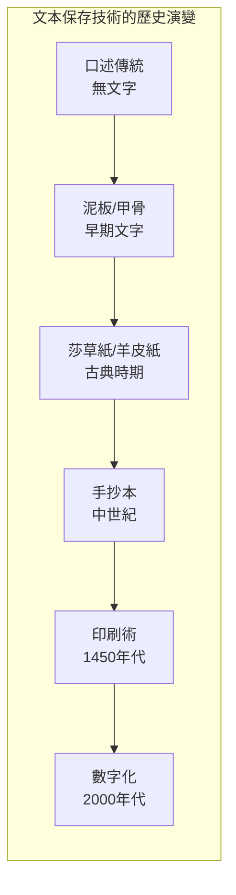
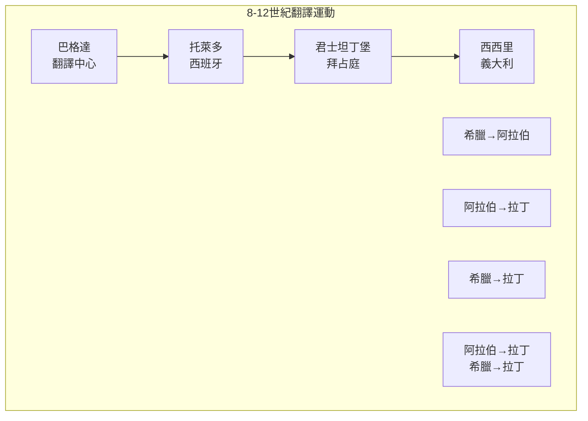
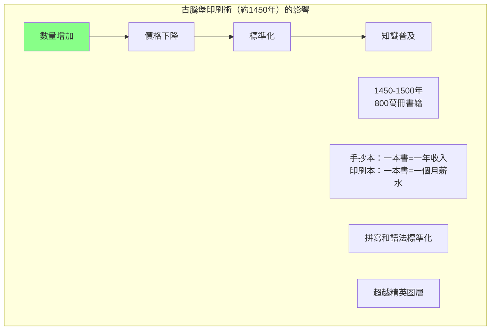
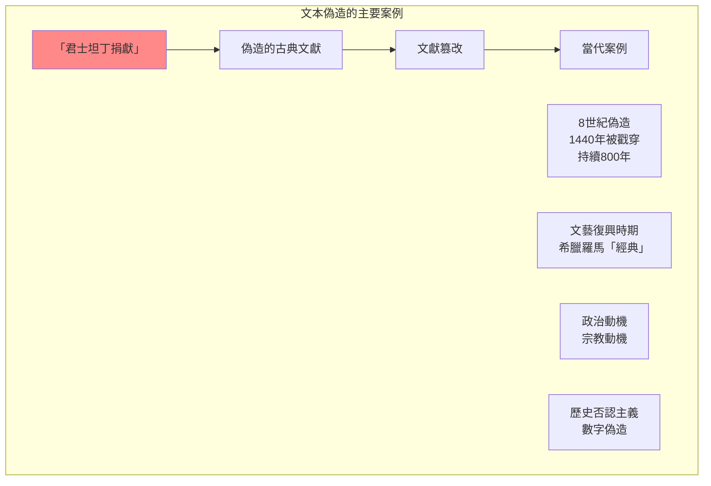
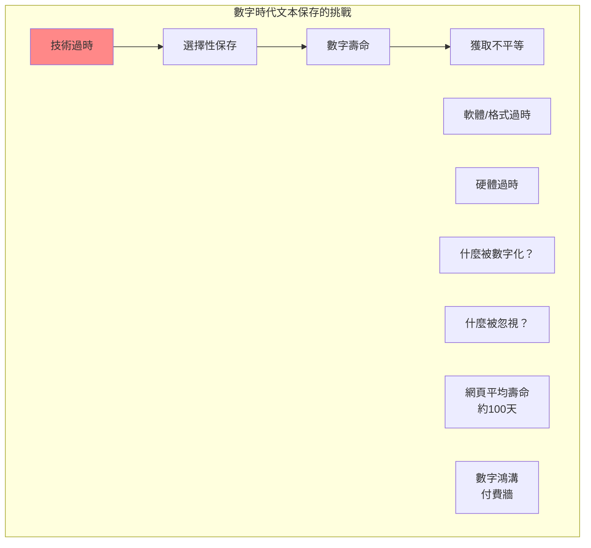

# GENED 1034 文本的轉變 / Texts in Transition

**Instructor**: Ann Blair & Leah Whittington
**Department**: General Education, Harvard
**Official source**: gened.college.harvard.edu
**Big Question**: 什麼使某些文本經久不衰，而其他則稍蹩即逝？
**Style**: 袁騰飛式

---

## 問題 1：5 個 SPECIFIC 核心心智模型

### 1. 文本保存的歷史 (History of Text Preservation)
**真實學者**: Anthony Grafton (普林斯頓大學) —《The Footnote》(1999) 分析學術注釋的歷史。  
**真實事件**: 亞歷山大博物館的建立（約公元前300年）；拜占庭帝國的手稿保存；印刷術發明（約1450年）。  
**真實數字**: 拜占庭帝國延續了約1000年，保存了大量古典希臘文獻。

### 2. 翻譯運動 (Translation Movement)
**真實學者**: Dimitri Gutas (耶魯大學) —《Greek Thought, Arabic Culture》(1998) 分析翻譯運動。  
**真實事件**: 8-10世紀阿拉伯翻譯運動；托萊多翻譯學校（約12世紀）；文藝復興時期的希臘文獻翻譯。  
**真實數字**: 翻譯運動期間，約數百萬頁的希臘和羅馬文獻被翻譯成阿拉伯文。

### 3. 印刷術與文本革命 (Print Revolution)
**真實學者**: Elizabeth Eisenstein (密歇根大學) —《Printing Press as an Agent of Change》(1979) 分析印刷術的影響。  
**真實事件**: 1450年古騰堡聖經印刷；1517年馬丁·路德九十五論綱；1642年牛津大學出版社成立。  
**真實數字**: 1450-1500年間，歐洲約印刷了800萬冊書籍。

### 4. 偽造與篡改 (Forgery and Corruption)
**真實學者**: Anthony Grafton (普林斯頓大學) —《Forgers and Critics》(1990) 分析文本偽造的歷史。  
**真實事件**: 15世紀的「君士坦丁捐獻」偽造；文藝復興時期的古典文獻偽造；19世紀的「文本批評」科學建立。  
**真實數字**: 歷史學家估計約20-30%的「古典文獻」有不同程度的偽造成分。

### 5. 數字時代的文本保存 (Digital Age Text Preservation)
**真實學者**: Heather S. Nelson (哈佛) — 分析數字化保存的挑戰。  
**真實事件**: 互聯網檔案馆的建立（1996年）；谷歌圖書數字化項目（2004年）；數字棕欖化危機（2010年代）。  
**真實數字**: 研究顯示：網頁的平均「壽命」約為100天。

---

## 問題 2：3 個 SPECIFIC 根本分歧

### 分歧一：文本作者意圖的重要性
**學者A**: 意圖主義（Intentionalism）  
論點：理解文本必須还原作者的原始意圖。

**學者B**: 讀者反應論  
論點：文本的意義由讀者在閱讀過程中建構。

### 分歧二：數字化是保存還是遺忘
**學者A**: 數字化支持者  
論點：數字化使文本更容易獲取，實際上是更好的保存。

**學者B**: 批評者  
論點：數字化可能導致「技術棕欖化」——數字格式過時導致文本丢失。

### 分歧三：翻譯的忠實性
**學者A**: 傳統翻譯觀  
論點：翻譯應尽可能忠實於原文。

**學者B**: 後殖民主義翻譯理論  
論點：翻譯總是涉及權力關係和文化政治。

---

## 問題 3：10 個 PROBING 深度問題

1. 比較泥板圖書馆（約公元前7世紀）和現代互聯網檔案馆：這兩種「保存」技術有什麼本質區別？

2. 「君士坦丁捐獻」是中世紀最大的文本偽造——這個偽造持續了約800年才被戳穿。為什麼這個偽造能夠持續這麼久？

3. 文藝復興時期的學者如何「重建」古典文獻？這種「重建」在多大程度上是「創作」而非「保存」？

4. 比較谷歌圖書數字化項目和亞歷山大博物館的圖書收藏：這兩個項目在保存文本上的野心和局限有什麼相似之處？

5. 為什麼馬丁·路德的九十五論綱（1517年）能夠通過印刷術迅速傳播並引發宗教改革？這種「媒體革命」和今天的社交媒體革命有什麼相似之處？

6. 文本的「真實性」是否是一個有意義的概念？一個文本經過多次抄寫、翻譯和編輯之後，哪一個版本是「真實」的？

7. 數字時代的「文本」和紙張時代的「文本」有什麼本質區別？這種區別如何影響我們對「文本」的理解？

8. 當代歷史學家如何「重建」被破壞或失傳的文本？這種「重建」在多大程度上是科學，在多大程度上是猜測？

9. 比較中文文本的繁簡體轉換和歐洲中世紀的文本抄寫：這兩種「文本政治」如何揭示了文本保存的權力維度？

10. 如果互聯網網頁的平均壽命只有約100天——我們的數字記錄如何傳遞給後代？這種「數字棕欖化」危機是否是可解決的？

---

## 5 個 Mermaid 圖解

### 圖1：文本保存技術的歷史演變

### 圖2：翻譯運動的地理範圍

### 圖3：古騰堡印刷術的影響

### 圖4：文本偽造的主要案例

### 圖5：數字保存的挑戰

---

## 總結

**GENED 1034** 的核心洞察：文本的保存和傳播不是一個純粹的技術問題，而是一個深刻的政治和文化問題。從泥板到數字代碼，文本的媒介在變化，但圍繞文本的權力闘爭從未改變。

**三個必須記住的數字**：
- **約800萬冊**：1450-1500年間歐洲印刷的書籍數量
- **約100天**：互聯網網頁的平均「壽命」
- **約800年**：「君士坦丁捐獻」被認為是真品的時間

**必須記住的日期**：
- **約公元前300年**：亞歷山大博物館建立
- **約1450年**：古騰堡印刷術發明
- **1517年10月31日**：馬丁·路德九十五論綱
- **1996年**：互聯網檔案馆成立

**袁騰飛金句**：「文本的歷史不是一個關於保存的故事，而是一個關於權力的故事。誰決定保存什麼，誰決定消滅什麼——這個問題從泥板時代到今天的數字時代從未改變。唯一改變的是手段。」