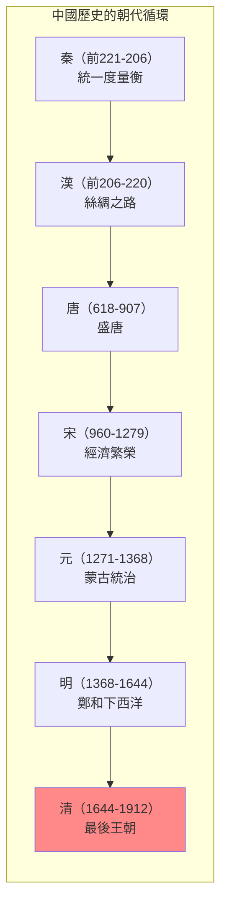
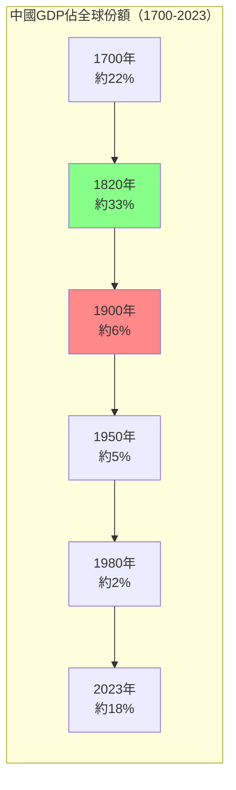
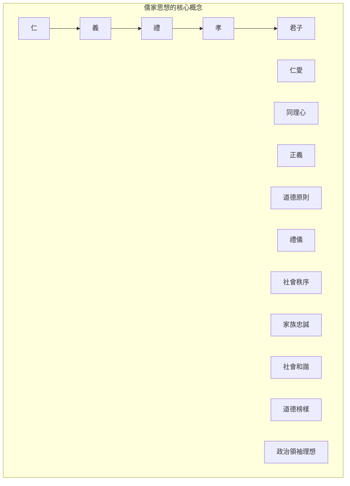
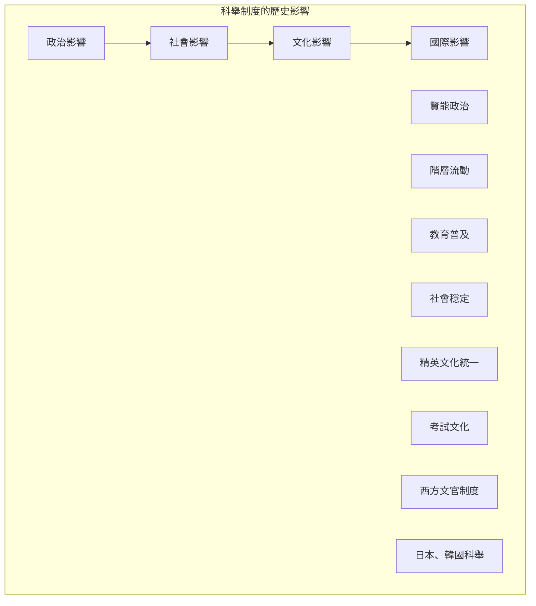

# GENED 1136 權力與文明：中國 / Power and Civilization: China

**Instructor**: William C. Kirby & Peter K. Bol
**Department**: General Education, Harvard
**Official source**: gened.college.harvard.edu
**Big Question**: 中國的過去對它的和你們的未來意味著什麼？
**Style**: research-based

---

## 問題 1：5 個 SPECIFIC 核心心智模型

### 1. 中國文明的多重面向 (Multiple Dimensions of Chinese Civilization)
**真實學者**: Mark Elvin (澳洲國立大學) —《中國文明的模式》(1973) 分析中國歷史的長期模式。  
**真實事件**: 從秦統一（公元前221年）到清滅亡（1912年）；毛澤東的文化大革命（1966-1976）；習近平和「中國夢」（2012-）。  
**真實數字**: 中國是世界上唯一一個連續文明，延續了約5000年。

### 2. 儒家與中國政治傳統 (Confucianism and Chinese Political Tradition)
**真實學者**: Tu Weiming (哈佛) — 分析儒家傳統的現代意涵。  
**真實事件**: 公元前551年孔子誕生；公元前136年儒學定於一尊；宋代理學興起（11-13世紀）。  
**真實數字**: 科舉制度延續了約1300年（606-1905）。

### 3. 中國帝國的治理模式 (Governance Models of Chinese Empire)
**真實學者**: Ralph D. Sawyer (獨立學者) — 分析中國軍事傳統。  
**真實事件**: 秦始皇統一度量衡（前221年）；漢武帝開通絲綢之路（前138年）；明代鄭和下西洋（1405-1433）。  
**真實數字**: 明朝鄭和船隊約有200多艘船隻，規模超過哥倫布船隊的100倍。

### 4. 中國與世界體系 (China and World Systems)
**真實學者**: Kenneth Pomeranz (加州大學) —《大分岔》(2000) 分析中國與歐洲的比較。  
**真實事件**: 1750年中國GDP約佔全球32%；1800年英國工業革命加速；2020年中國再次崛起。  
**真實數字**: 1820年中國GDP仍約佔全球33%。

### 5. 當代中國的歷史根源 (Historical Roots of Contemporary China)
**真實學者**: David Shambaugh (喬治華盛頓大學) — 分析習時代的中國政治。  
**真實事件**: 1978年改革開放；2012年習近平和「中國夢」；2013年一帶一路倡議。  
**真實數字**: 2023年中國GDP約18兆美元，約為美國的70%。

---

## 問題 2：3 個 SPECIFIC 根本分歧

### 分歧一：中國文明是「特殊性」還是「普世性」
**學者A**: 文化特殊論者  
論點：中國文明有其獨特的發展邏輯，不能用西方理論框架分析。

**學者B**: 比較現代化論者  
論點：中國和其他文明可以進行有意義的比較。

### 分歧二：毛澤東的歷史評價
**學者A**: 官方史學  
論點：毛澤東功大於過，是中國現代化的奠基人。

**學者B**: 歷史學家如李銳  
論點：文革是錯誤，但毛的歷史功績不可否認。

### 分歧三：「中國模式」的普世性
**學者A**: 官方宣傳  
論點：中國模式為發展中國家提供了替代西方的道路。

**學者B**: 批評者  
論點：中國模式是威權資本主義，不可持續。

---

## 問題 3：10 個 PROBING 深度問題

1. 比較秦統一（前221年）和歐盟成立（1993年）：這兩個「統一」實驗有什麼本質區別？帝國和超國家組織的邏輯是否相通？

2. 科舉制度延續了約1300年——這種基於考試的官僚選拔制度如何影響了中國的政治文化和社會流動性？

3. 1750年中國GDP佔全球約32%，而1900年這個比例下降到約6%。這種「大分岔」的原因到底是什麼？

4. 比較儒家思想和自由民主思想：這兩套政治哲學對「好的治理」有什麼不同的理解？哪一個更能回應當代治理挑戰？

5. 為什麼中國共產黨選擇了市場改革而不是政治改革？這種「經濟自由化、政治控制」的組合能否長期維持？

6. 比較毛澤東的文化大革命和斯大林的農業集體化：這兩個革命的意識形態邏輯和社會後果有什麼相似之處？

7. 「一帶一路」倡議和19世紀的殖民帝國主義有什麼區別？這種區別是實質性的還是話語性的？

8. 中國共產黨的合法性來自經濟增長——如果經濟放緩，這種合法性如何重構？

9. 比較香港、台灣和新疆：這三個「邊疆」問題如何測試了中國中央政府的治理能力和國際形象？

10. 如果中國在21世紀再次成為世界最大經濟體——這種「回歸」對全球秩序和中國本身意味著什麼？

---

## 5 個 Mermaid 圖解

### 圖1：中國歷史的朝代循環


### 圖2：中國GDP的世界份額變化


### 圖3：儒家思想的核心概念


### 圖4：中國科舉制度的影響


### 圖5：中國崛起的維度
```mermaid
graph TD
    subgraph "中國崛起的各個維度"}
        A["經濟"]
        A1["GDP: 18兆美元"]
        A2["製造業產值第一"]
        
        B["軍事"]
        B1["軍費: 世界第二"]
        B2["海軍現代化"]
        
        C["科技"]
        C1["5G、太陽能、AI"]
        C2["專利申請第一"]
        
        D["外交"]
        D1["一帶一路"]
        D2["上合組織"]
        
        E["軟實力"]
        E1["孔子學院"]
        E2["文化輸出"]
    end
    
    A --> B --> C --> D --> E
    style A fill:#8f8
```

---

## 總結

**GENED 1136** 的核心洞察：中國是世界上唯一一個連續文明，延續了約5000年。理解這段歷史不僅是理解中國過去的前提，更是理解當代中國政治、經濟和外交政策的基礎。

**三個必須記住的數字**：
- **約5000年**：中國連續文明的歷史
- **約33%**：1820年中國GDP佔全球份額
- **18兆美元**：2023年中國GDP

**必須記住的日期**：
- **前221年**：秦始皇統一六國
- **606年**：科舉制度開始
- **1949年10月1日**：人民共和國成立
- **1978年12月**：改革開放開始

**research-based金句**：「中國歷史是世界上最大的『文明實驗』——5000年來，一個國家，一個文明，一套政治哲學，卻經歷了無數次的分裂、統一、繁榮、衰落、革命。這不是西方理論能夠簡單解釋的——中國有自己的邏輯。」