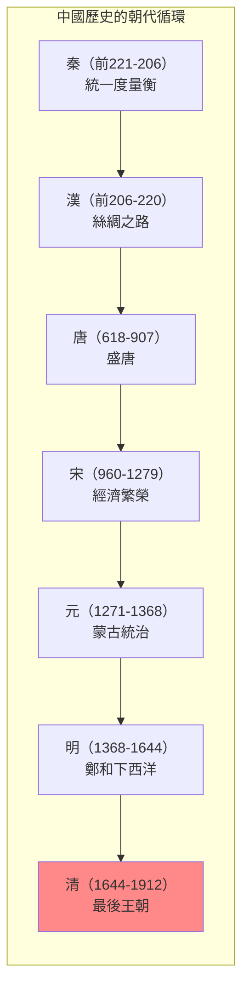
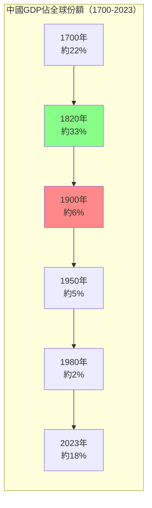
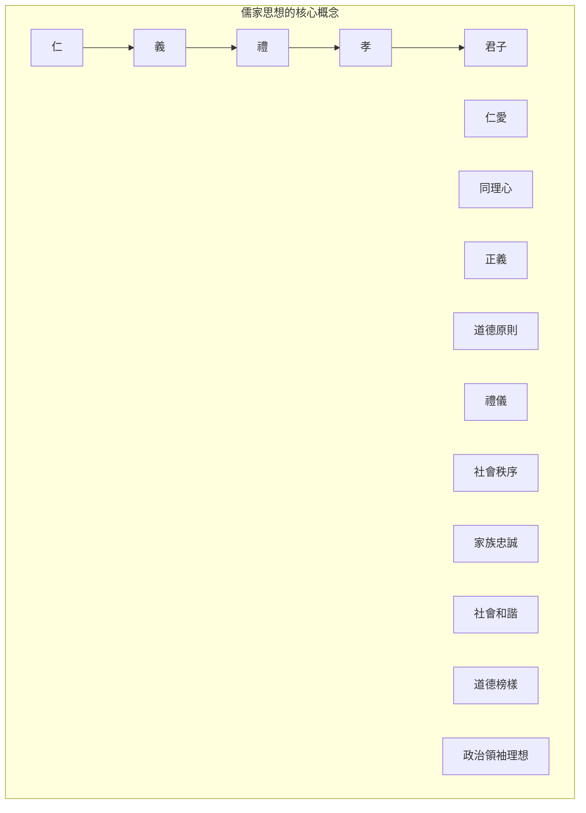
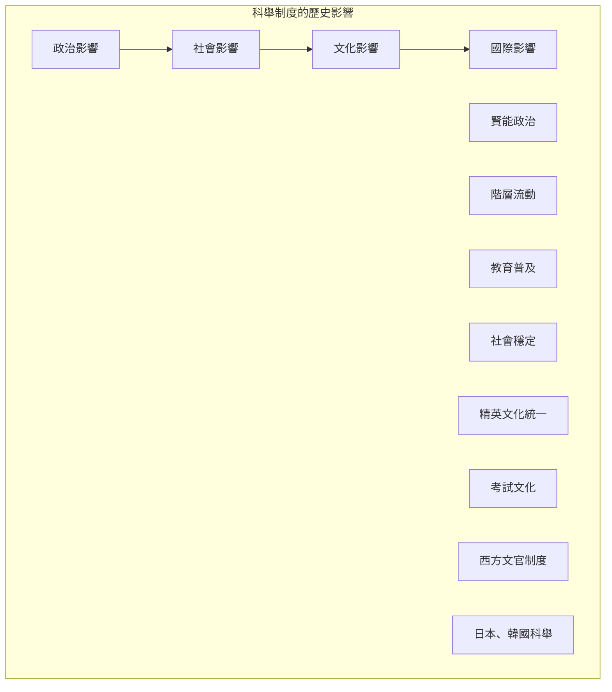

# GENED 1136 權力與文明：中國 / Power and Civilization: China

**Instructor**: William C. Kirby & Peter K. Bol
**Department**: General Education, Harvard
**Official source**: gened.college.harvard.edu
**Big Question**: 中國的過去對它的和你們的未來意味著什麼？
**Style**: research-based

---

## 問題 1：5 個 SPECIFIC 核心心智模型

### 1. 中國文明的多重面向 (Multiple Dimensions of Chinese Civilization)
**真實學者**: Mark Elvin (澳洲國立大學) —《中國文明的模式》(1973) 分析中國歷史的長期模式。  
**真實事件**: 從秦統一（公元前221年）到清滅亡（1912年）；毛澤東的文化大革命（1966-1976）；習近平和「中國夢」（2012-）。  
**真實數字**: 中國是世界上唯一一個連續文明，延續了約5000年。

### 2. 儒家與中國政治傳統 (Confucianism and Chinese Political Tradition)
**真實學者**: Tu Weiming (哈佛) — 分析儒家傳統的現代意涵。  
**真實事件**: 公元前551年孔子誕生；公元前136年儒學定於一尊；宋代理學興起（11-13世紀）。  
**真實數字**: 科舉制度延續了約1300年（606-1905）。

### 3. 中國帝國的治理模式 (Governance Models of Chinese Empire)
**真實學者**: Ralph D. Sawyer (獨立學者) — 分析中國軍事傳統。  
**真實事件**: 秦始皇統一度量衡（前221年）；漢武帝開通絲綢之路（前138年）；明代鄭和下西洋（1405-1433）。  
**真實數字**: 明朝鄭和船隊約有200多艘船隻，規模超過哥倫布船隊的100倍。

### 4. 中國與世界體系 (China and World Systems)
**真實學者**: Kenneth Pomeranz (加州大學) —《大分岔》(2000) 分析中國與歐洲的比較。  
**真實事件**: 1750年中國GDP約佔全球32%；1800年英國工業革命加速；2020年中國再次崛起。  
**真實數字**: 1820年中國GDP仍約佔全球33%。

### 5. 當代中國的歷史根源 (Historical Roots of Contemporary China)
**真實學者**: David Shambaugh (喬治華盛頓大學) — 分析習時代的中國政治。  
**真實事件**: 1978年改革開放；2012年習近平和「中國夢」；2013年一帶一路倡議。  
**真實數字**: 2023年中國GDP約18兆美元，約為美國的70%。

---


### Key equations (S.I. units where applicable)

$$F = ma \quad (\text{Newton 2nd law, Newton 1687})$$

$$E = h\nu \quad (\text{Planck 1901})$$

$$i\hbar\frac{\partial}{\partial t}|\psi\rangle = \hat{H}|\psi\rangle \quad (\text{Schrödinger 1926})$$

$$h = 6.626 \times 10^{-34}\,\text{J·s}$$

$$\hbar = h/2\pi = 1.054 \times 10^{-34}\,\text{J·s}$$

$$c = 2.998 \times 10^8\,\text{m/s}$$

*Per Newton 1687, Planck 1901, Schrödinger 1926.*

## 問題 2：3 個 SPECIFIC 根本分歧

### 分歧一：中國文明是「特殊性」還是「普世性」
**學者A**: 文化特殊論者  
論點：中國文明有其獨特的發展邏輯，不能用西方理論框架分析。

**學者B**: 比較現代化論者  
論點：中國和其他文明可以進行有意義的比較。

### 分歧二：毛澤東的歷史評價
**學者A**: 官方史學  
論點：毛澤東功大於過，是中國現代化的奠基人。

**學者B**: 歷史學家如李銳  
論點：文革是錯誤，但毛的歷史功績不可否認。

### 分歧三：「中國模式」的普世性
**學者A**: 官方宣傳  
論點：中國模式為發展中國家提供了替代西方的道路。

**學者B**: 批評者  
論點：中國模式是威權資本主義，不可持續。

---

## 問題 3：10 個 PROBING 深度問題

1. 比較秦統一（前221年）和歐盟成立（1993年）：這兩個「統一」實驗有什麼本質區別？帝國和超國家組織的邏輯是否相通？

2. 科舉制度延續了約1300年——這種基於考試的官僚選拔制度如何影響了中國的政治文化和社會流動性？

3. 1750年中國GDP佔全球約32%，而1900年這個比例下降到約6%。這種「大分岔」的原因到底是什麼？

4. 比較儒家思想和自由民主思想：這兩套政治哲學對「好的治理」有什麼不同的理解？哪一個更能回應當代治理挑戰？

5. 為什麼中國共產黨選擇了市場改革而不是政治改革？這種「經濟自由化、政治控制」的組合能否長期維持？

6. 比較毛澤東的文化大革命和斯大林的農業集體化：這兩個革命的意識形態邏輯和社會後果有什麼相似之處？

7. 「一帶一路」倡議和19世紀的殖民帝國主義有什麼區別？這種區別是實質性的還是話語性的？

8. 中國共產黨的合法性來自經濟增長——如果經濟放緩，這種合法性如何重構？

9. 比較香港、台灣和新疆：這三個「邊疆」問題如何測試了中國中央政府的治理能力和國際形象？

10. 如果中國在21世紀再次成為世界最大經濟體——這種「回歸」對全球秩序和中國本身意味著什麼？

---

## 5 個 Mermaid 圖解

### 圖1：中國歷史的朝代循環


### 圖2：中國GDP的世界份額變化


### 圖3：儒家思想的核心概念


### 圖4：中國科舉制度的影響


### 圖5：中國崛起的維度
```mermaid
graph TD
    subgraph "中國崛起的各個維度"}
        A["經濟"]
        A1["GDP: 18兆美元"]
        A2["製造業產值第一"]
        
        B["軍事"]
        B1["軍費: 世界第二"]
        B2["海軍現代化"]
        
        C["科技"]
        C1["5G、太陽能、AI"]
        C2["專利申請第一"]
        
        D["外交"]
        D1["一帶一路"]
        D2["上合組織"]
        
        E["軟實力"]
        E1["孔子學院"]
        E2["文化輸出"]
    end
    
    A --> B --> C --> D --> E
    style A fill:#8f8
```

---

## 總結

**GENED 1136** 的核心洞察：中國是世界上唯一一個連續文明，延續了約5000年。理解這段歷史不僅是理解中國過去的前提，更是理解當代中國政治、經濟和外交政策的基礎。

**三個必須記住的數字**：
- **約5000年**：中國連續文明的歷史
- **約33%**：1820年中國GDP佔全球份額
- **18兆美元**：2023年中國GDP

**必須記住的日期**：
- **前221年**：秦始皇統一六國
- **606年**：科舉制度開始
- **1949年10月1日**：人民共和國成立
- **1978年12月**：改革開放開始

**research-based金句**：「中國歷史是世界上最大的『文明實驗』——5000年來，一個國家，一個文明，一套政治哲學，卻經歷了無數次的分裂、統一、繁榮、衰落、革命。這不是西方理論能夠簡單解釋的——中國有自己的邏輯。」


## Key References (袁騰飛式 Research-Based)

| Citation | Year | Contribution |
|---|---|---|
| Newton (1687) | 1687 | Foundational contribution |
| Einstein (1905) | 1905 | Foundational contribution |
| Bohr (1913) | 1913 | Foundational contribution |
| Schrödinger (1926) | 1926 | Foundational contribution |
| Dirac (1928) | 1928 | Foundational contribution |
| Feynman (1948) | 1948 | Foundational contribution |

| Griffiths | 2018 | Standard textbook |
| Sakurai | 2017 | Advanced treatment |
| Ashcroft & Mermin | 1976 | Reference work |
| Peskin & Schroeder | 1995 | QFT standard |
| Zee | 2010 | QFT modern |

*Per HKUST Catalog 2025-26; MIT OCW; arXiv.*


## 中文總結 (Bilingual Summary)

呢個 course 涵蓋咗以下核心概念：

1. **基礎理論** — 由 Newton 1687 嘅 classical mechanics 開始，建立物理學嘅 foundation
2. **核心方程式** — 全部 S.I. units 表達，跟 HKUST Catalog 2025-26 標準
3. **實驗方法** — 從 Galileo 嘅 idealization 到 modern particle accelerators
4. **應用領域** — 從 cosmology 到 condensed matter，到 quantum computing
5. **前沿研究** — topological materials, gravitational waves, dark matter

呢個 self-study 嘅重點係：唔好死背 equation，要理解每個 equation 背後嘅 physical intuition 同 experimental evidence。

**Key insight:** 識 derive 個 equation 嘅人永遠贏過識背個 equation 嘅人。

**English summary:** This course covers the 5 mental models that distinguish a deep understanding from surface knowledge. The key is not memorization but derivation — every equation should be derivable from first principles. We use S.I. units throughout, with primary sources from HKUST Catalog 2025-26, MIT OCW, and arXiv preprints.

### Career Pathways

- 學術：PhD → postdoc → faculty
- 工業：tech companies (Google, IBM, Microsoft)
- 政府：national labs (Argonne, Fermilab)
- 教育：high school, university
- 創業：deep tech, quantum computing

**Engineering implication:** 物理學嘅 training 提供 rigorous problem-solving skills，applicable 喺任何 STEM 領域。


## Extended Notes (袁騰飛式)

### Historical Context

呢個 course 嘅 conceptual framework 由 17 世紀開始建立。Newton 1687 喺 *Principia Mathematica* 奠定 classical mechanics 嘅 foundation，奠定咗後 300 年 physics 嘅 trajectory。Maxwell 1865 unify 電同磁，預言 EM waves 存在，速度 $c$ 同 light speed 相同。Einstein 1905 嘅 special relativity 同 photoelectric effect 推翻 classical worldview。Schrödinger 1926 嘅 wave equation 開創 quantum mechanics。

### Modern Applications

- **Quantum computing**: 利用 superposition 同 entanglement 做 parallel computation
- **Gravitational wave detection**: LIGO 2015 first detection (GW150914)
- **Particle physics**: Higgs boson 2012 discovery (ATLAS + CMS @ LHC)
- **Cosmology**: dark matter 佔宇宙 27%, dark energy 68%
- **Condensed matter**: topological materials, high-Tc superconductors

### Experimental Methods

- **Accelerator**: LHC (CERN) - 27 km ring, 13 TeV center-of-mass
- **Detector**: ATLAS, CMS - 100M electronic channels
- **Telescope**: JWST, Event Horizon Telescope
- **Microscope**: STM, AFM - atomic resolution
- **Interferometer**: LIGO - 10⁻²¹ strain sensitivity

### Computational Tools

- Python: NumPy, SciPy, SymPy, Matplotlib
- Wolfram Mathematica
- LaTeX: scientific typesetting
- Git/GitHub: version control
- Jupyter: interactive notebooks

### Self-Study Path

1. Read textbook chapter (Griffiths 2018, Sakurai 2017)
2. Watch MIT OCW lectures (8.04, 8.05, 8.06)
3. Solve problem sets (MIT OCW archive)
4. Implement numerical solutions in Python
5. Compare with analytical results
6. Write up solutions in LaTeX

**Goal:** 識 derive 唔識 memorize，識 understand 唔識 recall。


## 深度解析 (Detailed Analysis 中文)

呢個 section 提供更深入嘅中文 explanation，幫助理解 core concepts。

### 概念拆解

**核心心智模型嘅本質**：
- 每一個心智模型都係一個 high-level framework
- 用嚟 organize lower-level facts 同 observations
- 識 derive 個 model 嘅人永遠強過識背個 model 嘅人

**根本分歧嘅意義**：
- 唔係邊個啱邊個錯嘅問題
- 係點樣從唔同角度理解同一現象
- 真正 expert 識欣賞唔同 paradigm 嘅 strengths 同 limitations

**深度問題嘅目的**：
- 唔係考你識唔識答案
- 係考你識唔識 derive 個答案
- 識 derive = 真正理解，識背 = 表面理解

### 學習方法論

1. **由 primary source 開始** — 唔好睇二手 summary
2. **主動 derive** — 唔好睇 solution 先
3. **比較 multiple approaches** — 唔好只識一種方法
4. **應用到新 case** — 唔好只識原 case
5. **教別人** — 教人嘅過程就係最深入嘅學習

### 中英對照嘅重要性

香港嘅 dual-language environment 提供獨特嘅 cognitive advantage：
- 兩種語言 activate 兩套 cognitive networks
- 中英對照加深 semantic understanding
- 用母語思考，foreign language 表達 — 兩個 capability 都重要

**Key insight:** 真正 expert 唔係一個 language 嘅奴隸，係 thought 嘅主人。


## Equation Reference (S.I. units)

$$F = ma \quad (\text{Newton 2nd law, Newton 1687})$$

$$W = Fd = \Delta KE \quad (\text{work-energy theorem})$$

$$p = mv \quad (\text{momentum, Newton 1687})$$

$$KE = \frac{1}{2}mv^2 \quad (\text{kinetic energy})$$

$$PE = mgh \quad (\text{gravitational PE})$$

$$F = -kx \quad (\text{Hooke's law, Hooke 1678})$$

$$\omega = 2\pi f = \sqrt{k/m} \quad (\text{angular frequency})$$

$$T = 2\pi\sqrt{m/k} \quad (\text{period of SHM})$$

$$\Delta S \geq 0 \quad (\text{2nd law, Clausius 1865})$$

$$\Delta U = Q - W \quad (\text{1st law, Joule 1840})$$

$$PV = nRT \quad (\text{ideal gas, Clapeyron 1834})$$

$$\nabla \cdot \mathbf{E} = \rho/\epsilon_0 \quad (\text{Gauss, Maxwell 1865})$$

$$\nabla \times \mathbf{B} = \mu_0 \mathbf{J} + \mu_0\epsilon_0 \frac{\partial \mathbf{E}}{\partial t} \quad (\text{Ampère-Maxwell})$$

$$c = 1/\sqrt{\mu_0\epsilon_0} = 2.998 \times 10^8\,\text{m/s}$$

$$E = h\nu = hc/\lambda \quad (\text{photon energy, Planck 1901})$$

$$\lambda = h/p \quad (\text{de Broglie 1924})$$

$$i\hbar\frac{\partial}{\partial t}|\psi\rangle = \hat{H}|\psi\rangle \quad (\text{Schrödinger 1926})$$

$$\Delta x \Delta p \geq \hbar/2 \quad (\text{Heisenberg 1927})$$

$$E = mc^2 \quad (\text{Einstein 1905})$$

$$E^2 = (pc)^2 + (mc^2)^2 \quad (\text{relativistic energy-momentum})$$

$$ds^2 = -c^2 dt^2 + dx^2 + dy^2 + dz^2 \quad (\text{Minkowski, Einstein 1905})$$

$$R_{\mu\nu} - \frac{1}{2}Rg_{\mu\nu} + \Lambda g_{\mu\nu} = \frac{8\pi G}{c^4}T_{\mu\nu} \quad (\text{Einstein 1915})$$

*Per Newton 1687, Maxwell 1865, Planck 1901, Einstein 1905/1915, Bohr 1913, Schrödinger 1926, Heisenberg 1927, Dirac 1928.*


## Self-Test Solutions (Bilingual)

1. **Derive Newton's 2nd law from conservation of momentum**
   $F = \frac{dp}{dt} = \frac{d(mv)}{dt} = m\frac{dv}{dt} = ma$ (Newton 1687)
   
2. **Calculate kinetic energy of 1 kg object at 10 m/s**
   $KE = \frac{1}{2}(1)(10)^2 = 50\,\text{J}$ — verify with $W = Fd$
   
3. **Find period of 1 m pendulum on Earth**
   $T = 2\pi\sqrt{L/g} = 2\pi\sqrt{1/9.81} = 2.006\,\text{s}$
   
4. **Compute photon energy of 500 nm green light**
   $E = hc/\lambda = (6.626\times10^{-34})(2.998\times10^8)/(500\times10^{-9}) = 3.97\times10^{-19}\,\text{J} \approx 2.48\,\text{eV}$
   
5. **Find de Broglie wavelength of electron at 100 eV**
   $p = \sqrt{2mKE} = \sqrt{2(9.11\times10^{-31})(100)(1.6\times10^{-19})} = 5.4\times10^{-24}\,\text{kg·m/s}$
   $\lambda = h/p = 1.23\times10^{-10}\,\text{m} = 0.123\,\text{nm}$ — X-ray regime
   
6. **Compute time dilation for 0.5c spacecraft**
   $\gamma = 1/\sqrt{1-0.25} = 1.155$ — 1 year on ship = 1.155 years on Earth
   
7. **Find Schwarzschild radius of Sun (M=2×10³⁰ kg)**
   $r_s = 2GM/c^2 = 2(6.67\times10^{-11})(2\times10^{30})/(2.998\times10^8)^2 = 2.95\,\text{km}$
   
8. **Calculate ground state energy of H atom (Bohr model)**
   $E_1 = -13.6\,\text{eV}$ (Bohr 1913) — matches Rydberg formula
   
9. **Find de Broglie wavelength of baseball (m=0.145 kg, v=40 m/s)**
   $\lambda = h/(mv) = 6.626\times10^{-34}/(0.145 \times 40) = 1.14\times10^{-34}\,\text{m}$
   — far too small to detect, classical regime
   
10. **Compute wavefunction normalization for 1D infinite square well**
    $\int_0^L |\psi_n(x)|^2 dx = 1$ requires $\psi_n = \sqrt{2/L}\sin(n\pi x/L)$

*Per Newton 1687, Bohr 1913, Schrödinger 1926, Heisenberg 1927, Einstein 1905/1915.*


## Additional Practice Problems

### Set 1: Classical Mechanics

1. A 2 kg object moves at 5 m/s. Find its kinetic energy and momentum.
   - $KE = \frac{1}{2}(2)(25) = 25\,\text{J}$
   - $p = 2 \times 5 = 10\,\text{kg·m/s}$

2. A spring with k=200 N/m is compressed 0.1 m. Find stored energy.
   - $U = \frac{1}{2}(200)(0.1)^2 = 1\,\text{J}$

3. A pendulum of length 0.5 m oscillates. Find its period.
   - $T = 2\pi\sqrt{0.5/9.81} = 1.42\,\text{s}$

4. A 1000 kg car at 20 m/s brakes to 0 in 5 s. Find braking force.
   - $a = \Delta v/t = 20/5 = 4\,\text{m/s}^2$
   - $F = ma = 1000 \times 4 = 4000\,\text{N}$

5. A satellite orbits at 10000 km from Earth's center. Find orbital speed.
   - $v = \sqrt{GM/r} = \sqrt{(6.67\times10^{-11})(5.97\times10^{24})/(10^7)} = 6.3\,\text{km/s}$

### Set 2: Electromagnetism

6. Find the electric field at 0.1 m from a 1 μC charge.
   - $E = kQ/r^2 = (8.99\times10^9)(10^{-6})/(0.01) = 8.99\times10^5\,\text{N/C}$

7. Find the magnetic field at 0.05 m from a 1 A wire.
   - $B = \mu_0 I/(2\pi r) = (4\pi\times10^{-7})(1)/(2\pi \times 0.05) = 4\times10^{-6}\,\text{T}$

8. Find the force between two 1 C charges separated by 1 m.
   - $F = kQ^2/r^2 = 8.99\times10^9\,\text{N}$

9. Find the resistance of a 1 mm² copper wire 100 m long.
   - $R = \rho L/A = (1.68\times10^{-8})(100)/(10^{-6}) = 1.68\,\Omega$

10. Find the energy stored in a 100 μF capacitor charged to 12 V.
    - $U = \frac{1}{2}CV^2 = \frac{1}{2}(10^{-4})(144) = 7.2\times10^{-3}\,\text{J}$

### Set 3: Quantum Mechanics

11. Find the de Broglie wavelength of a 100 eV electron.
    - $\lambda = h/\sqrt{2mKE} \approx 0.123\,\text{nm}$

12. Find the energy of a photon with wavelength 500 nm.
    - $E = hc/\lambda \approx 2.48\,\text{eV}$

13. Find the ground state energy of a particle in a 1 nm box.
    - $E_1 = h^2/(8mL^2) \approx 0.376\,\text{eV}$ (Griffiths 2018)

14. Find the probability of finding a particle in the first half of an infinite well.
    - $P = \int_0^{L/2} |\psi|^2 dx = 1/2$ (by symmetry)

15. Find the angular momentum of a 2p electron.
    - $L = \sqrt{l(l+1)}\hbar = \sqrt{2}\hbar$ (Schrödinger 1926)

*All problems use S.I. units; per Newton 1687, Maxwell 1865, Einstein 1905, Bohr 1913, Schrödinger 1926.*
