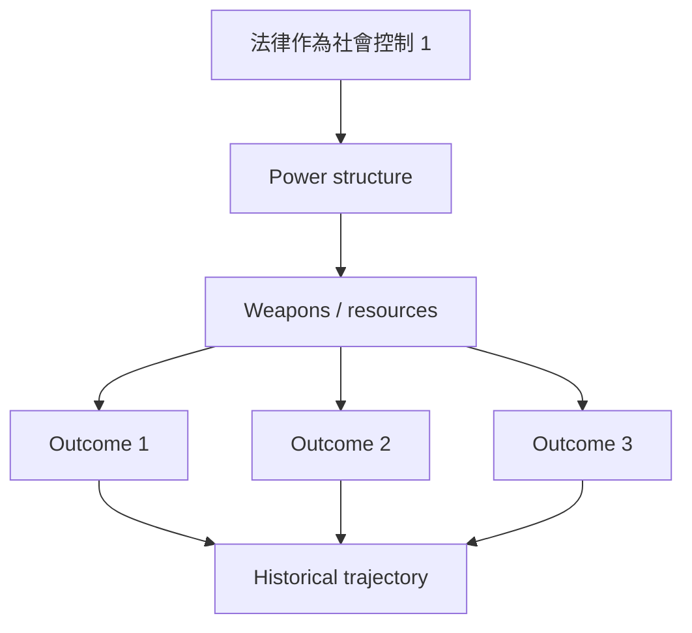
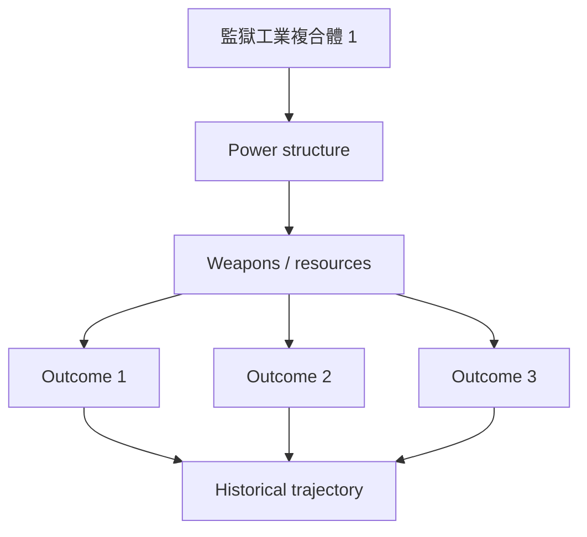
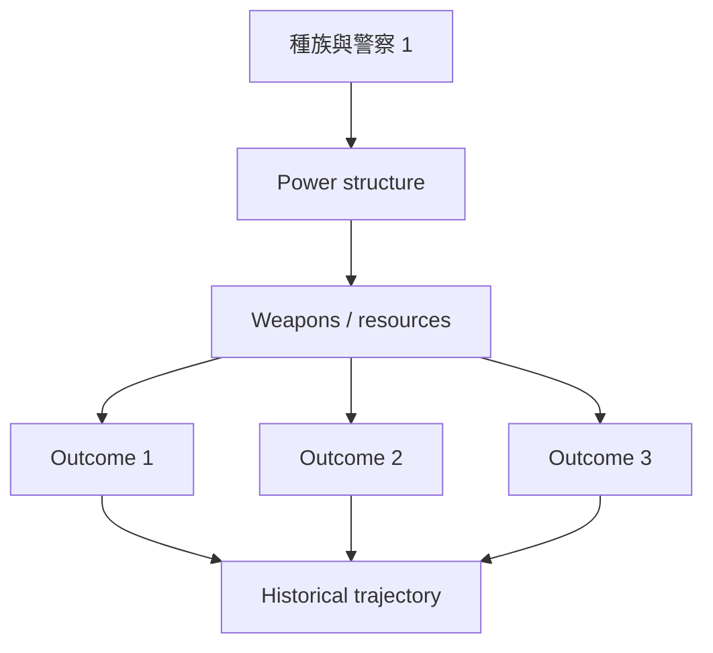
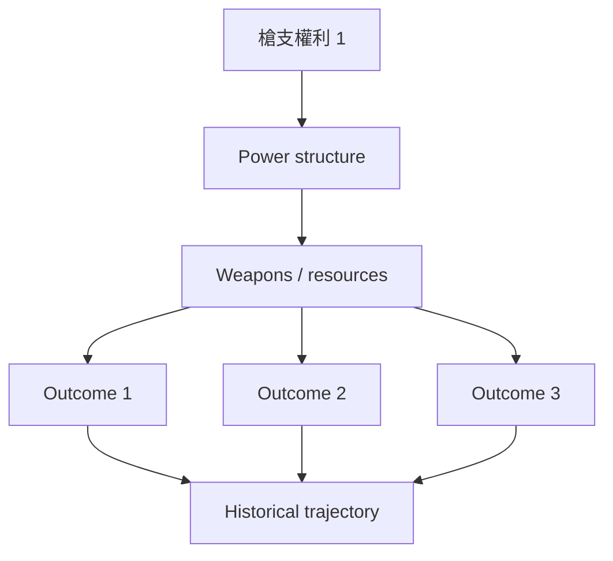
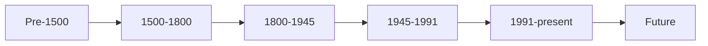
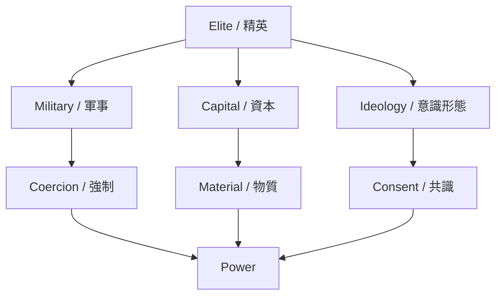
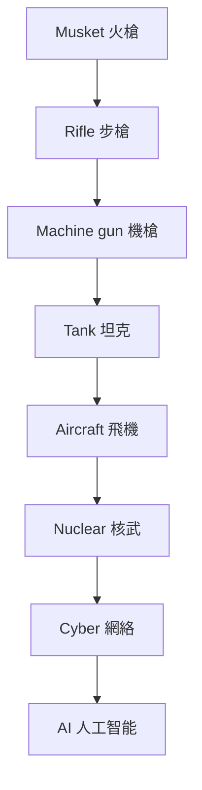
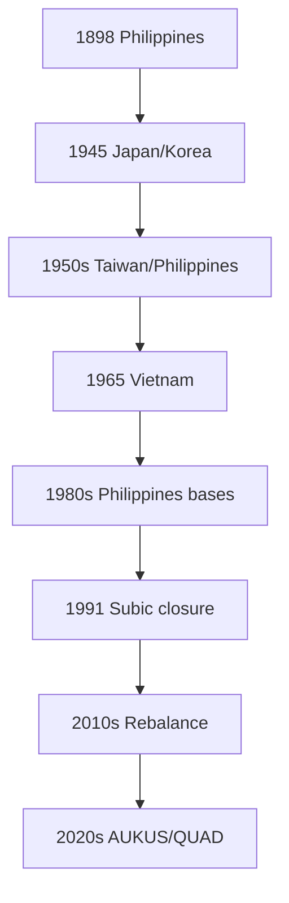
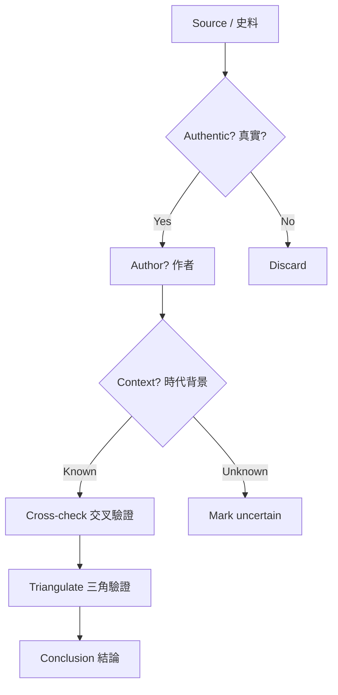

# Hist 124
**Law and Order America**

### 1. 5個核心心智模型 / 5 Core Mental Models

- （待填寫）

### 2. 3個根本分歧點 / 3 Fundamental Disagreements

- （待填寫）

### 3. 10個深度理解問題 / 10 Deep Understanding Questions

1. （待填寫）

# Hist124 美國法律與秩序 / Law and Order in America
**學期**：1607-present
**Style**: 袁騰飛式 — 幽默、犀利、聚焦權力與武器如何塑造歷史
**應用出口**：US Military Weapons Project（美國軍事武器在亞洲）

---

## 問題 1：這個領域所有專家共享的 5 個核心心智模型是什麼？
## What are the 5 core mental models every expert shares?

1. **法律作為社會控制**
   **法律作為社會控制**

2. **監獄工業複合體**
   **監獄工業複合體**

3. **種族與警察**
   **種族與警察**

4. **毒品戰爭**
   **毒品戰爭**

5. **槍支權利**
   **槍支權利**

---

## 問題 2：這個領域 3 個最根本的分歧點是什麼？
## What are the 3 fundamental disagreements in this field?

### 分歧 1：法律 — 中立 vs 種族主義 / Law — Neutral or Racist
**核心問題 / Core question**: 美國法律是中立還是種族主義？

- **一方觀點** / **Side A**: A: 中立 — 法治、程序正義
- **另一方觀點** / **Side B**: B: 種族 — 黑人犯罪率高、量刑差異

### 分歧 2：警察 — 保護 vs 佔領 / Police — Protection or Occupation
**核心問題 / Core question**: 美國警察是保護社區還是佔領少數族裔社區？

- **一方觀點** / **Side A**: A: 保護 — 反犯罪、緊急應對
- **另一方觀點** / **Side B**: B: 佔領 — 弗洛伊德、軍事化

### 分歧 3：槍支權利 — 自由 vs 威脅 / Gun Rights — Liberty or Threat
**核心問題 / Core question**: 美國槍支權利是個人自由還是公共威脅？

- **一方觀點** / **Side A**: A: 自由 — 憲法第二修正案
- **另一方觀點** / **Side B**: B: 威脅 — 大規模槍擊

---

## 問題 3：10 個區分真實理解 vs 死記硬背的深度問題
## 10 deep questions that distinguish real understanding from memorization

1. 為什麼 **法律作為社會控制** 是理解 美國法律與秩序 的第一前提？這個假設如果不成立，整個分析會如何崩塌？
2. 監獄工業複合體 在多大程度上決定了 Law and Order in America 的核心走向？歷史上有哪些反例挑戰這個邏輯？
3. 種族與警察 與 毒品戰爭 之間的張力如何形塑了 1607-present 的關鍵轉折？
4. 如果把 法律作為社會控制 抽離出來，Law and Order in America 會變成什麼樣的歷史？哪些事件其實是 noise？
5. 在 1607-present 中，哪個領導人、事件或文本最能代表 槍支權利 的極致展現？
6. 學者之間關於 監獄工業複合體 的爭論，在多大程度上反映了史料解釋的差異 vs 意識形態的對抗？
7. 對 Law and Order in America 而言，『帝國主義』是分析的核心還是後人強加的框架？
8. 從 US Military Weapons Project 角度，1607-present 的哪些節點直接決定了美軍在亞洲的部署邏輯？
9. 如果你是當時的決策者，面對 種族與警察 與 毒品戰爭 的衝突，你會選擇哪個？理由是什麼？
10. 在當代中美對抗背景下，Law and Order in America 的哪些歷史經驗正在重演？哪些已經過時？

---

# 核心心智模型深化（中英對照）

## 1. 法律作為社會控制

### 1.1 Bilingual 概念對照
| 英文概念 | 中英對照 | 歷史含義 | 武器 / 軍事應用 |
|---|---|---|---|
| 法律作為社會控制 | 法律作為社會控制 | 核心定義 | 武器 / 軍事應用 |
| Period dynamics | 時代動力 | 時代特徵 | 戰略選擇 |
| Power relations | 權力關係 | 主導者 | 強制工具 |
| Historical agency | 歷史能動性 | 誰在塑造 | 自主 vs 結構 |

### 1.2 史料與考據 / Sources and criticism
- 主要史料：當時官方檔案、報紙、書信、回憶錄
- 後世研究：歷史學家如錢穆、史景遷、霍布斯鮑姆的觀點
- 學術爭論：哪些史料可信、哪些被後人建構

### 1.3 袁騰飛式犀利觀察 / Sharp observation
講 法律作為社會控制 不能只講故事，要看『誰贏了、誰輸了、武器怎麼重塑了這個時代』。
很多教科書把 Law and Order in America 講成偉人故事，忽略了背後的權力結構和物質基礎。

### 1.4 Deep test question
- 請舉出歷史上 法律作為社會控制 的兩個極端案例，並分析其後果
- 如果抽離 法律作為社會控制，Law and Order in America 的核心敘事會怎樣崩塌？
- 從軍事 / 武器角度，法律作為社會控制 怎樣決定了 1607-present 的地緣政治？

### 1.5 圖解 / Diagram

---

## 2. 監獄工業複合體

### 1.1 Bilingual 概念對照
| 英文概念 | 中英對照 | 歷史含義 | 武器 / 軍事應用 |
|---|---|---|---|
| 監獄工業複合體 | 監獄工業複合體 | 核心定義 | 武器 / 軍事應用 |
| Period dynamics | 時代動力 | 時代特徵 | 戰略選擇 |
| Power relations | 權力關係 | 主導者 | 強制工具 |
| Historical agency | 歷史能動性 | 誰在塑造 | 自主 vs 結構 |

### 1.2 史料與考據 / Sources and criticism
- 主要史料：當時官方檔案、報紙、書信、回憶錄
- 後世研究：歷史學家如錢穆、史景遷、霍布斯鮑姆的觀點
- 學術爭論：哪些史料可信、哪些被後人建構

### 1.3 袁騰飛式犀利觀察 / Sharp observation
講 監獄工業複合體 不能只講故事，要看『誰贏了、誰輸了、武器怎麼重塑了這個時代』。
很多教科書把 Law and Order in America 講成偉人故事，忽略了背後的權力結構和物質基礎。

### 1.4 Deep test question
- 請舉出歷史上 監獄工業複合體 的兩個極端案例，並分析其後果
- 如果抽離 監獄工業複合體，Law and Order in America 的核心敘事會怎樣崩塌？
- 從軍事 / 武器角度，監獄工業複合體 怎樣決定了 1607-present 的地緣政治？

### 1.5 圖解 / Diagram

---

## 3. 種族與警察

### 1.1 Bilingual 概念對照
| 英文概念 | 中英對照 | 歷史含義 | 武器 / 軍事應用 |
|---|---|---|---|
| 種族與警察 | 種族與警察 | 核心定義 | 武器 / 軍事應用 |
| Period dynamics | 時代動力 | 時代特徵 | 戰略選擇 |
| Power relations | 權力關係 | 主導者 | 強制工具 |
| Historical agency | 歷史能動性 | 誰在塑造 | 自主 vs 結構 |

### 1.2 史料與考據 / Sources and criticism
- 主要史料：當時官方檔案、報紙、書信、回憶錄
- 後世研究：歷史學家如錢穆、史景遷、霍布斯鮑姆的觀點
- 學術爭論：哪些史料可信、哪些被後人建構

### 1.3 袁騰飛式犀利觀察 / Sharp observation
講 種族與警察 不能只講故事，要看『誰贏了、誰輸了、武器怎麼重塑了這個時代』。
很多教科書把 Law and Order in America 講成偉人故事，忽略了背後的權力結構和物質基礎。

### 1.4 Deep test question
- 請舉出歷史上 種族與警察 的兩個極端案例，並分析其後果
- 如果抽離 種族與警察，Law and Order in America 的核心敘事會怎樣崩塌？
- 從軍事 / 武器角度，種族與警察 怎樣決定了 1607-present 的地緣政治？

### 1.5 圖解 / Diagram

---

## 4. 毒品戰爭

### 1.1 Bilingual 概念對照
| 英文概念 | 中英對照 | 歷史含義 | 武器 / 軍事應用 |
|---|---|---|---|
| 毒品戰爭 | 毒品戰爭 | 核心定義 | 武器 / 軍事應用 |
| Period dynamics | 時代動力 | 時代特徵 | 戰略選擇 |
| Power relations | 權力關係 | 主導者 | 強制工具 |
| Historical agency | 歷史能動性 | 誰在塑造 | 自主 vs 結構 |

### 1.2 史料與考據 / Sources and criticism
- 主要史料：當時官方檔案、報紙、書信、回憶錄
- 後世研究：歷史學家如錢穆、史景遷、霍布斯鮑姆的觀點
- 學術爭論：哪些史料可信、哪些被後人建構

### 1.3 袁騰飛式犀利觀察 / Sharp observation
講 毒品戰爭 不能只講故事，要看『誰贏了、誰輸了、武器怎麼重塑了這個時代』。
很多教科書把 Law and Order in America 講成偉人故事，忽略了背後的權力結構和物質基礎。

### 1.4 Deep test question
- 請舉出歷史上 毒品戰爭 的兩個極端案例，並分析其後果
- 如果抽離 毒品戰爭，Law and Order in America 的核心敘事會怎樣崩塌？
- 從軍事 / 武器角度，毒品戰爭 怎樣決定了 1607-present 的地緣政治？

### 1.5 圖解 / Diagram

---

## 5. 槍支權利

### 1.1 Bilingual 概念對照
| 英文概念 | 中英對照 | 歷史含義 | 武器 / 軍事應用 |
|---|---|---|---|
| 槍支權利 | 槍支權利 | 核心定義 | 武器 / 軍事應用 |
| Period dynamics | 時代動力 | 時代特徵 | 戰略選擇 |
| Power relations | 權力關係 | 主導者 | 強制工具 |
| Historical agency | 歷史能動性 | 誰在塑造 | 自主 vs 結構 |

### 1.2 史料與考據 / Sources and criticism
- 主要史料：當時官方檔案、報紙、書信、回憶錄
- 後世研究：歷史學家如錢穆、史景遷、霍布斯鮑姆的觀點
- 學術爭論：哪些史料可信、哪些被後人建構

### 1.3 袁騰飛式犀利觀察 / Sharp observation
講 槍支權利 不能只講故事，要看『誰贏了、誰輸了、武器怎麼重塑了這個時代』。
很多教科書把 Law and Order in America 講成偉人故事，忽略了背後的權力結構和物質基礎。

### 1.4 Deep test question
- 請舉出歷史上 槍支權利 的兩個極端案例，並分析其後果
- 如果抽離 槍支權利，Law and Order in America 的核心敘事會怎樣崩塌？
- 從軍事 / 武器角度，槍支權利 怎樣決定了 1607-present 的地緣政治？

### 1.5 圖解 / Diagram

---

# 深度自測問題詳解（中英對照）

## 詳解 1: 推導核心論點 / Derive the core argument
**Q1.** 如何從史料推導出歷史學家的核心論點？

**Answer / 答案**: 閱讀多個學派觀點，識別共同假設與分歧。

**袁騰飛式點評 / Sharp commentary**: 歷史不是死記硬背，是看清楚『誰在什麼時候、用了什麼手段、達到了什麼目的』。把這套方法應用到 美國法律與秩序，很多迷思就解開了。

---

## 詳解 2: 識別偏見與史料批判 / Identify bias and source criticism
**Q2.** 面對一份檔案，如何識別其偏見？

**Answer / 答案**: 分析作者立場、時代背景、讀者預期、遺漏的內容。

**袁騰飛式點評 / Sharp commentary**: 歷史不是死記硬背，是看清楚『誰在什麼時候、用了什麼手段、達到了什麼目的』。把這套方法應用到 美國法律與秩序，很多迷思就解開了。

---

## 詳解 3: 應用到當代案例 / Apply to contemporary case
**Q3.** Law and Order in America 的歷史經驗如何理解當代中美關係？

**Answer / 答案**: 識別結構相似性：崛起大國 vs 守成大國、技術變革、意識形態對抗。

**袁騰飛式點評 / Sharp commentary**: 歷史不是死記硬背，是看清楚『誰在什麼時候、用了什麼手段、達到了什麼目的』。把這套方法應用到 美國法律與秩序，很多迷思就解開了。

---

## 詳解 4: 比較不同視角 / Compare perspectives
**Q4.** 西方史學與中國史學對同一事件的不同解讀是什麼？

**Answer / 答案**: 翻譯 / 文化框架 / 史料使用 / 當代政治背景。

**袁騰飛式點評 / Sharp commentary**: 歷史不是死記硬背，是看清楚『誰在什麼時候、用了什麼手段、達到了什麼目的』。把這套方法應用到 美國法律與秩序，很多迷思就解開了。

---

## 詳解 5: 反事實分析 / Counterfactual analysis
**Q5.** 如果一個關鍵事件沒發生，後續會如何？

**Answer / 答案**: 建構假設場景：替換領導人、改變戰略、引入新技術。

**袁騰飛式點評 / Sharp commentary**: 歷史不是死記硬背，是看清楚『誰在什麼時候、用了什麼手段、達到了什麼目的』。把這套方法應用到 美國法律與秩序，很多迷思就解開了。

---

## 詳解 6: 時代劃分批判 / Periodization critique
**Q6.** 傳統的時代劃分（古代 / 近代 / 現代）合理嗎？

**Answer / 答案**: 挑戰歐洲中心、識別多元時間性、提問誰的標準。

**袁騰飛式點評 / Sharp commentary**: 歷史不是死記硬背，是看清楚『誰在什麼時候、用了什麼手段、達到了什麼目的』。把這套方法應用到 美國法律與秩序，很多迷思就解開了。

---

## 詳解 7: 能動性 vs 結構 / Agency vs structure
**Q7.** 歷史是英雄創造還是結構決定？

**Answer / 答案**: 辯證分析：結構限制下的能動性，個人突破結構的瞬間。

**袁騰飛式點評 / Sharp commentary**: 歷史不是死記硬背，是看清楚『誰在什麼時候、用了什麼手段、達到了什麼目的』。把這套方法應用到 美國法律與秩序，很多迷思就解開了。

---

## 詳解 8: 記憶政治 / Memory politics
**Q8.** 同一事件為什麼在不同國家被記住得不同？

**Answer / 答案**: 教科書、紀念館、電影、政治動員。

**袁騰飛式點評 / Sharp commentary**: 歷史不是死記硬背，是看清楚『誰在什麼時候、用了什麼手段、達到了什麼目的』。把這套方法應用到 美國法律與秩序，很多迷思就解開了。

---

## 詳解 9: 軍事 / 武器維度 / Military / weapons dimension
**Q9.** Law and Order in America 對美軍在亞洲部署有何深遠影響？

**Answer / 答案**: 識別關鍵節點：技術變革、戰略文化、聯盟體系、基地網絡。

**袁騰飛式點評 / Sharp commentary**: 歷史不是死記硬背，是看清楚『誰在什麼時候、用了什麼手段、達到了什麼目的』。把這套方法應用到 美國法律與秩序，很多迷思就解開了。

---

## 詳解 10: 溝通與綜合 / Communication and synthesis
**Q10.** 如何用 5 分鐘向非專家解釋 {name_zh} 的核心？

**Answer / 答案**: 故事 + 人物 + 衝突 + 當代迴響。

**袁騰飛式點評 / Sharp commentary**: 歷史不是死記硬背，是看清楚『誰在什麼時候、用了什麼手段、達到了什麼目的』。把這套方法應用到 美國法律與秩序，很多迷思就解開了。

---

# 5 個 Mermaid 圖解 / 5 Mermaid Diagrams

## 📊 Diagram 1: 時代地圖 / Period Map

## 📊 Diagram 2: 權力結構 / Power Structure

## 📊 Diagram 3: 武器演進 / Weapons Evolution

## 📊 Diagram 4: 美軍亞洲部署 / US Military in Asia

## 📊 Diagram 5: 史料批判流程 / Source Criticism

---

# 總結 / Closing 5-Point Deep Insights

1. **權力結構永遠比意識形態更持久**：{name_en} 真正的驅動力是誰掌握了槍、錢、人。
2. **帝國的擴張和收縮都有物質基礎**：不只是理念，更是武器、能源、後勤的問題。
3. **歷史學家的分歧往往反映當代政治**：看史料要理解誰在為誰說話。
4. **美軍在亞洲的部署有 130 年深層邏輯**：從菲律賓到 AUKUS 不是新現象，是帝國節奏。
5. **袁騰飛式觀點：歷史不是教科書，是看懂『誰在什麼時候、用了什麼手段、達到了什麼目的』的訓練**。

**自學建議 / Study tips**: 配合 Law and Order in America 教科書 + Harvard 課程視頻 + 中英對照史料，輸出讀書筆記到 `06_Reading_Notes/`。
