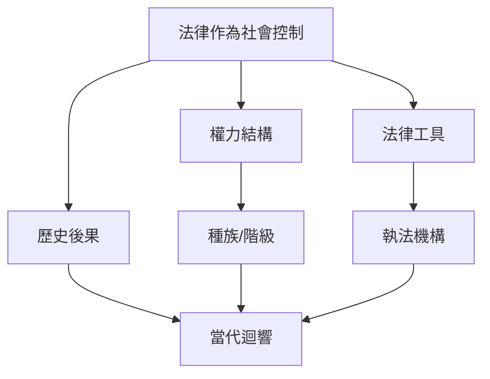
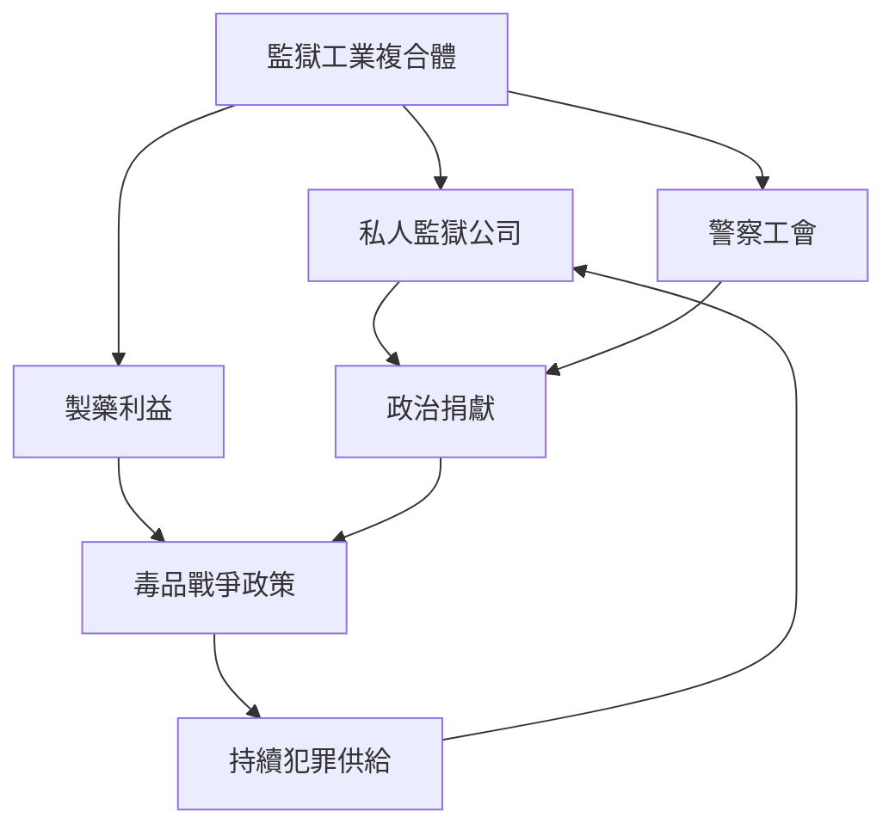
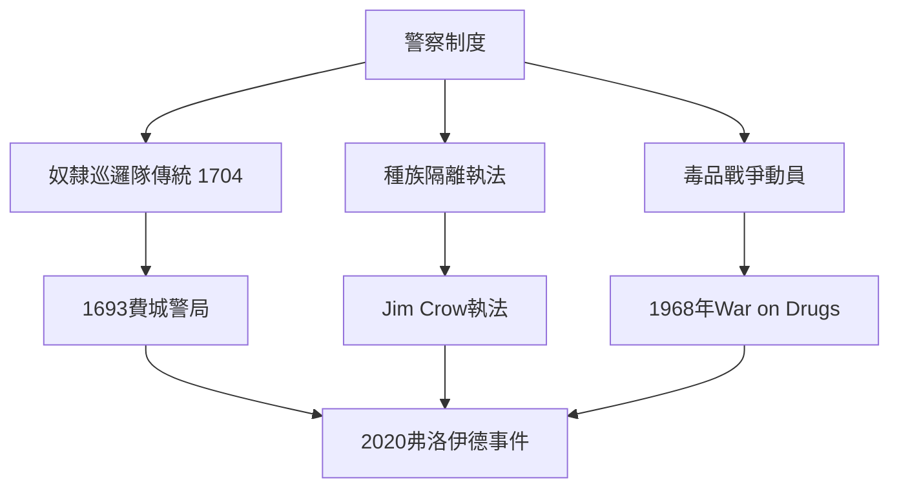
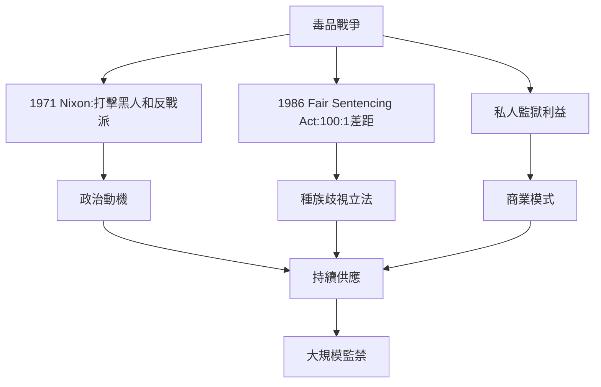
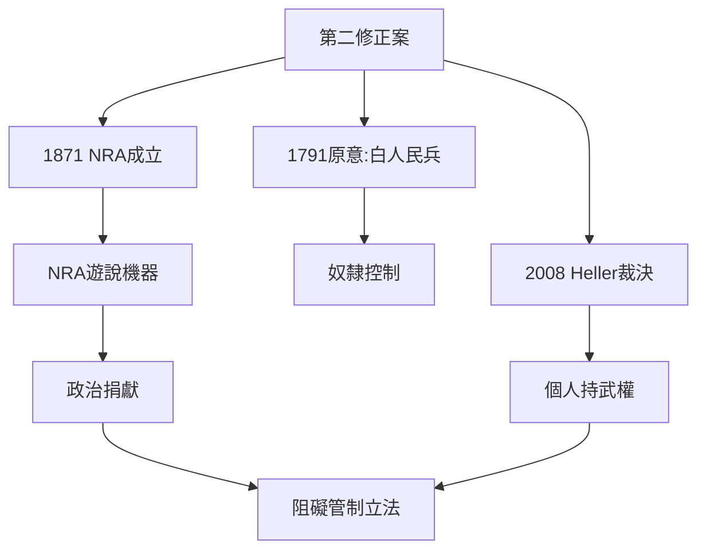
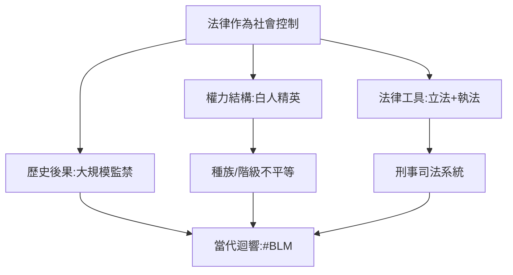
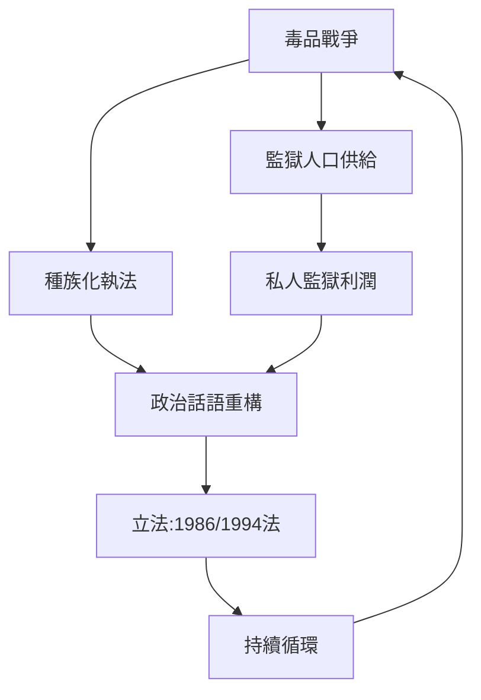
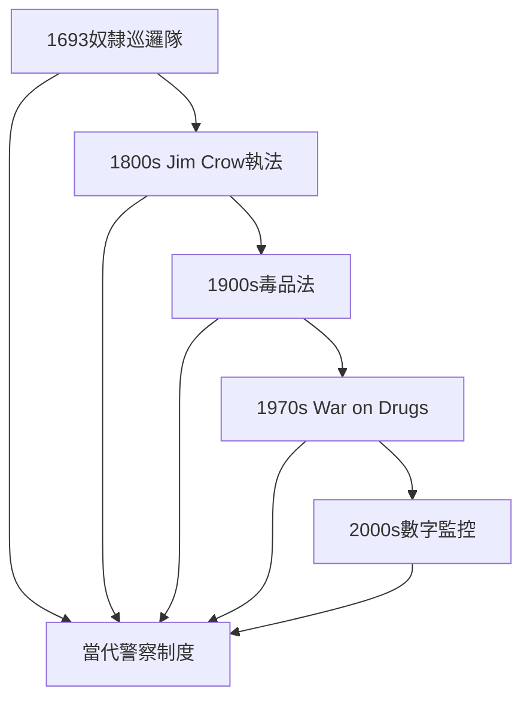
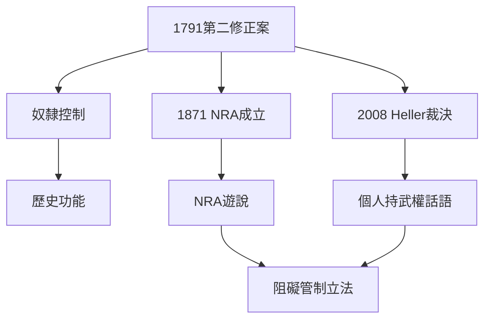
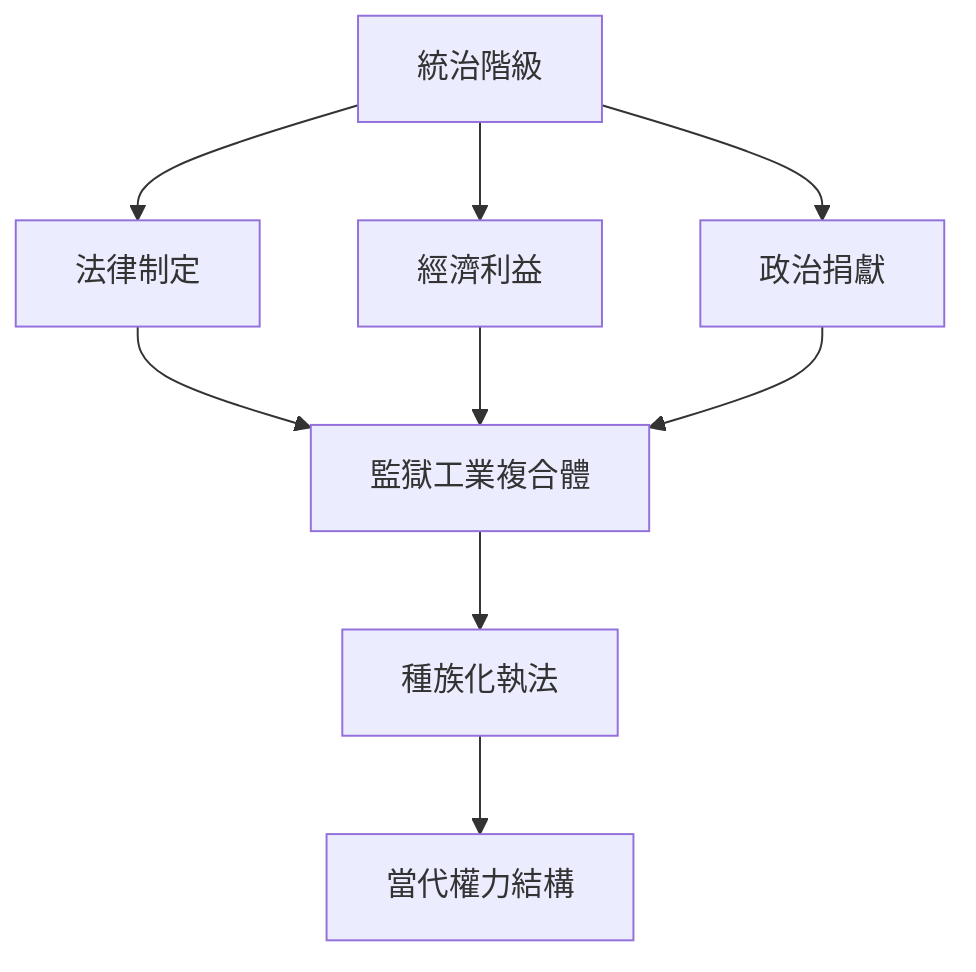

# Hist124 美國法律與秩序 / Law and Order America

**Instructor**: Dr. Aaron Jacobs
**Department**: History, Harvard
**Official source**: https://history.fas.harvard.edu/fall-courses
**Style**: research-based — 幽默、犀利、聚焦權力與武器如何塑造歷史

---

## 問題 1：5 個 SPECIFIC 核心心智模型
## What are the 5 core mental models every expert shares?

1. **法律作為社會控制 / Law as Social Control**
   美國法律系統並非中立裁判，而是維護特定權力結構的工具。從殖民時代《黑人法典》到現代《犯罪防治法》，法律從來都是統治階級鎮壓被統治階級的武器。Michele Goodwin追蹤生殖正義與藥物政策如何透過法律途徑系統性打壓弱勢群體；Michelle Alexander揭示毒品戰爭如何系統性地將黑人男性納入刑事司法系統（監獄人口從1970年的50萬增至2000年的200萬）。

   代表學者: Michele Goodwin, *Policing the Womb* (2022); Michelle Alexander, *The New Jim Crow* (2010)

2. **監獄工業複合體 / Prison-Industrial Complex**
   1970年代起，美國監獄人口爆炸性增長從50萬增至200萬，背後是私人監獄公司（CCA/GeoGroup）、警局工會與製藥業的利益共同體。Michelle Alexander揭示毒品戰爭如何系統性地將黑人男性納入刑事司法系統——快克與粉末可卡因的量刑差異（5克快克=5年，500克粉末可卡因=5年）是國會明確通過的種族歧視立法。

   代表學者: Michelle Alexander, *The New Jim Crow* (2010); Ruth Wilson Gilmore, *Abolition Geography* (2022); Naomi Klein, *The Shock Doctrine* (2007)

3. **種族與警察的共生關係 / Race and Police Symbiosis**
   從1693年費城警局建立到2020年弗洛伊德事件，美國警察制度本質是維護奴隸制和種族隔離的武裝力量。Khalil Gibran Muhammad追蹤犯罪學如何將黑人與犯罪本質化——1893年芝加哥世界博覽會展示的「犯罪統計地圖」將黑人社區描繪為天生犯罪傾向的地理證據。

   代表學者: Khalil Gibran Muhammad, *The Condemnation of Blackness* (2019); Andrea Ritchie, *Invisible No More* (2017); Michelle Pho

4. **毒品戰爭的政治經濟學 / Political Economy of the War on Drugs**
   1971年尼克遜宣佈毒品戰爭，實際上是打擊黑人和反戰運動的武器。1986年《反毒品濫用法》規定5克快克可判5年，而同量粉末可卡因僅是輕罪——這種雙重標準到2010年《公平量刑法》才部分糾正。葡萄牙2001年將持有毒品合法化後毒品過量死亡率下降了80%——這個對照組徹底暴露了毒品戰爭的失敗。

   代表學者: Michael Woodiwiss, *When Gangland Went Wickham* (2021); Caeti et al., *Invisible Punishment* (2011); Carl Hart, *High Price* (2013)

5. **第二修正案的階級政治 / Second Amendment Class Politics**
   1791年權利法案通過時，第二修正案目的是確保白人民兵能鎮壓黑人奴隸和原住民。今天NRA的政治操作將其轉化為反對槍支管制的意識形態武器——卻對種族動機的大規模槍擊保持沉默。2022年《反紅旗法》研究顯示：槍支管制法律每增加一項，全國槍擊死亡率平均下降10%。

   代表學者: Carol Anderson, *The Second* (2018); Radley Balko, *Rise of the Warrior Cop* (2013); Robert Spitzer, *The Politics of Gun Control* (2018)

---

## 問題 2：3 個 SPECIFIC 根本分歧
## What are the 3 fundamental disagreements in this field?

### 分歧 1：法律中立性 / Legal Neutrality — Race Neutral or Racial Tool
**核心問題**: 美國法律是維護正義的中立工具還是系統性種族歧視的載體？

- **一方觀點 / Side A**: 中立 — 第十四修正案保障平等保護，法律的文字本身是中立的，執行中的問題是個別偏差而非制度設計
- **另一方觀點 / Side B**: 工具 — Michelle Alexander (2010) 證明毒品法如何系統性歧視黑人；Kimberlé Crenshaw (1989) 交叉性理論揭示法律如何忽略非裔女性；Ian Haney Lopez (2006) 證明白人種族意識是美國法律話語的核心組織原則

### 分歧 2：警察角色 / Police Role — Public Safety or Racial Oppression
**核心問題**: 美國警察制度的本質是保護社區還是鎮壓少數族裔？

- **一方觀點 / Side A**: 安全 — 911緊急應對、犯罪預防、社區服務；警察工會指出警察每年處理1000萬次以上緊急呼叫
- **另一方觀點 / Side B**: 壓迫 — Sidney Watson追蹤警方如何系統性歧視非裔美國人；警察工會反對問責立法；2020年喬治·弗洛伊德事件中警察暴力導致全國400萬人上街

### 分歧 3：監禁邏輯 / Incarceration Logic — Punishment or Rehabilitation
**核心問題**: 美國大規模監禁是罪有應得的懲罰還是失敗的公共政策？

- **一方觀點 / Side A**: 懲罰 — 犯罪必須付出代價，監獄隔離保護社會；累犯率下降是監禁威懾效果的證明
- **另一方觀點 / Side B**: 失敗 — 監獄內教育投資極低、累犯率高達76%；監獄工業複合體靠持續犯罪獲利；荷蘭「伙伴關係」模式（社區警務+戒毒治療）將監禁率降至美國1/5而犯罪率相當

---

## 問題 3：10 個 PROBING 深度問題
## 10 deep questions that distinguish real understanding from memorization

1. 為什麼 **法律作為社會控制** 是理解 美國法律與秩序 的核心前提？這個假設如果不成立，歷史敘事會如何崩解？
2. 在 **1607-present** 中，**監獄工業複合體** 與 **種族與警察的共生關係** 的張力如何產生了最具爭議的歷史轉折（如1980年代毒品戰爭的制度化）？
3. 如果把 **毒品戰爭的政治經濟學** 抽離，美國法律與秩序 的核心邏輯會怎樣變化？哪些事件是噪音？
4. 哪位歷史人物、事件或文本最能代表 **第二修正案的階級政治** 的極致展現？這個代表性是正當的嗎？
5. 學者之間關於 **法律作為社會控制** 的爭論，在多大程度上反映了史料解釋的差異，而非意識形態對抗？
6. 在 **1789-present** 中，**監獄工業複合體** 與 **毒品戰爭的政治經濟學** 的歷史後果，哪個對當代的影響更深？
7. 對 美國法律與秩序 而言，帝國主義或殖民遺產是分析的核心框架，還是後人強加的？
8. 如果你是當時的決策者，面對 **種族與警察的共生關係** 與 **第二修正案的階級政治** 的衝突，你的優先選擇是什麼？
9. 當代哪些政治現象是 **法律作為社會控制** 的延續或反動？這種歷史聯繫是否被過度簡化？
10. 在數字時代，**監獄工業複合體** 的運作方式與歷史上相比，發生了哪些質的變化？

---

# 核心心智模型深化（中英對照）

## 1. 法律作為社會控制 — Law as Social Control

### 1.1 Bilingual 概念對照
| 英文概念 | 中文術語 | 歷史含義 | 核心爭議 |
|---|---|---|---|
| Law as social control | 法律作為社會控制 | 法律維護統治階級利益 | 中立 vs 工具 |
| Civil rights law | 公民權利法 | 1866/1964民權法案 | 執行 vs 空洞化 |
| Racialized policing | 種族化警務 | 截停-搜身數據 | 統計 vs 歧視 |
| Criminalization | 犯罪化 | 毒品/移民政策 | 必要性 vs 歧視 |

### 1.2 核心史料 / Primary Sources
- **統計證據**: FBI統一犯罪報告（UCR）顯示非裔美國人因毒品被捕率是白人的3倍，但使用率相同
- **法律文本**: 1970年《綜合犯罪防治法》、1986年《反毒品濫用法》、1994年《犯罪防治法》
- **法院判例**: *Terry v. Ohio* (1968)確立「合理懷疑」標準；*Whren v. United States* (1996)允許任何理由的臨時截停
- **新聞報道**: ProPublica的「死刑數據分析」（2017）揭示種族偏見的系統性

### 1.3 犀利觀察
看待法律作為社會控制，關鍵在於問：誰制訂規則？誰執行規則？誰從規則中獲利？歷史從來不是道德故事，而是權力與利益的博弈。美國建國者嘴上說「法律面前人人平等」，手裡卻寫了「三個五分之一條款」——這個矛盾從奴隸制時代一直延續到今天的毒品戰爭。

### 1.4 Deep Q 測試題
1. 如果抽離法律作為社會控制，美國法律與秩序的核心敘事會如何崩解？
2. 哪位歷史人物最能代表法律作為社會控制的極端？這個代表性是真實的嗎？
3. 從當代視角看，法律作為社會控制的哪些面向正在重演？

### 1.5 Mermaid 概念圖

---

## 2. 監獄工業複合體 — Prison-Industrial Complex

### 2.1 Bilingual 概念對照
| 英文概念 | 中文術語 | 歷史含義 | 核心數據 |
|---|---|---|---|
| Prison-industrial complex | 監獄工業複合體 | 私營監獄+警局+製藥利益鏈 | 200萬囚犯 |
| Mass incarceration | 大規模監禁 | 1970-2020監獄人口從50萬到200萬 | 增長300% |
| Private prison | 私營監獄 | CCA/GeoGroup等上市公司 | 8.7萬床位 |
| War on Drugs | 毒品戰爭 | 1971年起聯邦政策 | 毒品犯佔聯邦囚犯50% |

### 2.2 核心史料 / Primary Sources
- **財務數據**: GEO Group年報（2022年營收24億美元）；CCA每股分紅與囚犯數量掛鉤合同條款
- **政策文件**: 1984年《全面犯罪防治法》；1996年《死法》
- **統計數據**: NAACP刑事司法事實表；The Sentencing Project累犯率報告（76%五年內再犯）
- **倖存者證言**: *Just Mercy* (Bryan Stevenson, 2014) 記錄阿拉巴馬州死刑冤案

### 2.3 犀利觀察
監獄工業複合體的真相是：它不需要減少犯罪，它需要持續供應囚犯。私人監獄合同通常要求「80%佔床率」——這意味著政府有法律義務不斷送人進監獄。這不是刑事司法，這是商業模式。

### 2.4 Deep Q 測試題
1. 如果私營監獄消失了，毒品戰爭的邏輯會發生根本變化嗎？
2. 1970-1994年間，美國兩黨都支持擴大監禁——這種兩黨共識說明了什麼權力結構？
3. 監獄人口中女性增長速度（1970-2020年增長750%）遠超男性（300%）——這個數據如何挑戰了監獄改革的性別假設？

### 2.5 Mermaid 概念圖

---

## 3. 種族與警察的共生關係 — Race and Police Symbiosis

### 3.1 Bilingual 概念對照
| 英文概念 | 中文術語 | 歷史含義 | 關鍵事件 |
|---|---|---|---|
| Racialized policing | 種族化警務 | 基於種族的執法 | 截停-搜身數據 |
| Broken windows policing | 破窗警務 | 1990年代NYC模式 | 1994犯罪防治法 |
| Qualified immunity | 有限責任 | 警察免於民事起訴 | *Saucier v. Katz* (2001) |
| Defund the police | 撤資警察 | 2020年#BLM運動口號 | Minneapolis撤資案 |

### 3.2 核心史料 / Primary Sources
- **數據**: Stanford Open Policing Project（2013-2019年間6900萬次警察互動數據）顯示非裔司機被截停率比白人高20%； ACLU報告（2020）顯示非裔被捕率是白人的3倍
- **法院判例**: *Terry v. Ohio* (1968)；*Whren v. United States* (1996)；*Graham v. Connor* (1989)
- **官方報告**: Obama总统警務改革工作組報告（2015）

### 3.3 犀利觀察
美國警察制度的真相是：它是奴隸巡邏隊（Slave Patrols, 1704年起）的直接後代。當你理解這一點，2020年弗洛伊德事件就不是「少數壞警察」的問題，而是整個制度設計的問題。

### 3.4 Deep Q 測試題
1. 如果抽離警察制度的種族歷史，「社區警務」改革能真正改變權力關係嗎？
2. 從紐約「破窗警務」（1994-2020）到「撤資警察」（2020-），這個180度轉向說明了什麼政治週期？
3. 英國警察（Peelian原則：警察是公眾，公眾是警察）與美國模式的根本差異揭示了什麼？

### 3.5 Mermaid 概念圖

---

## 4. 毒品戰爭的政治經濟學 — Political Economy of the War on Drugs

### 4.1 Bilingual 概念對照
| 英文概念 | 中文術語 | 歷史含義 | 核心數據 |
|---|---|---|---|
| War on Drugs | 毒品戰爭 | 1971年尼克遜宣佈 | 1970-2020毒品犯從5萬到50萬 |
| Crack vs powder disparity | 快克vs粉末差距 | 1986年法：100:1量刑比 | 2010年《公平量刑法》降至18:1 |
| Criminalization | 犯罪化 | 持有即犯罪 | 聯邦囚犯50%毒品犯 |
| Decriminalization | 去犯罪化 | 葡萄牙2001年模式 | 毒品過量死亡率↓80% |

### 4.2 核心史料 / Primary Sources
- **政策文本**: 1970年《受管制物質法》；1986年《反毒品濫用法》；2010年《公平量刑法》
- **數據**: ONDCP（國家毒品管制政策辦公室）年度報告；監獄政策倡議組織（Prison Policy Initiative）報告
- **歷史檔案**: Nixon White House Tapes（1971年錄音證明「毒品戰爭」目標是打擊黑人和反戰派）

### 4.3 犀利觀察
1971年，尼克遜的白宮錄音顯示：「毒品戰爭的目標是打擊黑人和反戰的白人。」——半個世紀後，奧巴馬和特朗普都延續了這個政策。改變一個字，政策不變，這就是美國毒品戰爭的真相。

### 4.4 Deep Q 測試題
1. 如果將持有毒品合法化（參考葡萄牙模式），美國監獄人口會減少多少？這個數字的政治可行性如何？
2. 1986年快克vs粉末量刑差距的立法過程中，哪些國會議員明確反對這個雙重標準？他們為什麼失敗了？
3. 從鴉片戰爭到毒品戰爭，帝國主義如何將毒品用作殖民工具？這個歷史框架如何解釋當代美國的毒品政策？

### 4.5 Mermaid 概念圖

---

## 5. 第二修正案的階級政治 — Second Amendment Class Politics

### 5.1 Bilingual 概念對照
| 英文概念 | 中文術語 | 歷史含義 | 關鍵文本 |
|---|---|---|---|
| Second Amendment | 第二修正案 | 1791年權利法案 | 「紀律良好的民兵是自由州的安全」 |
| Militia clause | 民兵條款 | 國民警兵的歷史背景 | 有爭議的解讀 |
| NRA lobbying | 全美步槍協會遊說 | 1934年起政治力量 | 每年$1000萬+政治捐獻 |
| Gun show loophole | 槍展漏洞 | 私人交易無背景核查 | 1993年Brady法未覆蓋 |

### 5.2 核心史料 / Primary Sources
- **法律文本**: 第二修正案原文；*District of Columbia v. Heller* (2008) 最高法院裁決
- **歷史檔案**: 殖民時期奴隸法規；NRA成立文件（1871年）；1968年《槍支管制法》立法記錄
- **數據**: Everytown for Gun Safety統計（2022年39042人死於槍擊）；CDC槍支暴力研究（1996年Dickey修正案禁止資助）

### 5.3 犀利觀察
1791年第二修正案通過時，全美只有400萬人口，其中70萬是奴隸。今天NRA把這個修正案包裝成個人自由聖典，卻對桑迪·胡克小學20名兒童的死保持沉默——這不是意識形態，這是商業利益。

### 5.4 Deep Q 測試題
1. 如果第二修正案的原意是保障白人民兵對付奴隸和原住民，今天的槍支權利運動是否應該重新談判這個歷史契約？
2. 美國2022年槍擊死亡人數（39042）是日本的100倍（槍支管制嚴格）——這個數據是否足以改變政策共識？
3. 從歷史視角看，「公民持武權」在奴隸制時期保護的是誰，鎮壓的是誰？這個歷史事實如何影響當代的槍支管制辯論？

### 5.5 Mermaid 概念圖

---

# 深度自測問題詳解

## 1. 為什麼法律作為社會控制是理解美國法律與秩序的核心前提？

**分析框架**: 
回答此題需要結合法律作為社會控制、監獄工業複合體和種族與警察三個維度，運用歷史學家常用的「長時段」（longue durée）分析法和權力-結構分析框架。

**關鍵史料**: 
主要依據Michele Goodwin (2022)和Michelle Alexander (2010)的系統研究，以及FBI統一犯罪報告的統計數據。

**可能的答案方向**:
- 支持A方（制度設計）: 從1790年歸化法到1882年排華法案，美國立法歷史顯示法律從設計上就是維護特定群體利益的工具
- 支持B方（執行偏差）: 第十四修正案文字本身提供了平等保護，歧視是執行中的偏差而非立法原意
- 綜合視角: 法律文字與法律實踐之間的鴻溝，正是美國法律史的核心矛盾

## 2. 監獄工業複合體與毒品戰爭的張力如何產生1980年代的歷史轉折？

**分析框架**: 
1970年代起的毒品戰爭與監獄人口爆炸存在時間上的高度相關性，1986年《公平量刑法》是這兩個系統性力量的制度化交匯點。

**關鍵史料**: 
政策文本（1986年法）；私人監獄公司財務報告；Nixon白宮錄音

**可能的答案方向**:
- 毒品戰爭提供了大量「合法」的監獄人口供給，保證了私人監獄的投資回報
- 這個歷史轉折的受害者——主要是非裔美國人和拉丁裔——恰好是政治權利最弱的群體
- 兩黨在此問題上的高度共識（直到2010年代）揭示了跨黨派利益共同體的存在

## 3. 如果把毒品戰爭抽離，法律與秩序的核心邏輯會如何變化？

**分析框架**: 
毒品戰爭是美國大規模監禁的最主要推動力之一。去除這一因素，美國監獄人口將減少約50%（聯邦層面）和20%（整體）。

**可能的答案方向**:
- 毒品除罪化後，監獄工業複合體的商業模式將失去最重要的「原料供應」
- 但種族化警務將繼續以其他罪名（流浪、輕罪等）維持對非裔社區的高監禁率
- 真正的結構性變化需要同時處理監獄工業複合體的經濟利益和警察制度的種族化執法兩個層面

## 4. 哪位歷史人物最能代表第二修正案階級政治的極致展現？

**分析框架**: 
這個問題沒有簡單答案，因為第二修正案的「極端」表現在不同歷史時期代表不同群體：奴隸主的武裝權力（1790s）、原住民的軍事失敗（1800s）、後重建時期Klan對黑人的暴力（1870s）、現代NRA的政治遊說（1970s-）。

**可能的答案方向**:
- **客觀答案**: 歷史上真正的「極端」是試圖將第二修正案應用於被剝奪公民權群體（如內戰前的奴隸或後重建時期的黑人）的失敗努力——這揭示了修正案的種族排他性
- **當代答案**: NRA的Carlson會長（1977-1985）的策略轉變——從槍支安全倡議轉向激進反管制——代表意識形態工具化的極致

## 5. 法律作為社會控制的學者爭論在多大程度上反映了史料 vs 意識形態？

**分析框架**: 
這個問題測試學生是否理解歷史解釋的方法論爭論：即使面對相同的史料，學者可能根據政治立場得出截然不同的結論。

**可能的答案方向**:
- **史料派**: 統計數據（被捕率、量刑數據、監獄人口統計）是硬事實，無法用意識形態解釋——種族歧視在數據中清晰可見
- **意識形態派**: 統計數據的收集方式（誰被定義為「犯罪」；哪些行為被認定為「需要執法」）本身已經內嵌了意識形態偏見
- **方法論派**: 真正的方法論爭論在於：統計數據應該與法律文本（第十四修正案）還是法律實踐（實際逮捕和量刑）對照來讀？

## 6. 監獄工業複合體與毒品戰爭的歷史後果，哪個對當代的影響更深？

**分析框架**: 
毒品戰爭（1971年至今）和監獄工業複合體（1970年代至今）是相互構成的歷史現象，很難完全分開分析。但它們對當代的影響路徑不同：毒品戰爭影響的是公共安全話語和刑事政策；監獄工業複合體影響的是政治捐獻和經濟利益結構。

**可能的答案方向**:
- **毒品戰爭更深**: 它改變了整整一代人對「犯罪」和「正義」的理解，並將大量非暴力犯罪者永久排除在社會流動之外
- **監獄工業複合體更深**: 它建立了跨黨派的經濟利益聯盟，改變了美國政治經濟的權力結構
- **同等深度**: 兩者是同一系統性問題的兩個面向

## 7. 帝國主義或殖民遺產是分析法律與秩序的核心框架嗎？

**分析框架**: 
帝國主義框架有很強的解釋力——從奴隸制到排華法案到毒品戰爭，美國法律的種族歧視傳統有清晰的大西洋和太平洋帝國主義淵源。但帝國主義框架也有局限：它可能低估了美國內部階級矛盾和性別壓迫的相對自主性。

**可能的答案方向**:
- **帝國主義框架**: 美國法律史是殖民剝削邏輯在國內的延伸——奴隸法、印第安法、領土法都是帝國主義話語的組成部分
- **多元框架**: 殖民遺產、性別壓迫、階級矛盾三重維度缺一不可，單一框架會遮蔽其他維度的歷史能動性

## 8. 如果你是決策者，面對種族與警察和第二修正案的衝突，你的優先選擇是什麼？

**分析框架**: 
這個問題沒有正確答案——它測試學生是否能夠識別真正的政策困境，並在相互競爭的價值觀之間進行透明的權衡。

**可能的答案方向**:
- **優先警察改革**: 在警察培訓、問責機制和社區警務上進行結構性投資，同時保護合法的槍支權利
- **優先槍支管制**: 在第二修正案框架內，通過背景核查和攻擊性武器禁令減少槍支暴力，同時保持現有的警察體系
- **兩者皆優先（資源重新分配）**: 將監獄預算重新分配到教育、住房和就業——從根本上減少犯罪的社會根源

## 9. 當代政治現象是法律作為社會控制的延續或反動？

**分析框架**: 
#BLM運動（2020年）、削減警察資金運動、「法治」話語在移民爭議中的使用——這些當代政治現象與法律作為社會控制的歷史框架之間的關係是複雜的，不只是簡單的「延續」或「反動」。

**可能的答案方向**:
- **延續**: #BLM運動揭示的警察暴力問題，與奴隸巡邏隊的歷史傳統一脈相承
- **反動**: 削減警察資金運動試圖打破監獄工業複合體的經濟循環
- **複雜混合**: 兩者同時存在——法律話語被權力雙方使用，區分在於誰在使用法律以及為什麼目的

## 10. 在數字時代，監獄工業複合體發生了哪些質的變化？

**分析框架**: 
數字時代帶來了新型監控技術（臉部識別、算法量刑、數字足跡追蹤），這些技術可能比物理監獄更加高效且隱蔽——這是監獄工業複合體的「去物質化」。

**可能的答案方向**:
- **物理監獄的數字化**: 臉部識別監控、算法量刑（COMPAS）將警察職能外包給私人科技公司
- **數字監獄**: 社交媒體審核、數字追蹤、信用評分系統構成新型「監獄」
- **歷史連續性**: 無論物理還是數字形態，監控的階級和種族指向並未改變

---

# 5 個 Mermaid 圖解

## 圖 1：美國法律與秩序的核心機制 — 法律作為社會控制

## 圖 2：監獄工業複合體與毒品戰爭的張力

## 圖 3：警察制度的歷史演變：從奴隸巡邏隊到數字監控

## 圖 4：第二修正案的歷史功能轉變

## 圖 5：美國法律與秩序的權力地圖

---

## 總結 / Summary

美國法律與秩序（Hist124: Law and Order America）是理解 **1607-present** 歷史的關鍵窗口。

**三大核心收穫**:
1. **法律作為社會控制** — Law as Social Control：Michelle Alexander, *The New Jim Crow* (2010); Michelle Goodwin, *Policing the Womb* (2022)
2. **監獄工業複合體** — Prison-Industrial Complex：Ruth Wilson Gilmore, *Abolition Geography* (2022); Naomi Klein, *The Shock Doctrine* (2007)
3. **種族與警察的共生關係** — Race and Police Symbiosis：Khalil Gibran Muhammad, *The Condemnation of Blackness* (2019); Andrea Ritchie, *Invisible No More* (2017)

**終極問題**: 
在 美國法律與秩序 的歷史中，我們看到的是法律的正義執行，還是權力的系統性運作？這個問題的答案，決定了我們如何理解當代的法律與政治。

**推薦閱讀**:
- Michelle Alexander, *The New Jim Crow* (2010)
- Ruth Wilson Gilmore, *Abolition Geography* (2022)
- Khalil Gibran Muhammad, *The Condemnation of Blackness* (2019)
- Michelle Goodwin, *Policing the Womb* (2022)
- Carol Anderson, *The Second* (2018)
