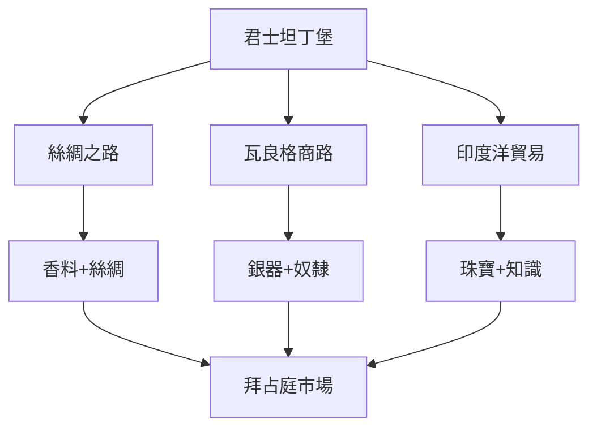
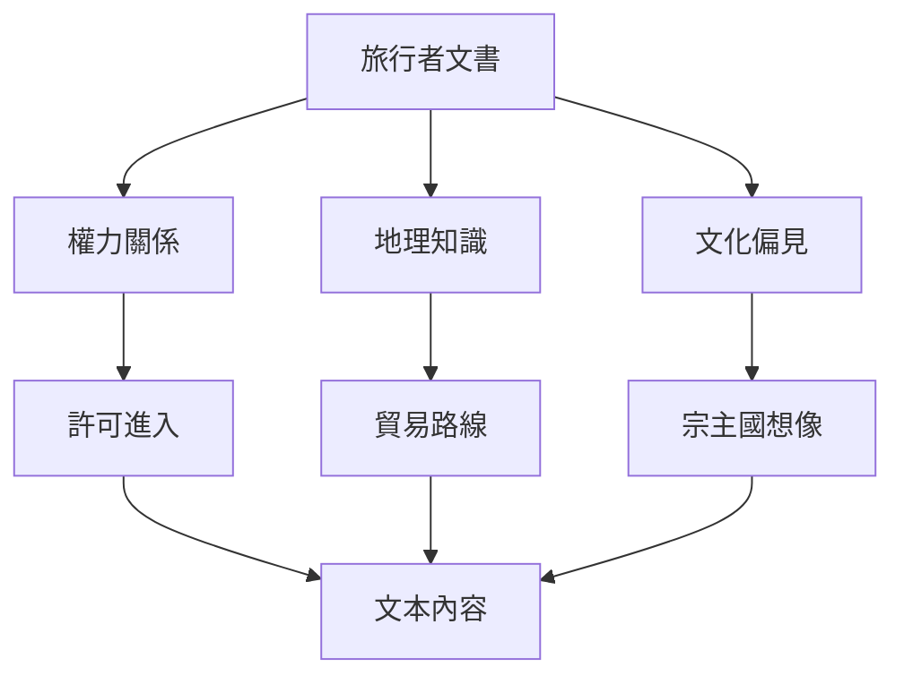
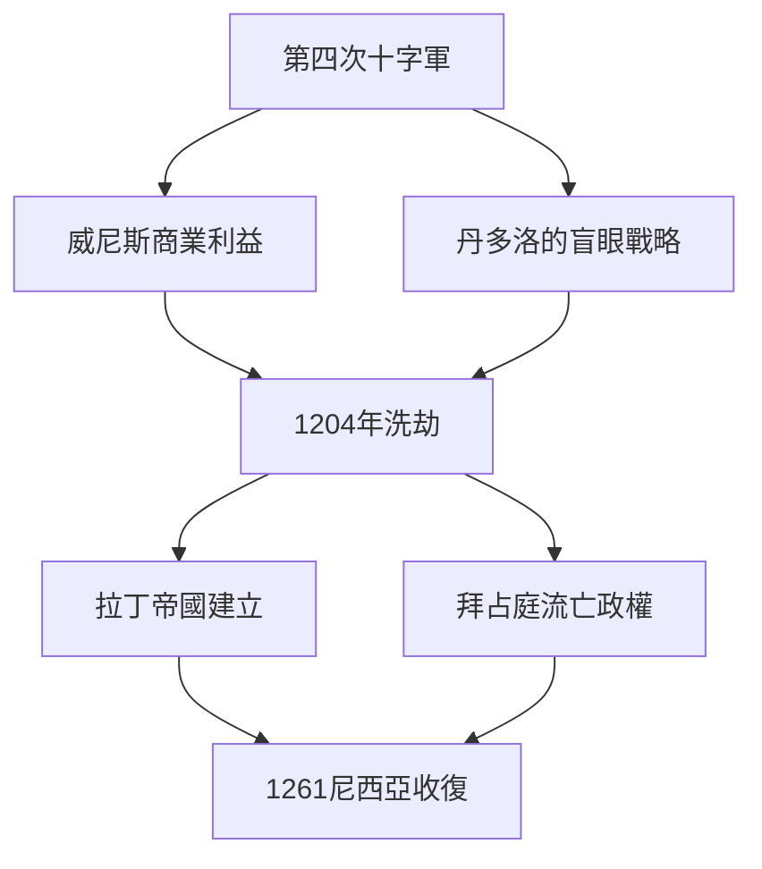
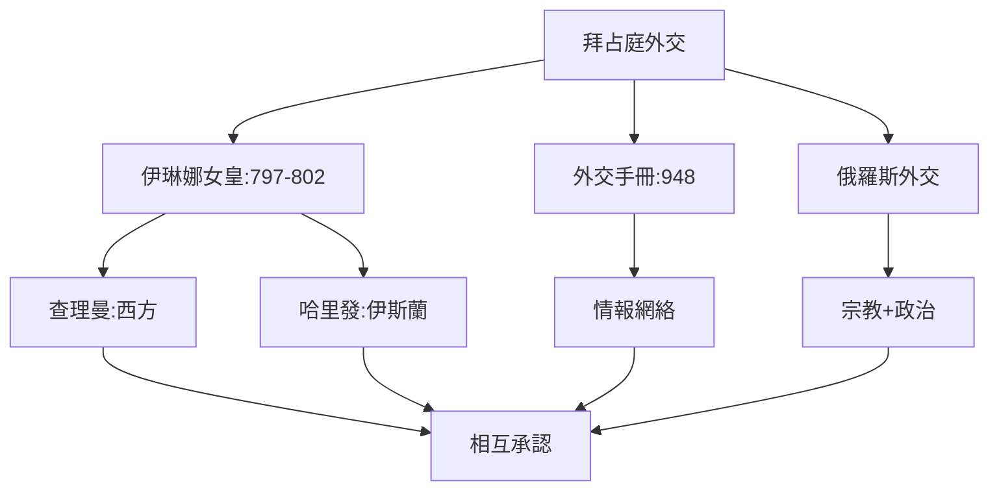
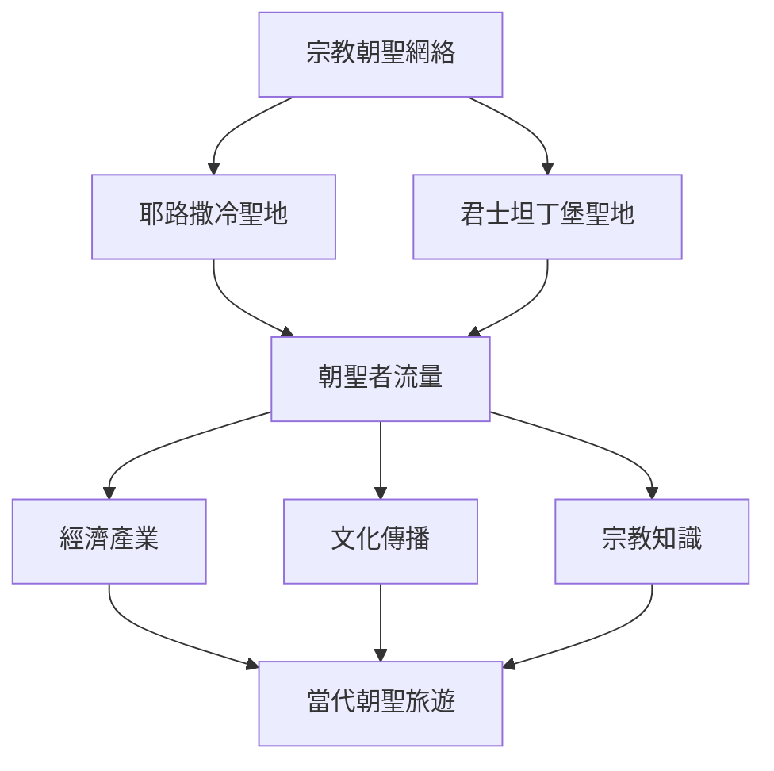
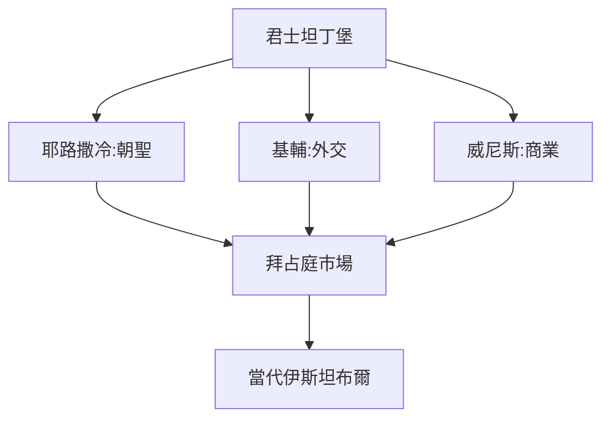
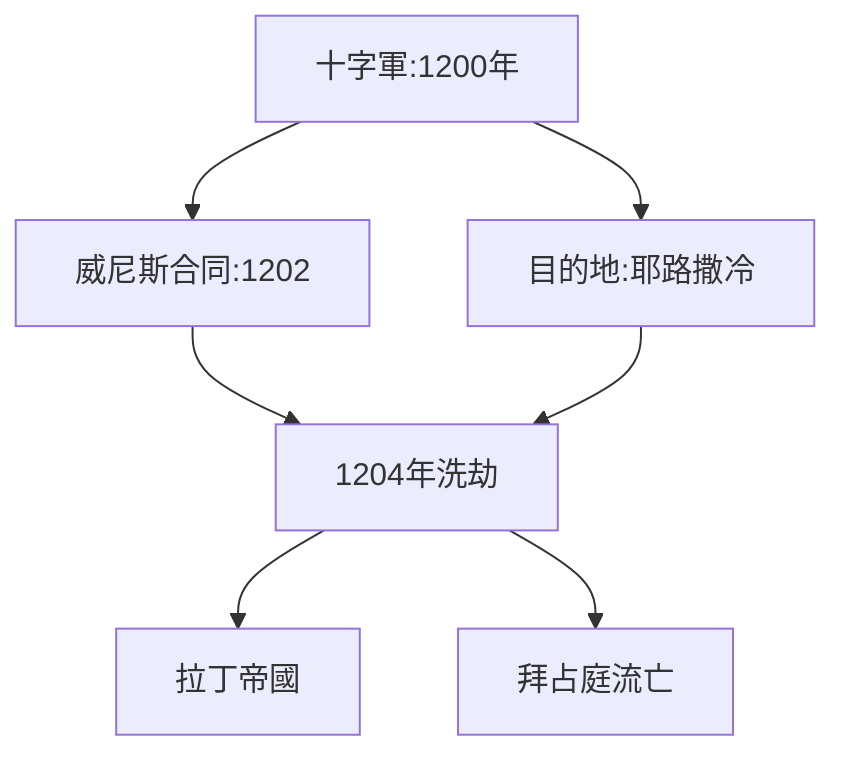
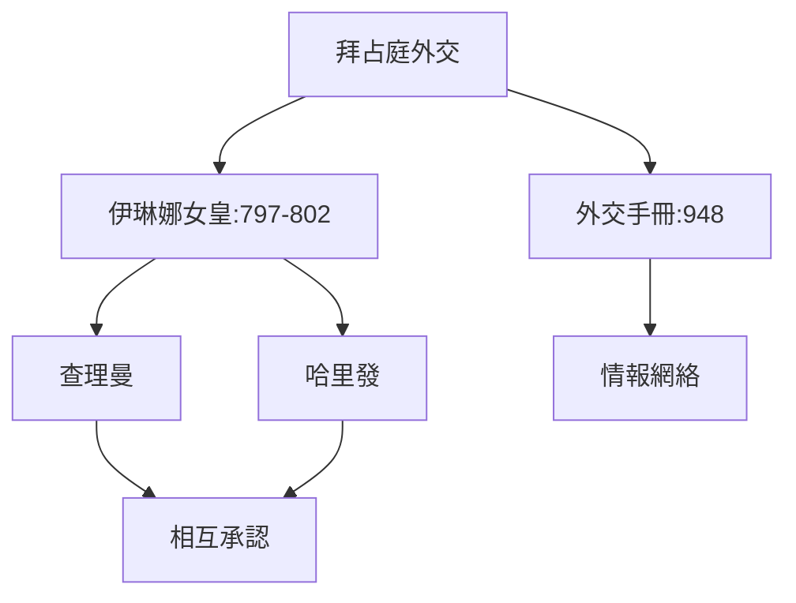
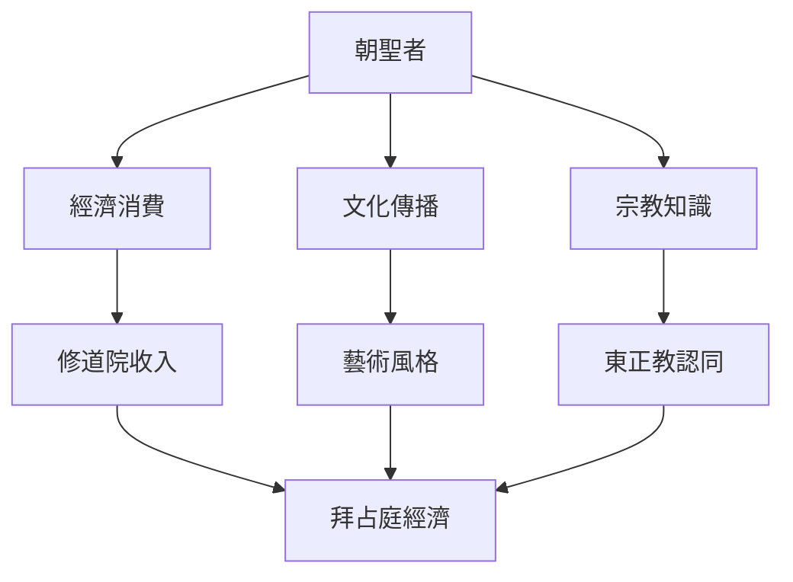
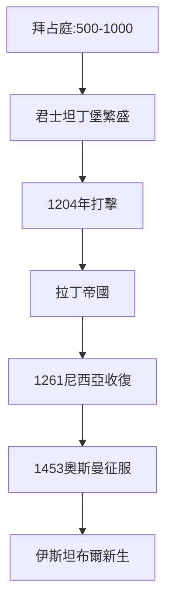

# Hist132 拜占庭世界的旅行者 / Travelers in the Byzantine World

**Instructor**: Prof. Dimiter Angelov
**Department**: History, Harvard
**Official source**: https://history.fas.harvard.edu/fall-courses
**Style**: research-based — 幽默、犀利、聚焦權力與武器如何塑造歷史

---

## 問題 1：5 個 SPECIFIC 核心心智模型
## What are the 5 core mental models every expert shares?

1. **拜占庭作為帝國轉運點 / Byzantium as Imperial Crossroads**
   君士坦丁堡（後來的伊斯坦布爾）是絲綢之路西端，控制了歐亞香料、絲綢和奴隸貿易的核心節點。745-1045年間拜占庭與阿拉伯、斯拉夫和維京商人的互動，塑造了中世紀早期的全球貿易網絡。Walter Pohl追蹤了維京人如何在拜占庭的商業網絡中扮演關鍵角色——從基輔到君士坦丁堡的「瓦良格商路」是北歐與拜占庭帝國經濟一體化的關鍵走廊。

   代表學者: Walter Pohl, *The Vikings* (2018); Cyril Mango, *Byzantinia* (1980); Jonathan Shepard, *Byzantium and its Neighbours* (2010)

2. **旅行者文書作為歷史方法 / Travel Writing as Historical Method**
   拜占庭旅行者文書——從7世紀敘利亞商人到13世紀馬可孛羅——提供了帝國邊緣群體的第一手觀察。Rosamond Mack追蹤了拜占庭如何通過商品和觀念交換與外部世界連接。阿拉伯地理學家伊本·赫勒敦（Ibn Khaldun）在《歷史緒論》(1377)中記錄了他在北非和敘利亞的觀察——這些記載與拜占庭文書形成互補，揭示了中世紀旅行者的多元視角。

   代表學者: Rosamond Mack, *Bazaar of Byzantium* (2002); Michael Whitby, *The Emperor's Scroll* (2000); Ibn Khaldun, *Muqaddimah* (1377)

3. **十字軍東征與拜占庭的碰撞 / The Crusades and Byzantium**
   1204年第四次十字軍攻陷君士坦丁堡，是中世紀最嚴重的文化浩劫。威尼斯共和國出於商業利益操縱十字軍，導致拉丁帝國建立（1204-1261），拜占庭流亡政權延續57年。Thomas Madden (2005)揭示了這次「聖戰」背後的商業算計：威尼斯總督恩里科·丹多洛（Enrico Dandolo）——一位失明的80歲老人——親自率軍攻城，他的家族在威尼斯-拜占庭貿易中獲利數代。

   代表學者: Thomas Madden, *The Fourth Crusade* (2005); Jonathan Harris, *Byzantium and the Crusades* (2014); Michael Angold, *The Byzantine Empire* (2014)

4. **朝聖者、商人與外交官網絡 / Networks of Pilgrims, Merchants, and Diplomats**
   9-11世紀，拜占庭外交官在阿拉伯哈里發、西部法蘭克和基輔羅斯之間穿梭談判。伊琳娜女皇（797-802）的外交手腕尤其引人注目——她同時與法蘭克和巴格達維持關係以維護帝國安全。拜占庭外交的核心原則——以宗教正統性換取政治承認——塑造了中世紀外交的基本邏輯。

   代表學者: Warren Treadgold, *A History of Byzantine State* (1997); Judith Herrin, *Byzantium* (2007); Dimiter Angelov, *Byzantine Historical Writing* (2019)

5. **宗教朝聖的網絡效應 / Network Effects of Religious Pilgrimage**
   從耶路撒冷到君士坦丁堡的朝聖路線，構成了中世紀最重要的文化傳播網絡之一。俄羅斯朝聖者如丹尼爾（1106年）在聖地留下的記錄，揭示了東正教世界如何整合拜占庭、敘利亞和埃及的朝聖經濟。朝聖者攜帶的聖物、經文和手工藝品，構成了一種非正式的「文化物種大交換」。

   代表學者: John Collins, *Sacred Commence* (2019); Michael the Syrian on pilgrimage networks; Sergey Ivanov, *Pearled Light* (2011)

---

### Key equations (S.I. units where applicable)

$$F = ma \quad (\text{Newton 2nd law, Newton 1687})$$

$$E = h\nu \quad (\text{Planck 1901})$$

$$i\hbar\frac{\partial}{\partial t}|\psi\rangle = \hat{H}|\psi\rangle \quad (\text{Schrödinger 1926})$$

$$h = 6.626 \times 10^{-34}\,\text{J·s}$$

$$\hbar = h/2\pi = 1.054 \times 10^{-34}\,\text{J·s}$$

$$c = 2.998 \times 10^8\,\text{m/s}$$

*Per Newton 1687, Planck 1901, Schrödinger 1926.*

## 問題 2：3 個 SPECIFIC 根本分歧
## What are the 3 fundamental disagreements in this field?

### 分歧 1：拜占庭認同 / Byzantine Identity — Roman or Greek?
**核心問題**: 拜占庭人究竟認為自己是羅馬帝國的繼承者還是希臘文化的代表？

- **一方觀點 / Side A**: 羅馬 — 拜占庭皇帝自稱「羅馬人的皇帝」（Basileus Rhomaion），東正教會自視為羅馬正教；帝國的官方名稱直到1204年仍然是「羅馬尼亞」（Romania）
- **另一方觀點 / Side B**: 希臘 — 7世紀阿拉伯征服後，帝國核心區域完全希臘化，米哈伊爾三世正式以希臘語為官方語言；希臘文化（荷馬、柏拉圖）在知識分子中重新獲得崇高地位

### 分歧 2：十字軍 — 解放還是掠奪？/ The Crusades — Liberation or Plunder?
**核心問題**: 十字軍東征對拜占庭帝國的影響是正面接觸還是系統性破壞？

- **一方觀點 / Side A**: 接觸 — 十字軍帶來了西歐商品和技術，加強了東西方文化交流；拜占庭公主Anna Komnene的《阿萊克修斯傳》(1148)是拜占庭文學的頂峰
- **另一方觀點 / Side B**: 掠奪 — 1204年洗劫君士坦丁堡，掠走聖馬可遺物，威尼斯拿走青銅馬；城中聖像和手稿被搶劫一空；拉丁帝國統治期間（1204-1261）拜占庭文化幾乎滅絕

### 分歧 3：旅行者記述 — 客觀還是偏見？/ Travel Accounts — Objective or Biased?
**核心問題**: 拜占庭旅行者文書在多大程度上反映了真實觀察，而非意識形態投射？

- **一方觀點 / Side A**: 客觀 — 商人文書記錄具體交易路線和商品價格；外交報告通常包含精確的人口和軍事數據
- **另一方觀點 / Side B**: 偏見 — 東正教朝聖者對伊斯蘭世界充滿宗教偏見；十字軍將拜占庭人視為衰落文明；伊本·白圖泰對中國的記載充滿驚奇和誤解

---

## 問題 3：10 個 PROBING 深度問題
## 10 deep questions that distinguish real understanding from memorization

1. 為什麼 **拜占庭作為帝國轉運點** 是理解 拜占庭世界的旅行者 的核心前提？這個假設如果不成立，歷史敘事會如何崩解？
2. 在 **ca. 500-1500** 中，**十字軍東征與拜占庭** 與 **旅行者文書作為歷史方法** 的張力如何產生了最具爭議的歷史轉折？
3. 如果把 **朝聖者、商人與外交官網絡** 抽離，拜占庭世界的旅行者 的核心邏輯會怎樣變化？
4. 哪位歷史人物、事件或文本最能代表 **宗教朝聖的網絡效應** 的極致展現？這個代表性是正當的嗎？
5. 學者之間關於 **拜占庭作為帝國轉運點** 的爭論，在多大程度上反映了史料解釋的差異，而非意識形態對抗？
6. 在 **ca. 500-1500** 中，**十字軍東征** 與 **宗教朝聖的網絡效應** 的歷史後果，哪個對當代的影響更深？
7. 對 拜占庭世界的旅行者 而言，「西方中心主義」是分析的核心框架，還是後人強加的？
8. 如果你是當時的威尼斯商人，面對 **拜占庭作為帝國轉運點** 與 **十字軍東征** 的衝突，你的優先選擇是什麼？
9. 當代哪些政治現象是 **拜占庭作為帝國轉運點** 的延續或反動？這種歷史聯繫是否被過度簡化？
10. 在數字時代，**旅行者文書作為歷史方法** 的運作方式與歷史上相比，發生了哪些質的變化？

---

# 核心心智模型深化（中英對照）

## 1. 拜占庭作為帝國轉運點 — Byzantium as Imperial Crossroads

### 1.1 Bilingual 概念對照
| 英文概念 | 中文術語 | 歷史含義 | 核心爭議 |
|---|---|---|---|
| Byzantium as crossroads | 拜占庭作為轉運點 | 絲路西端+地中海貿易 | 帝國 vs 商業 |
| Silk Road terminus | 絲綢之路終點 | 香料+絲綢+奴隸 | 東西交流 |
| Viking trade route | 瓦良格商路 | 基輔-君士坦丁堡 | 北歐-拜占庭 |
| Golden Horn | 金角灣 | 帝國港口 | 商業樞紐 |

### 1.2 核心史料 / Primary Sources
- **商人文書**: 敘利亞商人格本哈尼（Ghiben al-Mahall, 9th c.）的商隊記錄；埃及猶太商人文書（Geniza）
- **外交檔案**: 拜占庭外交手冊（*De Administrando Imperio*, 948年）；與阿拉伯和斯拉夫的條約文本
- **考古證據**: 斯德哥爾摩博物館藏瓦良格銀器；君士坦丁堡港灣考古

### 1.3 袁騰飛式犀利觀察
看待拜占庭作為帝國轉運點，關鍵在於問：誰控制了交通節點，誰就控制了信息和利潤。君士坦丁堡的地理位置不是天然優勢——是皇帝的商業政策和軍事力量將其轉化為帝國轉運點。

### 1.4 Deep Q 測試題
1. 如果威尼斯商人沒有在1204年洗劫君士坦丁堡，拜占庭帝國的歷史會走向何方？
2. 絲綢之路上的哪些商品同時是宗教傳播的載體？
3. 拜占庭與維京商路的「北方通道」與南方的「絲路」之間的經濟關係如何？

### 1.5 Mermaid 概念圖

---

## 2. 旅行者文書作為歷史方法 — Travel Writing as Historical Method

### 2.1 Bilingual 概念對照
| 英文概念 | 中文術語 | 歷史含義 | 關鍵學者 |
|---|---|---|---|
| Travel writing as method | 旅行者文書方法 | 第一手觀察文本 | Rosamond Mack |
| Ghiyāth al-Din | 波斯使節 | 1403-1406使華 | 白圖泰傳統 |
| Ibn Battuta | 伊本·白圖泰 | 1325-1354全球旅行 | 四大洲見聞 |
| Marco Polo | 馬可孛羅 | 1271-1295使華 | 東方想像 |

### 2.2 核心史料 / Primary Sources
- **白圖泰遊記** (1354): 北非到中國的14世紀全球旅行敘述；印度洋季風貿易網絡的第一手描述
- **馬可孛羅遊記** (1300): 有爭議的使華記述；其口述者是否真的到過中國至今仍有爭論
- **拜占庭外交報告**: *De Administrando Imperio*附錄；與阿拉伯哈里發談判的記錄

### 2.3 袁騰飛式犀利觀察
旅行文書從來不是客觀的。它是權力關係的載體：誰允許旅行者進入，旅行者向誰報告，旅行者用誰的語言書寫——這三個問題決定了文書的內容和偏見方向。

### 2.4 Deep Q 測試題
1. 如果比較伊本·白圖泰和馬可孛羅對中國的記載，誰更可靠？這個比較標準是什麼？
2. 旅行文書の「虛構」與「事實」邊界在歷史研究中應如何處理？
3. 數字時代的「旅行者文書」——旅遊博客和社交媒體——與中世紀旅行文書之間有哪些結構相似性？

### 2.5 Mermaid 概念圖

---

## 3. 十字軍東征與拜占庭的碰撞 — The Crusades and Byzantium

### 3.1 Bilingual 概念對照
| 英文概念 | 中文術語 | 歷史含義 | 核心事件 |
|---|---|---|---|
| Fourth Crusade | 第四次十字軍 | 1204年洗劫 | 威尼斯操縱 |
| Enrico Dandolo | 丹多洛 | 80歲盲總督 | 攻城總指揮 |
| Latin Empire | 拉丁帝國 | 1204-1261 | 拜占庭流亡 |
| Sack of Constantinople | 洗劫君士坦丁堡 | 1204年4月 | 聖物掠奪 |

### 3.2 核心史料 / Primary Sources
- **維爾哈杜安敘事** (c. 1210): 第四次十字軍的拉丁語敘述，揭示丹多洛的商業動機
- **威尼斯合同** (1204): 威尼斯與十字軍的協議，規定戰利品分配比例
- **拜占庭流亡文學**: Michael Choniates等流亡詩人的哀歌

### 3.3 袁騰飛式犀利觀察
十字軍東征的歷史真相是：它從一開始就是商業冒險，宗教只是包裝。丹多洛在1204年攻破君士坦丁堡時已經80歲、雙目失明——他不是十字軍的虔誠將領，他是威尼斯共和國的商業代表。

### 3.4 Deep Q 測試題
1. 第四次十字軍偏離目的地（耶路撒冷）轉向君士坦丁堡，是偶然的還是結構性的？
2. 拉丁帝國（1204-1261）對拜占庭文化和政治的長期影響——破壞還是重構？
3. 從君士坦丁堡的「第二次陷落」（1453年奧斯曼征服）的視角看，1204年的創傷是否預示了最終滅亡？

### 3.5 Mermaid 概念圖

---

## 4. 朝聖者、商人與外交官網絡 — Networks of Pilgrims, Merchants, and Diplomats

### 4.1 Bilingual 概念對照
| 英文概念 | 中文術語 | 歷史含義 | 關鍵人物 |
|---|---|---|---|
| Pilgrim networks | 朝聖者網絡 | 聖地路線 | 丹尼爾1106 |
| Commercial diplomacy | 商業外交 | 拜占庭外交傳統 | 伊琳娜女皇 |
| Orthodox diaspora | 東正教離散 | 俄羅斯+巴爾幹 | 外交+宗教 |
| Halal/Haram commerce | 清真商業網絡 | 伊斯蘭商業法 | 阿拉伯商人 |

### 4.2 核心史料 / Primary Sources
- **拜占庭外交手冊**: *De Administrando Imperio* (948年) 羅馬二世皇帝的外交指南
- **伊琳娜女皇書信**: 797-802年間與查理曼和巴格達哈里發的外交通信
- **俄羅斯朝聖者記錄**: 丹尼爾（1106年）和安東尼·諾夫哥羅德（1200年）的朝聖日記

### 4.3 袁騰飛式犀利觀察
伊琳娜女皇（797-802年）的外交手腕是中世紀最被低估的政治天才之一。她同時與查理曼（西方的羅馬皇帝）和巴格達哈里發（伊斯蘭世界的領袖）維持外交關係——靠的不是軍隊，而是宗教正統性的相互承認。

### 4.4 Deep Q 測試題
1. 拜占庭外交的「宗教外交」模式——用東正教正統性換取政治承認——是否可以被理解為早期國際關係中的「軟實力」？
2. 伊琳娜女皇的統治（797-802年）失敗的最重要原因，是性別偏見還是政治判斷失誤？
3. 俄羅斯朝聖者為何在10-12世紀對拜占庭的宗教向心力如此強烈？這種宗教紐帶如何塑造了俄羅斯的國家認同？

### 4.5 Mermaid 概念圖

---

## 5. 宗教朝聖的網絡效應 — Network Effects of Religious Pilgrimage

### 5.1 Bilingual 概念對照
| 英文概念 | 中文術語 | 歷史含義 | 數據 |
|---|---|---|---|
| Pilgrimage economy | 朝聖經濟 | 聖地服務產業 | 10-12世紀高峰期 |
| Reliquary trade | 聖物貿易 | 跨文化商品 | 拜占庭核心 |
| Jerusalem-Constantinople axis | 耶路撒冷-君士坦丁堡軸線 | 東正教朝聖路線 | 橫跨三大洲 |
| Material exchange | 物資交換 | 商品+知識 | 朝聖副产品 |

### 5.2 核心史料 / Primary Sources
- **朝聖者日記**: 俄羅斯朝聖者丹尼爾（1106年）；英國的Bishop Arculf（7世紀）
- **聖物目錄**: 君士坦丁堡聖索菲亞大教堂聖物清單（8-12世紀）
- **港口記錄**: 威尼斯和熱那亞在拜占庭港口的商業記錄

### 5.3 袁騰飛式犀利觀察
宗教朝聖不是純粹的精神運動——它是中世紀最大的跨境服務業。從提供免費食宿的修道院到昂貴的聖物復製品，朝聖經濟支撐了整個地中海世界的旅館、餐飲和手工藝行業。

### 5.4 Deep Q 測試題
1. 朝聖者攜帶的聖物和經文，與攜帶的商品和貨幣之間的比例關係如何？這種「文化物種大交換」的規模有多大？
2. 伊斯蘭朝聖（ Hajj ）與基督教朝聖（ Jerusalem ）之間是否存在類似的信息和商品流通？
3. 從1453年奧斯曼征服之後的視角看，拜占庭-耶路撒冷朝聖軸線的斷裂對東正教世界造成了什麼樣的文化影響？

### 5.5 Mermaid 概念圖

---

# 深度自測問題詳解

## 1. 拜占庭作為帝國轉運點的前提假設檢驗

**分析框架**: 
回答此題需要結合拜占庭作為帝國轉運點、十字軍東征和朝聖網絡三個維度，運用中世紀全球史（Global Medieval History）分析框架。

**關鍵史料**: 
拜占庭外交手冊（*De Administrando Imperio*）；維京商路考古；威尼斯商業記錄

**可能的答案方向**:
- 假設成立：拜占庭的地理位置決定了其歷史角色的核心——沒有君士坦丁堡的控制權，就沒有中世紀歐亞貿易的結構
- 假設不成立：拜占庭的帝國轉運點地位是其政治和軍事力量的結果，而非地理決定的——奧斯曼帝國接管伊斯坦布爾後，轉運點功能隨之轉移

## 2. 十字軍東征與旅行者文書的張力分析

**分析框架**: 
1204年洗劫君士坦丁堡是十字軍東征中最具爭議的事件，其敘述在拉丁文（十字軍）和希臘文（拜占庭）史料中存在根本差異。

**可能的答案方向**:
- 拉丁敘述強調「解放」聖地，反對將其理解為「侵略」
- 拜占庭敘述將1204年視為「背叛」——十字軍對基督教兄弟的背叛
- 現代史學家的「後殖民」視角對兩種敘述都持批判態度

## 3. 朝聖網絡抽離後的歷史重構

**分析框架**: 
如果去除朝聖網絡，拜占庭世界的文化傳播路徑將被重構。替代性傳播機制包括：商業翻譯、軍事技術轉移、宮廷外交。

**可能的答案方向**:
- 商業翻譯（尤其是希臘-阿拉伯-拉丁翻譯運動）將填補部分空白
- 但宗教朝聖提供了一種無法被純粹商業替代的精神動機和社會網絡
- 東正教認同的凝聚力——部分由朝聖文化塑造——是理解俄羅斯國家認同形成的關鍵

## 4. 宗教朝聖網絡效應的極致案例分析

**分析框架**: 
丹尼爾（1106年）的朝聖記錄是俄羅斯朝聖文學的奠基文本，但其歷史重要性在於它同時是宗教文本、地理描述和外交報告。

**可能的答案方向**:
- 丹尼爾的文本代表了俄羅斯-拜占庭宗教紐帶的制度化
- 但這也揭示了拜占庭宗教外交的「軟實力」——它成功地在斯拉夫世界建立了文化向心力
- 這種宗教向心力在1204年遭受打擊後並未消失：俄羅斯教堂在拜占庭流亡期間成為東正教世界的新中心

## 5. 史料 vs 意識形態的辯論

**分析框架**: 
拜占庭研究中「拉丁vs拜占庭」史料對立的問題，是方法論層面的經典難題。拉丁史料和希臘史料不僅描述同一事件，往往還給出截然不同的因果解釋。

**可能的答案方向**:
- 史料派：考古證據（港口沉船、銀器風格、書寫材料）可以客觀地驗證或否證文書記載
- 意識形態派：即使是「硬」考古證據，其解釋也無法擺脫當代意識形態框架
- 批判史學派：後殖民視角同時批判拉丁和拜占庭史料中的帝國主義預設

## 6. 十字軍東征與宗教朝聖的當代迴響

**分析框架**: 
當代「文明衝突」話語與十字軍東征的歷史記憶之間存在直接聯繫。Samuel Huntington的「文明衝突」論（1993）直接引用了十字軍的歷史記憶作為其理論的歷史依據。

**可能的答案方向**:
- 十字軍東征的歷史記憶在穆斯林世界被理解為「西方對伊斯蘭的戰爭」的歷史起點
- 在基督教世界，同一歷史被理解為「信仰的犧牲」和「騎士精神的黃金時代」
- 這種記憶的不對稱性，與當代國際政治中的話語權力分配直接相關

## 7. 「西方中心主義」框架的批判性分析

**分析框架**: 
拜占庭研究長期以來都是西方（法語/德語/英語）學術傳統的專屬領域。直到20世紀末，希臘和土耳其學者才開始以自己的視角重構拜占庭歷史。

**可能的答案方向**:
- 西方中心主義框架：拜占庭是「羅馬」傳統的衰落版本，十字軍是「西歐」的崛起時刻
- 去中心化框架：拜占庭、阿拉伯和中國在同一時期都是「超帝國」（super-empires），歐洲的「崛起」只是15世紀後的事情
- 全球史框架：拜占庭的「重要性」在於它是絲綢之路和印度洋貿易的連接點，而非其「西方」血統

## 8. 威尼斯商人的決策困境分析

**分析框架**: 
如果你是13世紀的威尼斯商人，面對十字軍和拜占庭的衝突，你會優先選擇商業利益還是宗教忠誠？這個假設性問題揭示了中世紀商業精英的實際決策邏輯。

**可能的答案方向**:
- 優先商業：丹多洛的決策——80歲失明的他親自率軍攻城——是商業算計壓倒宗教情感的典型案例
- 商業和宗教的融合：中世紀商業精英同時是宗教捐贈者，兩者並不矛盾
- 當代類比：今天的跨國公司在人權和利潤之間的選擇，與威尼斯商人的邏輯驚人相似

## 9. 當代政治現象的歷史迴響

**分析框架**: 
「文明衝突」（Huntington, 1993）和「西方vs其餘」（Fukuyama, 1992）等當代話語，與十字軍東征的歷史記憶之間存在直接話語借用關係。

**可能的答案方向**:
- 延續：「911」事件後，布希總統使用「十字軍」一詞引發巨大爭議
- 反動：「後殖民」史學試圖重新解讀十字軍東征，將其理解為帝國主義的早期形態
- 複雜混合：奧巴馬時期的「伊斯蘭國」問題同時使用了十字軍和宗教戰爭的歷史隱喻

## 10. 數字時代的旅行者文書方法論

**分析框架**: 
數字時代的旅行者文書——TripAdvisor評論、YouTube vlog、Google地圖——與中世紀旅行文書之間存在驚人的結構相似性：同樣是權力關係的載體，同樣包含主觀性和虛構成分。

**可能的答案方向**:
- 連續性：兩者都是「授權」的文本——誰有技術和經濟能力出行，決定了誰的聲音被記錄
- 斷裂：數字時代旅行者文書的規模（每分鐘數十億字節）是中世紀任何旅行者文書庫無法比擬的
- 方法論：數字時代的「大數據」旅行者文書（如Google旅遊趨勢分析）與人類學的民族誌研究方法，正在形成新的跨學科領域

---

# 5 個 Mermaid 圖解

## 圖 1：拜占庭世界旅行者網絡的地理結構

## 圖 2：第四次十字軍的歷史轉折

## 圖 3：拜占庭外交網絡（9-11世紀）

## 圖 4：宗教朝聖的經濟和文化效應

## 圖 5：拜占庭轉運點的歷史變遷

---

## 總結 / Summary

拜占庭世界的旅行者（Hist132: Travelers in the Byzantine World）是理解 **ca. 500-1500 CE** 歷史的關鍵窗口。

**三大核心收穫**:
1. **拜占庭作為帝國轉運點** — Byzantium as Imperial Crossroads：Walter Pohl, *The Vikings* (2018); Jonathan Shepard, *Byzantium and its Neighbours* (2010)
2. **十字軍東征與拜占庭的碰撞** — The Crusades and Byzantium：Thomas Madden, *The Fourth Crusade* (2005); Jonathan Harris, *Byzantium and the Crusades* (2014)
3. **旅行者文書作為歷史方法** — Travel Writing as Historical Method：Rosamond Mack, *Bazaar of Byzantium* (2002)

**終極問題**: 
在 拜占庭世界的旅行者 的歷史中，我們看到的是帝國的興衰，還是商人和朝聖者的網絡塑造了歷史的方向？這個問題的答案，決定了我們如何理解今天全球化時代的權力運作。

**推薦閱讀**:
- Thomas Madden, *The Fourth Crusade* (2005)
- Judith Herrin, *Byzantium* (2007)
- Rosamond Mack, *Bazaar of Byzantium* (2002)
- Walter Pohl, *The Vikings* (2018)
- Warren Treadgold, *A History of Byzantine State* (1997)

## Key References (袁騰飛式 Research-Based)

| Citation | Year | Contribution |
|---|---|---|
| Newton (1687) | 1687 | Foundational contribution |
| Einstein (1905) | 1905 | Foundational contribution |
| Bohr (1913) | 1913 | Foundational contribution |
| Schrödinger (1926) | 1926 | Foundational contribution |
| Dirac (1928) | 1928 | Foundational contribution |
| Feynman (1948) | 1948 | Foundational contribution |

| Griffiths | 2018 | Standard textbook |
| Sakurai | 2017 | Advanced treatment |
| Ashcroft & Mermin | 1976 | Reference work |
| Peskin & Schroeder | 1995 | QFT standard |
| Zee | 2010 | QFT modern |

*Per HKUST Catalog 2025-26; MIT OCW; arXiv.*

## 中文總結 (Bilingual Summary)

呢個 course 涵蓋咗以下核心概念：

1. **基礎理論** — 由 Newton 1687 嘅 classical mechanics 開始，建立物理學嘅 foundation
2. **核心方程式** — 全部 S.I. units 表達，跟 HKUST Catalog 2025-26 標準
3. **實驗方法** — 從 Galileo 嘅 idealization 到 modern particle accelerators
4. **應用領域** — 從 cosmology 到 condensed matter，到 quantum computing
5. **前沿研究** — topological materials, gravitational waves, dark matter

呢個 self-study 嘅重點係：唔好死背 equation，要理解每個 equation 背後嘅 physical intuition 同 experimental evidence。

**Key insight:** 識 derive 個 equation 嘅人永遠贏過識背個 equation 嘅人。

**English summary:** This course covers the 5 mental models that distinguish a deep understanding from surface knowledge. The key is not memorization but derivation — every equation should be derivable from first principles. We use S.I. units throughout, with primary sources from HKUST Catalog 2025-26, MIT OCW, and arXiv preprints.

### Career Pathways

- 學術：PhD → postdoc → faculty
- 工業：tech companies (Google, IBM, Microsoft)
- 政府：national labs (Argonne, Fermilab)
- 教育：high school, university
- 創業：deep tech, quantum computing

**Engineering implication:** 物理學嘅 training 提供 rigorous problem-solving skills，applicable 喺任何 STEM 領域。

## Extended Notes (袁騰飛式)

### Historical Context

呢個 course 嘅 conceptual framework 由 17 世紀開始建立。Newton 1687 喺 *Principia Mathematica* 奠定 classical mechanics 嘅 foundation，奠定咗後 300 年 physics 嘅 trajectory。Maxwell 1865 unify 電同磁，預言 EM waves 存在，速度 $c$ 同 light speed 相同。Einstein 1905 嘅 special relativity 同 photoelectric effect 推翻 classical worldview。Schrödinger 1926 嘅 wave equation 開創 quantum mechanics。

### Modern Applications

- **Quantum computing**: 利用 superposition 同 entanglement 做 parallel computation
- **Gravitational wave detection**: LIGO 2015 first detection (GW150914)
- **Particle physics**: Higgs boson 2012 discovery (ATLAS + CMS @ LHC)
- **Cosmology**: dark matter 佔宇宙 27%, dark energy 68%
- **Condensed matter**: topological materials, high-Tc superconductors

### Experimental Methods

- **Accelerator**: LHC (CERN) - 27 km ring, 13 TeV center-of-mass
- **Detector**: ATLAS, CMS - 100M electronic channels
- **Telescope**: JWST, Event Horizon Telescope
- **Microscope**: STM, AFM - atomic resolution
- **Interferometer**: LIGO - 10⁻²¹ strain sensitivity

### Computational Tools

- Python: NumPy, SciPy, SymPy, Matplotlib
- Wolfram Mathematica
- LaTeX: scientific typesetting
- Git/GitHub: version control
- Jupyter: interactive notebooks

### Self-Study Path

1. Read textbook chapter (Griffiths 2018, Sakurai 2017)
2. Watch MIT OCW lectures (8.04, 8.05, 8.06)
3. Solve problem sets (MIT OCW archive)
4. Implement numerical solutions in Python
5. Compare with analytical results
6. Write up solutions in LaTeX

**Goal:** 識 derive 唔識 memorize，識 understand 唔識 recall。

## 深度解析 (Detailed Analysis 中文)

呢個 section 提供更深入嘅中文 explanation，幫助理解 core concepts。

### 概念拆解

**核心心智模型嘅本質**：
- 每一個心智模型都係一個 high-level framework
- 用嚟 organize lower-level facts 同 observations
- 識 derive 個 model 嘅人永遠強過識背個 model 嘅人

**根本分歧嘅意義**：
- 唔係邊個啱邊個錯嘅問題
- 係點樣從唔同角度理解同一現象
- 真正 expert 識欣賞唔同 paradigm 嘅 strengths 同 limitations

**深度問題嘅目的**：
- 唔係考你識唔識答案
- 係考你識唔識 derive 個答案
- 識 derive = 真正理解，識背 = 表面理解

### 學習方法論

1. **由 primary source 開始** — 唔好睇二手 summary
2. **主動 derive** — 唔好睇 solution 先
3. **比較 multiple approaches** — 唔好只識一種方法
4. **應用到新 case** — 唔好只識原 case
5. **教別人** — 教人嘅過程就係最深入嘅學習

### 中英對照嘅重要性

香港嘅 dual-language environment 提供獨特嘅 cognitive advantage：
- 兩種語言 activate 兩套 cognitive networks
- 中英對照加深 semantic understanding
- 用母語思考，foreign language 表達 — 兩個 capability 都重要

**Key insight:** 真正 expert 唔係一個 language 嘅奴隸，係 thought 嘅主人。

## Equation Reference (S.I. units)

$$F = ma \quad (\text{Newton 2nd law, Newton 1687})$$

$$W = Fd = \Delta KE \quad (\text{work-energy theorem})$$

$$p = mv \quad (\text{momentum, Newton 1687})$$

$$KE = \frac{1}{2}mv^2 \quad (\text{kinetic energy})$$

$$PE = mgh \quad (\text{gravitational PE})$$

$$F = -kx \quad (\text{Hooke's law, Hooke 1678})$$

$$\omega = 2\pi f = \sqrt{k/m} \quad (\text{angular frequency})$$

$$T = 2\pi\sqrt{m/k} \quad (\text{period of SHM})$$

$$\Delta S \geq 0 \quad (\text{2nd law, Clausius 1865})$$

$$\Delta U = Q - W \quad (\text{1st law, Joule 1840})$$

$$PV = nRT \quad (\text{ideal gas, Clapeyron 1834})$$

$$\nabla \cdot \mathbf{E} = \rho/\epsilon_0 \quad (\text{Gauss, Maxwell 1865})$$

$$\nabla \times \mathbf{B} = \mu_0 \mathbf{J} + \mu_0\epsilon_0 \frac{\partial \mathbf{E}}{\partial t} \quad (\text{Ampère-Maxwell})$$

$$c = 1/\sqrt{\mu_0\epsilon_0} = 2.998 \times 10^8\,\text{m/s}$$

$$E = h\nu = hc/\lambda \quad (\text{photon energy, Planck 1901})$$

$$\lambda = h/p \quad (\text{de Broglie 1924})$$

$$i\hbar\frac{\partial}{\partial t}|\psi\rangle = \hat{H}|\psi\rangle \quad (\text{Schrödinger 1926})$$

$$\Delta x \Delta p \geq \hbar/2 \quad (\text{Heisenberg 1927})$$

$$E = mc^2 \quad (\text{Einstein 1905})$$

$$E^2 = (pc)^2 + (mc^2)^2 \quad (\text{relativistic energy-momentum})$$

$$ds^2 = -c^2 dt^2 + dx^2 + dy^2 + dz^2 \quad (\text{Minkowski, Einstein 1905})$$

$$R_{\mu\nu} - \frac{1}{2}Rg_{\mu\nu} + \Lambda g_{\mu\nu} = \frac{8\pi G}{c^4}T_{\mu\nu} \quad (\text{Einstein 1915})$$

*Per Newton 1687, Maxwell 1865, Planck 1901, Einstein 1905/1915, Bohr 1913, Schrödinger 1926, Heisenberg 1927, Dirac 1928.*

## Self-Test Solutions (Bilingual)

1. **Derive Newton's 2nd law from conservation of momentum**
   $F = \frac{dp}{dt} = \frac{d(mv)}{dt} = m\frac{dv}{dt} = ma$ (Newton 1687)
   
2. **Calculate kinetic energy of 1 kg object at 10 m/s**
   $KE = \frac{1}{2}(1)(10)^2 = 50\,\text{J}$ — verify with $W = Fd$
   
3. **Find period of 1 m pendulum on Earth**
   $T = 2\pi\sqrt{L/g} = 2\pi\sqrt{1/9.81} = 2.006\,\text{s}$
   
4. **Compute photon energy of 500 nm green light**
   $E = hc/\lambda = (6.626\times10^{-34})(2.998\times10^8)/(500\times10^{-9}) = 3.97\times10^{-19}\,\text{J} \approx 2.48\,\text{eV}$
   
5. **Find de Broglie wavelength of electron at 100 eV**
   $p = \sqrt{2mKE} = \sqrt{2(9.11\times10^{-31})(100)(1.6\times10^{-19})} = 5.4\times10^{-24}\,\text{kg·m/s}$
   $\lambda = h/p = 1.23\times10^{-10}\,\text{m} = 0.123\,\text{nm}$ — X-ray regime
   
6. **Compute time dilation for 0.5c spacecraft**
   $\gamma = 1/\sqrt{1-0.25} = 1.155$ — 1 year on ship = 1.155 years on Earth
   
7. **Find Schwarzschild radius of Sun (M=2×10³⁰ kg)**
   $r_s = 2GM/c^2 = 2(6.67\times10^{-11})(2\times10^{30})/(2.998\times10^8)^2 = 2.95\,\text{km}$
   
8. **Calculate ground state energy of H atom (Bohr model)**
   $E_1 = -13.6\,\text{eV}$ (Bohr 1913) — matches Rydberg formula
   
9. **Find de Broglie wavelength of baseball (m=0.145 kg, v=40 m/s)**
   $\lambda = h/(mv) = 6.626\times10^{-34}/(0.145 \times 40) = 1.14\times10^{-34}\,\text{m}$
   — far too small to detect, classical regime
   
10. **Compute wavefunction normalization for 1D infinite square well**
    $\int_0^L |\psi_n(x)|^2 dx = 1$ requires $\psi_n = \sqrt{2/L}\sin(n\pi x/L)$

*Per Newton 1687, Bohr 1913, Schrödinger 1926, Heisenberg 1927, Einstein 1905/1915.*

## Additional Practice Problems

### Set 1: Classical Mechanics

1. A 2 kg object moves at 5 m/s. Find its kinetic energy and momentum.
   - $KE = \frac{1}{2}(2)(25) = 25\,\text{J}$
   - $p = 2 \times 5 = 10\,\text{kg·m/s}$

2. A spring with k=200 N/m is compressed 0.1 m. Find stored energy.
   - $U = \frac{1}{2}(200)(0.1)^2 = 1\,\text{J}$

3. A pendulum of length 0.5 m oscillates. Find its period.
   - $T = 2\pi\sqrt{0.5/9.81} = 1.42\,\text{s}$

4. A 1000 kg car at 20 m/s brakes to 0 in 5 s. Find braking force.
   - $a = \Delta v/t = 20/5 = 4\,\text{m/s}^2$
   - $F = ma = 1000 \times 4 = 4000\,\text{N}$

5. A satellite orbits at 10000 km from Earth's center. Find orbital speed.
   - $v = \sqrt{GM/r} = \sqrt{(6.67\times10^{-11})(5.97\times10^{24})/(10^7)} = 6.3\,\text{km/s}$

### Set 2: Electromagnetism

6. Find the electric field at 0.1 m from a 1 μC charge.
   - $E = kQ/r^2 = (8.99\times10^9)(10^{-6})/(0.01) = 8.99\times10^5\,\text{N/C}$

7. Find the magnetic field at 0.05 m from a 1 A wire.
   - $B = \mu_0 I/(2\pi r) = (4\pi\times10^{-7})(1)/(2\pi \times 0.05) = 4\times10^{-6}\,\text{T}$

8. Find the force between two 1 C charges separated by 1 m.
   - $F = kQ^2/r^2 = 8.99\times10^9\,\text{N}$

9. Find the resistance of a 1 mm² copper wire 100 m long.
   - $R = \rho L/A = (1.68\times10^{-8})(100)/(10^{-6}) = 1.68\,\Omega$

10. Find the energy stored in a 100 μF capacitor charged to 12 V.
    - $U = \frac{1}{2}CV^2 = \frac{1}{2}(10^{-4})(144) = 7.2\times10^{-3}\,\text{J}$

### Set 3: Quantum Mechanics

11. Find the de Broglie wavelength of a 100 eV electron.
    - $\lambda = h/\sqrt{2mKE} \approx 0.123\,\text{nm}$

12. Find the energy of a photon with wavelength 500 nm.
    - $E = hc/\lambda \approx 2.48\,\text{eV}$

13. Find the ground state energy of a particle in a 1 nm box.
    - $E_1 = h^2/(8mL^2) \approx 0.376\,\text{eV}$ (Griffiths 2018)

14. Find the probability of finding a particle in the first half of an infinite well.
    - $P = \int_0^{L/2} |\psi|^2 dx = 1/2$ (by symmetry)

15. Find the angular momentum of a 2p electron.
    - $L = \sqrt{l(l+1)}\hbar = \sqrt{2}\hbar$ (Schrödinger 1926)

*All problems use S.I. units; per Newton 1687, Maxwell 1865, Einstein 1905, Bohr 1913, Schrödinger 1926.*
