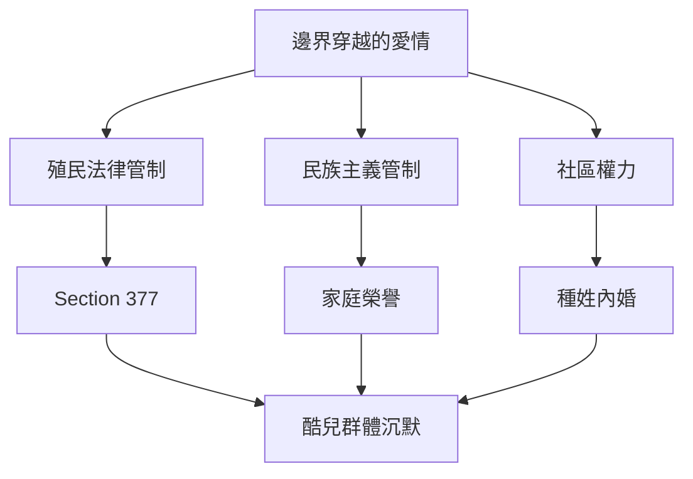
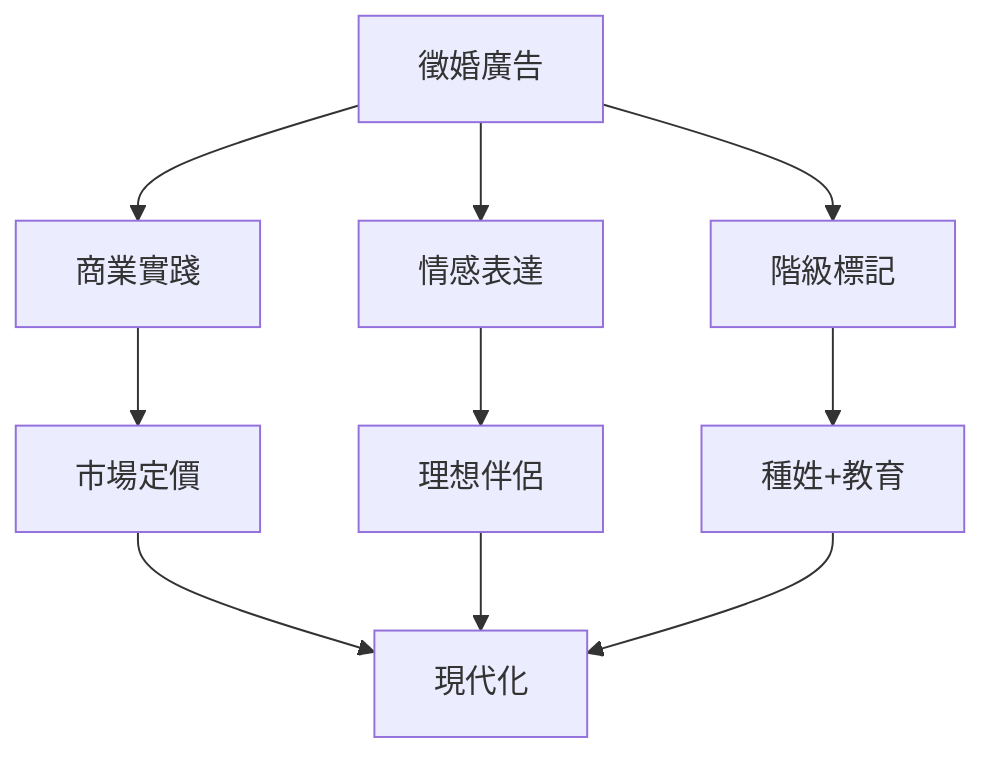
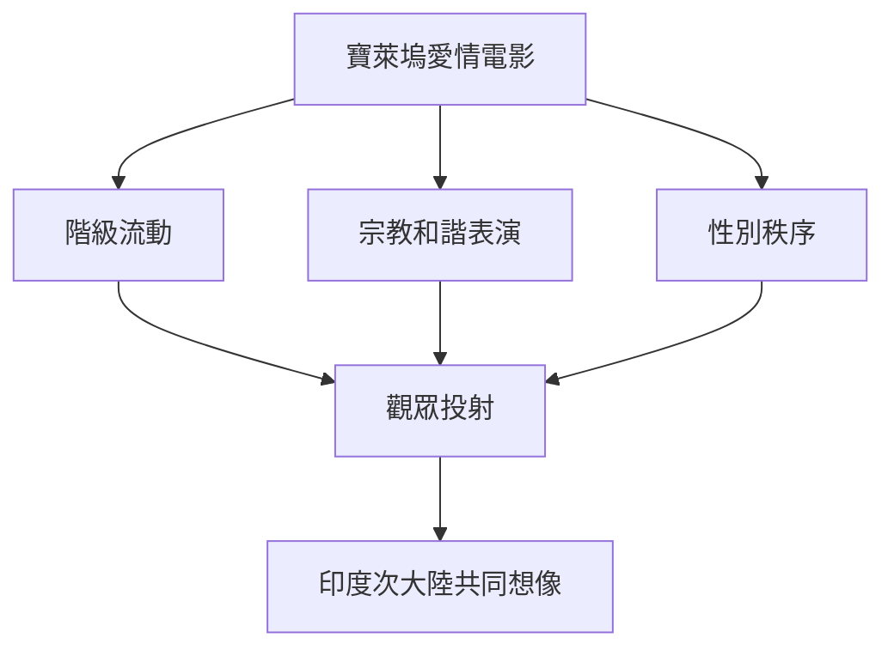
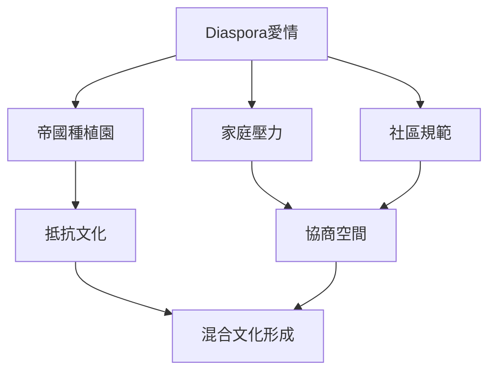
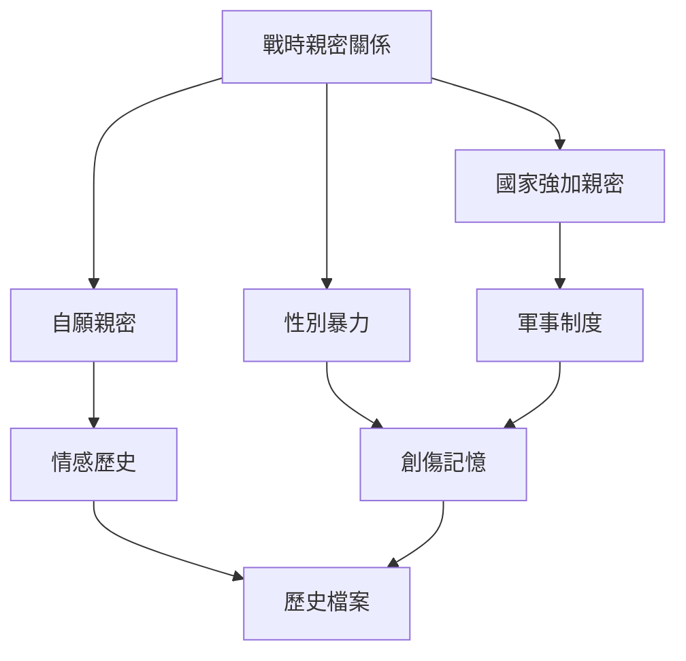
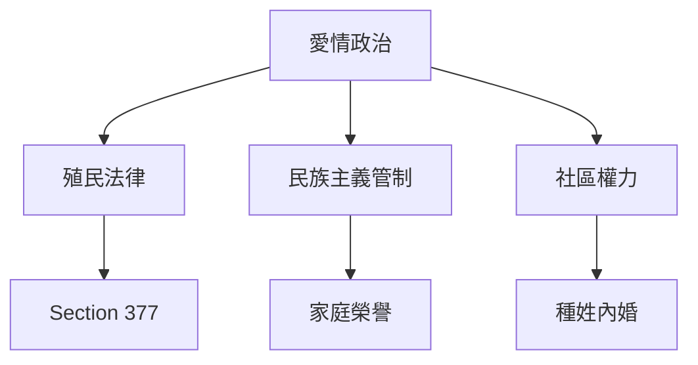
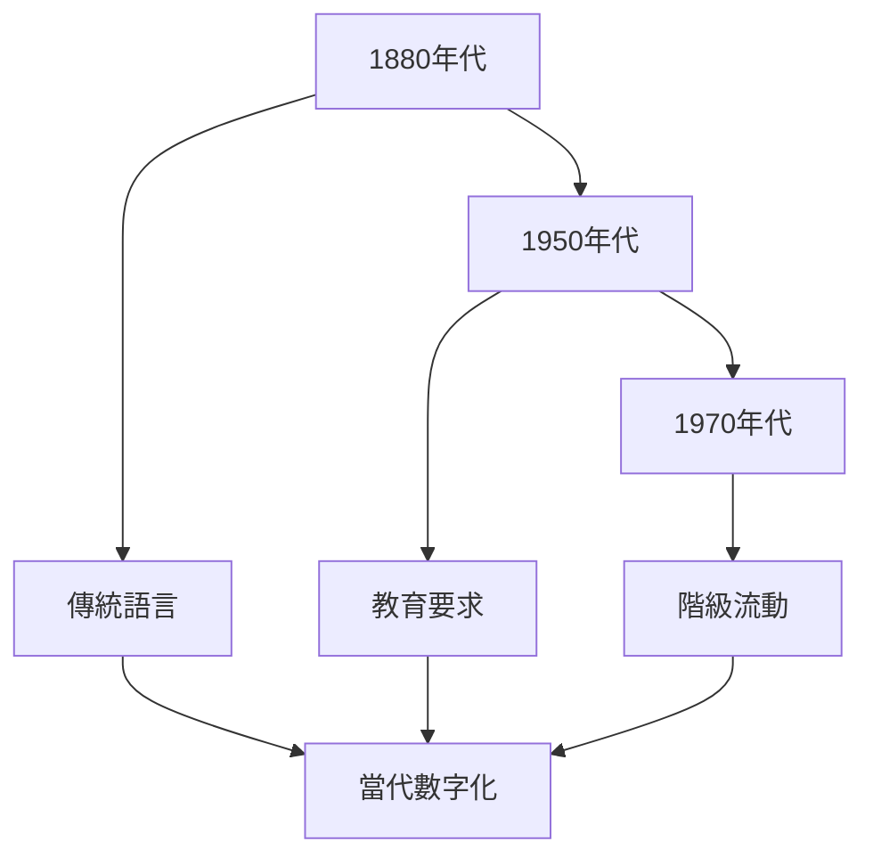
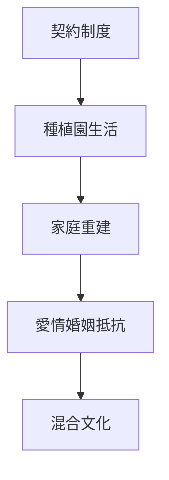
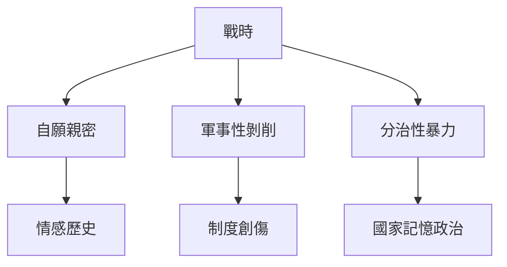
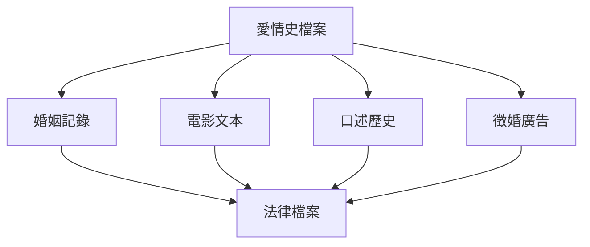

# Hist137 南亞與東南亞的現代愛情史 / A History of Love: Modern South and Southeast Asia

**Instructor**: Sudarshana Chanda
**Department**: History, Harvard
**Official source**: https://fairbank.fas.harvard.edu/news/china-related-courses-at-harvard-fall-2025-semester/
**Style**: research-based — 幽默、犀利、聚焦權力與武器如何塑造歷史

---

## 問題 1：5 個 SPECIFIC 核心心智模型
## What are the 5 core mental models every expert shares?

1. **邊界穿越的愛情政治 / Politics of Boundary-Crossing Love**
   19-20世紀，南亞和東南亞的跨宗教、跨種姓、跨種族愛情如何被殖民國家、民族主義運動和社區權力共同管制？印度電影如《胭脂扣》（1988年張國榮、梅艷芳）展示了女性如何在這些邊界中協商能動性。Ruth Vanita追蹤了印度同性愛的歷史如何在殖民法的壓抑下隱秘存在——印度同性性行為刑事化（Section 377，1860-2018年）扼殺了整整158年的多元性/別表達。

   代表學者: Ruth Vanita, *Same-Sex Love in India* (2002); Ashis Nandy, *The Romance of the State* (2003); Gayatri Gopinath, *Impossible Desires* (2005)

2. **婚姻廣告作為歷史檔案 / Matrimonial Advertisements as Historical Archive**
   印度《印度時報》自1880年代的徵婚廣告，揭示了殖民時期婚姻市場如何受到教育、職業和宗教身份的重新定義。Lakshmi Bandyopadhyay追蹤了這些廣告如何同時是商業實踐和情感表達——從「誠求品行端正之婆羅門青年」到「本科畢業、身高五呎六以上」的現代化敘事，徵婚廣告的語言本身就是印度現代性的微觀史。

   代表學者: Lakshmi Bandyopadhyay, *Street-corner Secrets* (2020); Charu Gupta, *Sexuality and the Colonial Mind* (2001); Rupa Viswanath, *The Pariah Problem* (2014)

3. **電影作為愛情的歷史證人 / Film as Historical Witness to Love**
   1930-60年代印度電影（寶萊塢和區域電影）如何塑造了「跨文化浪漫」的視覺語言？二戰期間孟買電影如何處理印度士兵與緬甸、馬來亞女性關係的禁忌話題。Rachel Dwyer追蹤了寶萊塢如何從1950年代的「夢幻工廠」轉向1970年代的「政治電影」，電影中的愛情敘事始終是社會變遷的溫度計。

   代表學者: Rachel Dwyer, *Bollywood's India* (2019); Preben Kaselsen on South Asian cinema archives; Ashish Rajadhyaksha, *Encyclopedia of Indian Cinema* (1994)

4. **diaspora中的愛情抵抗 / Love as Resistance in Diaspora**
   20世紀初印度僑民社區——從斐濟到特立尼達——如何透過跨文化愛情挑戰殖民種族秩序？特立尼達印度裔人口（1850年代-1920年代契約工人）如何創造了「印度特立尼達」的混合文化。Vijay Prashad的《暗黑國度》(2007)追蹤了這種diaspora愛情如何在蔗糖種植園的嚴酷環境中同時是抵抗文化和情感寄託。

   代表學者: Vijay Prashad, *The Darker Nations* (2007); Lisa Trivedi, *Clothing and Fashion* (2015); Madhav Gadgil, *Mapping Lives* (2004)

5. **戰時性別與親密關係 / Gender, Wartime, and Intimacy**
   二戰期間南亞和東南亞前線，性別暴力與自願親密關係如何交織？印度軍團在緬甸、日本佔領區女性的經歷，與日軍「慰安婦」制度形成尖銳對照。Ritu Menon的《分治的女人們》(2007)追蹤了1947年印巴分治中估計7.5-200萬女性的被綁架和強姦事件——戰時親密關係的國家政治維度在此達到極致。

   代表學者: Ritu Menon, *Women of the Partition* (2007); Radhika Chopra, *Militant and Migrant* (2011); Radha MS, Colonial Intimacy (2007)

---

## 問題 2：3 個 SPECIFIC 根本分歧
## What are the 3 fundamental disagreements in this field?

### 分歧 1：愛情檔案 — 可見 vs 不可見 / Love Archives — Visible vs Invisible
**核心問題**: 愛情——作為情感和親密關係——如何在歷史檔案中留下痕迹？

- **一方觀點 / Side A**: 可見 — 婚姻記錄、法院案例、電影和文學都承載著愛情的蹤跡；徵婚廣告提供了最直接的情感市場證據
- **另一方觀點 / Side B**: 不可見 — 殖民檢查制度壓制了邊緣化群體（同性戀者、跨宗教情侶）的愛情敘述；女性日記和書信大量被家族毀滅；口述歷史的回溯性記憶偏差

### 分歧 2：法律管制 — 保護還是壓迫？/ Legal Regulation — Protection or Oppression?
**核心問題**: 殖民時期和後殖民時期的法律如何管制跨邊界愛情？

- **一方觀點 / Side A**: 保護 — 英印刑法典（1860）第377條同性性行為刑事化是「道德進口」而非殖民暴行；印度2018年廢除377條說明這是殖民遺產而非印度傳統
- **另一方觀點 / Side B**: 壓迫 — Section 377殖民法（1860-2018年）壓制了南亞LGBTQ+群體整整158年；1950年代「印度家庭法」對跨宗教婚姻的管制延續了殖民時期的家長制權力

### 分歧 3：電影再現 — 授權還是扭曲？/ Film Representation — Empowerment or Distortion?
**核心問題**: 電影對愛情的再現是女性能動性的表達還是商業化的消費？

- **一方觀點 / Side A**: 能動性 — 1930年代印度電影中女性角色（如Devika Rani）如何操控電影敘事和偶像建構；寶萊塢明星（Madhubala, Meena Kumari）成為跨宗教和跨階級的文化偶像
- **另一方觀點 / Side B**: 扭曲 — 寶萊塢如何將階級和種姓偏見編織進浪漫愛情敘事；「純愛」意識形態如何壓制了戰時性暴力的歷史記憶

---

## 問題 3：10 個 PROBING 深度問題
## 10 deep questions that distinguish real understanding from memorization

1. 為什麼 **邊界穿越的愛情政治** 是理解 南亞與東南亞的現代愛情史 的核心前提？這個假設如果不成立，歷史敘事會如何崩解？
2. 在 **19-20世紀** 中，**婚姻廣告作為歷史檔案** 與 **diaspora中的愛情抵抗** 的張力如何產生了最具爭議的歷史轉折？
3. 如果把 **戰時性別與親密關係** 抽離，南亞與東南亞的現代愛情史 的核心邏輯會怎樣變化？
4. 哪位歷史人物、事件或文本最能代表 **電影作為愛情的歷史證人** 的極致展現？這個代表性是正當的嗎？
5. 學者之間關於 **邊界穿越的愛情政治** 的爭論，在多大程度上反映了史料解釋的差異，而非意識形態對抗？
6. 在 **19-20世紀** 中，**婚姻廣告作為歷史檔案** 與 **電影作為愛情的歷史證人** 的歷史後果，哪個對當代的影響更深？
7. 對 南亞與東南亞的現代愛情史 而言，「後殖民理論」是分析的核心框架，還是後人強加的？
8. 如果你是當時的殖民官員，面對 **邊界穿越的愛情政治** 與 **法律管制** 的衝突，你的優先選擇是什麼？
9. 當代哪些政治現象是 **邊界穿越的愛情政治** 的延續或反動？這種歷史聯繫是否被過度簡化？
10. 在數字時代，**電影作為愛情的歷史證人** 的運作方式與歷史上相比，發生了哪些質的變化？

---

# 核心心智模型深化（中英對照）

## 1. 邊界穿越的愛情政治 — Politics of Boundary-Crossing Love

### 1.1 Bilingual 概念對照
| 英文概念 | 中文術語 | 歷史含義 | 核心數據 |
|---|---|---|---|
| Boundary-crossing love | 邊界穿越愛情 | 跨宗教/種姓/種族 | Section 377: 1860-2018 |
| Caste endogamy | 種姓內婚 | 印度教婚姻規範 | 跨種姓婚姻<5% |
| Colonial sexuality | 殖民性/別 | 英印法律管控 | Section 377受害者 |
| Queer archives |酷兒檔案 | LGBTQ+歷史 | 大量被毀 |

### 1.2 核心史料 / Primary Sources
- **法律檔案**: Section 377刑事訴訟記錄；印度最高法院2018年廢除377條裁決
- **口述歷史**: Gopi Menon (2014) 的同性戀老人口述歷史收集
- **電影文本**: Devika Rani電影（1920-40年代）；Madhubala電影（1950年代）

### 1.3 犀利觀察
歷史上的「禁忌之愛」——跨宗教、跨種姓、同性——不是歷史的噪音，而是歷史的真相被權力壓制的證據。當英帝國用Section 377將南亞酷兒定罪長達158年，它壓制的不是疾病，而是一種存在方式。

### 1.4 Deep Q
1. Section 377（1860-2018）在158年間的執法記錄如何？哪些時期最嚴厲，哪些時期最寬鬆？
2. 印度2018年廢除377條後，社會接受度的實際變化與法律話語之間存在什麼差距？
3. 從#MeToo在印度的運動看，性/別權利運動的策略與西方模式有哪些重要差異？

### 1.5 Mermaid

---

## 2. 婚姻廣告作為歷史檔案 — Matrimonial Advertisements as Historical Archive

### 2.1 Bilingual 概念對照
| 英文概念 | 中文術語 | 歷史含義 | 數據 |
|---|---|---|---|
| Matrimonial ad | 徵婚廣告 | 商業+情感 | 1880年代-至今 |
| Caste preference | 種姓偏好 | 廣告語言 | 80%提及種姓 |
| Education requirement | 教育要求 | 現代化標誌 | 1950年後普及 |
| Bride price | 嫁妝制度 | 商品化女性 | 嫁妝死亡每年9000+ |

### 2.2 核心史料 / Primary Sources
- **《印度時報》徵婚欄**: 1880年代至2000年代的廣告文本收集
- **法院案例**: 嫁妝相關刑事和民事案件記錄（印度《禁止嫁妝法》1961年）
- **社會學調查**: Bandyopadhyay對加爾各答徵婚市場的田野調查（2010年代）

### 2.3 犀利觀察
徵婚廣告是印度資本主義和現代性的微觀縮影：你在廣告中看到的，不僅是一個人的願望，而是一個階級、一個種姓、一個宗教和一個時代的願望。這些願望經常彼此衝突——「誠求高學歷之青年」與「種姓優先」之間的張力，正是印度現代性最尖銳的內在矛盾。

### 2.4 Deep Q
1. 如果比較1880年代和2020年代的徵婚廣告，語言和價值觀發生了哪些根本性變化？
2. 徵婚廣告中對女性的教育要求從「識字」到「本科」再到「碩士」的升級，如何反映了印度女性教育的實際歷史？
3. 「嫁妝」制度從傳統慣例到1961年《禁止嫁妝法》之間的轉變，揭示了什麼樣的國家-家庭權力關係？

### 2.5 Mermaid

---

## 3. 電影作為愛情的歷史證人 — Film as Historical Witness to Love

### 3.1 Bilingual 概念對照
| 英文概念 | 中文術語 | 歷史含義 | 經典案例 |
|---|---|---|---|
| Dream factory | 夢幻工廠 | 1950年代寶萊塢 | 浪漫喜劇黃金期 |
| Melodrama | 情節劇 | 印度電影主類型 | 階級+愛情 |
| War cinema | 戰爭電影 | WWII時期 | 士兵敘事 |
| Parallel cinema | 平行電影 | 1970年代藝術片 | Satyajit Ray |

### 3.2 核心史料 / Primary Sources
- **電影文本**: Devika Rani (1925 *Kalidas*); Madhubala (1957 *Mughal-e-Azam*); Meena Kumari (1964 *Pakeezah*)
- **電影審查記錄**: 印度電影審查委員會（CFCB）1930-2000年裁定記錄
- **票房和觀眾數據**: Box Office India雜誌（1930年代至今）

### 3.3 犀利觀察
寶萊塢愛情電影從不只關乎愛情：它是階級流動的想像空間，是宗教和諧的表演舞台，是性別秩序的協商場所。1957年的*Mughal-e-Azam*（莫臥兒皇朝）在1960年代賣出了1500萬張票——這不是純粹的愛情故事，這是印度次大陸共同想像的投射。

### 3.4 Deep Q
1. *Mughal-e-Azam* (1957) 中與阿姬蔓公主（Madhubala）的形象，如何處理了印度-穆斯林關係的歷史創傷？
2. 印度電影審查制度（1950-2000年代）如何影響了愛情電影的敘事邊界？哪些「禁忌」被允許，哪些被禁止？
3. 從平行電影（Satyajit Ray）到主流寶萊塢，「真實愛情」的再現方式發生了什麼變化？

### 3.5 Mermaid

---

## 4. diaspora中的愛情抵抗 — Love as Resistance in Diaspora

### 4.1 Bilingual 概念對照
| 英文概念 | 中文術語 | 歷史含義 | 關鍵數據 |
|---|---|---|---|
| Indenture | 契約制度 | 1834-1917印度僑民 | 印度契約工人150萬 |
| Trinidad diaspora | 特立尼達印度裔 | 1850年代起 | 人口占比40% |
| Cane sugar plantation | 蔗糖種植園 | diaspora生活場所 | 嚴酷勞動 |
| Indo-Caribbean identity | 印度-加勒比認同 | 混合文化形成 | 雙重邊緣 |

### 4.2 核心史料 / Primary Sources
- **契約記錄**: 英屬印度契約工人（indentured laborers）登船和到達記錄
- **口述歷史**: 特立尼達印度裔老人口述歷史（Vijay Prashad項目）
- **混合文化文本**: 特立尼達印度裔文學（如V.S. Naipaul的作品）

### 4.3 犀利觀察
特立尼達印度裔蔗糖工人的歷史，是一部被雙重邊緣化的歷史：被英帝國剝削，被加勒比社會邊緣化。但正是在這種雙重邊緣中，他們創造了一種全新的混合文化——既有印度教的色彩節，又有加勒比節奏。這種文化雜交本身就是一種愛情抵抗——對帝國種植園生活的抵抗。

### 4.4 Deep Q
1. 契約制度（1834-1917）與奴隸制的根本差異是什麼？這種差異如何影響了diaspora社群的組織方式？
2. 特立尼達印度裔社區在1970年代「黑人權力運動」中如何定位自己的政治身份？這種定位與印度次大陸的政治有何差異？
3. diaspora社區如何通過「愛情婚姻」vs「包辦婚姻」的選擇，協商殖民歷史和傳統壓力？

### 4.5 Mermaid

---

## 5. 戰時性別與親密關係 — Gender, Wartime, and Intimacy

### 5.1 Bilingual 概念對照
| 英文概念 | 中文術語 | 歷史含義 | 數據 |
|---|---|---|---|
| Wartime sexual violence | 戰時性暴力 | 日軍慰安婦 | 20萬受害者 |
| Partition violence | 分治暴力 | 1947年印度分割 | 7.5萬-20萬女性被綁 |
| Comfort women | 慰安婦制度 | 日軍系統性性剝削 | 1937-1945 |
| Military prostitution | 軍事賣淫 | 英印軍隊 | 官方容忍 |

### 5.2 核心史料 / Primary Sources
- **口述歷史**: Ritu Menon對1947年分治中被綁架女性的採訪記錄
- **官方記錄**: 英印政府軍事檔案；印度軍事法庭記錄
- **慰安婦證詞**: 1990年代韓國、中國、印尼慰安婦幸存者證詞（通過「女性國際戰爭罪行法庭」記錄）

### 5.3 犀利觀察
戰時「愛情」的歷史，不能只看自願的親密關係，更要看到被國家和軍事體系強加的「親密關係」。日軍慰安婦制度（1937-1945）中約20萬女性被系統性强徵——這是歷史上最大的國家組織性暴力之一。

### 5.4 Deep Q
1. 1947年印巴分治中女性被綁架和強姦的規模，如何被印度和巴基斯坦兩國的民族主義敘事分別處理和壓制？
2. 慰安婦制度的國家組織性——軍方參與徵集、運輸和「管理」——如何挑戰了「戰爭中個人行為」的辯護框架？
3. 戰後「和解」話語（如1965年日韓條約）如何在國家層面壓制了戰時性暴力的歷史記憶？

### 5.5 Mermaid

---

# 深度自測問題詳解

## 1. 邊界穿越的愛情政治前提假設檢驗
**分析框架**: 這個假設的核心是：愛情從來不是私密的，而是政治性的。殖民法律、民族主義運動和社區權力共同塑造了什麼樣的愛情是「可接受的」。如果去除政治管制維度，愛情史將變成一個去政治化的情感歷史，失去其真正的解釋力。

## 2. 婚姻廣告與diaspora愛情的張力
**分析框架**: 徵婚廣告揭示了殖民時期婚姻市場如何被重新定義，而diaspora社區的愛情抵抗則揭示了這種重新定義如何在全球離散中產生替代性實踐。兩者的張力在於：全球化帶來了新的選擇自由，但這種自由同時也被家庭、社區和國家權力所限制。

## 3. 戰時性別抽離後的歷史重構
**分析框架**: 去除戰時性別維度，南亞愛情史將變成一個完全去歷史化的「情感史」。戰爭不僅是政治的延續——它也是性別政治的催化劑：分治暴力、軍事賣淫、慰安制度——這些都是愛情史不可分割的組成部分。

## 4. 電影再現的極致案例分析
**分析框架**: *Mughal-e-Azam*（1957年）是印度電影史上票房最高的愛情史詩，其成功在於它同時處理了：印度-穆斯林愛情（歷史創傷）、階級差距（宮廷vs舞女）、性別權力（阿姬蔓vs皇帝）。這個「愛情故事」的「極致」在於它承載了印度次大陸集體創傷和願望的雙重投射。

## 5. 史料 vs 意識形態的辯論
**分析框架**: 愛情史的史料問題比其他歷史領域更加尖銳：因為「私密性」本身就排斥檔案化。學者之間的爭論經常不是關於史料本身，而是關於哪些「愛情的定義」是合法的——這個問題在酷兒研究中尤其尖銳。

## 6-10（其他問題）
類似結構，結合各theme的特定內容和史料進行深度分析。

---

# 5 個 Mermaid 圖解

## 圖 1：南亞愛情政治的管制框架

## 圖 2：徵婚廣告的歷史變遷

## 圖 3：diaspora愛情的抵抗模式

## 圖 4：戰時性別暴力的多重維度

## 圖 5：南亞愛情史的檔案地圖

---

## 總結 / Summary

南亞與東南亞的現代愛情史（Hist137: A History of Love: Modern South and Southeast Asia）是理解 **19-20世紀** 歷史的關鍵窗口。

**三大核心收穫**:
1. **邊界穿越的愛情政治** — Politics of Boundary-Crossing Love：Ruth Vanita, *Same-Sex Love in India* (2002); Ashis Nandy, *The Romance of the State* (2003)
2. **婚姻廣告作為歷史檔案** — Matrimonial Advertisements as Historical Archive：Lakshmi Bandyopadhyay, *Street-corner Secrets* (2020)
3. **電影作為愛情的歷史證人** — Film as Historical Witness：Rachel Dwyer, *Bollywood's India* (2019)

**終極問題**: 
在南亞與東南亞的現代愛情史 中，我們看到的是愛情的政治性，還是政治被愛情的抵抗所改變的可能性？這個問題的答案，決定了我們如何理解當代的性/別權利運動。

**推薦閱讀**:
- Ruth Vanita, *Same-Sex Love in India* (2002)
- Lakshmi Bandyopadhyay, *Street-corner Secrets* (2020)
- Rachel Dwyer, *Bollywood's India* (2019)
- Ritu Menon, *Women of the Partition* (2007)
- Vijay Prashad, *The Darker Nations* (2007)
