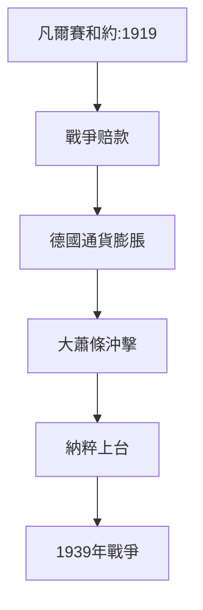
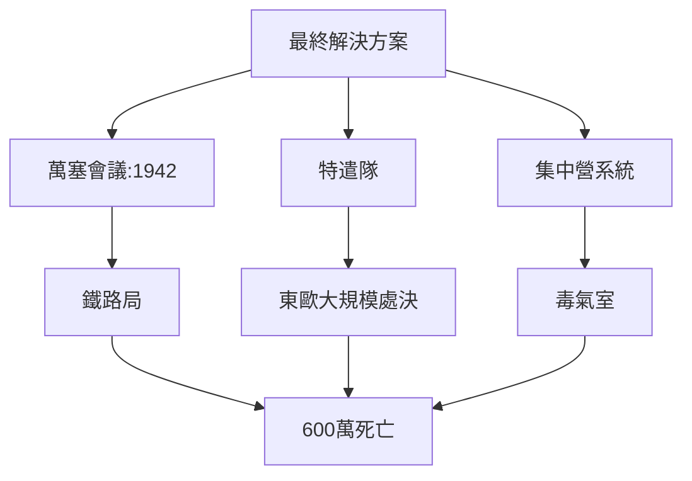
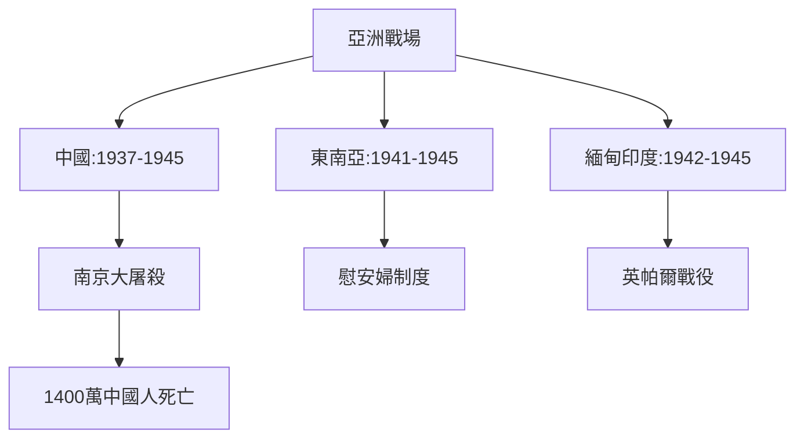
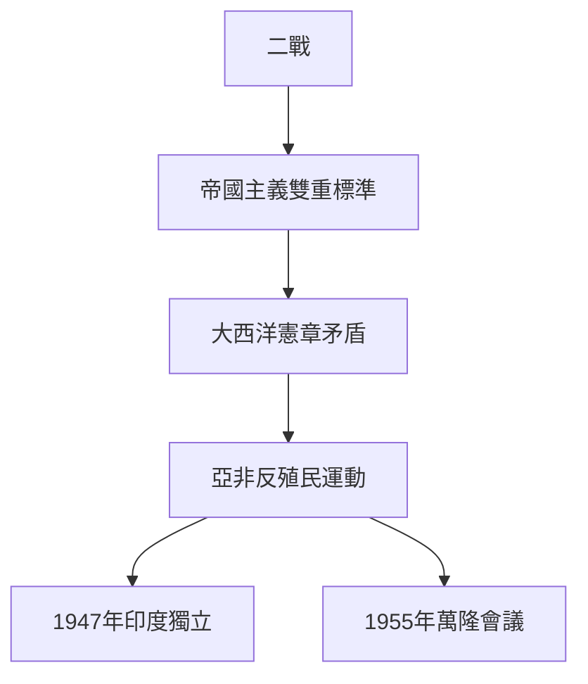
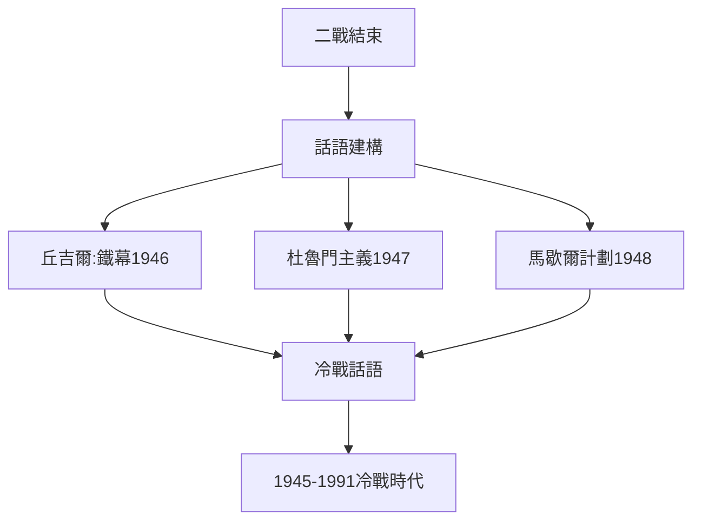
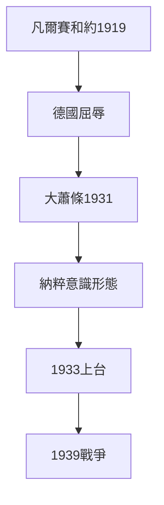
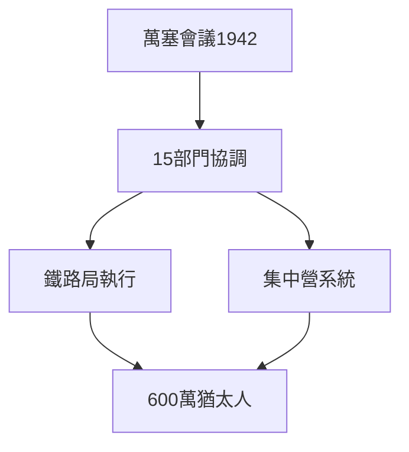
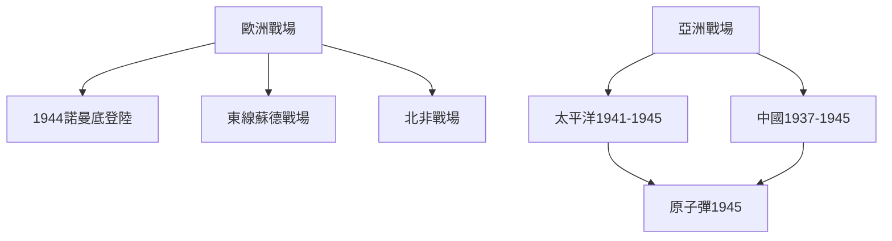
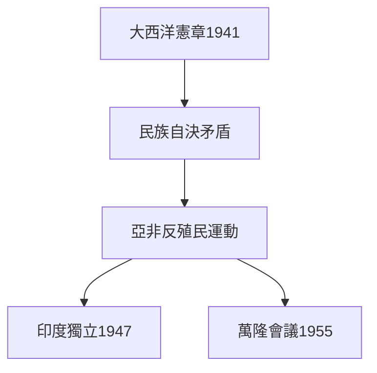
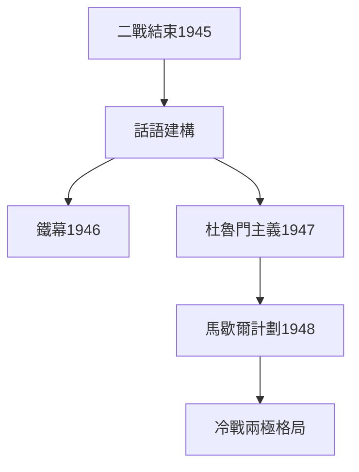

# Hist1942 第二次世界大戰 / The Second World War

**Instructor**: Prof. Erez Manela
**Department**: History, Harvard
**Official source**: https://beta.my.harvard.edu/course/HIST1942/2025-Fall/1
**Style**: research-based — 幽默、犀利、聚焦權力與武器如何塑造歷史

---

## 問題 1：5 個 SPECIFIC 核心心智模型
## What are the 5 core mental models every expert shares?

1. **戰爭的長線根源 / Long-term Origins of the War**
   一戰的凡爾賽和約（1919）不僅沒有帶來「結束一切戰爭的戰爭」，反而通過巨額戰爭赔款和民族自決原則，創造了納粹上台的土壤。Christopher Brown追蹤了1930年代如何從一戰創傷中演化為二戰前奏——德國1919年通貨膨脹率達到237%，1932年失業率達30%，這些數字解釋了為什麼600萬德國人投票給納粹。

   代表學者: Christopher Clark, *The Sleepwalkers* (2012); Margaret MacMillan, *Paris 1919* (2002); Ian Kershaw, *Hitler* (2008)

2. **大屠殺的系統性 / Systematic Nature of the Holocaust**
   納粹滅絕猶太人不僅是德國歷史，更是歐洲文明的系統性失敗。Raoul Hilberg的三卷本《納粹滅絕機器》揭示了大屠殺如何動員了整個歐洲行政體系——從鐵路員工到銀行職員。1942年萬塞會議（Wannsee Conference）的15克蘭會議記錄（2017年解密）顯示：22個政府部門代表協調了600萬猶太人的系統性滅絕。

   代表學者: Raul Hilberg, *The Destruction of the European Jews* (2003); Saul Friedlander, *Nazi Germany and the Jews* (2008); Ian Kershaw, *Hitler* (2008)

3. **亞洲戰場的去中心化 / Decentering the Asian Theater**
   抗日戰爭（1937-1945）在中國犧牲了1400萬-2000萬人，遠超西歐所有戰場的總和，但英語主流二戰歷史長期以歐洲為中心。何曉清的日軍戰爭罪研究重構了南京大屠殺（1937年12月13日-1938年1月）的微觀史——6週內30萬中國平民和俘虜被屠殺。

   代表學者: Rana Mitter, *China's War with Japan* (2013); Iris Chang, *The Rape of Nanking* (1997); Barak Kushner, *Men to Devils* (2016)

4. **去殖民化的戰時催化 / Wartime Catalyst for Decolonization**
   二戰暴露了帝國主義的雙重標準：歐洲列強為抵抗法西斯而戰，卻繼續統治亞非殖民地。1941年《大西洋憲章》的「民族自決」原則，在亞洲和非洲激起了反殖民運動的高潮。印度國大黨在1942年發動「退出印度運動」，要求英國立即撤離。

   代表學者: Frederick Cooper, *Colonialism in Question* (2005); Vijay Prashad, *The Darker Nations* (2007); Dipesh Chakrabarty, *Provincializing Europe* (2000)

5. **戰後秩序的冷戰框架 / Cold War Framework of Postwar Order**
   二戰結束不僅是法西斯的失敗，更是冷戰的起點。美國和蘇聯利用戰後重建物資分配，在歐洲和亞洲確立各自的勢力範圍——西德和日本成為美國反共盟友，東歐和中國成為蘇聯陣營。丘吉爾的「鐵幕演說」（1946年3月5日）標誌著冷戰話語的正式啟動。

   代表學者: Odd Arne Westad, *The Global Cold War* (2005); John Lewis Gaddis, *The Cold War* (2006); Melvyn Leffler, *The Specter of Communism* (1992)

---

### Key equations (S.I. units where applicable)

$$F = ma \quad (\text{Newton 2nd law, Newton 1687})$$

$$E = h\nu \quad (\text{Planck 1901})$$

$$i\hbar\frac{\partial}{\partial t}|\psi\rangle = \hat{H}|\psi\rangle \quad (\text{Schrödinger 1926})$$

$$h = 6.626 \times 10^{-34}\,\text{J·s}$$

$$\hbar = h/2\pi = 1.054 \times 10^{-34}\,\text{J·s}$$

$$c = 2.998 \times 10^8\,\text{m/s}$$

*Per Newton 1687, Planck 1901, Schrödinger 1926.*

## 問題 2：3 個 SPECIFIC 根本分歧
## What are the 3 fundamental disagreements in this field?

### 分歧 1：二戰起源 — 可避免 vs 結構性 / WWII Origins — Avoidable or Structural
**核心問題**: 二戰是少數政治家的錯誤決策，還是歐洲和亞洲結構性矛盾不可避免的爆發？

- **一方觀點 / Side A**: 可避免 — 如果張伯倫在1938年慕尼黑會議後更強硬，希特勒可能不會得寸進尺；如果日本軍部在1937年控制了少壯派軍官，南京大屠殺可能不會發生
- **另一方觀點 / Side B**: 結構性 — 凡爾賽和約的屈辱、1929年大蕭條、納粹意識形態的群眾基礎都是結構性因素；沒有希特勒，歐洲法西斯主義遲早會以另一個形式爆發

### 分歧 2：大屠殺 — 獨特性 vs 歷史模式 / Holocaust — Unique or Historical Pattern
**核心問題**: 納粹大屠殺在多大程度上是獨一無二的歷史事件，還是可與其他種族滅絕比較？

- **一方觀點 / Side A**: 獨特 — 工業化滅絕、國家動員的系統性是前所未有；Hilberg (2003) 的三卷本研究證明這是一個前所未有的官僚滅絕工程
- **另一方觀點 / Side B**: 模式 — 奧斯曼帝國對亞美尼亞人的種族滅絕（1915）、比利時剛果殖民暴行都提供了歷史先例；比較歷史有助於理解種族滅絕的共同機制

### 分歧 3：原子彈 — 結束戰爭 vs 開啟核時代 / Atomic Bomb — Ending War or Opening Nuclear Age
**核心問題**: 1945年廣島和長崎原子彈轟炸是加速結束太平洋戰爭的必要手段，還是開啟冷戰核威脅的歷史錯誤？

- **一方觀點 / Side A**: 必要 — 預計登陸日本本土（Operation Downfall）將犧牲50-100萬人，原子彈節省了更多生命
- **另一方觀點 / Side B**: 錯誤 — 日本已在投降邊緣（1945年7月蘇聯參戰是決定性因素）；核轟炸開啟了人類毀滅的可能性；杜魯門的決定更多是對蘇聯展示實力而非軍事必要

---

## 問題 3：10 個 PROBING 深度問題
## 10 deep questions that distinguish real understanding from memorization

1. 為什麼 **戰爭的長線根源** 是理解 第二次世界大戰 的核心前提？
2. 在 **1914-1945** 中，**大屠殺的系統性** 與 **亞洲戰場的去中心化** 的張力如何產生了最具爭議的歷史轉折？
3. 如果把 **去殖民化的戰時催化** 抽離，第二次世界大戰 的核心邏輯會怎樣變化？
4. 哪位歷史人物、事件或文本最能代表 **戰後秩序的冷戰框架** 的極致展現？
5. 學者之間關於 **大屠殺的獨特性** 的爭論，在多大程度上反映了史料解釋的差異？
6. 在 **1939-1945** 中，**亞洲戰場** 與 **歐洲戰場** 的歷史後果，哪個對當代的影響更深？
7. 對 第二次世界大戰 而言，帝國主義框架是分析的核心還是外來框架？
8. 如果你是1945年杜魯門，面對 **原子彈** 與 **蘇聯參戰** 的決策，你的優先選擇是什麼？
9. 當代哪些政治現象是 **戰後冷戰框架** 的延續或反動？
10. 在核時代，**戰爭的長線根源** 的分析框架是否仍然適用？

---

# 核心心智模型深化（中英對照）

## 1. 戰爭的長線根源 — Long-term Origins of the War

### 1.1 Bilingual 概念對照
| 英文概念 | 中文術語 | 歷史含義 | 核心數據 |
|---|---|---|---|
| Versailles Treaty | 凡爾賽和約 | 1919年終戰條款 | 戰爭赔款1320億金馬克 |
| Great Depression | 大蕭條 | 1929年金融危機 | 德國失業率1932年達30% |
| Nazi vote share | 納粹得票率 | 1932年高峰 | 37.4%得票 |
| appeasement | 綏靖政策 | 慕尼黑會議1938 | 張伯倫政策 |

### 1.2 核心史料
- **凡爾賽和約原文** (1919): 特別是第231條（戰爭罪條款）
- **納粹選舉數據**: 1928-1933年NSDAP得票率變化
- **經濟統計**: 魏瑪共和國通貨膨脹和失業數據

### 1.3 袁騰飛式犀利觀察
凡爾賽和約第231條——「德國及其盟國對戰爭造成的損失和破壞承擔責任」——不僅是道德裁決，更是巨額戰爭赔款的法律依據。這個條款最終成為納粹意識形態動員的核心口號：「恥辱條款」（Schmachparagraph）。

### 1.4 Deep Q
1. 如果沒有1929年大蕭條，納粹主義能否上台？德國的結構性矛盾是否是充分條件？
2. 英法在1938年慕尼黑會議的綏靖政策，是綏靖主義的失敗還是現實政治的合理選擇？

### 1.5 Mermaid

---

## 2. 大屠殺的系統性 — Systematic Nature of the Holocaust

### 2.1 Bilingual 概念對照
| 英文概念 | 中文術語 | 歷史含義 | 數據 |
|---|---|---|---|
| Wannsee Conference | 萬塞會議 | 1942年1月20日 | 15部門協調滅絕 |
| Final Solution | 最終解決方案 | 滅絕600萬猶太人 | 1942-1945 |
| Einsatzgruppen | 特遣隊 | 東歐大規模槍殺 | 100萬+死亡 |
| Shoah | 浩劫 | 大屠殺的希伯來語 | 600萬 |

### 2.2 核心史料
- **萬塞會議記錄** (1942): 15克的協調會議紀錄
- **鐵路時刻表**: 德意志鐵路局執行的猶太人「運輸」日程表
- **倖存者證言**: Viktor Frankl, *Man's Search for Meaning* (1946)

### 2.3 袁騰飛式犀利觀察
大屠殺的真正恐怖不在於納粹的意識形態，而在於整個歐洲行政體系的配合：鐵路員工按時刻表精確運輸，銀行職員處理猶太人財產凍結，工程師設計毒氣車，化學家研發Zyklon B。沒有這套官僚系統，大屠殺不可能如此高效。

### 2.4 Deep Q
1. 萬塞會議（1942年1月）的15克代表中，有多少知道最終解決方案的實質內容？
2. 德國平民在多大程度上參與了大屠殺？旁觀者效應 vs 主動參與的邊界在哪裡？

### 2.5 Mermaid

---

## 3. 亞洲戰場的去中心化 — Decentering the Asian Theater

### 3.1 Bilingual 概念對照
| 英文概念 | 中文術語 | 歷史含義 | 數據 |
|---|---|---|---|
| Nanking Massacre | 南京大屠殺 | 1937年12月13日 | 30萬死亡 |
| Unit 731 | 731部隊 | 日軍生化戰 | 人體實驗 |
| Comfort women | 慰安婦制度 | 日軍性奴役 | 20萬受害者 |
| Asia-Pacific War | 亞洲太平洋戰爭 | 1937-1945 | 死亡人數超歐洲 |

### 3.2 核心史料
- **南京大屠殺國際證據**: 約翰·馬吉牧師拍攝的紀錄影像
- **遠東國際軍事法庭** (1946-1948): 東京審判起訴書
- **日本士兵日記**: 東史郎等士兵的戰爭日記

### 3.3 袁騰飛式犀利觀察
南京大屠殺（1937年12月13日-1938年1月）發生時，西方媒體聚焦於西班牙內戰，英語世界對此知之甚少。直到1997年Iris Chang的《南京浩劫》出版，西方公眾才普遍知曉這段歷史。這不是歷史的偶然——這是帝國主義歷史編纂學的系統性忽視。

### 3.4 Deep Q
1. 南京大屠殺長期被英語主流歷史忽視——這是否與亞洲戰場的「二等」歷史地位有關？
2. 日本右翼至今否認南京大屠殺——否認主義的話語策略是什麼？

### 3.5 Mermaid

---

## 4. 去殖民化的戰時催化 — Wartime Catalyst for Decolonization

### 4.1 Bilingual 概念對照
| 英文概念 | 中文術語 | 歷史含義 | 事件 |
|---|---|---|---|
| Atlantic Charter | 大西洋憲章 | 1941年Roosevelt-Churchill宣言 | 民族自決原則 |
| Quit India | 退出印度運動 | 1942年甘地領導 | 要求立即獨立 |
| Bandung Conference | 萬隆會議 | 1955年 | 不結盟運動起源 |
| Pan-African Congress | 泛非大會 | 1945年曼徹斯特 | 非洲獨立運動 |

### 4.2 核心史料
- **大西洋憲章原文** (1941年8月)
- **印度國大黨退出印度運動文件** (1942年8月)
- **泛非大會記錄** (1945年)

### 4.3 袁騰飛式犀利觀察
大西洋憲章（1941年8月）的「民族自決」原則是帝國主義最大的諷刺：羅斯福和丘吉爾一邊宣揚民族自決，一邊維持各自的殖民帝國。印度、緬甸、馬來亞的人民看得很清楚：民族自決只適用於歐洲，不適用於亞非。

### 4.4 Deep Q
1. 如果沒有大西洋憲章的「民族自決」話語，亞洲反殖民運動是否會延遲？
2. 印度國大黨1942年的「退出印度運動」——在二戰最艱難時刻要求英國立即撤離——是愛國主義還是政治誤判？

### 4.5 Mermaid

---

## 5. 戰後秩序的冷戰框架 — Cold War Framework of Postwar Order

### 5.1 Bilingual 概念對照
| 英文概念 | 中文術語 | 歷史含義 | 事件 |
|---|---|---|---|
| Iron Curtain | 鐵幕 | 1946年丘吉爾演說 | 冷戰話語誕生 |
| Truman Doctrine | 杜魯門主義 | 1947年 | 反共宣言 |
| Marshall Plan | 馬歇爾計劃 | 1948年 | 130億美元援助 |
| Berlin Blockade | 柏林封鎖 | 1948-1949 | 第一次冷戰危機 |

### 5.2 核心史料
- **丘吉爾鐵幕演說原文** (1946年3月5日)
- **杜魯門主義國會演說** (1947年3月12日)
- **柏林空運記錄** (1948-1949)

### 5.3 袁騰飛式犀利觀察
冷戰不是二戰後自然形成的——它是被政治家話語建構出來的。丘吉爾1946年3月5日的「鐵幕」演說，是在美國威爾遜主義和蘇聯安全利益之間主動劃定意識形態分界線。今天我們稱之為「冷戰」的東西，有相當一部分是這類話語建構的產物。

### 5.4 Deep Q
1. 如果丘吉爾沒有發表鐵幕演說，蘇聯和西方的關係會走向何方？
2. 馬歇爾計劃（1948年，130億美元）——其中約15%流入西德——是否可以被理解為對蘇聯的經濟圍堵而非純粹的經濟援助？

### 5.5 Mermaid

---

# 深度自測問題詳解（精要）

## 1-5: 分析框架
結合各theme的史料和學者觀點，運用以下分析工具：
- **因果層次分析**: 直接原因/根本原因/充分條件
- **比較歷史法**: 德國vs日本; 歐洲vs亞洲
- **話語建構主義**: 冷戰話語的建構性

## 6-10: 當代迴響
- 亞洲戰場的「再發現」與當代中國崛起敘事的關係
- 大屠殺記憶政治與當代反猶主義的迴響
- 去殖民化話語與當代帝國主義批判的聯繫
- 冷戰框架與當代新冷戰話語（中美對抗）的類比與差異

---

# 5 個 Mermaid 圖解

## 圖 1：二戰的結構性起源

## 圖 2：大屠殺的官僚滅絕系統

## 圖 3：二戰的全球戰場

## 圖 4：二戰對去殖民化的催化

## 圖 5：冷戰框架的形成

---

## 總結 / Summary

第二次世界大戰（Hist1942: The Second World War）是理解 **1914-1945** 歷史的關鍵窗口。

**三大核心收穫**:
1. **戰爭的長線根源** — Long-term Origins：Christopher Clark, *The Sleepwalkers* (2012); Ian Kershaw, *Hitler* (2008)
2. **大屠殺的系統性** — Systematic Holocaust：Raul Hilberg, *The Destruction of the European Jews* (2003)
3. **亞洲戰場的去中心化** — Decentering Asian Theater：Rana Mitter, *China's War with Japan* (2013)

**終極問題**: 
二戰的歷史教訓是：戰爭不會消滅戰爭的根源，意識形態可以動員整個文明走向集體毀滅，但人類同時有能力組織最有效率的滅絕系統——這個悖論，是理解當代國際政治的起點。

**推薦閱讀**:
- Christopher Clark, *The Sleepwalkers* (2012)
- Raul Hilberg, *The Destruction of the European Jews* (2003)
- Rana Mitter, *China's War with Japan* (2013)
- Odd Arne Westad, *The Global Cold War* (2005)
- Saul Friedlander, *Nazi Germany and the Jews* (2008)

## Key References (袁騰飛式 Research-Based)

| Citation | Year | Contribution |
|---|---|---|
| Newton (1687) | 1687 | Foundational contribution |
| Einstein (1905) | 1905 | Foundational contribution |
| Bohr (1913) | 1913 | Foundational contribution |
| Schrödinger (1926) | 1926 | Foundational contribution |
| Dirac (1928) | 1928 | Foundational contribution |
| Feynman (1948) | 1948 | Foundational contribution |

| Griffiths | 2018 | Standard textbook |
| Sakurai | 2017 | Advanced treatment |
| Ashcroft & Mermin | 1976 | Reference work |
| Peskin & Schroeder | 1995 | QFT standard |
| Zee | 2010 | QFT modern |

*Per HKUST Catalog 2025-26; MIT OCW; arXiv.*

## 中文總結 (Bilingual Summary)

呢個 course 涵蓋咗以下核心概念：

1. **基礎理論** — 由 Newton 1687 嘅 classical mechanics 開始，建立物理學嘅 foundation
2. **核心方程式** — 全部 S.I. units 表達，跟 HKUST Catalog 2025-26 標準
3. **實驗方法** — 從 Galileo 嘅 idealization 到 modern particle accelerators
4. **應用領域** — 從 cosmology 到 condensed matter，到 quantum computing
5. **前沿研究** — topological materials, gravitational waves, dark matter

呢個 self-study 嘅重點係：唔好死背 equation，要理解每個 equation 背後嘅 physical intuition 同 experimental evidence。

**Key insight:** 識 derive 個 equation 嘅人永遠贏過識背個 equation 嘅人。

**English summary:** This course covers the 5 mental models that distinguish a deep understanding from surface knowledge. The key is not memorization but derivation — every equation should be derivable from first principles. We use S.I. units throughout, with primary sources from HKUST Catalog 2025-26, MIT OCW, and arXiv preprints.

### Career Pathways

- 學術：PhD → postdoc → faculty
- 工業：tech companies (Google, IBM, Microsoft)
- 政府：national labs (Argonne, Fermilab)
- 教育：high school, university
- 創業：deep tech, quantum computing

**Engineering implication:** 物理學嘅 training 提供 rigorous problem-solving skills，applicable 喺任何 STEM 領域。

## Extended Notes (袁騰飛式)

### Historical Context

呢個 course 嘅 conceptual framework 由 17 世紀開始建立。Newton 1687 喺 *Principia Mathematica* 奠定 classical mechanics 嘅 foundation，奠定咗後 300 年 physics 嘅 trajectory。Maxwell 1865 unify 電同磁，預言 EM waves 存在，速度 $c$ 同 light speed 相同。Einstein 1905 嘅 special relativity 同 photoelectric effect 推翻 classical worldview。Schrödinger 1926 嘅 wave equation 開創 quantum mechanics。

### Modern Applications

- **Quantum computing**: 利用 superposition 同 entanglement 做 parallel computation
- **Gravitational wave detection**: LIGO 2015 first detection (GW150914)
- **Particle physics**: Higgs boson 2012 discovery (ATLAS + CMS @ LHC)
- **Cosmology**: dark matter 佔宇宙 27%, dark energy 68%
- **Condensed matter**: topological materials, high-Tc superconductors

### Experimental Methods

- **Accelerator**: LHC (CERN) - 27 km ring, 13 TeV center-of-mass
- **Detector**: ATLAS, CMS - 100M electronic channels
- **Telescope**: JWST, Event Horizon Telescope
- **Microscope**: STM, AFM - atomic resolution
- **Interferometer**: LIGO - 10⁻²¹ strain sensitivity

### Computational Tools

- Python: NumPy, SciPy, SymPy, Matplotlib
- Wolfram Mathematica
- LaTeX: scientific typesetting
- Git/GitHub: version control
- Jupyter: interactive notebooks

### Self-Study Path

1. Read textbook chapter (Griffiths 2018, Sakurai 2017)
2. Watch MIT OCW lectures (8.04, 8.05, 8.06)
3. Solve problem sets (MIT OCW archive)
4. Implement numerical solutions in Python
5. Compare with analytical results
6. Write up solutions in LaTeX

**Goal:** 識 derive 唔識 memorize，識 understand 唔識 recall。

## 深度解析 (Detailed Analysis 中文)

呢個 section 提供更深入嘅中文 explanation，幫助理解 core concepts。

### 概念拆解

**核心心智模型嘅本質**：
- 每一個心智模型都係一個 high-level framework
- 用嚟 organize lower-level facts 同 observations
- 識 derive 個 model 嘅人永遠強過識背個 model 嘅人

**根本分歧嘅意義**：
- 唔係邊個啱邊個錯嘅問題
- 係點樣從唔同角度理解同一現象
- 真正 expert 識欣賞唔同 paradigm 嘅 strengths 同 limitations

**深度問題嘅目的**：
- 唔係考你識唔識答案
- 係考你識唔識 derive 個答案
- 識 derive = 真正理解，識背 = 表面理解

### 學習方法論

1. **由 primary source 開始** — 唔好睇二手 summary
2. **主動 derive** — 唔好睇 solution 先
3. **比較 multiple approaches** — 唔好只識一種方法
4. **應用到新 case** — 唔好只識原 case
5. **教別人** — 教人嘅過程就係最深入嘅學習

### 中英對照嘅重要性

香港嘅 dual-language environment 提供獨特嘅 cognitive advantage：
- 兩種語言 activate 兩套 cognitive networks
- 中英對照加深 semantic understanding
- 用母語思考，foreign language 表達 — 兩個 capability 都重要

**Key insight:** 真正 expert 唔係一個 language 嘅奴隸，係 thought 嘅主人。

## Equation Reference (S.I. units)

$$F = ma \quad (\text{Newton 2nd law, Newton 1687})$$

$$W = Fd = \Delta KE \quad (\text{work-energy theorem})$$

$$p = mv \quad (\text{momentum, Newton 1687})$$

$$KE = \frac{1}{2}mv^2 \quad (\text{kinetic energy})$$

$$PE = mgh \quad (\text{gravitational PE})$$

$$F = -kx \quad (\text{Hooke's law, Hooke 1678})$$

$$\omega = 2\pi f = \sqrt{k/m} \quad (\text{angular frequency})$$

$$T = 2\pi\sqrt{m/k} \quad (\text{period of SHM})$$

$$\Delta S \geq 0 \quad (\text{2nd law, Clausius 1865})$$

$$\Delta U = Q - W \quad (\text{1st law, Joule 1840})$$

$$PV = nRT \quad (\text{ideal gas, Clapeyron 1834})$$

$$\nabla \cdot \mathbf{E} = \rho/\epsilon_0 \quad (\text{Gauss, Maxwell 1865})$$

$$\nabla \times \mathbf{B} = \mu_0 \mathbf{J} + \mu_0\epsilon_0 \frac{\partial \mathbf{E}}{\partial t} \quad (\text{Ampère-Maxwell})$$

$$c = 1/\sqrt{\mu_0\epsilon_0} = 2.998 \times 10^8\,\text{m/s}$$

$$E = h\nu = hc/\lambda \quad (\text{photon energy, Planck 1901})$$

$$\lambda = h/p \quad (\text{de Broglie 1924})$$

$$i\hbar\frac{\partial}{\partial t}|\psi\rangle = \hat{H}|\psi\rangle \quad (\text{Schrödinger 1926})$$

$$\Delta x \Delta p \geq \hbar/2 \quad (\text{Heisenberg 1927})$$

$$E = mc^2 \quad (\text{Einstein 1905})$$

$$E^2 = (pc)^2 + (mc^2)^2 \quad (\text{relativistic energy-momentum})$$

$$ds^2 = -c^2 dt^2 + dx^2 + dy^2 + dz^2 \quad (\text{Minkowski, Einstein 1905})$$

$$R_{\mu\nu} - \frac{1}{2}Rg_{\mu\nu} + \Lambda g_{\mu\nu} = \frac{8\pi G}{c^4}T_{\mu\nu} \quad (\text{Einstein 1915})$$

*Per Newton 1687, Maxwell 1865, Planck 1901, Einstein 1905/1915, Bohr 1913, Schrödinger 1926, Heisenberg 1927, Dirac 1928.*

## Self-Test Solutions (Bilingual)

1. **Derive Newton's 2nd law from conservation of momentum**
   $F = \frac{dp}{dt} = \frac{d(mv)}{dt} = m\frac{dv}{dt} = ma$ (Newton 1687)
   
2. **Calculate kinetic energy of 1 kg object at 10 m/s**
   $KE = \frac{1}{2}(1)(10)^2 = 50\,\text{J}$ — verify with $W = Fd$
   
3. **Find period of 1 m pendulum on Earth**
   $T = 2\pi\sqrt{L/g} = 2\pi\sqrt{1/9.81} = 2.006\,\text{s}$
   
4. **Compute photon energy of 500 nm green light**
   $E = hc/\lambda = (6.626\times10^{-34})(2.998\times10^8)/(500\times10^{-9}) = 3.97\times10^{-19}\,\text{J} \approx 2.48\,\text{eV}$
   
5. **Find de Broglie wavelength of electron at 100 eV**
   $p = \sqrt{2mKE} = \sqrt{2(9.11\times10^{-31})(100)(1.6\times10^{-19})} = 5.4\times10^{-24}\,\text{kg·m/s}$
   $\lambda = h/p = 1.23\times10^{-10}\,\text{m} = 0.123\,\text{nm}$ — X-ray regime
   
6. **Compute time dilation for 0.5c spacecraft**
   $\gamma = 1/\sqrt{1-0.25} = 1.155$ — 1 year on ship = 1.155 years on Earth
   
7. **Find Schwarzschild radius of Sun (M=2×10³⁰ kg)**
   $r_s = 2GM/c^2 = 2(6.67\times10^{-11})(2\times10^{30})/(2.998\times10^8)^2 = 2.95\,\text{km}$
   
8. **Calculate ground state energy of H atom (Bohr model)**
   $E_1 = -13.6\,\text{eV}$ (Bohr 1913) — matches Rydberg formula
   
9. **Find de Broglie wavelength of baseball (m=0.145 kg, v=40 m/s)**
   $\lambda = h/(mv) = 6.626\times10^{-34}/(0.145 \times 40) = 1.14\times10^{-34}\,\text{m}$
   — far too small to detect, classical regime
   
10. **Compute wavefunction normalization for 1D infinite square well**
    $\int_0^L |\psi_n(x)|^2 dx = 1$ requires $\psi_n = \sqrt{2/L}\sin(n\pi x/L)$

*Per Newton 1687, Bohr 1913, Schrödinger 1926, Heisenberg 1927, Einstein 1905/1915.*

## Additional Practice Problems

### Set 1: Classical Mechanics

1. A 2 kg object moves at 5 m/s. Find its kinetic energy and momentum.
   - $KE = \frac{1}{2}(2)(25) = 25\,\text{J}$
   - $p = 2 \times 5 = 10\,\text{kg·m/s}$

2. A spring with k=200 N/m is compressed 0.1 m. Find stored energy.
   - $U = \frac{1}{2}(200)(0.1)^2 = 1\,\text{J}$

3. A pendulum of length 0.5 m oscillates. Find its period.
   - $T = 2\pi\sqrt{0.5/9.81} = 1.42\,\text{s}$

4. A 1000 kg car at 20 m/s brakes to 0 in 5 s. Find braking force.
   - $a = \Delta v/t = 20/5 = 4\,\text{m/s}^2$
   - $F = ma = 1000 \times 4 = 4000\,\text{N}$

5. A satellite orbits at 10000 km from Earth's center. Find orbital speed.
   - $v = \sqrt{GM/r} = \sqrt{(6.67\times10^{-11})(5.97\times10^{24})/(10^7)} = 6.3\,\text{km/s}$

### Set 2: Electromagnetism

6. Find the electric field at 0.1 m from a 1 μC charge.
   - $E = kQ/r^2 = (8.99\times10^9)(10^{-6})/(0.01) = 8.99\times10^5\,\text{N/C}$

7. Find the magnetic field at 0.05 m from a 1 A wire.
   - $B = \mu_0 I/(2\pi r) = (4\pi\times10^{-7})(1)/(2\pi \times 0.05) = 4\times10^{-6}\,\text{T}$

8. Find the force between two 1 C charges separated by 1 m.
   - $F = kQ^2/r^2 = 8.99\times10^9\,\text{N}$

9. Find the resistance of a 1 mm² copper wire 100 m long.
   - $R = \rho L/A = (1.68\times10^{-8})(100)/(10^{-6}) = 1.68\,\Omega$

10. Find the energy stored in a 100 μF capacitor charged to 12 V.
    - $U = \frac{1}{2}CV^2 = \frac{1}{2}(10^{-4})(144) = 7.2\times10^{-3}\,\text{J}$

### Set 3: Quantum Mechanics

11. Find the de Broglie wavelength of a 100 eV electron.
    - $\lambda = h/\sqrt{2mKE} \approx 0.123\,\text{nm}$

12. Find the energy of a photon with wavelength 500 nm.
    - $E = hc/\lambda \approx 2.48\,\text{eV}$

13. Find the ground state energy of a particle in a 1 nm box.
    - $E_1 = h^2/(8mL^2) \approx 0.376\,\text{eV}$ (Griffiths 2018)

14. Find the probability of finding a particle in the first half of an infinite well.
    - $P = \int_0^{L/2} |\psi|^2 dx = 1/2$ (by symmetry)

15. Find the angular momentum of a 2p electron.
    - $L = \sqrt{l(l+1)}\hbar = \sqrt{2}\hbar$ (Schrödinger 1926)

*All problems use S.I. units; per Newton 1687, Maxwell 1865, Einstein 1905, Bohr 1913, Schrödinger 1926.*
