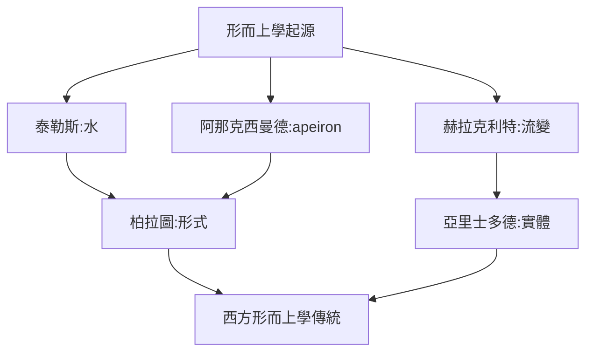
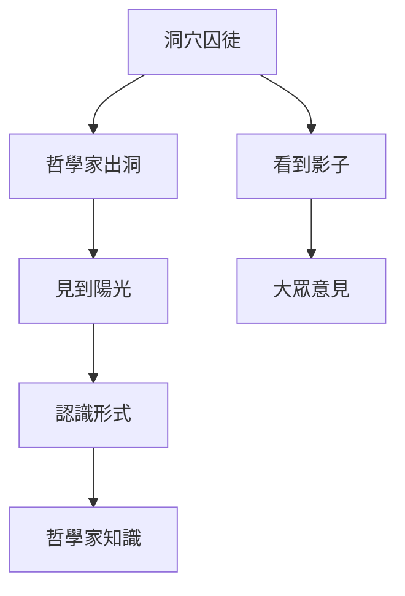
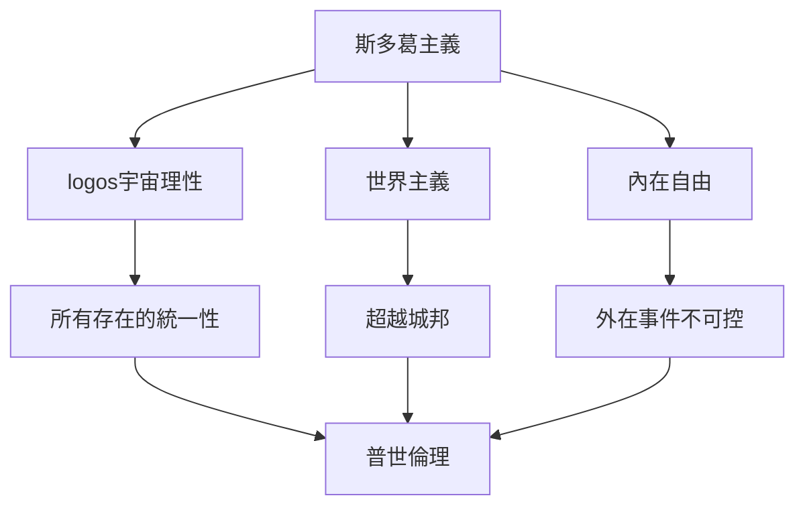
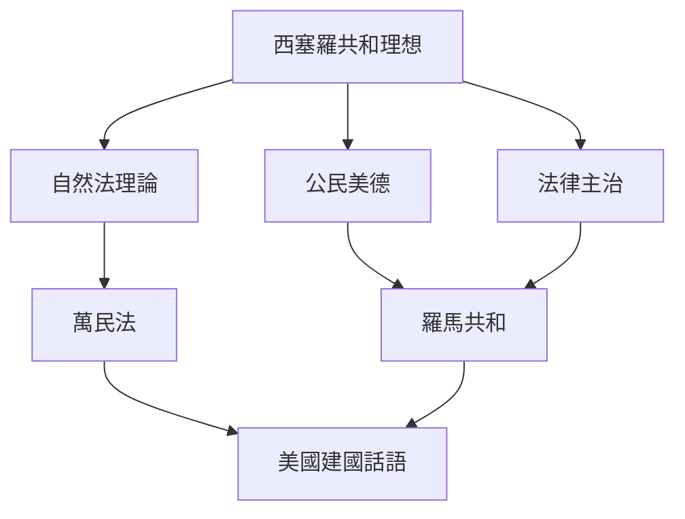
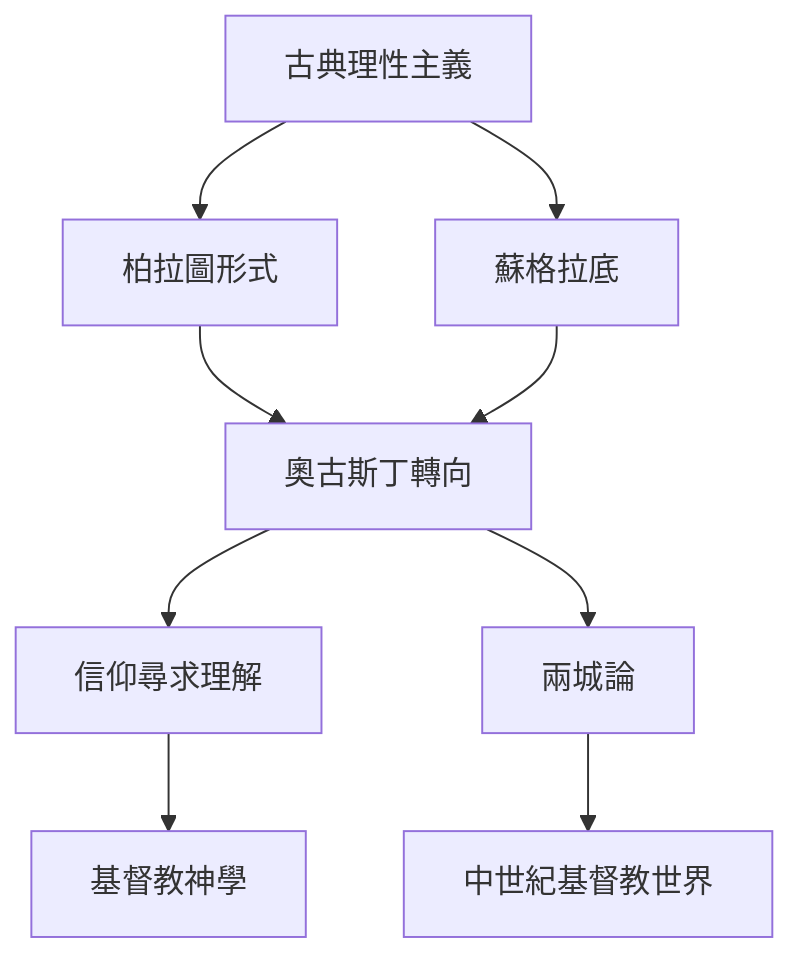
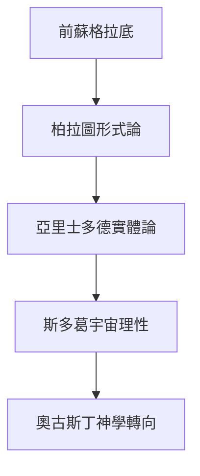
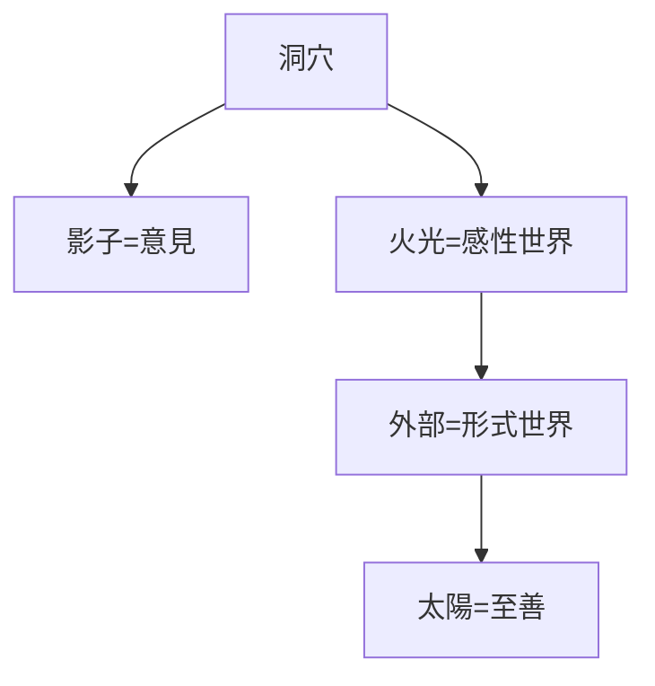
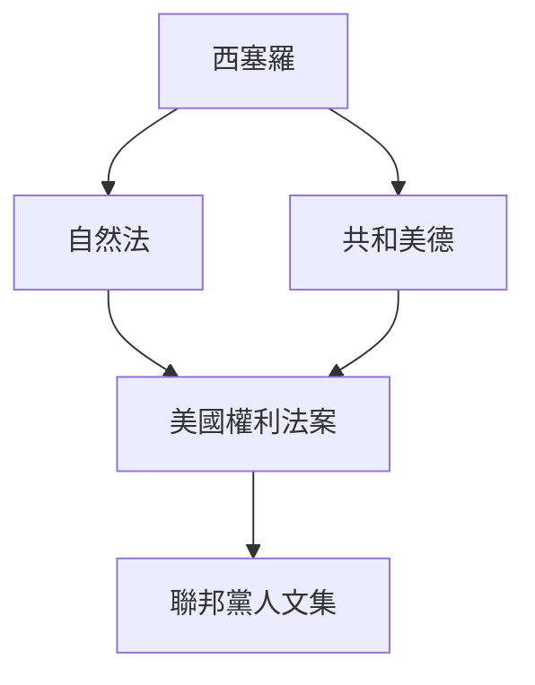
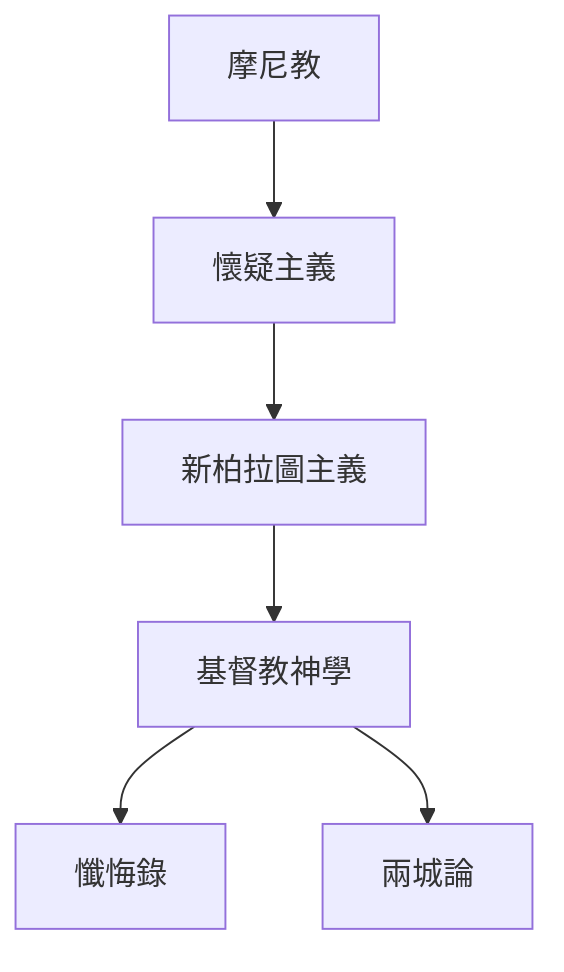
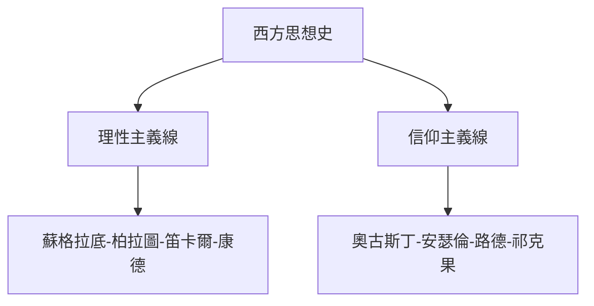

# Hist20A 西方思想史：希臘羅馬古代 / Western Intellectual History: Greco-Roman Antiquity

**Instructor**: Prof. James Hankins
**Department**: History, Harvard
**Official source**: https://history.fas.harvard.edu/fall-courses
**Style**: research-based — 幽默、犀利、聚焦權力與武器如何塑造歷史

---

## 問題 1：5 個 SPECIFIC 核心心智模型
## What are the 5 core mental models every expert shares?

1. **形而上學的起源 / Origins of Metaphysics**
   前蘇格拉底哲學家——泰勒斯的水（"萬物皆水"）、阿那克西曼德的apeiron（無定）、巴門尼德的存在（唯一、永恆、不變）——構成了西方形而上學的基因。他們問「什麼是真正真實的」這個問題，塑造了柏拉圖和亞里士多德的整個哲學傳統。Jonathan Barnes (1982) 追蹤了這7位（前蘇格拉底）哲學家的思想如何構成一個連貫的「前蘇格拉底世紀」。

   代表學者: Jonathan Barnes, *The Pre-Socratic Philosophers* (1982); G.E.L. Owen, *Aristotle on the Pre-Socratics* (1970)

2. **柏拉圖的理想國 vs 亞里士多德的實踐智慧 / Plato's Republic vs Aristotle's Phronesis**
   柏拉圖（公元前427-347）在《理想國》中設計了一個由哲學家國王統治的等級社會，認為正義是每個階級各司其職（"鐵銀銅"類比）。亞里士多德（公元前384-322）則在《尼各馬可倫理學》中主張實踐智慧（phronesis）——在具體情境中的道德判斷——優於抽象原則。Martha Nussbaum (1986) 追蹤了這種張力如何在文藝復興和啟蒙運動中被重新激活。

   代表學者: Plato, *Republic*; Aristotle, *Nicomachean Ethics* (trans. Irwin 1999); Martha Nussbaum, *The Fragility of Goodness* (1986)

3. **斯多葛派的宇宙理性 / Stoic Cosmopolitanism**
   愛比克泰德（50-135 CE）從奴隸到哲學家的經歷，使他發展出一套主張宇宙理性（logos）將所有人連為一體的哲學。他的《金言》（Enchiridion）成為羅馬皇帝的道德指南——馬可·奧勒留（121-180 CE）本人就是斯多葛主義的踐行者。

   代表學者: Epictetus, *Discourses*; Marcus Aurelius, *Meditations*; Brad Inwood, *Stoicism and Ethics* (2003)

4. **西塞羅的羅馬共和理想 / Cicero's Roman Republican Ideal**
   西塞羅（公元前106-43）將希臘哲學翻譯成拉丁語，創造了整套政治哲學詞彙——"共和國"（res publica）、"公民美德"、"自然法"。這些概念成為羅馬共和意識形態的核心，並在美國建國時被直接挪用——《獨立宣言》中的"自然法和自然上帝"話語直接來自西塞羅。

   代表學者: Cicero, *De Re Publica*; J.G.A. Pocock, *The Machiavellian Moment* (1975); Judith Zinsser, *Julius Caesar* (2006)

5. **奧古斯丁的神學轉向 / Augustine's Theological Turn**
   奧古斯丁（354-430）的《懺悔錄》代表西方思想史的最大轉折：從古典世界對理性本身的信任，轉向對墮落人類是否有能力認識真理的深刻懷疑。他的"內在之光"概念為中世紀神秘主義和宗教改革同時埋下了種子。Peter Brown (1967) 的經典傳記追蹤了奧古斯丁如何從摩尼教信徒轉向天主教神學。

   代表學者: Augustine, *Confessions*; Peter Brown, *Augustine of Hippo* (1967); Carol Harrison, *Beauty and Revelation* (1992)

---

## 問題 2：3 個 SPECIFIC 根本分歧
## What are the 3 fundamental disagreements in this field?

### 分歧 1：柏拉圖 — 哲學家國王 vs 民主 / Plato — Philosopher King or Democracy
**核心問題**: 柏拉圖對民主的批評在當代民主危機背景下是否重新獲得了合法性？

- **一方觀點 / Side A**: 支持 — 民主導向民粹和暴民政治，蘇格拉底之死就是證明；哲學家統治（Epistocracy）在當代政治哲學中有所復興
- **另一方觀點 / Side B**: 反對 — 民主的"多數暴政"已通過權利法案和司法審查得到糾正；哲學家國王自身不受制約會導致更大的暴政

### 分歧 2：理性 vs 信仰 / Reason vs Faith
**核心問題**: 從蘇格拉底到奧古斯丁，思想史是否必然走向理性對信仰的最終讓步？

- **一方觀點 / Side A**: 理性 — 希臘理性主義傳統是西方文明的基礎，宗教是中世紀的偏差；科學革命（16-17世紀）是理性主義的最終勝利
- **另一方觀點 / Side B**: 信仰 — 奧古斯丁的"信仰尋求理解"（crede ut intelligas）表明理性從屬於信仰；現代科學危機（量子力學的不確定性）再次證明純理性不足

### 分歧 3：古典遺產 — 借鑒還是挪用？/ Classical Heritage — Borrowed or Appropriated?
**核心問題**: 美國建國者對古典思想的使用是真實傳承，還是意識形態的政治工具？

- **一方觀點 / Side A**: 傳承 — 古典共和思想直接塑造了美國憲法和權利法案；麥迪遜在《聯邦黨人文集》中明確引用西塞羅
- **另一方觀點 / Side B**: 挪用 — 建國者引用西塞羅時忽略了奴隸制和性別壓迫——這些也是古典傳統的組成部分；後殖民批評揭示了這種"普世主義"話語的歐洲中心性

---

## 問題 3：10 個 PROBING 深度問題
## 10 deep questions that distinguish real understanding from memorization

1. 為什麼 **形而上學的起源** 是理解 西方思想史：希臘羅馬古代 的核心前提？
2. 在 **公元前600-公元600** 中，**柏拉圖 vs 亞里士多德** 的張力如何產生了最具爭議的哲學轉折？
3. 如果把 **斯多葛派的宇宙理性** 抽離，西方思想史 的核心邏輯會怎樣變化？
4. 哪位歷史人物、事件或文本最能代表 **西塞羅的羅馬共和理想** 的極致展現？
5. 學者之間關於 **理性 vs 信仰** 的爭論，在多大程度上反映了史料解釋的差異？
6. 在 **公元前600-公元600** 中，**形而上學** 與 **實踐倫理學** 的歷史後果，哪個對當代的影響更深？
7. 對 西方思想史 而言，"西方"這個地理-文化框架是分析的核心還是限制？
8. 如果你是蘇格拉底，面對 **理性批判** 與 **民主多數** 的衝突，你的優先選擇是什麼？
9. 當代哪些政治現象是 **柏拉圖的理想國** 的延續或反動？
10. 在多元文化時代，**古典遺產** 的話語權屬於誰？

---

# 核心心智模型深化（中英對照）

## 1. 形而上學的起源 — Origins of Metaphysics

### 1.1 Bilingual 概念對照
| 英文概念 | 中文術語 | 歷史含義 | 核心問題 |
|---|---|---|---|
| Archaic question | 原初問題 | 什麼是真正真實的？ | 形而上學起點 |
| Thales: water | 泰勒斯：水 | 萬物的基質 | 自然主義轉向 |
| Parmenides: Being | 巴門尼德：存在 | 唯一、永恆、不變 | 邏輯學起源 |
| Heraclitus: flux | 赫拉克利特：流變 | 萬物皆流 | 變化問題 |

### 1.2 核心史料
- **殘篇（Fragments）**: 前蘇格拉底哲學家現存的片段文本（輯自後世引用）
- **第歐根尼·拉修斯**: 《名哲言行錄》保存了大量早期哲學家傳記
- **亞里士多德《形而上學》**: 對前蘇格拉底的系統整理和批判

### 1.3 袁騰飛式犀利觀察
泰勒斯說"萬物皆水"——這不是物理學猜想，這是西方哲學的第一個"元問題"：在多樣性背後，是否存在某種統一性？這個問題在2500年後的物理學（弦理論、量子場論）中依然存在。

### 1.4 Deep Q
1. 如果巴門尼德的"存在者存在，不存在者不存在"是邏輯學的起點，它是否同時是形而上學的起點和邏輯學的陷阱（否認變化的真實性）？
2. 前蘇格拉底哲學家的思想在多大程度上受到美索不達米亞和埃及思想傳統的影響？

### 1.5 Mermaid

---

## 2. 柏拉圖 vs 亞里士多德 — Plato vs Aristotle

### 2.1 Bilingual 概念對照
| 英文概念 | 中文術語 | 歷史含義 | 核心文本 |
|---|---|---|---|
| Forms/Ideas | 形式/理念 | 柏拉圖的核心概念 | *理想國*, *斐多* |
| Phronesis | 實踐智慧 | 亞里士多德倫理核心 | *尼各馬可倫理學* VI |
| Philosopher king | 哲學家國王 | 理想國的統治者 | *理想國* V |
| Golden mean | 中道 | 亞里士多德美德論 | *倫理學* II |

### 2.2 核心史料
- **柏拉圖《理想國》**: 特別是"線喻"（Line Simile）和"洞穴比喻"（Republic 514a-521b）
- **亞里士多德《尼各馬可倫理學》**: 特別是第六卷對實踐智慧的論述
- **Nussbaum (1986)**: 對兩者倫理學的比較研究

### 2.3 袁騰飛式犀利觀察
洞穴比喻（Republic 514a）：囚徒們背對洞口，只看到火光投射的影子——柏拉圖說這就是普通人對"現實"的理解。蘇格拉底的任務是把囚徒從洞穴中拉出來。但問題來了：誰決定外面的世界是真正的現實？這個問題困擾了西方哲學2500年——它就是我們今天所說的"專家政治"（technocracy）的哲學根源。

### 2.4 Deep Q
1. 洞穴比喻中"從洞穴到陽光"的過程是不可逆的嗎？一個曾經"看到真相"的人能否回到洞穴而不感到痛苦？
2. 如果哲學家國王的權力不受制約，誰來制約哲學家國王？這個"元問題"是否是柏拉圖思想的最深層矛盾？

### 2.5 Mermaid

---

## 3. 斯多葛派的宇宙理性 — Stoic Cosmopolitanism

### 3.1 Bilingual 概念對照
| 英文概念 | 中文術語 | 歷史含義 | 核心文本 |
|---|---|---|---|
| Logos | 宇宙理性 | 宇宙的合理原則 | 赫拉克利特-斯多葛傳統 |
| cosmopolitanism | 世界主義 | 超越城邦的認同 | 愛比克泰德 |
| oikeiosis | 自我認知 | 向外擴展的道德 | 愛比克泰德 |
| Enchiridion | 金言 | 實用手冊 | 愛比克泰德, 2世紀 |

### 3.2 核心史料
- **愛比克泰德《金言》**: 斯多葛主義的精華手冊
- **馬可·奧勒留《沉思錄》**: 羅馬皇帝私人道德日記
- **西塞羅《圖斯庫拉言論》**: 斯多葛倫理學在羅馬的傳播

### 3.3 袁騰飛式犀利觀察
愛比克泰德說："我不是雅典人或科林斯人或任意一個城邦的公民——我是宇宙的公民。"這句話在2世紀是一種激進的普世主義，在今天則是聯合國公民意識的哲學祖先。

### 3.4 Deep Q
1. 斯多葛主義的"宇宙理性"（logos）與基督教"上帝"和伊斯蘭"真主"之間是什麼關係？
2. 馬可·奧勒留作為皇帝踐行斯多葛主義——他的道德實踐是否被權力腐蝕？

### 3.5 Mermaid

---

## 4. 西塞羅的羅馬共和理想 — Cicero's Roman Republican Ideal

### 4.1 Bilingual 概念對照
| 英文概念 | 中文術語 | 歷史含義 | 核心文本 |
|---|---|---|---|
| Res publica | 共和國 | 公共事務 | *論共和國* |
| Natural law | 自然法 | 超越人法的原則 | *論法律* |
| Ius gentium | 萬民法 | 適用所有人的法 | 羅馬法傳統 |
| Humanitas | 人道 | 羅馬人文主義 | 西塞羅教育思想 |

### 4.2 核心史料
- **西塞羅《論共和國》** (54-51 BCE): 羅馬共和理想的最完整陳述
- **西塞羅《論法律》**: 自然法理論的系統陳述
- **聯邦黨人文集**: 美國建國者對西塞羅的直接引用

### 4.3 袁騰飛式犀利觀察
西塞羅被暗殺（公元前43年12月7日）時，凱撒主義（獨裁）正在取代共和主義——這個歷史轉折預示了西方政治思想中最持久的張力：共和 vs 帝制。今天的美國政治，依然在這個張力之中。

### 4.4 Deep Q
1. 美國建國者對西塞羅的引用是否忽略了他的奴隸主身份？奴隸制的共和理想是否是一個內在矛盾？
2. 自然法理論在當代人權話語中的使用，是真實傳承還是政治工具化？

### 4.5 Mermaid

---

## 5. 奧古斯丁的神學轉向 — Augustine's Theological Turn

### 5.1 Bilingual 概念對照
| 英文概念 | 中文術語 | 歷史含義 | 核心文本 |
|---|---|---|---|
| Confessions | 懺悔錄 | 內在自我敘述 | 397-401 CE |
| Inner light | 內在之光 | 認識真理的來源 | 奧古斯丁光學 |
| Grace and free will | 恩典與自由意志 | 基督教人類學 | *論意志自由* |
| Two Cities | 兩城論 | 歷史的終極意義 | *上帝之城* |

### 5.2 核心史料
- **奧古斯丁《懺悔錄》**: 第一部西歐自傳；"時間是什麼——沒人問我，我則知道；但若要解釋給問者，我便一無所知"
- **奧古斯丁《上帝之城》**: 對羅馬陷落的基督教解讀；兩城理論
- **Peter Brown (1967)**: 經典的奧古斯丁傳記

### 5.3 袁騰飛式犀利觀察
奧古斯丁在《懺悔錄》開篇寫道："你為自己創造了我們，我們的心若不安息在你裡面，便不得安寧。"這句話不是哲學命題——這是祈禱。西方思想史從柏拉圖的"理性認識"到奧古斯丁的"信仰祈禱"，是一個認識論的大轉折。

### 5.4 Deep Q
1. 奧古斯丁對摩尼教的拒斥（387年）——從"善惡二元論"到"一切善來自上帝"——這個轉向的哲學意義是什麼？
2. "兩城論"（上帝之城 vs 世俗之城）與當代宗教政治（政教分離vs宗教國家）的關係是什麼？

### 5.5 Mermaid

---

# 深度自測問題詳解（精要）

## 1-5
結合史料和學者觀點，運用以下分析工具：
- **思想史方法論**: 文本 vs 語境; 接受史（Rezeptionsgeschichte）
- **比較哲學**: 希臘 vs 羅馬; 古典 vs 基督教
- **批判理論**: 後殖民對"西方"概念的解構

## 6-10
當代迴響分析：
- 洞穴比喻與當代"後真相"政治的關係
- 斯多葛主義與當代"情緒管理"文化的聯繫
- 自然法理論與當代人權話語的繼承與張力
- 奧古斯丁的"原罪"論與當代政治哲學的批判

---

# 5 個 Mermaid 圖解

## 圖 1：西方形而上學傳統的演變

## 圖 2：柏拉圖洞穴比喻的認識論結構

## 圖 3：西塞羅思想對美國建國的影響

## 圖 4：奧古斯丁思想轉向的地圖

## 圖 5：西方思想史的兩條主線

---

## 總結 / Summary

西方思想史：希臘羅馬古代（Hist20A: Western Intellectual History: Greco-Roman Antiquity）是理解 **公元前600-公元600** 思想傳承的關鍵窗口。

**三大核心收穫**:
1. **形而上學的起源** — Origins of Metaphysics：Jonathan Barnes, *The Pre-Socratic Philosophers* (1982)
2. **柏拉圖 vs 亞里士多德** — Plato vs Aristotle：Martha Nussbaum, *The Fragility of Goodness* (1986)
3. **奧古斯丁的神學轉向** — Augustine's Theological Turn：Peter Brown, *Augustine of Hippo* (1967)

**終極問題**: 
在 西方思想史 的漫長傳承中，我們看到的是理性的勝利，還是信仰的退讓？這個問題本身，或許就是西方思想史留給當代最深刻的挑戰。

**推薦閱讀**:
- Jonathan Barnes, *The Pre-Socratic Philosophers* (1982)
- Martha Nussbaum, *The Fragility of Goodness* (1986)
- Peter Brown, *Augustine of Hippo* (1967)
- J.G.A. Pocock, *The Machiavellian Moment* (1975)
- Brad Inwood, *Stoicism and Ethics* (2003)
