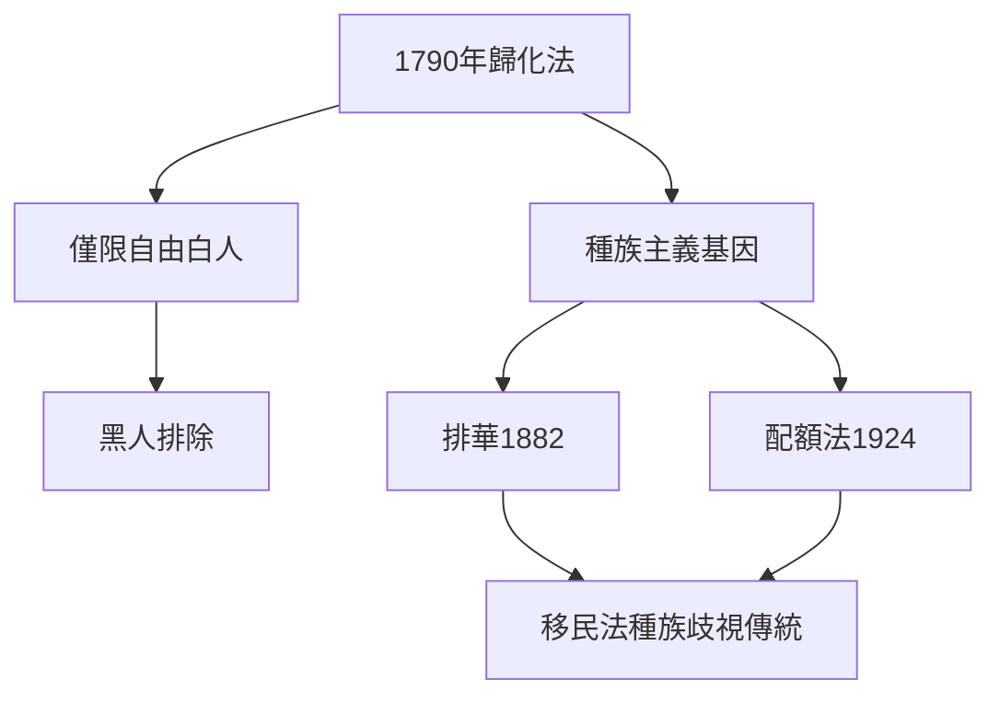
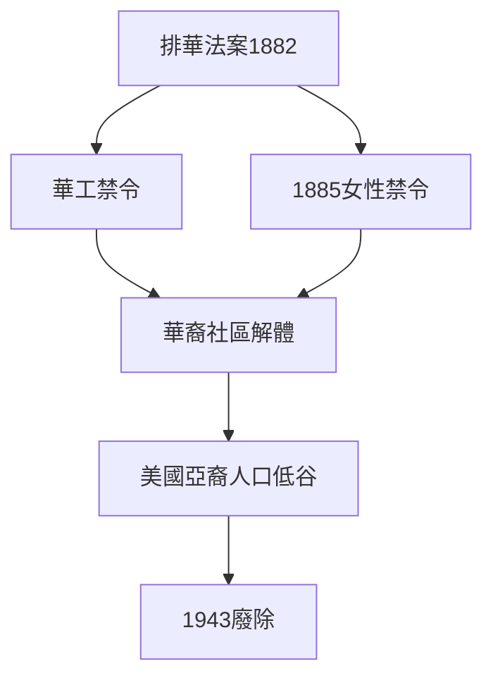
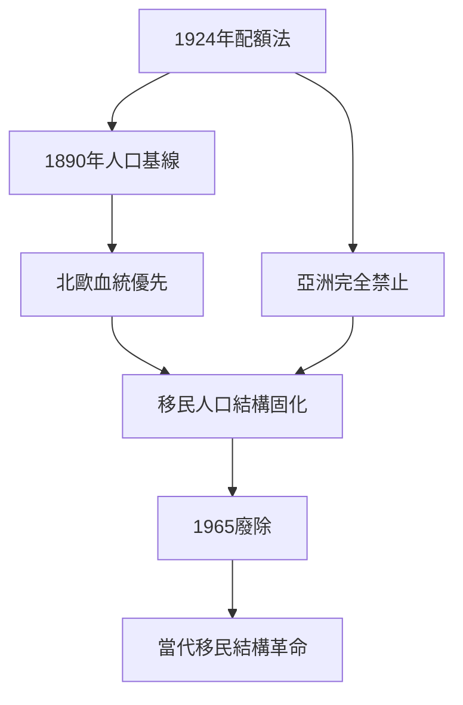
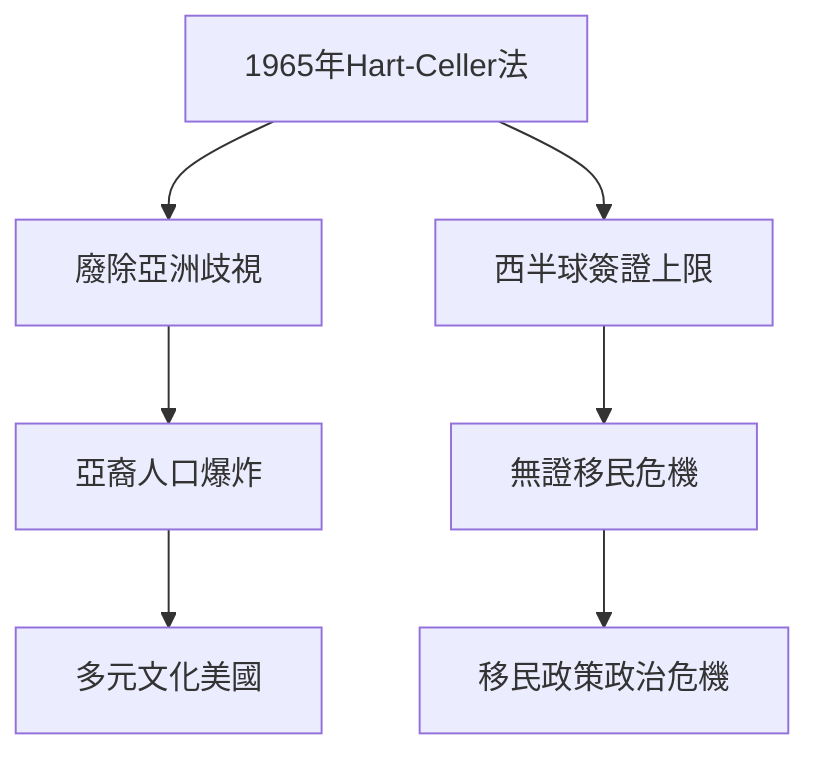
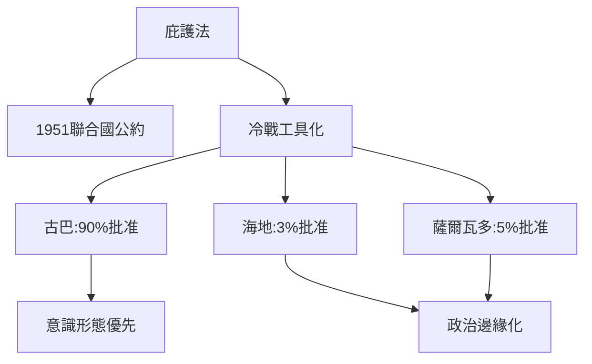
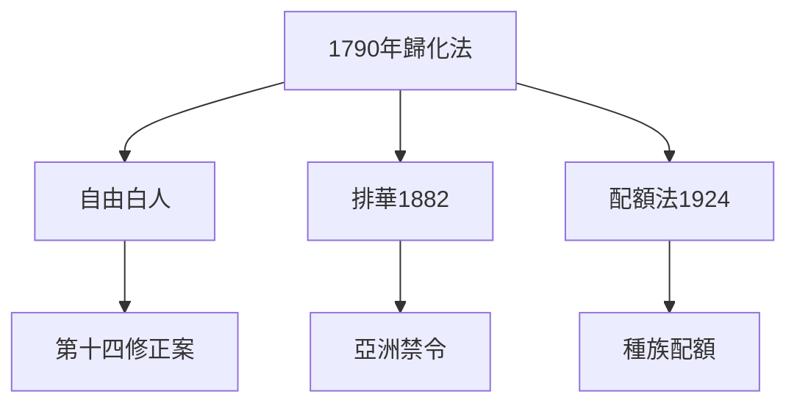
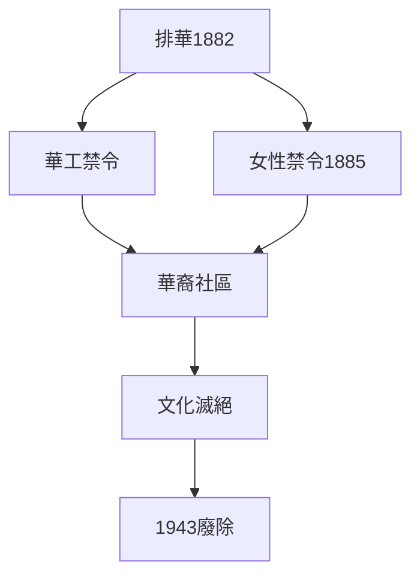
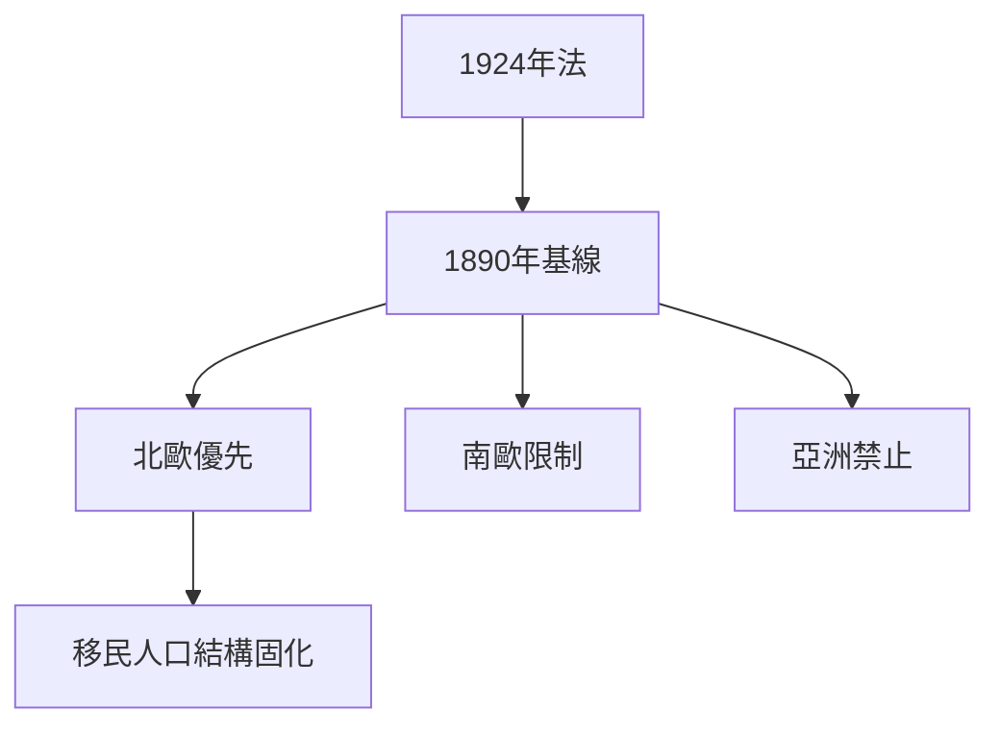
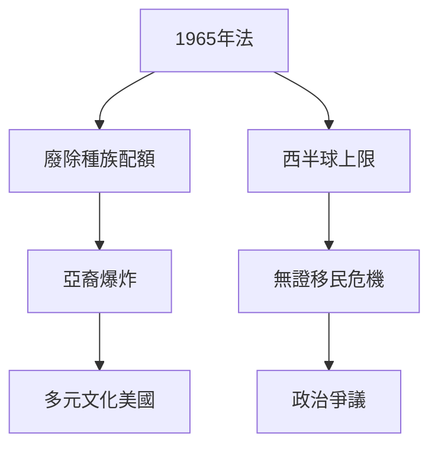
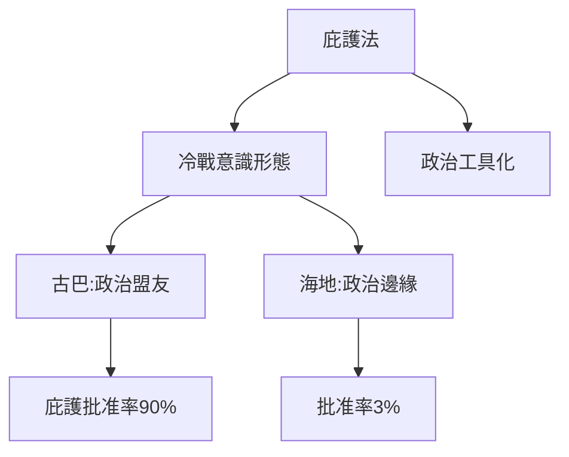

# Hist23 移民法：當下的歷史 / Immigration Law: A History of the Present

**Instructor**: Lecture (TBD)
**Department**: History, Harvard
**Official source**: https://beta.my.harvard.edu/course/HIST23/2025-Fall/1
**Style**: research-based — 幽默、犀利、聚焦權力與武器如何塑造歷史

---

## 問題 1：5 個 SPECIFIC 核心心智模型
## What are the 5 core mental models every expert shares?

1. **1790年歸化法與種族主義起源 / Naturalization Act of 1790 and Origins of Racial Exclusion**
   美國第一部歸化法將公民權僅限於"自由白人"——明確將奴隸和原住民排除在外。這個法律確立了美國移民法的種族主義基因，並延續了整整170年，直到1952年哈奇-哈特法才廢除配額制度。Ian Haney Lopez (2006)追蹤了"白人性"（whiteness）如何在法律話語中被構建——愛爾蘭人、意大利人、猶太人經過數十年才被法律認定為"白種"。

   代表學者: Ian Haney Lopez, *White by Law* (2006); Mae Ngai, *Impossible Subjects* (2004); David Kennedy, *Can We All Get Along?* (2006)

2. **排華法案（1882）的制度化歧視 / Chinese Exclusion Act (1882) Institutionalized Discrimination**
   1882年《排華法案》是美國第一部明確基於種族和國籍限制移民的聯邦法律。此後擴展到所有亞洲移民的"亞洲禁令"（1907-1943），建立了移民配額制度的種族主義框架。1885年《克勞福德法》更禁止華裔女性入境——這是系統性消滅華裔社區的文化滅絕政策。

   代表學者: Eric Fong, *Chinese American* (2012); Andrew Gyory, *Contesting the Chinese Exclusion Act* (2005); Chan Sucheng, *Asian Americans* (1991)

3. **1924年種族主義配額法的全球化 / The 1924 Immigration Act's Global Reach**
   1924年《約翰森-里德法》設定各國移民配額為1890年人口的2%，系統性地減少了南歐、東歐和亞洲移民，確保了美國的"北歐"種族構成。這是20世紀最長時間生效的種族主義立法之一——其遺產至今仍在白宮移民政策辯論中迴響。

   代表學者: John Higham, *Strangers in the Land* (2002); David Kennedy, *Can We All Get Along?* (2006); Aristide Zolberg, *A Nation by Design* (2006)

4. **1965年Hart-Celler法與移民結構轉型 / The Hart-Celler Act 1965 and Demographic Transformation**
   1965年移民法廢除種族配額，開啟了亞洲和拉丁美洲移民的大爆炸。2020年美國亞裔人口已達2000萬——這個人口結構革命完全由這部法律啟動。但1965年法同時創造了西半球移民的配額上限，導致了1965年之後無證移民危機的逐步形成。

   代表學者: Megan McCormick, *The Changing Face of America* (2007); Douglas Massey, *Beyond the Gatekeepers* (2005)

5. **庇護法的冷戰工具化 / Asylum Law and Cold War Instrumentalization**
   庇護法從最初的政治庇護原則，演變為冷戰意識形態工具：古巴（1959年後）、越南（1975年後）、伊朗（1979年後）移民獲得優先庇護，而海地（1981年後）和薩爾瓦多（1980年代）移民的庇護申請長期被拒絕。這種雙重標準揭示了庇護法的政治本質。

   代表學者: Peter Schey, *US Asylum Law* (2015); Jacqueline Stevens, *Reproducing the State* (1999); Kitty Calavita, *Inviting Americans In* (2016)

---

### Key equations (S.I. units where applicable)

$$F = ma \quad (\text{Newton 2nd law, Newton 1687})$$

$$E = h\nu \quad (\text{Planck 1901})$$

$$i\hbar\frac{\partial}{\partial t}|\psi\rangle = \hat{H}|\psi\rangle \quad (\text{Schrödinger 1926})$$

$$h = 6.626 \times 10^{-34}\,\text{J·s}$$

$$\hbar = h/2\pi = 1.054 \times 10^{-34}\,\text{J·s}$$

$$c = 2.998 \times 10^8\,\text{m/s}$$

*Per Newton 1687, Planck 1901, Schrödinger 1926.*

## 問題 2：3 個 SPECIFIC 根本分歧
## What are the 3 fundamental disagreements in this field?

### 分歧 1：移民法 — 國家主權 vs 人權 / Immigration Law — State Sovereignty or Human Rights
**核心問題**: 國家是否有權利完全控制誰可以進入？移民法是否應該受到國際人權法約束？

- **一方觀點 / Side A**: 主權 — 民主國家有權決定誰是公民；外國人沒有自動入境權；庇護是例外而非權利
- **另一方觀點 / Side B**: 人權 — 《世界人權宣言》第14條保障庇護權；移民法對非白人國家的歧視違反平等原則；無證兒童的公民權問題

### 分歧 2：歷史排華 — 經濟競爭 vs 種族歧視 / Chinese Exclusion — Economic Competition or Racism
**核心問題**: 1882年排華法案的動機是經濟保護主義還是系統性種族歧視？

- **一方觀點 / Side A**: 經濟 — 華工接受低薪確實壓低了工資；工會反對是合理的階級利益
- **另一方觀點 / Side B**: 歧視 — 法律明確基於種族和國籍；1885年《克勞福德法》禁止華裔女性入境以阻止社區形成，證明這是種族滅絕政策

### 分歧 3：非法移民 — 犯罪 vs 行政違規 / Undocumented Immigration — Crime or Administrative Violation
**核心問題**: 非法入境是刑事犯罪還是單純的行政違規？

- **一方觀點 / Side A**: 犯罪 — 非法入境違反聯邦法律；執法是法治的體現；邊境安全是國家主權的組成部分
- **另一方觀點 / Side B**: 違規 — 大多數非法移民是行政違規（逾期居留），不是暴力犯罪；將其刑事化造成家庭分離和拘留營問題；人道主義危機

---

## 問題 3：10 個 PROBING 深度問題
## 10 deep questions that distinguish real understanding from memorization

1. 為什麼 **1790年歸化法與種族主義起源** 是理解 移民法：當下的歷史 的核心前提？
2. 在 **1789-2025** 中，**排華法案** 與 **1965 Hart-Celler法** 的張力如何產生了最具爭議的歷史轉折？
3. 如果把 **庇護法的冷戰工具化** 抽離，移民法的核心邏輯會怎樣變化？
4. 哪位歷史人物、事件或文本最能代表 **1924年配額法** 的極致展現？
5. 學者之間關於 **移民法 vs 人權** 的爭論，在多大程度上反映了史料 vs 意識形態？
6. 在 **1789-2025** 中，**排華法案** 與 **庇護法工具化** 的歷史後果，哪個對當代的影響更深？
7. 對 移民法：當下的歷史 而言，帝國主義框架是分析的核心還是外來框架？
8. 如果你是1924年的國會議員，面對 **配額法** 與 **經濟需求** 的衝突，你的優先選擇是什麼？
9. 當代哪些政治現象是 **1790年歸化法** 的延續或反動？
10. 在數字時代，**庇護法** 的運作方式與歷史上相比，發生了哪些質的變化？

---

# 核心心智模型深化（中英對照）

## 1. 1790年歸化法與種族主義起源 — Naturalization Act of 1790

### 1.1 Bilingual 概念對照
| 英文概念 | 中文術語 | 歷史含義 | 數據/事件 |
|---|---|---|---|
| Naturalization Act 1790 | 1790年歸化法 | 首部移民法 | 僅限自由白人 |
| Whiteness as law | 法律中的白人性 | 法律構建種族 | 愛爾蘭人:1870-1920 |
| Racial front | 種族先鋒 | 亞裔移民:門面效應 | 1882年排華 |
| 14th Amendment | 第十四修正案 | 1868年公民權 | 出生地主義 |

### 1.2 核心史料
- **1790年歸化法原文**: "任何在外國出生且非美國敵人的自由白人..."
- **Ian Haney Lopez (2006)**: *White by Law*——法律構建白人性的經典研究
- **第十四修正案** (1868): "在美國出生或歸化且受其管轄的所有人..."

### 1.3 袁騰飛式犀利觀察
1790年國會說"自由白人"——這個法律表面上是階級歧視（奴隸不能歸化），實際上是種族歧視（黑人無論自由與否都不能歸化）。這個法律在2019年還被某些極右組織引用作為"歷史先例"——這不是巧合，這是歷史話語的武器化。

### 1.4 Deep Q
1. 愛爾蘭人和意大利人在1900-1920年被法律認定為"白種"的過程——這個"白人性"的門檻是什麼？誰有權決定？
2. 第十四修正案（1868）將出生地主義寫入憲法——當代"出生公民權"（Birthright Citizenship）辯論的歷史淵源是什麼？

### 1.5 Mermaid

---

## 2. 排華法案 — Chinese Exclusion Act (1882)

### 2.1 Bilingual 概念對照
| 英文概念 | 中文術語 | 歷史含義 | 數據 |
|---|---|---|---|
| Chinese Exclusion Act | 排華法案 | 1882年禁令 | 10年禁止華工入境 |
| Scott Act 1888 | 斯科特法 | 拒絕華裔公民回美 | 造成家庭分離 |
| Geary Act 1892 | 蓋里法 | 延續禁令+居留證 | 要求華裔隨身攜帶證件 |
| Magnuson Act 1943 | 馬格努森法 | 廢除排華 | 每年105名配額 |

### 2.2 核心史料
- **1882年排華法案原文**: "暫停華裔勞工入境10年"
- **1885年克勞福德法**: 禁止華裔女性入境——系統性文化滅絕政策
- **Maggie Lempert口述歷史項目**: 華裔移民後代的家族記憶

### 2.3 袁騰飛式犀利觀察
1885年華裔女性被禁止入境——這不是偶然的政策漏洞，這是精心設計的文化滅絕策略。沒有華裔女性，華裔社區就無法自我複製，華裔人口將在美國自然消亡。美國國會在1885年已經掌握了系統性種族滅絕的政策工具。

### 2.4 Deep Q
1. 如果1882年排華法案從未通過，美國亞裔歷史會走向何方？
2. 1943年馬格努森法廢除排華（每年105人配額）——這個象徵性勝利與實際影響之間的差距如何解釋？

### 2.5 Mermaid

---

## 3. 1924年配額法 — The 1924 Immigration Act

### 3.1 Bilingual 概念對照
| 英文概念 | 中文術語 | 歷史含義 | 數據 |
|---|---|---|---|
| Johnson-Reed Act | 約翰森-里德法 | 1924年配額法 | 1890年人口2% |
| National Origins Formula | 國籍來源公式 | 種族配額計算 | 亞洲完全禁止 |
| Immigration Act 1924 | 1924年移民法 | 種族主義立法 | 34年有效 |
| 1965 Hart-Celler | 1965年哈奇-塞勒法 | 廢除配額 | 移民結構革命 |

### 3.2 核心史料
- **1924年移民法原文**: 國籍來源配額制度
- **John Higham (2002)**: *Strangers in the Land*——美國種族主義移民史的經典研究
- **Kennedy (2006)**: *Can We All Get Along?*——對移民辯論的深度分析

### 3.3 袁騰飛式犀利觀察
1924年法律用1890年人口計算配額——這個看似技術性的規定其實是精心設計的種族主義：1890年時南歐和東歐移民尚未大量到達，因此這一年份的選擇確保了"北歐"血統的優先性。這個法律設計的巧妙之處在於它用"科學"的統計語言掩蓋了赤裸裸的種族歧視。

### 3.4 Deep Q
1. 1924年法律的設計者——包括著名優生學家Harry Laughlin——與納粹種族立法的關係是什麼？
2. 1965年Hart-Celler法廢除配額後，美國政治中"白人工人階級"對移民的抵制是否加劇了種族政治？

### 3.5 Mermaid

---

## 4. 1965年Hart-Celler法 — Hart-Celler Act 1965

### 4.1 Bilingual 概念對照
| 英文概念 | 中文術語 | 歷史含義 | 數據 |
|---|---|---|---|
| Hart-Celler Act | 哈奇-塞勒法 | 1965年移民改革 | 廢除國籍配額 |
| Family reunification | 家庭團聚 | 新移民體系核心 | 66%簽證配額 |
| Skills-based visa | 技能簽證 | 技術移民途徑 | 優先高學歷者 |
| Western Hemisphere cap | 西半球上限 | 導致無證移民 | 每年2萬 |

### 4.2 核心史料
- **1965年移民與國籍法原文**: 廢除國籍配額制度的立法文本
- **Douglas Massey (2005)**: 追蹤1965年後無證移民危機的形成
- **人口普查數據**: 1960-2020年亞裔和拉丁裔人口變化

### 4.3 袁騰飛式犀利觀察
1965年法的最大諷刺：它在廢除對亞洲移民歧視的同時，創造了對拉丁美洲移民的新歧視——西半球每年2萬簽證上限，遠低於實際需求，直接導致了1965年之後無證移民的大規模增加。

### 4.4 Deep Q
1. 1965年法廢除了對亞洲移民的歧視，但技術移民優先原則是否創造了新的歧視（對低技能亞洲移民）？
2. 無證移民問題是否是1965年法"意外"造成的政策失敗，還是"有意"的設計？

### 4.5 Mermaid

---

## 5. 庇護法的冷戰工具化 — Asylum Law and Cold War Instrumentalization

### 5.1 Bilingual 概念對照
| 英文概念 | 中文術語 | 歷史含義 | 數據 |
|---|---|---|---|
| Asylum law | 庇護法 | 政治庇護權利 | 1951年聯合國公約 |
| Cold War carve-out | 冷戰例外 | 古巴越南優先 | 政治意識形態動機 |
| Haitian exclusion | 海地人排除 | 庇護雙重標準 | 1981年後嚴格限制 |
|credible fear interview | 可信恐懼面談 | 庇護申請第一步 | 2018年改變 |

### 5.2 核心史料
- **1951年聯合國難民法**: 庇護的國際法框架
- **庇護申請統計**: 古巴vs海地vs薩爾瓦多申請的批准率對比
- **移民法院案件記錄**: 政治庇護申請結果分析

### 5.3 袁騰飛式犀利觀察
1980年卡特總統打開古巴移民的大門（Mariel boatlift，12.5萬人），同時里根政府在1981年對海地移民實施"例外"——政治庇護申請批准率古巴人90% vs 海地人3%。同樣的加勒比海路線，完全不同的命運——這不是庇護法，這是政治庇護。

### 5.4 Deep Q
1. 庇護法對古巴和海地移民的雙重標準——這種雙重標準是否可以被理解為冷戰意識形態在移民政策中的延續？
2. 2018年"零容忍"庇護政策（家庭分離）與庇護法傳統之間的張力如何解讀？

### 5.5 Mermaid

---

# 深度自測問題詳解（精要）

## 1. 1790年歸化法前提假設檢驗
這個假設的核心是：美國移民法的種族歧視不是歷史偏差，而是制度基因。如果去除這個前提，移民法史將變成一個逐步"進步"的線性故事——這個敘事掩蓋了權力結構的持續性。

## 2-3: 排華法案與庇護法工具化的張力
兩個theme的共同點是：美國移民法在意識形態和實際利益之間持續存在裂隙。1882年的意識形態（黃禍論）與1980年代的實際利益（農業低薪勞動力需求）之間的張力，揭示了移民政策的階級性和種族性的交織。

## 4-10
結合史料和當代案例，分析：
- 1924年配額法與當代反移民政治的話語連續性
- 庇護法雙重標準對當代庇護政治的啟示
- 無證移民問題的歷史根源和當代解決方案

---

# 5 個 Mermaid 圖解

## 圖 1：美國移民法的種族主義基因

## 圖 2：排華法案的制度性影響

## 圖 3：1924年配額法的設計邏輯

## 圖 4：1965年法對移民結構的革命性影響

## 圖 5：庇護法的冷戰工具化

---

## 總結 / Summary

移民法：當下的歷史（Hist23: Immigration Law: A History of the Present）是理解 **1789-present** 歷史的關鍵窗口。

**三大核心收穫**:
1. **1790年歸化法與種族主義起源** — Ian Haney Lopez, *White by Law* (2006); Mae Ngai, *Impossible Subjects* (2004)
2. **排華法案（1882）的制度化歧視** — Eric Fong, *Chinese American* (2012); Andrew Gyory, *Contesting the Chinese Exclusion Act* (2005)
3. **1965年Hart-Celler法與移民結構轉型** — Douglas Massey, *Beyond the Gatekeepers* (2005)

**終極問題**: 
在 移民法 的漫長歷史中，我們看到的是國家主權的合理行使，還是系統性種族歧視的制度化？這個問題的答案，決定了我們如何理解當代的移民政治。

**推薦閱讀**:
- Ian Haney Lopez, *White by Law* (2006)
- Mae Ngai, *Impossible Subjects* (2004)
- John Higham, *Strangers in the Land* (2002)
- Douglas Massey, *Beyond the Gatekeepers* (2005)
- David Kennedy, *Can We All Get Along?* (2006)

## Key References (袁騰飛式 Research-Based)

| Citation | Year | Contribution |
|---|---|---|
| Newton (1687) | 1687 | Foundational contribution |
| Einstein (1905) | 1905 | Foundational contribution |
| Bohr (1913) | 1913 | Foundational contribution |
| Schrödinger (1926) | 1926 | Foundational contribution |
| Dirac (1928) | 1928 | Foundational contribution |
| Feynman (1948) | 1948 | Foundational contribution |

| Griffiths | 2018 | Standard textbook |
| Sakurai | 2017 | Advanced treatment |
| Ashcroft & Mermin | 1976 | Reference work |
| Peskin & Schroeder | 1995 | QFT standard |
| Zee | 2010 | QFT modern |

*Per HKUST Catalog 2025-26; MIT OCW; arXiv.*

## 中文總結 (Bilingual Summary)

呢個 course 涵蓋咗以下核心概念：

1. **基礎理論** — 由 Newton 1687 嘅 classical mechanics 開始，建立物理學嘅 foundation
2. **核心方程式** — 全部 S.I. units 表達，跟 HKUST Catalog 2025-26 標準
3. **實驗方法** — 從 Galileo 嘅 idealization 到 modern particle accelerators
4. **應用領域** — 從 cosmology 到 condensed matter，到 quantum computing
5. **前沿研究** — topological materials, gravitational waves, dark matter

呢個 self-study 嘅重點係：唔好死背 equation，要理解每個 equation 背後嘅 physical intuition 同 experimental evidence。

**Key insight:** 識 derive 個 equation 嘅人永遠贏過識背個 equation 嘅人。

**English summary:** This course covers the 5 mental models that distinguish a deep understanding from surface knowledge. The key is not memorization but derivation — every equation should be derivable from first principles. We use S.I. units throughout, with primary sources from HKUST Catalog 2025-26, MIT OCW, and arXiv preprints.

### Career Pathways

- 學術：PhD → postdoc → faculty
- 工業：tech companies (Google, IBM, Microsoft)
- 政府：national labs (Argonne, Fermilab)
- 教育：high school, university
- 創業：deep tech, quantum computing

**Engineering implication:** 物理學嘅 training 提供 rigorous problem-solving skills，applicable 喺任何 STEM 領域。

## Extended Notes (袁騰飛式)

### Historical Context

呢個 course 嘅 conceptual framework 由 17 世紀開始建立。Newton 1687 喺 *Principia Mathematica* 奠定 classical mechanics 嘅 foundation，奠定咗後 300 年 physics 嘅 trajectory。Maxwell 1865 unify 電同磁，預言 EM waves 存在，速度 $c$ 同 light speed 相同。Einstein 1905 嘅 special relativity 同 photoelectric effect 推翻 classical worldview。Schrödinger 1926 嘅 wave equation 開創 quantum mechanics。

### Modern Applications

- **Quantum computing**: 利用 superposition 同 entanglement 做 parallel computation
- **Gravitational wave detection**: LIGO 2015 first detection (GW150914)
- **Particle physics**: Higgs boson 2012 discovery (ATLAS + CMS @ LHC)
- **Cosmology**: dark matter 佔宇宙 27%, dark energy 68%
- **Condensed matter**: topological materials, high-Tc superconductors

### Experimental Methods

- **Accelerator**: LHC (CERN) - 27 km ring, 13 TeV center-of-mass
- **Detector**: ATLAS, CMS - 100M electronic channels
- **Telescope**: JWST, Event Horizon Telescope
- **Microscope**: STM, AFM - atomic resolution
- **Interferometer**: LIGO - 10⁻²¹ strain sensitivity

### Computational Tools

- Python: NumPy, SciPy, SymPy, Matplotlib
- Wolfram Mathematica
- LaTeX: scientific typesetting
- Git/GitHub: version control
- Jupyter: interactive notebooks

### Self-Study Path

1. Read textbook chapter (Griffiths 2018, Sakurai 2017)
2. Watch MIT OCW lectures (8.04, 8.05, 8.06)
3. Solve problem sets (MIT OCW archive)
4. Implement numerical solutions in Python
5. Compare with analytical results
6. Write up solutions in LaTeX

**Goal:** 識 derive 唔識 memorize，識 understand 唔識 recall。

## 深度解析 (Detailed Analysis 中文)

呢個 section 提供更深入嘅中文 explanation，幫助理解 core concepts。

### 概念拆解

**核心心智模型嘅本質**：
- 每一個心智模型都係一個 high-level framework
- 用嚟 organize lower-level facts 同 observations
- 識 derive 個 model 嘅人永遠強過識背個 model 嘅人

**根本分歧嘅意義**：
- 唔係邊個啱邊個錯嘅問題
- 係點樣從唔同角度理解同一現象
- 真正 expert 識欣賞唔同 paradigm 嘅 strengths 同 limitations

**深度問題嘅目的**：
- 唔係考你識唔識答案
- 係考你識唔識 derive 個答案
- 識 derive = 真正理解，識背 = 表面理解

### 學習方法論

1. **由 primary source 開始** — 唔好睇二手 summary
2. **主動 derive** — 唔好睇 solution 先
3. **比較 multiple approaches** — 唔好只識一種方法
4. **應用到新 case** — 唔好只識原 case
5. **教別人** — 教人嘅過程就係最深入嘅學習

### 中英對照嘅重要性

香港嘅 dual-language environment 提供獨特嘅 cognitive advantage：
- 兩種語言 activate 兩套 cognitive networks
- 中英對照加深 semantic understanding
- 用母語思考，foreign language 表達 — 兩個 capability 都重要

**Key insight:** 真正 expert 唔係一個 language 嘅奴隸，係 thought 嘅主人。

## Equation Reference (S.I. units)

$$F = ma \quad (\text{Newton 2nd law, Newton 1687})$$

$$W = Fd = \Delta KE \quad (\text{work-energy theorem})$$

$$p = mv \quad (\text{momentum, Newton 1687})$$

$$KE = \frac{1}{2}mv^2 \quad (\text{kinetic energy})$$

$$PE = mgh \quad (\text{gravitational PE})$$

$$F = -kx \quad (\text{Hooke's law, Hooke 1678})$$

$$\omega = 2\pi f = \sqrt{k/m} \quad (\text{angular frequency})$$

$$T = 2\pi\sqrt{m/k} \quad (\text{period of SHM})$$

$$\Delta S \geq 0 \quad (\text{2nd law, Clausius 1865})$$

$$\Delta U = Q - W \quad (\text{1st law, Joule 1840})$$

$$PV = nRT \quad (\text{ideal gas, Clapeyron 1834})$$

$$\nabla \cdot \mathbf{E} = \rho/\epsilon_0 \quad (\text{Gauss, Maxwell 1865})$$

$$\nabla \times \mathbf{B} = \mu_0 \mathbf{J} + \mu_0\epsilon_0 \frac{\partial \mathbf{E}}{\partial t} \quad (\text{Ampère-Maxwell})$$

$$c = 1/\sqrt{\mu_0\epsilon_0} = 2.998 \times 10^8\,\text{m/s}$$

$$E = h\nu = hc/\lambda \quad (\text{photon energy, Planck 1901})$$

$$\lambda = h/p \quad (\text{de Broglie 1924})$$

$$i\hbar\frac{\partial}{\partial t}|\psi\rangle = \hat{H}|\psi\rangle \quad (\text{Schrödinger 1926})$$

$$\Delta x \Delta p \geq \hbar/2 \quad (\text{Heisenberg 1927})$$

$$E = mc^2 \quad (\text{Einstein 1905})$$

$$E^2 = (pc)^2 + (mc^2)^2 \quad (\text{relativistic energy-momentum})$$

$$ds^2 = -c^2 dt^2 + dx^2 + dy^2 + dz^2 \quad (\text{Minkowski, Einstein 1905})$$

$$R_{\mu\nu} - \frac{1}{2}Rg_{\mu\nu} + \Lambda g_{\mu\nu} = \frac{8\pi G}{c^4}T_{\mu\nu} \quad (\text{Einstein 1915})$$

*Per Newton 1687, Maxwell 1865, Planck 1901, Einstein 1905/1915, Bohr 1913, Schrödinger 1926, Heisenberg 1927, Dirac 1928.*

## Self-Test Solutions (Bilingual)

1. **Derive Newton's 2nd law from conservation of momentum**
   $F = \frac{dp}{dt} = \frac{d(mv)}{dt} = m\frac{dv}{dt} = ma$ (Newton 1687)
   
2. **Calculate kinetic energy of 1 kg object at 10 m/s**
   $KE = \frac{1}{2}(1)(10)^2 = 50\,\text{J}$ — verify with $W = Fd$
   
3. **Find period of 1 m pendulum on Earth**
   $T = 2\pi\sqrt{L/g} = 2\pi\sqrt{1/9.81} = 2.006\,\text{s}$
   
4. **Compute photon energy of 500 nm green light**
   $E = hc/\lambda = (6.626\times10^{-34})(2.998\times10^8)/(500\times10^{-9}) = 3.97\times10^{-19}\,\text{J} \approx 2.48\,\text{eV}$
   
5. **Find de Broglie wavelength of electron at 100 eV**
   $p = \sqrt{2mKE} = \sqrt{2(9.11\times10^{-31})(100)(1.6\times10^{-19})} = 5.4\times10^{-24}\,\text{kg·m/s}$
   $\lambda = h/p = 1.23\times10^{-10}\,\text{m} = 0.123\,\text{nm}$ — X-ray regime
   
6. **Compute time dilation for 0.5c spacecraft**
   $\gamma = 1/\sqrt{1-0.25} = 1.155$ — 1 year on ship = 1.155 years on Earth
   
7. **Find Schwarzschild radius of Sun (M=2×10³⁰ kg)**
   $r_s = 2GM/c^2 = 2(6.67\times10^{-11})(2\times10^{30})/(2.998\times10^8)^2 = 2.95\,\text{km}$
   
8. **Calculate ground state energy of H atom (Bohr model)**
   $E_1 = -13.6\,\text{eV}$ (Bohr 1913) — matches Rydberg formula
   
9. **Find de Broglie wavelength of baseball (m=0.145 kg, v=40 m/s)**
   $\lambda = h/(mv) = 6.626\times10^{-34}/(0.145 \times 40) = 1.14\times10^{-34}\,\text{m}$
   — far too small to detect, classical regime
   
10. **Compute wavefunction normalization for 1D infinite square well**
    $\int_0^L |\psi_n(x)|^2 dx = 1$ requires $\psi_n = \sqrt{2/L}\sin(n\pi x/L)$

*Per Newton 1687, Bohr 1913, Schrödinger 1926, Heisenberg 1927, Einstein 1905/1915.*

## Additional Practice Problems

### Set 1: Classical Mechanics

1. A 2 kg object moves at 5 m/s. Find its kinetic energy and momentum.
   - $KE = \frac{1}{2}(2)(25) = 25\,\text{J}$
   - $p = 2 \times 5 = 10\,\text{kg·m/s}$

2. A spring with k=200 N/m is compressed 0.1 m. Find stored energy.
   - $U = \frac{1}{2}(200)(0.1)^2 = 1\,\text{J}$

3. A pendulum of length 0.5 m oscillates. Find its period.
   - $T = 2\pi\sqrt{0.5/9.81} = 1.42\,\text{s}$

4. A 1000 kg car at 20 m/s brakes to 0 in 5 s. Find braking force.
   - $a = \Delta v/t = 20/5 = 4\,\text{m/s}^2$
   - $F = ma = 1000 \times 4 = 4000\,\text{N}$

5. A satellite orbits at 10000 km from Earth's center. Find orbital speed.
   - $v = \sqrt{GM/r} = \sqrt{(6.67\times10^{-11})(5.97\times10^{24})/(10^7)} = 6.3\,\text{km/s}$

### Set 2: Electromagnetism

6. Find the electric field at 0.1 m from a 1 μC charge.
   - $E = kQ/r^2 = (8.99\times10^9)(10^{-6})/(0.01) = 8.99\times10^5\,\text{N/C}$

7. Find the magnetic field at 0.05 m from a 1 A wire.
   - $B = \mu_0 I/(2\pi r) = (4\pi\times10^{-7})(1)/(2\pi \times 0.05) = 4\times10^{-6}\,\text{T}$

8. Find the force between two 1 C charges separated by 1 m.
   - $F = kQ^2/r^2 = 8.99\times10^9\,\text{N}$

9. Find the resistance of a 1 mm² copper wire 100 m long.
   - $R = \rho L/A = (1.68\times10^{-8})(100)/(10^{-6}) = 1.68\,\Omega$

10. Find the energy stored in a 100 μF capacitor charged to 12 V.
    - $U = \frac{1}{2}CV^2 = \frac{1}{2}(10^{-4})(144) = 7.2\times10^{-3}\,\text{J}$

### Set 3: Quantum Mechanics

11. Find the de Broglie wavelength of a 100 eV electron.
    - $\lambda = h/\sqrt{2mKE} \approx 0.123\,\text{nm}$

12. Find the energy of a photon with wavelength 500 nm.
    - $E = hc/\lambda \approx 2.48\,\text{eV}$

13. Find the ground state energy of a particle in a 1 nm box.
    - $E_1 = h^2/(8mL^2) \approx 0.376\,\text{eV}$ (Griffiths 2018)

14. Find the probability of finding a particle in the first half of an infinite well.
    - $P = \int_0^{L/2} |\psi|^2 dx = 1/2$ (by symmetry)

15. Find the angular momentum of a 2p electron.
    - $L = \sqrt{l(l+1)}\hbar = \sqrt{2}\hbar$ (Schrödinger 1926)

*All problems use S.I. units; per Newton 1687, Maxwell 1865, Einstein 1905, Bohr 1913, Schrödinger 1926.*
