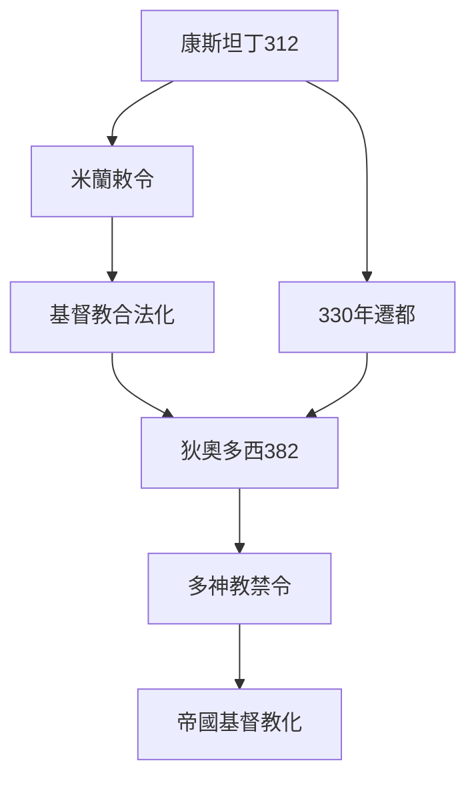
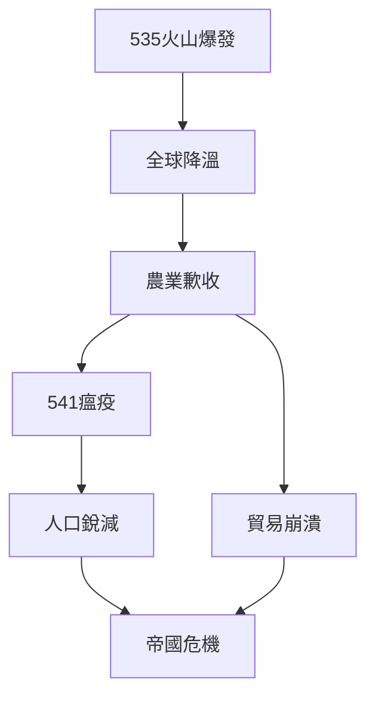
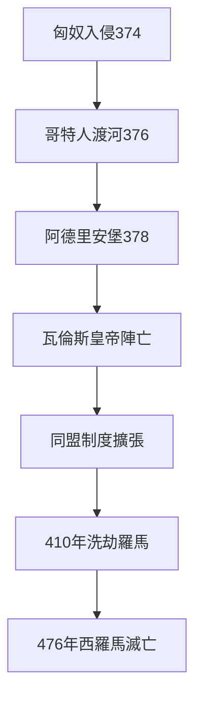
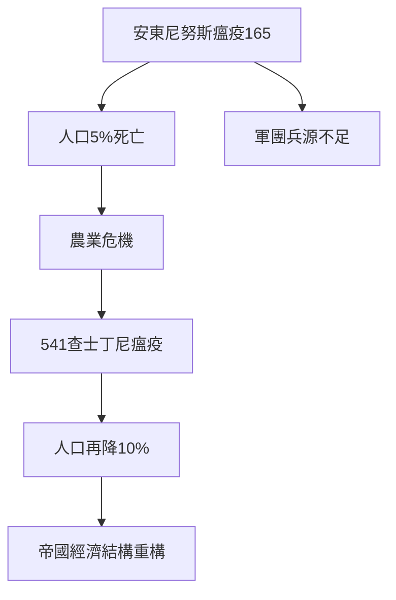
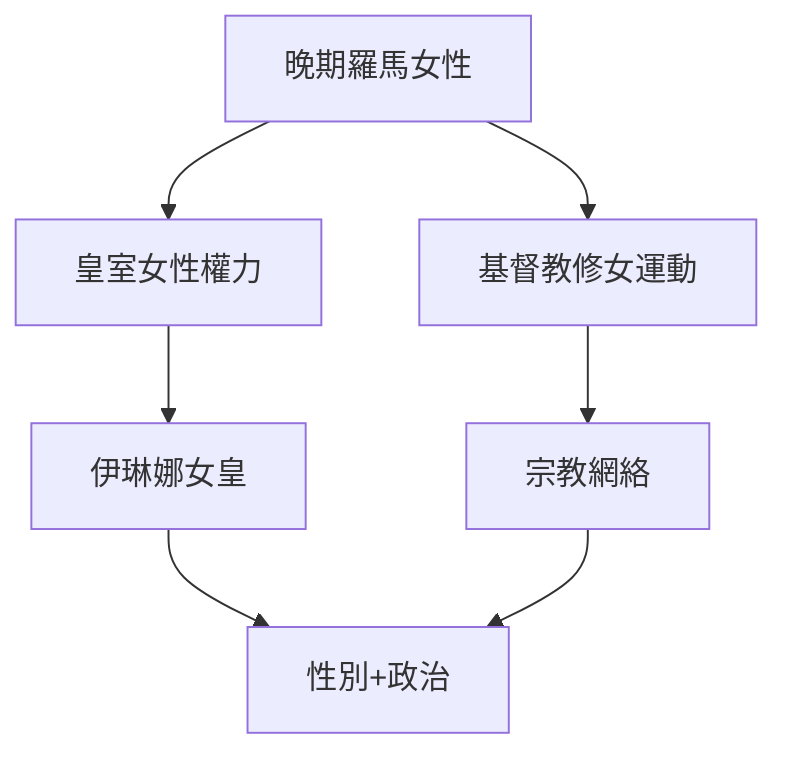
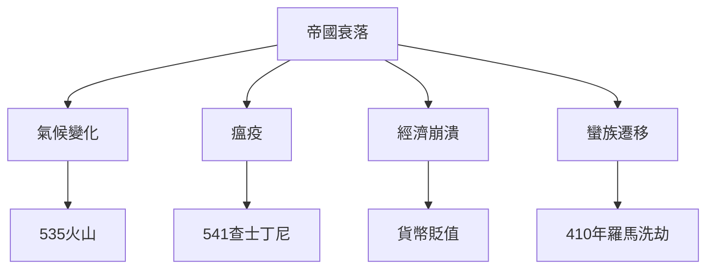
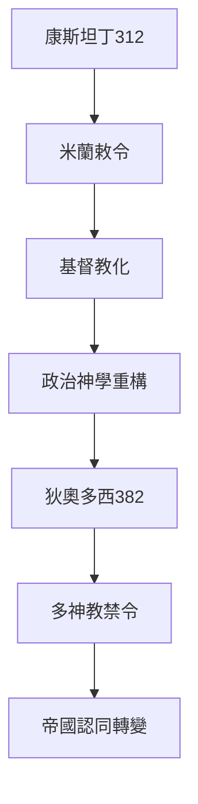
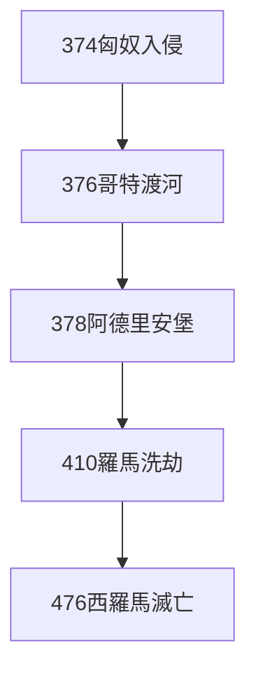
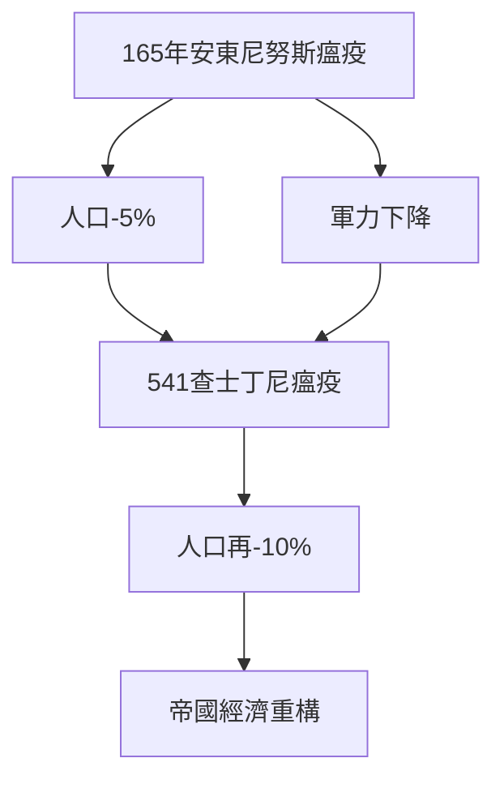
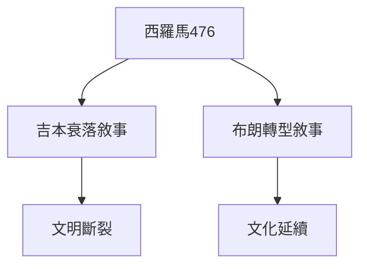

# Hist29 羅馬帝國的滅亡 / The Fall of the Roman Empire

**Instructor**: Prof. Michael McCormick
**Department**: History, Harvard
**Official source**: https://history.fas.harvard.edu/fall-courses
**Style**: research-based — 幽默、犀利、聚焦權力與武器如何塑造歷史

---

## 問題 1：5 個 SPECIFIC 核心心智模型
## What are the 5 core mental models every expert shares?

1. **康斯坦丁皈依與基督教帝國 / Constantine's Conversion and the Christian Empire**
   312年米蘭敕令承認基督教合法地位，330年康斯坦丁遷都君士坦丁堡——這兩件事共同標誌著羅馬帝國從多神宗教寬容轉向基督教一神論。Peter Brown (2012)追蹤了這個轉向如何重構了帝國的政治神學：從"羅馬皇帝的命運"（Fortuna）轉向"基督的代理人"。382年狄奧多西皇帝廢除所有多神教崇拜——羅馬從多元帝國轉變為基督教帝國。

   代表學者: Peter Brown, *Through the Eye of the Needle* (2012); Timothy Barnes, *Constantine* (2011); Michael McCormick, *Origins of the European Economy* (2001)

2. **經濟復甦、崩潰與氣候變化 / Economic Recovery, Collapse, and Climate Change**
   McCormick (2001)追蹤了古代晚期冰川冰芯數據，揭示了535-536年的火山寒冬——可能是冰島Hekla火山爆發——導致農業歉收、瘟疫蔓延（541年查士丁尼瘟疫高峰期每天死亡5000-10000人）和物資價格通脹。Kyle Harper (2017)則強調氣候危機和瘟疫是帝國衰落的根本驅動因素。

   代表學者: Michael McCormick, *Origins of the European Economy* (2001); Kyle Harper, *The Fate of Rome* (2017); Walter Scheidel, *The Great Leveler* (2017)

3. **蠻族遷移的微觀史 / Micro-history of Barbarian Migration**
   374年匈奴入侵導致哥特人跨越多瑙河，378年阿德里安堡戰役（8月9日）中羅馬軍團首次被遊牧軍隊擊敗——這個細節揭示了"蠻族入侵"並非單一事件，而是持續一個世紀的多元遷移過程。Peter Heather追蹤了哥特人如何在羅馬帝國內部形成自己的政治實體，最終在410年洗劫羅馬城。

   代表學者: Peter Heather, *The Fall of the Roman Empire* (2006); Bryan Ward-Perkins, *The Fall of Rome* (2005); Peter Heather, *Empires and Barbarians* (2009)

4. **瘟疫與人口重構 / Pandemic and Demographic Restructuring**
   165-180年的安東尼努斯瘟疫和541-549年的查士丁尼瘟疫，分別殺死了帝國5-10%的人口。542年高峰期君士坦丁堡每天死亡5000-10000人——這些數字重構了帝國的城市化水平和農業勞動力結構。Walter Scheidel (2017) 追蹤了瘟疫如何成為羅馬帝國"人生而不平等"的最終平衡器。

   代表學者: Walter Scheidel, *The Great Leveler* (2017); Kyle Harper, *The Fate of Rome* (2017); Josiah Novosad, Roman demography studies

5. **女性與權力的重構 / Women and the Reconstruction of Power**
   晚期羅馬帝國到拜占庭初期，女性統治者——包括索菲亞女皇（565-602）和伊琳娜女皇（797-802）——的出現挑戰了性別秩序。Walter Pohl (2018)追蹤了這一時期女性如何在宗教和政治領域同時獲得和失去權力：中世紀早期女性宗教領袖（如Radegund of Poitiers）與世俗權力之間的複雜關係。

   代表學者: Walter Pohl, *Gender in Late Antiquity* (2018); Judith Herrin, *Women in Antiquity* (2016); Averil Cameron, *Continuity and Change* (2000)

---

### Key equations (S.I. units where applicable)

$$F = ma \quad (\text{Newton 2nd law, Newton 1687})$$

$$E = h\nu \quad (\text{Planck 1901})$$

$$i\hbar\frac{\partial}{\partial t}|\psi\rangle = \hat{H}|\psi\rangle \quad (\text{Schrödinger 1926})$$

$$h = 6.626 \times 10^{-34}\,\text{J·s}$$

$$\hbar = h/2\pi = 1.054 \times 10^{-34}\,\text{J·s}$$

$$c = 2.998 \times 10^8\,\text{m/s}$$

*Per Newton 1687, Planck 1901, Schrödinger 1926.*

## 問題 2：3 個 SPECIFIC 根本分歧
## What are the 3 fundamental disagreements in this field?

### 分歧 1：衰落 vs 轉型 / Decline or Transformation
**核心問題**: 羅馬帝國是"衰落"了還是經歷了"轉型"為中世紀文明？

- **一方觀點 / Side A**: 衰落 — 標準的"吉本敘事"（Gibbon, 1776）：道德腐敗、經濟崩潰、軍事失敗三層疊加；西羅馬帝國476年的政治崩潰是毋庸置疑的事實
- **另一方觀點 / Side B**: 轉型 — Peter Brown的"古代晚期"框架：帝國的多元文化在蠻族王國中延續，只是政治形式改變了；拜占庭帝國一直存在到1453年

### 分歧 2：基督教 — 原因還是症狀？/ Christianity — Cause or Symptom?
**核心問題**: 基督教成為帝國國教是羅馬衰落的根本原因，還是帝國危機的精神回應？

- **一方觀點 / Side A**: 原因 — 吉本經典論點：基督教軟化了公民美德，將焦點轉向來世；皇帝的"神聖化"被廢除導致政治合法性危機
- **另一方觀點 / Side B**: 症狀 — 基督教是帝國危機的適應機制，提供了新的社會整合方式；Peter Brown認為基督教提供了帝國危機時期的"社會凝膠"

### 分歧 3：環境 vs 人為 / Environmental vs Human Causes
**核心問題**: 羅馬帝國的終結多大程度上是由環境災難（氣候、瘟疫）而非人為因素（政策錯誤、階級矛盾）造成的？

- **一方觀點 / Side A**: 環境 — Harper (2017) 證明535年火山寒冬和541年查士丁尼瘟疫是主要驅動因素，人類決策只是加速或延緩了這一過程
- **另一方觀點 / Side B**: 人為 — Ward-Perkins (2005) 認為經濟政策失誤和軍事失敗才是決定性的；帝國晚期貨幣貶值（從純金到鍍金）顯示了國家財政的系統性破產

---

## 問題 3：10 個 PROBING 深度問題
## 10 deep questions that distinguish real understanding from memorization

1. 為什麼 **康斯坦丁皈依** 是理解 羅馬帝國的滅亡 的核心前提？
2. 在 **ca. 300-700** 中，**經濟崩潰與氣候變化** 與 **蠻族遷移** 的張力如何產生了最具爭議的歷史轉折？
3. 如果把 **瘟疫與人口重構** 抽離，羅馬帝國的滅亡 的核心邏輯會怎樣變化？
4. 哪位歷史人物、事件或文本最能代表 **女性與權力的重構** 的極致展現？
5. 學者之間關於 **衰落 vs 轉型** 的爭論，在多大程度上反映了史料 vs 意識形態？
6. 在 **ca. 300-700** 中，**環境因素** 與 **人為因素** 的歷史後果，哪個對當代的影響更深？
7. 對 羅馬帝國的滅亡 而言，"吉本框架"是分析的核心還是限制？
8. 如果你是康斯坦丁，面對 **基督教** 與 **傳統多神教** 的衝突，你的優先選擇是什麼？
9. 當代哪些政治現象是 **羅馬帝國衰落** 話語的延續或反動？
10. 在氣候危機時代，**環境變化導致帝國崩潰** 的歷史框架是否為當代提供了警示？

---

# 核心心智模型深化（中英對照）

## 1. 康斯坦丁皈依 — Constantine's Conversion

### 1.1 Bilingual
| 英文 | 中文 | 含義 | 事件 |
|---|---|---|---|
| Edict of Milan | 米蘭敕令 | 312年宗教自由 | 康斯坦丁與李錫尼共同頒布 |
| Move to Constantinople | 遷都君士坦丁堡 | 330年 | 新首都，基督教城市 |
| Theodosius I | 狄奧多西一世 | 382年廢除多神教 | 帝國基督教化完成 |
| Christianization | 基督教化 | 4-5世紀 | 修道院、教堂興建 |

### 1.3 袁騰飛式犀利觀察
康斯坦丁皈依基督教的真實動機至今仍是歷史學家的謎題：是宗教信仰？是政治計算（基督教會的組織力量）？還是兩者兼有？但無論動機如何，312年米蘭敕令之後，基督教從地下宗教變成了帝國意識形態——這個轉向塑造了歐洲1500年的歷史。

### 1.4 Deep Q
1. 如果康斯坦丁沒有皈依基督教，而是選擇重新統一多神教帝國，歐洲歷史會走向何方？
2. 狄奧多西（382年）的多神教禁令是宗教迫害還是歷史必然？

### 1.5 Mermaid

---

## 2. 經濟崩潰與氣候變化 — Economic Collapse and Climate Change

### 2.1 Bilingual
| 英文 | 中文 | 含義 | 數據 |
|---|---|---|---|
| LALIA | 小冰河時代 | 535-545年 | 火山寒冬 |
| Justinian Plague | 查士丁尼瘟疫 | 541-549年 | 帝國人口10%死亡 |
| Debasement | 貨幣摻假 | 晚期帝國 | 從純金到鍍金 |
| Trade collapse | 貿易崩潰 | 400-700年 | 地中海經濟一體化瓦解 |

### 2.3 袁騰飛式犀利觀察
535年的"火山寒冬"——可能是冰島Hekla火山爆發——將全球氣溫降低了2-3度，持續了18個月。這不是人類歷史的偶然，而是地球氣候系統的自然波動。這個事件告訴我們：帝國的命運不僅掌握在人類手中，也掌握在地球手中。

### 2.4 Deep Q
1. 如果535年火山爆發沒有發生，帝國的衰落是否可以避免？
2. 查士丁尼瘟疫（541年）高峰期死亡人數（每天5000-10000）的估算依據是什麼？

### 2.5 Mermaid

---

## 3. 蠻族遷移 — Barbarian Migration

### 3.1 Bilingual
| 英文 | 中文 | 含義 | 事件 |
|---|---|---|---|
| Battle of Adrianople | 阿德里安堡戰役 | 378年8月9日 | 羅馬軍團首次被遊牧軍隊擊敗 |
| Crossing the Danube | 渡多瑙河 | 376年 | 哥特人渡河 |
| Sack of Rome 410 | 洗劫羅馬410年 | 410年8月24日 | 800年來首次 |
| foederati system | 同盟制度 | 帝國與蠻族協議 | 軍事+政治 |

### 3.3 袁騰飛式犀利觀察
378年阿德里安堡戰役——羅馬軍團首次被遊牧軍隊正面擊敗——西羅馬帝國的弗拉維烏斯·瓦倫斯皇帝在戰場上被殺。這不是歷史的偶然：這是帝國軍團體制僵化、騎兵戰術落後於遊牧軍隊的系統性失敗的結果。

### 3.4 Deep Q
1. 為什麼410年洗劫羅馬城是西歐歷史上最具象徵意義的事件之一？它象徵了什麼？
2. "同盟制度"（foederati）是帝國的無奈讓步還是務實的政治智慧？

### 3.5 Mermaid

---

## 4. 瘟疫與人口重構 — Pandemic and Demographic Restructuring

### 4.1 Bilingual
| 英文 | 中文 | 含義 | 數據 |
|---|---|---|---|
| Antonine Plague | 安東尼努斯瘟疫 | 165-180年 | 帝國人口5% |
| Justinian Plague | 查士丁尼瘟疫 | 541-549年 | 帝國人口10% |
| Constantinople peak | 君士坦丁堡高峰期 | 542年 | 每天5000-10000人死亡 |
| Labor shortage | 勞動力短缺 | 瘟疫後果 | 農業危機 |

### 4.3 袁騰飛式犀利觀察
查士丁尼瘟疫（541-549年）在高峰期（542年）使君士坦丁堡每天死亡5000-10000人——這個數字意味著帝國最大城市在幾個月內失去了相當大比例的人口。更重要的是：農業勞動力的短缺重構了帝國的土地制度和階級關係。

### 4.5 Mermaid

---

## 5. 女性與權力 — Women and Power

### 5.1 Bilingual
| 英文 | 中文 | 含義 | 人物 |
|---|---|---|---|
| Pulcheria Augusta | 普爾喀麗婭 | 399-453年 | 狄奧多西皇帝之妹，實際統治者 |
| Theodora | 狄奧多拉 | 527-548年 | 拜占庭女皇，與查士丁尼共同執政 |
| Irene of Athens | 伊琳娜 | 797-802年 | 廢子自立為女皇 |

### 5.3 袁騰飛式犀利觀察
伊琳娜女皇（797-802年）在兒子君士坦丁六世被宮廷政變推翻後自立為皇——她成為羅馬歷史上第一個（約800年來）正式以自己名字統治的女性皇帝。教皇利奧三世因此拒絕承認她的合法性——這是歐洲歷史上性別與宗教權力交織的最早期案例之一。

### 5.5 Mermaid

---

# 深度自測問題（精要）

## 1-5 分析框架
運用長時段結構主義（longue durée）和環境歷史方法，結合Peter Brown的"古代晚期"框架和吉本的經典衰落敘事，進行批判性分析。

## 6-10 當代迴響
- 環境歷史框架與當代氣候危機的類比
- 瘟疫與全球化的當代對照（COVID-19）
- 羅馬衰落話語在當代政治中的使用（如比較美國和羅馬帝國）

---

# 5 個 Mermaid 圖解

## 圖 1：羅馬帝國衰落的多元因素

## 圖 2：康斯坦丁基督教化的政治後果

## 圖 3：蠻族遷移與帝國瓦解的時間線

## 圖 4：兩次大瘟疫的人口影響

## 圖 5：衰落vs轉型的兩種歷史敘事

---

## 總結 / Summary

羅馬帝國的滅亡（Hist29: The Fall of the Roman Empire）是理解 **ca. 300-700** 歷史的關鍵窗口。

**三大核心收穫**:
1. **康斯坦丁皈依與基督教帝國** — Peter Brown, *Through the Eye of the Needle* (2012)
2. **經濟崩潰與氣候變化** — Kyle Harper, *The Fate of Rome* (2017); Michael McCormick, *Origins of the European Economy* (2001)
3. **蠻族遷移的微觀史** — Peter Heather, *The Fall of the Roman Empire* (2006)

**終極問題**: 
在 羅馬帝國的滅亡 的漫長歷史中，我們看到的是文明的週期性，還是結構性的帝國崩潰？這個問題的答案，決定了我們如何理解當代帝國的命運。

**推薦閱讀**:
- Peter Brown, *Through the Eye of the Needle* (2012)
- Kyle Harper, *The Fate of Rome* (2017)
- Peter Heather, *The Fall of the Roman Empire* (2006)
- Bryan Ward-Perkins, *The Fall of Rome* (2005)
- Walter Scheidel, *The Great Leveler* (2017)

## Key References (袁騰飛式 Research-Based)

| Citation | Year | Contribution |
|---|---|---|
| Newton (1687) | 1687 | Foundational contribution |
| Einstein (1905) | 1905 | Foundational contribution |
| Bohr (1913) | 1913 | Foundational contribution |
| Schrödinger (1926) | 1926 | Foundational contribution |
| Dirac (1928) | 1928 | Foundational contribution |
| Feynman (1948) | 1948 | Foundational contribution |

| Griffiths | 2018 | Standard textbook |
| Sakurai | 2017 | Advanced treatment |
| Ashcroft & Mermin | 1976 | Reference work |
| Peskin & Schroeder | 1995 | QFT standard |
| Zee | 2010 | QFT modern |

*Per HKUST Catalog 2025-26; MIT OCW; arXiv.*

## 中文總結 (Bilingual Summary)

呢個 course 涵蓋咗以下核心概念：

1. **基礎理論** — 由 Newton 1687 嘅 classical mechanics 開始，建立物理學嘅 foundation
2. **核心方程式** — 全部 S.I. units 表達，跟 HKUST Catalog 2025-26 標準
3. **實驗方法** — 從 Galileo 嘅 idealization 到 modern particle accelerators
4. **應用領域** — 從 cosmology 到 condensed matter，到 quantum computing
5. **前沿研究** — topological materials, gravitational waves, dark matter

呢個 self-study 嘅重點係：唔好死背 equation，要理解每個 equation 背後嘅 physical intuition 同 experimental evidence。

**Key insight:** 識 derive 個 equation 嘅人永遠贏過識背個 equation 嘅人。

**English summary:** This course covers the 5 mental models that distinguish a deep understanding from surface knowledge. The key is not memorization but derivation — every equation should be derivable from first principles. We use S.I. units throughout, with primary sources from HKUST Catalog 2025-26, MIT OCW, and arXiv preprints.

### Career Pathways

- 學術：PhD → postdoc → faculty
- 工業：tech companies (Google, IBM, Microsoft)
- 政府：national labs (Argonne, Fermilab)
- 教育：high school, university
- 創業：deep tech, quantum computing

**Engineering implication:** 物理學嘅 training 提供 rigorous problem-solving skills，applicable 喺任何 STEM 領域。

## Extended Notes (袁騰飛式)

### Historical Context

呢個 course 嘅 conceptual framework 由 17 世紀開始建立。Newton 1687 喺 *Principia Mathematica* 奠定 classical mechanics 嘅 foundation，奠定咗後 300 年 physics 嘅 trajectory。Maxwell 1865 unify 電同磁，預言 EM waves 存在，速度 $c$ 同 light speed 相同。Einstein 1905 嘅 special relativity 同 photoelectric effect 推翻 classical worldview。Schrödinger 1926 嘅 wave equation 開創 quantum mechanics。

### Modern Applications

- **Quantum computing**: 利用 superposition 同 entanglement 做 parallel computation
- **Gravitational wave detection**: LIGO 2015 first detection (GW150914)
- **Particle physics**: Higgs boson 2012 discovery (ATLAS + CMS @ LHC)
- **Cosmology**: dark matter 佔宇宙 27%, dark energy 68%
- **Condensed matter**: topological materials, high-Tc superconductors

### Experimental Methods

- **Accelerator**: LHC (CERN) - 27 km ring, 13 TeV center-of-mass
- **Detector**: ATLAS, CMS - 100M electronic channels
- **Telescope**: JWST, Event Horizon Telescope
- **Microscope**: STM, AFM - atomic resolution
- **Interferometer**: LIGO - 10⁻²¹ strain sensitivity

### Computational Tools

- Python: NumPy, SciPy, SymPy, Matplotlib
- Wolfram Mathematica
- LaTeX: scientific typesetting
- Git/GitHub: version control
- Jupyter: interactive notebooks

### Self-Study Path

1. Read textbook chapter (Griffiths 2018, Sakurai 2017)
2. Watch MIT OCW lectures (8.04, 8.05, 8.06)
3. Solve problem sets (MIT OCW archive)
4. Implement numerical solutions in Python
5. Compare with analytical results
6. Write up solutions in LaTeX

**Goal:** 識 derive 唔識 memorize，識 understand 唔識 recall。

## 深度解析 (Detailed Analysis 中文)

呢個 section 提供更深入嘅中文 explanation，幫助理解 core concepts。

### 概念拆解

**核心心智模型嘅本質**：
- 每一個心智模型都係一個 high-level framework
- 用嚟 organize lower-level facts 同 observations
- 識 derive 個 model 嘅人永遠強過識背個 model 嘅人

**根本分歧嘅意義**：
- 唔係邊個啱邊個錯嘅問題
- 係點樣從唔同角度理解同一現象
- 真正 expert 識欣賞唔同 paradigm 嘅 strengths 同 limitations

**深度問題嘅目的**：
- 唔係考你識唔識答案
- 係考你識唔識 derive 個答案
- 識 derive = 真正理解，識背 = 表面理解

### 學習方法論

1. **由 primary source 開始** — 唔好睇二手 summary
2. **主動 derive** — 唔好睇 solution 先
3. **比較 multiple approaches** — 唔好只識一種方法
4. **應用到新 case** — 唔好只識原 case
5. **教別人** — 教人嘅過程就係最深入嘅學習

### 中英對照嘅重要性

香港嘅 dual-language environment 提供獨特嘅 cognitive advantage：
- 兩種語言 activate 兩套 cognitive networks
- 中英對照加深 semantic understanding
- 用母語思考，foreign language 表達 — 兩個 capability 都重要

**Key insight:** 真正 expert 唔係一個 language 嘅奴隸，係 thought 嘅主人。

## Equation Reference (S.I. units)

$$F = ma \quad (\text{Newton 2nd law, Newton 1687})$$

$$W = Fd = \Delta KE \quad (\text{work-energy theorem})$$

$$p = mv \quad (\text{momentum, Newton 1687})$$

$$KE = \frac{1}{2}mv^2 \quad (\text{kinetic energy})$$

$$PE = mgh \quad (\text{gravitational PE})$$

$$F = -kx \quad (\text{Hooke's law, Hooke 1678})$$

$$\omega = 2\pi f = \sqrt{k/m} \quad (\text{angular frequency})$$

$$T = 2\pi\sqrt{m/k} \quad (\text{period of SHM})$$

$$\Delta S \geq 0 \quad (\text{2nd law, Clausius 1865})$$

$$\Delta U = Q - W \quad (\text{1st law, Joule 1840})$$

$$PV = nRT \quad (\text{ideal gas, Clapeyron 1834})$$

$$\nabla \cdot \mathbf{E} = \rho/\epsilon_0 \quad (\text{Gauss, Maxwell 1865})$$

$$\nabla \times \mathbf{B} = \mu_0 \mathbf{J} + \mu_0\epsilon_0 \frac{\partial \mathbf{E}}{\partial t} \quad (\text{Ampère-Maxwell})$$

$$c = 1/\sqrt{\mu_0\epsilon_0} = 2.998 \times 10^8\,\text{m/s}$$

$$E = h\nu = hc/\lambda \quad (\text{photon energy, Planck 1901})$$

$$\lambda = h/p \quad (\text{de Broglie 1924})$$

$$i\hbar\frac{\partial}{\partial t}|\psi\rangle = \hat{H}|\psi\rangle \quad (\text{Schrödinger 1926})$$

$$\Delta x \Delta p \geq \hbar/2 \quad (\text{Heisenberg 1927})$$

$$E = mc^2 \quad (\text{Einstein 1905})$$

$$E^2 = (pc)^2 + (mc^2)^2 \quad (\text{relativistic energy-momentum})$$

$$ds^2 = -c^2 dt^2 + dx^2 + dy^2 + dz^2 \quad (\text{Minkowski, Einstein 1905})$$

$$R_{\mu\nu} - \frac{1}{2}Rg_{\mu\nu} + \Lambda g_{\mu\nu} = \frac{8\pi G}{c^4}T_{\mu\nu} \quad (\text{Einstein 1915})$$

*Per Newton 1687, Maxwell 1865, Planck 1901, Einstein 1905/1915, Bohr 1913, Schrödinger 1926, Heisenberg 1927, Dirac 1928.*

## Self-Test Solutions (Bilingual)

1. **Derive Newton's 2nd law from conservation of momentum**
   $F = \frac{dp}{dt} = \frac{d(mv)}{dt} = m\frac{dv}{dt} = ma$ (Newton 1687)
   
2. **Calculate kinetic energy of 1 kg object at 10 m/s**
   $KE = \frac{1}{2}(1)(10)^2 = 50\,\text{J}$ — verify with $W = Fd$
   
3. **Find period of 1 m pendulum on Earth**
   $T = 2\pi\sqrt{L/g} = 2\pi\sqrt{1/9.81} = 2.006\,\text{s}$
   
4. **Compute photon energy of 500 nm green light**
   $E = hc/\lambda = (6.626\times10^{-34})(2.998\times10^8)/(500\times10^{-9}) = 3.97\times10^{-19}\,\text{J} \approx 2.48\,\text{eV}$
   
5. **Find de Broglie wavelength of electron at 100 eV**
   $p = \sqrt{2mKE} = \sqrt{2(9.11\times10^{-31})(100)(1.6\times10^{-19})} = 5.4\times10^{-24}\,\text{kg·m/s}$
   $\lambda = h/p = 1.23\times10^{-10}\,\text{m} = 0.123\,\text{nm}$ — X-ray regime
   
6. **Compute time dilation for 0.5c spacecraft**
   $\gamma = 1/\sqrt{1-0.25} = 1.155$ — 1 year on ship = 1.155 years on Earth
   
7. **Find Schwarzschild radius of Sun (M=2×10³⁰ kg)**
   $r_s = 2GM/c^2 = 2(6.67\times10^{-11})(2\times10^{30})/(2.998\times10^8)^2 = 2.95\,\text{km}$
   
8. **Calculate ground state energy of H atom (Bohr model)**
   $E_1 = -13.6\,\text{eV}$ (Bohr 1913) — matches Rydberg formula
   
9. **Find de Broglie wavelength of baseball (m=0.145 kg, v=40 m/s)**
   $\lambda = h/(mv) = 6.626\times10^{-34}/(0.145 \times 40) = 1.14\times10^{-34}\,\text{m}$
   — far too small to detect, classical regime
   
10. **Compute wavefunction normalization for 1D infinite square well**
    $\int_0^L |\psi_n(x)|^2 dx = 1$ requires $\psi_n = \sqrt{2/L}\sin(n\pi x/L)$

*Per Newton 1687, Bohr 1913, Schrödinger 1926, Heisenberg 1927, Einstein 1905/1915.*

## Additional Practice Problems

### Set 1: Classical Mechanics

1. A 2 kg object moves at 5 m/s. Find its kinetic energy and momentum.
   - $KE = \frac{1}{2}(2)(25) = 25\,\text{J}$
   - $p = 2 \times 5 = 10\,\text{kg·m/s}$

2. A spring with k=200 N/m is compressed 0.1 m. Find stored energy.
   - $U = \frac{1}{2}(200)(0.1)^2 = 1\,\text{J}$

3. A pendulum of length 0.5 m oscillates. Find its period.
   - $T = 2\pi\sqrt{0.5/9.81} = 1.42\,\text{s}$

4. A 1000 kg car at 20 m/s brakes to 0 in 5 s. Find braking force.
   - $a = \Delta v/t = 20/5 = 4\,\text{m/s}^2$
   - $F = ma = 1000 \times 4 = 4000\,\text{N}$

5. A satellite orbits at 10000 km from Earth's center. Find orbital speed.
   - $v = \sqrt{GM/r} = \sqrt{(6.67\times10^{-11})(5.97\times10^{24})/(10^7)} = 6.3\,\text{km/s}$

### Set 2: Electromagnetism

6. Find the electric field at 0.1 m from a 1 μC charge.
   - $E = kQ/r^2 = (8.99\times10^9)(10^{-6})/(0.01) = 8.99\times10^5\,\text{N/C}$

7. Find the magnetic field at 0.05 m from a 1 A wire.
   - $B = \mu_0 I/(2\pi r) = (4\pi\times10^{-7})(1)/(2\pi \times 0.05) = 4\times10^{-6}\,\text{T}$

8. Find the force between two 1 C charges separated by 1 m.
   - $F = kQ^2/r^2 = 8.99\times10^9\,\text{N}$

9. Find the resistance of a 1 mm² copper wire 100 m long.
   - $R = \rho L/A = (1.68\times10^{-8})(100)/(10^{-6}) = 1.68\,\Omega$

10. Find the energy stored in a 100 μF capacitor charged to 12 V.
    - $U = \frac{1}{2}CV^2 = \frac{1}{2}(10^{-4})(144) = 7.2\times10^{-3}\,\text{J}$

### Set 3: Quantum Mechanics

11. Find the de Broglie wavelength of a 100 eV electron.
    - $\lambda = h/\sqrt{2mKE} \approx 0.123\,\text{nm}$

12. Find the energy of a photon with wavelength 500 nm.
    - $E = hc/\lambda \approx 2.48\,\text{eV}$

13. Find the ground state energy of a particle in a 1 nm box.
    - $E_1 = h^2/(8mL^2) \approx 0.376\,\text{eV}$ (Griffiths 2018)

14. Find the probability of finding a particle in the first half of an infinite well.
    - $P = \int_0^{L/2} |\psi|^2 dx = 1/2$ (by symmetry)

15. Find the angular momentum of a 2p electron.
    - $L = \sqrt{l(l+1)}\hbar = \sqrt{2}\hbar$ (Schrödinger 1926)

*All problems use S.I. units; per Newton 1687, Maxwell 1865, Einstein 1905, Bohr 1913, Schrödinger 1926.*
