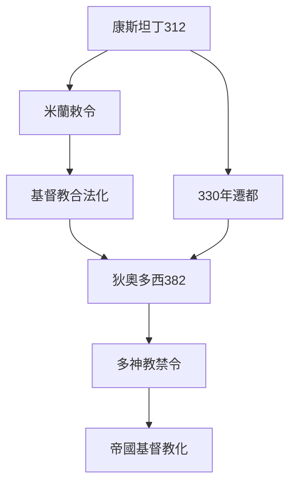
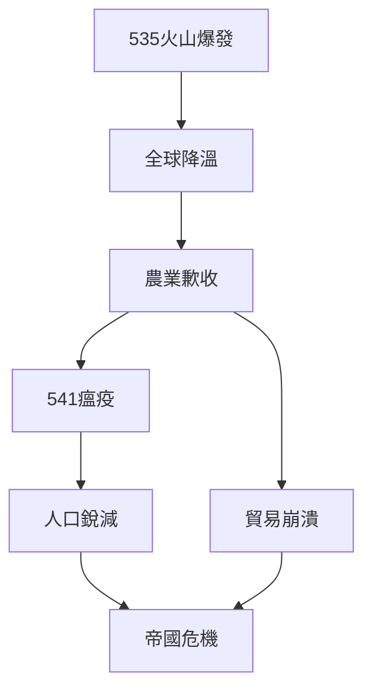
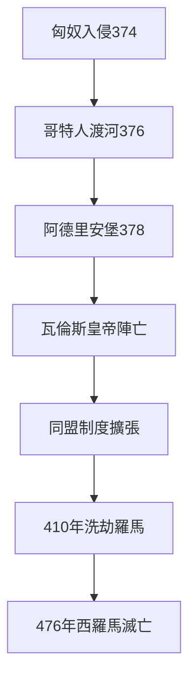
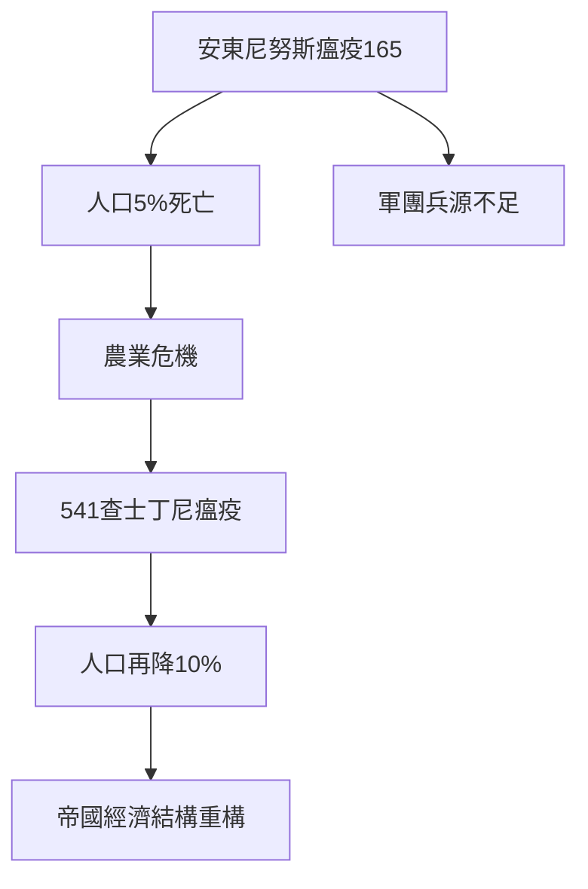
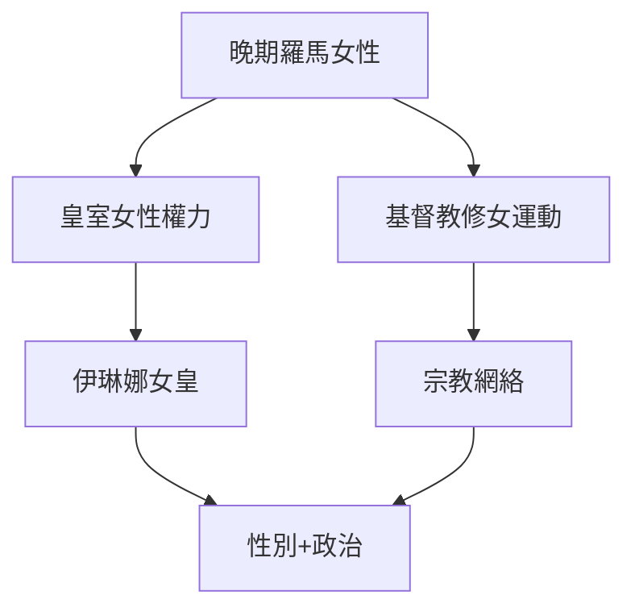
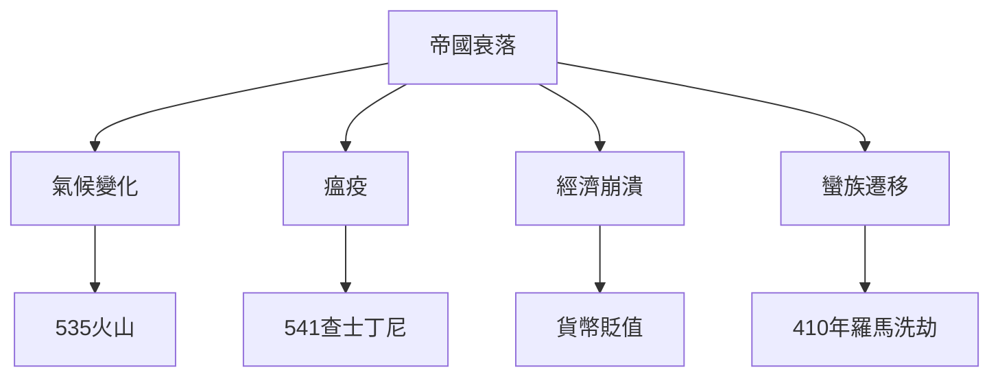
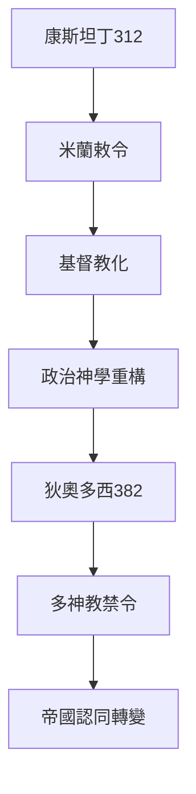
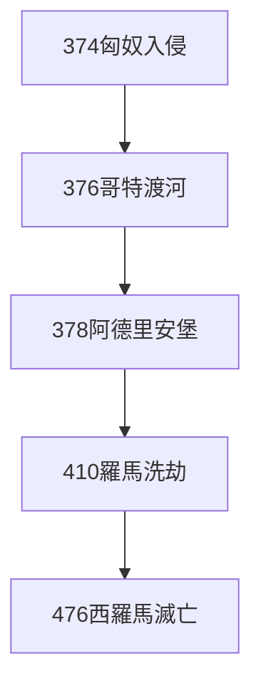
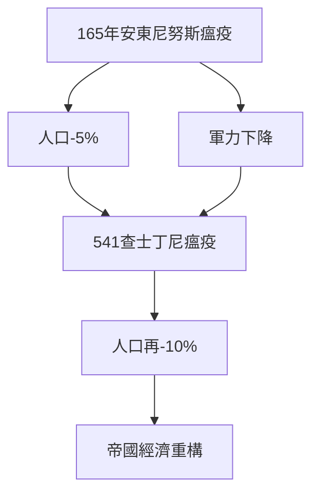
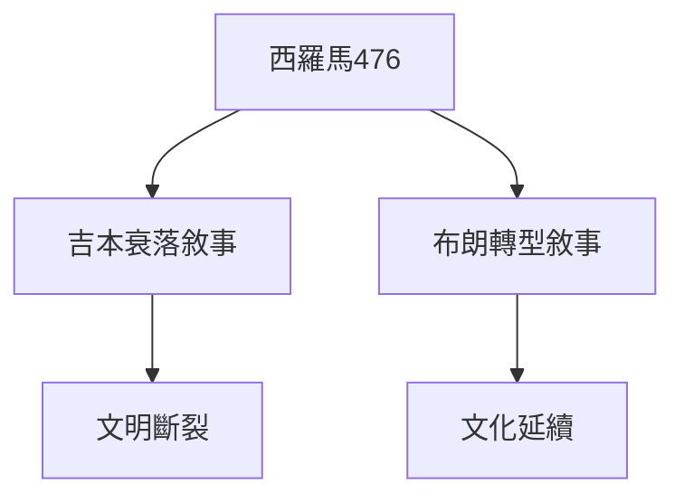

# Hist29 羅馬帝國的滅亡 / The Fall of the Roman Empire

**Instructor**: Prof. Michael McCormick
**Department**: History, Harvard
**Official source**: https://history.fas.harvard.edu/fall-courses
**Style**: research-based — 幽默、犀利、聚焦權力與武器如何塑造歷史

---

## 問題 1：5 個 SPECIFIC 核心心智模型
## What are the 5 core mental models every expert shares?

1. **康斯坦丁皈依與基督教帝國 / Constantine's Conversion and the Christian Empire**
   312年米蘭敕令承認基督教合法地位，330年康斯坦丁遷都君士坦丁堡——這兩件事共同標誌著羅馬帝國從多神宗教寬容轉向基督教一神論。Peter Brown (2012)追蹤了這個轉向如何重構了帝國的政治神學：從"羅馬皇帝的命運"（Fortuna）轉向"基督的代理人"。382年狄奧多西皇帝廢除所有多神教崇拜——羅馬從多元帝國轉變為基督教帝國。

   代表學者: Peter Brown, *Through the Eye of the Needle* (2012); Timothy Barnes, *Constantine* (2011); Michael McCormick, *Origins of the European Economy* (2001)

2. **經濟復甦、崩潰與氣候變化 / Economic Recovery, Collapse, and Climate Change**
   McCormick (2001)追蹤了古代晚期冰川冰芯數據，揭示了535-536年的火山寒冬——可能是冰島Hekla火山爆發——導致農業歉收、瘟疫蔓延（541年查士丁尼瘟疫高峰期每天死亡5000-10000人）和物資價格通脹。Kyle Harper (2017)則強調氣候危機和瘟疫是帝國衰落的根本驅動因素。

   代表學者: Michael McCormick, *Origins of the European Economy* (2001); Kyle Harper, *The Fate of Rome* (2017); Walter Scheidel, *The Great Leveler* (2017)

3. **蠻族遷移的微觀史 / Micro-history of Barbarian Migration**
   374年匈奴入侵導致哥特人跨越多瑙河，378年阿德里安堡戰役（8月9日）中羅馬軍團首次被遊牧軍隊擊敗——這個細節揭示了"蠻族入侵"並非單一事件，而是持續一個世紀的多元遷移過程。Peter Heather追蹤了哥特人如何在羅馬帝國內部形成自己的政治實體，最終在410年洗劫羅馬城。

   代表學者: Peter Heather, *The Fall of the Roman Empire* (2006); Bryan Ward-Perkins, *The Fall of Rome* (2005); Peter Heather, *Empires and Barbarians* (2009)

4. **瘟疫與人口重構 / Pandemic and Demographic Restructuring**
   165-180年的安東尼努斯瘟疫和541-549年的查士丁尼瘟疫，分別殺死了帝國5-10%的人口。542年高峰期君士坦丁堡每天死亡5000-10000人——這些數字重構了帝國的城市化水平和農業勞動力結構。Walter Scheidel (2017) 追蹤了瘟疫如何成為羅馬帝國"人生而不平等"的最終平衡器。

   代表學者: Walter Scheidel, *The Great Leveler* (2017); Kyle Harper, *The Fate of Rome* (2017); Josiah Novosad, Roman demography studies

5. **女性與權力的重構 / Women and the Reconstruction of Power**
   晚期羅馬帝國到拜占庭初期，女性統治者——包括索菲亞女皇（565-602）和伊琳娜女皇（797-802）——的出現挑戰了性別秩序。Walter Pohl (2018)追蹤了這一時期女性如何在宗教和政治領域同時獲得和失去權力：中世紀早期女性宗教領袖（如Radegund of Poitiers）與世俗權力之間的複雜關係。

   代表學者: Walter Pohl, *Gender in Late Antiquity* (2018); Judith Herrin, *Women in Antiquity* (2016); Averil Cameron, *Continuity and Change* (2000)

---

## 問題 2：3 個 SPECIFIC 根本分歧
## What are the 3 fundamental disagreements in this field?

### 分歧 1：衰落 vs 轉型 / Decline or Transformation
**核心問題**: 羅馬帝國是"衰落"了還是經歷了"轉型"為中世紀文明？

- **一方觀點 / Side A**: 衰落 — 標準的"吉本敘事"（Gibbon, 1776）：道德腐敗、經濟崩潰、軍事失敗三層疊加；西羅馬帝國476年的政治崩潰是毋庸置疑的事實
- **另一方觀點 / Side B**: 轉型 — Peter Brown的"古代晚期"框架：帝國的多元文化在蠻族王國中延續，只是政治形式改變了；拜占庭帝國一直存在到1453年

### 分歧 2：基督教 — 原因還是症狀？/ Christianity — Cause or Symptom?
**核心問題**: 基督教成為帝國國教是羅馬衰落的根本原因，還是帝國危機的精神回應？

- **一方觀點 / Side A**: 原因 — 吉本經典論點：基督教軟化了公民美德，將焦點轉向來世；皇帝的"神聖化"被廢除導致政治合法性危機
- **另一方觀點 / Side B**: 症狀 — 基督教是帝國危機的適應機制，提供了新的社會整合方式；Peter Brown認為基督教提供了帝國危機時期的"社會凝膠"

### 分歧 3：環境 vs 人為 / Environmental vs Human Causes
**核心問題**: 羅馬帝國的終結多大程度上是由環境災難（氣候、瘟疫）而非人為因素（政策錯誤、階級矛盾）造成的？

- **一方觀點 / Side A**: 環境 — Harper (2017) 證明535年火山寒冬和541年查士丁尼瘟疫是主要驅動因素，人類決策只是加速或延緩了這一過程
- **另一方觀點 / Side B**: 人為 — Ward-Perkins (2005) 認為經濟政策失誤和軍事失敗才是決定性的；帝國晚期貨幣貶值（從純金到鍍金）顯示了國家財政的系統性破產

---

## 問題 3：10 個 PROBING 深度問題
## 10 deep questions that distinguish real understanding from memorization

1. 為什麼 **康斯坦丁皈依** 是理解 羅馬帝國的滅亡 的核心前提？
2. 在 **ca. 300-700** 中，**經濟崩潰與氣候變化** 與 **蠻族遷移** 的張力如何產生了最具爭議的歷史轉折？
3. 如果把 **瘟疫與人口重構** 抽離，羅馬帝國的滅亡 的核心邏輯會怎樣變化？
4. 哪位歷史人物、事件或文本最能代表 **女性與權力的重構** 的極致展現？
5. 學者之間關於 **衰落 vs 轉型** 的爭論，在多大程度上反映了史料 vs 意識形態？
6. 在 **ca. 300-700** 中，**環境因素** 與 **人為因素** 的歷史後果，哪個對當代的影響更深？
7. 對 羅馬帝國的滅亡 而言，"吉本框架"是分析的核心還是限制？
8. 如果你是康斯坦丁，面對 **基督教** 與 **傳統多神教** 的衝突，你的優先選擇是什麼？
9. 當代哪些政治現象是 **羅馬帝國衰落** 話語的延續或反動？
10. 在氣候危機時代，**環境變化導致帝國崩潰** 的歷史框架是否為當代提供了警示？

---

# 核心心智模型深化（中英對照）

## 1. 康斯坦丁皈依 — Constantine's Conversion

### 1.1 Bilingual
| 英文 | 中文 | 含義 | 事件 |
|---|---|---|---|
| Edict of Milan | 米蘭敕令 | 312年宗教自由 | 康斯坦丁與李錫尼共同頒布 |
| Move to Constantinople | 遷都君士坦丁堡 | 330年 | 新首都，基督教城市 |
| Theodosius I | 狄奧多西一世 | 382年廢除多神教 | 帝國基督教化完成 |
| Christianization | 基督教化 | 4-5世紀 | 修道院、教堂興建 |

### 1.3 犀利觀察
康斯坦丁皈依基督教的真實動機至今仍是歷史學家的謎題：是宗教信仰？是政治計算（基督教會的組織力量）？還是兩者兼有？但無論動機如何，312年米蘭敕令之後，基督教從地下宗教變成了帝國意識形態——這個轉向塑造了歐洲1500年的歷史。

### 1.4 Deep Q
1. 如果康斯坦丁沒有皈依基督教，而是選擇重新統一多神教帝國，歐洲歷史會走向何方？
2. 狄奧多西（382年）的多神教禁令是宗教迫害還是歷史必然？

### 1.5 Mermaid

---

## 2. 經濟崩潰與氣候變化 — Economic Collapse and Climate Change

### 2.1 Bilingual
| 英文 | 中文 | 含義 | 數據 |
|---|---|---|---|
| LALIA | 小冰河時代 | 535-545年 | 火山寒冬 |
| Justinian Plague | 查士丁尼瘟疫 | 541-549年 | 帝國人口10%死亡 |
| Debasement | 貨幣摻假 | 晚期帝國 | 從純金到鍍金 |
| Trade collapse | 貿易崩潰 | 400-700年 | 地中海經濟一體化瓦解 |

### 2.3 犀利觀察
535年的"火山寒冬"——可能是冰島Hekla火山爆發——將全球氣溫降低了2-3度，持續了18個月。這不是人類歷史的偶然，而是地球氣候系統的自然波動。這個事件告訴我們：帝國的命運不僅掌握在人類手中，也掌握在地球手中。

### 2.4 Deep Q
1. 如果535年火山爆發沒有發生，帝國的衰落是否可以避免？
2. 查士丁尼瘟疫（541年）高峰期死亡人數（每天5000-10000）的估算依據是什麼？

### 2.5 Mermaid

---

## 3. 蠻族遷移 — Barbarian Migration

### 3.1 Bilingual
| 英文 | 中文 | 含義 | 事件 |
|---|---|---|---|
| Battle of Adrianople | 阿德里安堡戰役 | 378年8月9日 | 羅馬軍團首次被遊牧軍隊擊敗 |
| Crossing the Danube | 渡多瑙河 | 376年 | 哥特人渡河 |
| Sack of Rome 410 | 洗劫羅馬410年 | 410年8月24日 | 800年來首次 |
| foederati system | 同盟制度 | 帝國與蠻族協議 | 軍事+政治 |

### 3.3 犀利觀察
378年阿德里安堡戰役——羅馬軍團首次被遊牧軍隊正面擊敗——西羅馬帝國的弗拉維烏斯·瓦倫斯皇帝在戰場上被殺。這不是歷史的偶然：這是帝國軍團體制僵化、騎兵戰術落後於遊牧軍隊的系統性失敗的結果。

### 3.4 Deep Q
1. 為什麼410年洗劫羅馬城是西歐歷史上最具象徵意義的事件之一？它象徵了什麼？
2. "同盟制度"（foederati）是帝國的無奈讓步還是務實的政治智慧？

### 3.5 Mermaid

---

## 4. 瘟疫與人口重構 — Pandemic and Demographic Restructuring

### 4.1 Bilingual
| 英文 | 中文 | 含義 | 數據 |
|---|---|---|---|
| Antonine Plague | 安東尼努斯瘟疫 | 165-180年 | 帝國人口5% |
| Justinian Plague | 查士丁尼瘟疫 | 541-549年 | 帝國人口10% |
| Constantinople peak | 君士坦丁堡高峰期 | 542年 | 每天5000-10000人死亡 |
| Labor shortage | 勞動力短缺 | 瘟疫後果 | 農業危機 |

### 4.3 犀利觀察
查士丁尼瘟疫（541-549年）在高峰期（542年）使君士坦丁堡每天死亡5000-10000人——這個數字意味著帝國最大城市在幾個月內失去了相當大比例的人口。更重要的是：農業勞動力的短缺重構了帝國的土地制度和階級關係。

### 4.5 Mermaid

---

## 5. 女性與權力 — Women and Power

### 5.1 Bilingual
| 英文 | 中文 | 含義 | 人物 |
|---|---|---|---|
| Pulcheria Augusta | 普爾喀麗婭 | 399-453年 | 狄奧多西皇帝之妹，實際統治者 |
| Theodora | 狄奧多拉 | 527-548年 | 拜占庭女皇，與查士丁尼共同執政 |
| Irene of Athens | 伊琳娜 | 797-802年 | 廢子自立為女皇 |

### 5.3 犀利觀察
伊琳娜女皇（797-802年）在兒子君士坦丁六世被宮廷政變推翻後自立為皇——她成為羅馬歷史上第一個（約800年來）正式以自己名字統治的女性皇帝。教皇利奧三世因此拒絕承認她的合法性——這是歐洲歷史上性別與宗教權力交織的最早期案例之一。

### 5.5 Mermaid

---

# 深度自測問題（精要）

## 1-5 分析框架
運用長時段結構主義（longue durée）和環境歷史方法，結合Peter Brown的"古代晚期"框架和吉本的經典衰落敘事，進行批判性分析。

## 6-10 當代迴響
- 環境歷史框架與當代氣候危機的類比
- 瘟疫與全球化的當代對照（COVID-19）
- 羅馬衰落話語在當代政治中的使用（如比較美國和羅馬帝國）

---

# 5 個 Mermaid 圖解

## 圖 1：羅馬帝國衰落的多元因素

## 圖 2：康斯坦丁基督教化的政治後果

## 圖 3：蠻族遷移與帝國瓦解的時間線

## 圖 4：兩次大瘟疫的人口影響

## 圖 5：衰落vs轉型的兩種歷史敘事

---

## 總結 / Summary

羅馬帝國的滅亡（Hist29: The Fall of the Roman Empire）是理解 **ca. 300-700** 歷史的關鍵窗口。

**三大核心收穫**:
1. **康斯坦丁皈依與基督教帝國** — Peter Brown, *Through the Eye of the Needle* (2012)
2. **經濟崩潰與氣候變化** — Kyle Harper, *The Fate of Rome* (2017); Michael McCormick, *Origins of the European Economy* (2001)
3. **蠻族遷移的微觀史** — Peter Heather, *The Fall of the Roman Empire* (2006)

**終極問題**: 
在 羅馬帝國的滅亡 的漫長歷史中，我們看到的是文明的週期性，還是結構性的帝國崩潰？這個問題的答案，決定了我們如何理解當代帝國的命運。

**推薦閱讀**:
- Peter Brown, *Through the Eye of the Needle* (2012)
- Kyle Harper, *The Fate of Rome* (2017)
- Peter Heather, *The Fall of the Roman Empire* (2006)
- Bryan Ward-Perkins, *The Fall of Rome* (2005)
- Walter Scheidel, *The Great Leveler* (2017)
