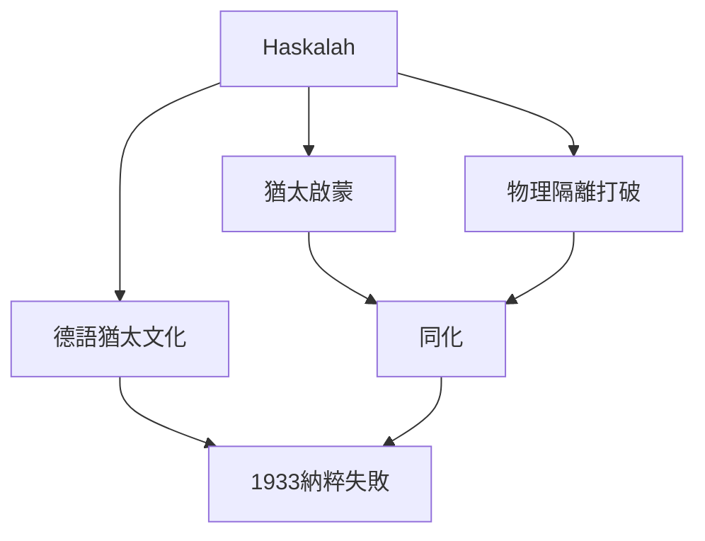
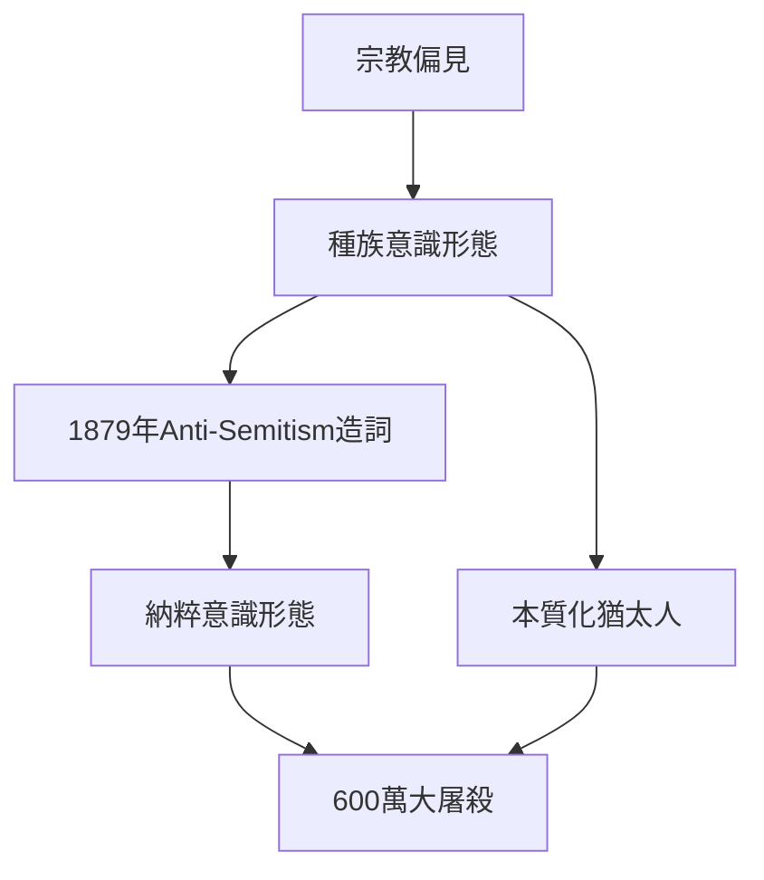
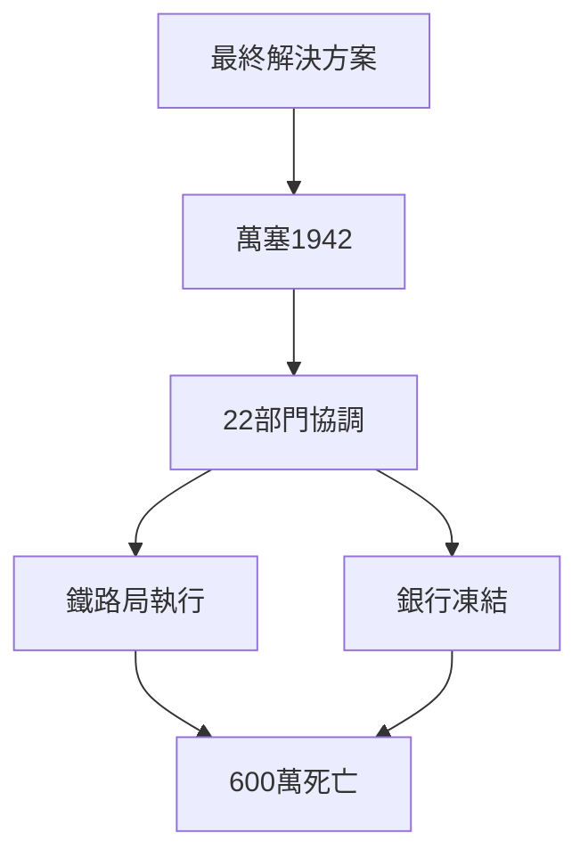
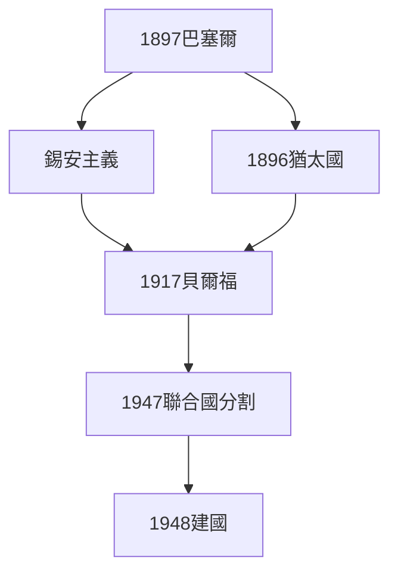
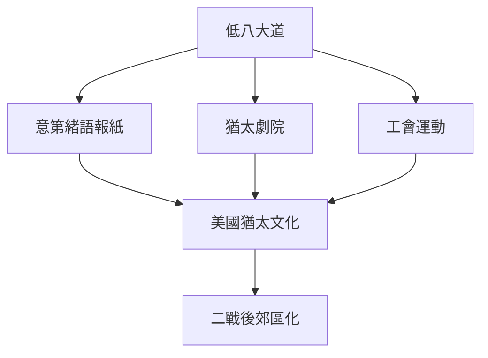
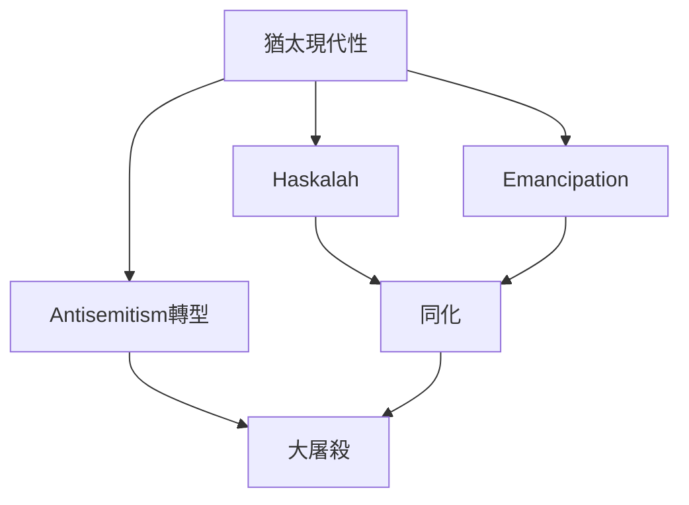
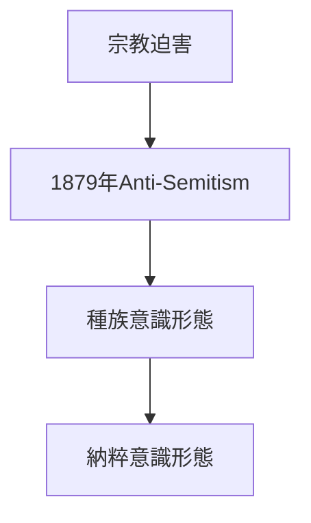
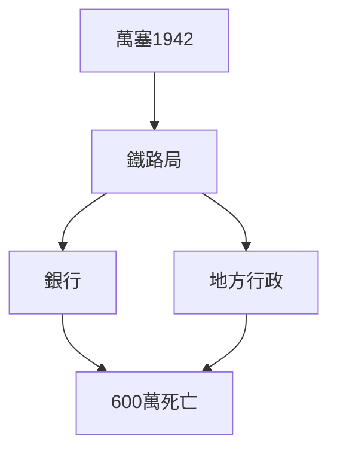
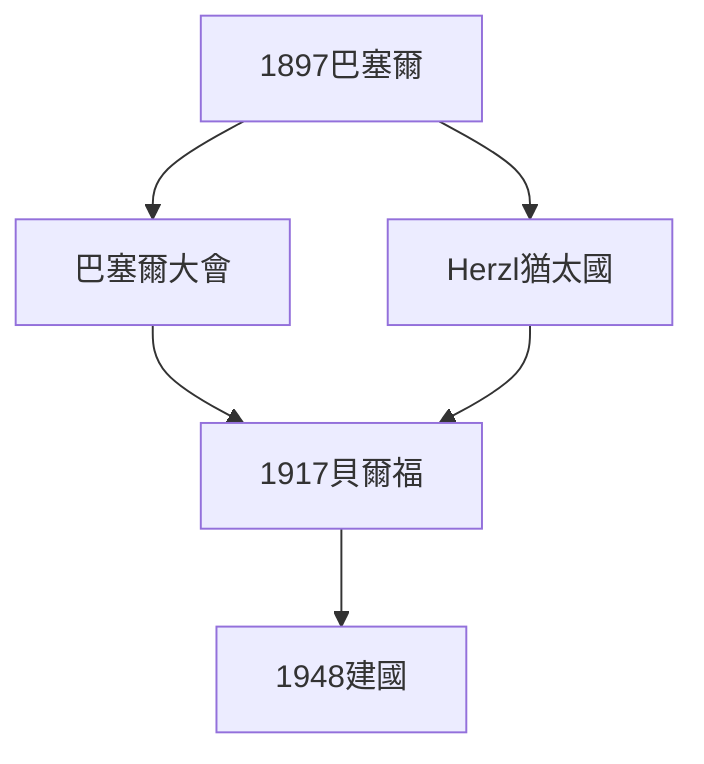
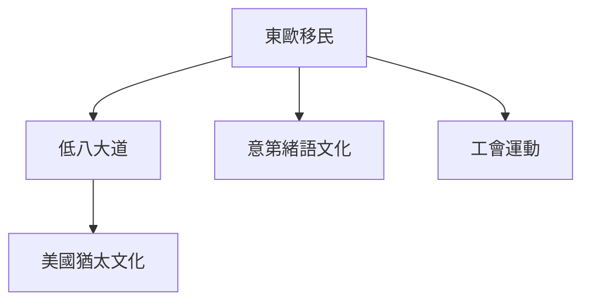

# Hist39 現代世界的猶太人 / Jews in the Modern World

**Instructor**: Prof. Derek Penslar
**Department**: History, Harvard
**Official source**: https://cjs.fas.harvard.edu/academics/courses/courses-fall-2025/hist-39-jews-in-the-modern-world/
**Style**: research-based — 幽默、犀利、聚焦權力與武器如何塑造歷史

---

## 問題 1：5 個 SPECIFIC 核心心智模型

1. **現代性對猶太社會的衝擊 / Impact of Modernity on Jewish Society**
   18世紀歐洲啟蒙運動（Haskalah）打破了猶太隔離區（Ghetto）的物理和精神圍牆。Moses Mendelssohn（1729-1786）代表"融入"路線，試圖證明猶太教與德國文化完全相容——這個實驗在1933年悲劇性地失敗了。David Sorkin追蹤了這場"猶太啟蒙"如何在柏林、維也納和布拉格形成獨特的"德語猶太文化"（Deutsch-Jüdische Kultursprache）。

   代表學者: David Sorkin, *The Transformation of Jewish Identity* (1987); Todd Endelman, *The Jews of Britain* (2002)

2. **反猶太主義的現代轉型 / Modern Transformation of Antisemitism**
   1879年威廉·馬爾的《猶太問題的解決》首次創造"Anti-Semitism"一詞，將宗教偏見升級為種族意識形態——這標誌著現代種族主義反猶太主義的誕生。Hannah Arendt (1951)追蹤了這種意識形態如何最終通向滅絕政治，並在《艾希曼在耶路撒撒冷》(1963)中記錄了"平庸的惡"的哲學意義。

   代表學者: Hannah Arendt, *The Origins of Totalitarianism* (1951); Robert Wistrich, *Antisemitism* (2001); Omar Bartov

3. **大屠殺的系統性分析 / Systematic Analysis of the Holocaust**
   Raul Hilberg的三卷本《納粹滅絕機器》(1961, 2003) 揭示大屠殺如何動員了整個國家機器：鐵路時刻表精確到分鐘，納粹統計局追蹤每個"處理"地點的效率。1942年萬塞會議（1月20日）的15克協調會議記錄（2017年解密）顯示：22個政府部門代表參與了600萬猶太人的滅絕協調。

   代表學者: Raul Hilberg, *The Destruction of the European Jews* (2003); Saul Friedlander, *Nazi Germany and the Jews* (2008); Ian Kershaw, *Hitler* (2008)

4. **錫安主義與以色列建國 / Zionism and the Founding of Israel**
   1897年巴塞爾錫安主義大會（600名代表）標誌著猶太民族主義運動的誕生。Theodor Herzl的《猶太國》(1896)將猶太人從宗教共同體重構為政治民族。1948年5月14日以色列建國的歷史正當性至今仍充滿爭議——Benny Morris的《1948》(2008)等修正主義史學與傳統錫安主義史學之間存在尖銳對立。

   代表學者: Derek Penslar, *Zionism and Technocracy* (2022); Benny Morris, *1948* (2008); Nur Masalha, *The Palestine Expedition* (2012)

5. **美國猶太人的同化與創新 / American Jewish Assimilation and Creativity**
   1880-1920年200萬東歐猶太人移居美國，在低八大道（Lower East Side）建立了可能是歷史上密度最高的猶太文化生產基地：報紙、劇院、工會、社區組織——這些創新徹底改變了猶太人在美國的文化影響力。Hasia Diner追蹤了這種"美國猶太例外論"如何與歐洲猶太歷史形成尖銳對照。

   代表學者: Hasia Diner, *The Jews of the United States* (2004); Eli Lederhendler, *American Jewish History* (2009)

---

## 問題 2：3 個 SPECIFIC 根本分歧

### 分歧 1：現代化 vs 同化 / Modernization vs Assimilation
**核心問題**: 猶太人接受現代性是否必然意味著放棄猶太文化認同？

- **A**: 必然 — 世俗化是現代化的前提，宗教將退居私人領域；Haskalah運動的目標就是"正常化"
- **B**: 可選 — 美國猶太人展示了"多元認同"的可能：既是猶太人也是美國人，且兩者並不衝突

### 分歧 2：錫安主義 — 解放還是殖民主義？/ Zionism — Liberation or Colonialism?
**核心問題**: 以色列建國運動是猶太民族的民族解放運動，還是歐洲殖民主義在中東的延伸？

- **A**: 解放 — 歐洲反猶主義證明猶太人需要自己的民族國家才能保障安全；錫安主義是19世紀民族主義運動的合理組成部分
- **B**: 殖民 — 巴勒斯坦的土地所有權數據顯示錫安主義定居者運動與歐洲殖民邏輯相同；Edward Said的《巴勒斯坦問題》(1979)開創了後殖民批判

### 分歧 3：大屠殺記憶政治 / Memory Politics of the Holocaust
**核心問題**: 大屠殺記憶在當代公共話語中應該扮演什麼角色？

- **A**: 普世 — "不再重演"是對所有人的道德命令；反猶太主義在歐洲和美國的復甦證明大屠殺記憶有其現實政治功能
- **B**: 特殊 — 大屠殺的獨特性（Shoah）不能被泛化，否則會淡化其独特历史意义；過度政治化大屠殺記憶會成為以色列外交政策的工具

---

## 問題 3：10 個 PROBING 深度問題

1. 為什麼 **現代性對猶太社會的衝擊** 是理解 現代世界的猶太人 的核心前提？
2. 在 **1650-present** 中，**反猶太主義的現代轉型** 與 **大屠殺的系統性** 的張力如何產生了最具爭議的歷史轉折？
3. 如果把 **錫安主義與以色列建國** 抽離，現代世界猶太人 的核心邏輯會怎樣變化？
4. 哪位歷史人物、事件或文本最能代表 **美國猶太人的同化與創新** 的極致展現？
5. 學者之間關於 **錫安主義 vs 殖民主義** 的爭論，在多大程度上反映了史料 vs 意識形態？
6. 在 **1650-present** 中，**反猶太主義** 與 **大屠殺記憶政治** 的歷史後果，哪個對當代的影響更深？
7. 對 現代世界的猶太人 而言，"受害者"身份是分析的起點還是限制？
8. 如果你是19世紀的東歐猶太知識分子，面對 **現代化** 與 **傳統宗教** 的衝突，你的優先選擇是什麼？
9. 當代哪些政治現象是 **反猶太主義現代轉型** 的延續或反動？
10. 在後殖民主義時代，**錫安主義** 的歷史解釋話語權屬於誰？

---

# 核心心智模型深化（中英對照）

## 1. 現代性對猶太社會的衝擊 — Impact of Modernity

### 1.1 Bilingual
| 英文 | 中文 | 含義 | 核心數據 |
|---|---|---|---|
| Haskalah | 猶太啟蒙運動 | 18世紀德國猶太世俗化 | Mendelssohn |
| Emancipation | 猶太解放 | 西歐各國猶太公民權 | 1791法國-1871德國 |
| Ghetto | 隔離區 | 威尼斯1516-1797 | 物理隔離制度 |
| assimilation | 同化 | 融入主流社會 | 德語猶太文化 |

### 1.3 袁騰飛式犀利觀察
Moses Mendelssohn是18世紀最著名的猶太知識分子——他在柏林與康德、萊辛同桌論哲學，他的臉被印刷在茶葉罐上。但他的女兒約Josephine在1834年皈依基督教後，她的猶太丈夫仍然被普魯士法律禁止在普魯士境內定居。這個細節說明：猶太啟蒙的承諾從未完全兌現。

### 1.5 Mermaid

---

## 2. 反猶太主義的現代轉型 — Modern Transformation of Antisemitism

### 2.1 Bilingual
| 英文 | 中文 | 含義 | 核心事件 |
|---|---|---|---|
| Anti-Semitism | 反猶太主義 | 1879年威廉·馬爾造詞 | 種族意識形態 |
| Racial antisemitism | 種族性反猶太主義 | 宗教→種族 | 納粹意識形態基礎 |
| Protocols of Elders | 錫安賢人議定書 | 1905年偽造文件 | 20世紀最暢銷阴谋論 |
| Holocaust inversion | 大屠殺逆轉 | 當代反猶太主義話語 | 陰謀論話語 |

### 2.3 袁騰飛式犀利觀察
1879年威廉·馬爾創造"反猶太主義"（Anti-Semitism）一詞——這不僅是術語的發明，而是認識論的革命：它將猶太人從宗教類別轉化為種族類別。宗教偏見是可以通過教育和接觸改變的，但"種族特性"是本質的、不可改變的。這就是現代種族主義反猶太主義比中世紀宗教迫害更危險的原因。

### 2.5 Mermaid

---

## 3. 大屠殺的系統性 — Systematic Nature of the Holocaust

### 3.1 Bilingual
| 英文 | 中文 | 含義 | 數據 |
|---|---|---|---|
| Wannsee Conference | 萬塞會議 | 1942年1月20日 | 15部門協調 |
| Final Solution | 最終解決方案 | 600萬猶太人滅絕 | 1942-1945 |
| Einsatzgruppen | 特遣隊 | 東歐大規模槍殺 | 100萬+ |
| Perpetrator research | 加害者研究 | 施害者動機分析 | Goldhagen 1996 |

### 3.3 袁騰飛式犀利觀察
大屠殺的真正恐怖不在於納粹的意識形態，而在於整個歐洲行政體系的配合。Hilberg (2003)揭示：沒有德意志鐵路局的時刻表、沒有銀行職員的財產凍結、沒有地方政府的人口統計，大屠殺不可能如此高效。這是現代官僚制度的悲劇性頂峰。

### 3.5 Mermaid

---

## 4. 錫安主義與以色列建國 — Zionism and the Founding of Israel

### 4.1 Bilingual
| 英文 | 中文 | 含義 | 事件 |
|---|---|---|---|
| Basel Congress | 巴塞爾大會 | 1897年 | 錫安主義運動誕生 |
| Balfour Declaration | 貝爾福宣言 | 1917年 | 英國支持猶太家園 |
| UN Partition Plan | 聯合國分割方案 | 1947年11月29日 | 1817號決議 |
| Israel Independence | 以色列建國 | 1948年5月14日 | 阿拉伯聯盟反對 |

### 4.3 袁騰飛式犀利觀察
1897年巴塞爾錫安主義大會，Theodor Herzl預言："在巴塞爾，我建立了猶太國……如果它現在還不存在，它遲早會存在。"55年後（1948年），這個預言成為了歷史。但歷史的諷刺在於：Herzl建立的是一個猶太民主國家，而今天的以色列在如何定義"猶太民主"問題上正處於深刻的內部危機。

### 4.5 Mermaid

---

## 5. 美國猶太人的同化與創新 — American Jewish Assimilation and Creativity

### 5.1 Bilingual
| 英文 | 中文 | 含義 | 數據 |
|---|---|---|---|
| Lower East Side | 低八大道 | 紐約猶太文化中心 | 1880-1920 |
| Forward newspaper | 前進報 | 1897年創刊 | 意第緒語左翼報紙 |
| Yiddish theater | 意第緒語劇院 | 1880年代 | 紐約百老匯前身 |
| Jewish exceptionalism | 猶太例外論 | 美國模式 | 高教育水平 |

### 5.3 袁騰飛式犀利觀察
低八大道是20世紀初地球上文化密度最高的空間之一：每隔三個街口就有一份意第緒語報紙，每週有新的劇院演出，每個社區都有自己的工會和互助組織。這些在不到50年的時間裡創造了現代美國猶太文化——然後這個文化本身在二戰後的郊區化中被"正常化"了。

### 5.5 Mermaid

---

# 深度自測問題詳解（精要）

## 1-5: 分析框架
運用比較歷史學（大屠殺研究）、後殖民批判（錫安主義）和身份政治理論，分析現代猶太歷史中的核心矛盾。

## 6-10: 當代迴響
- 反猶太主義在歐美復甦的歷史根源
- 大屠殺記憶政治與當代以色列外交政策
- 錫安主義vs反錫安主義話語在當代大學校園的政治化

---

# 5 個 Mermaid 圖解

## 圖 1：猶太現代性的歷史結構

## 圖 2：反猶太主義從宗教到種族的轉型

## 圖 3：大屠殺的官僚滅絕系統

## 圖 4：錫安主義運動的歷史結構

## 圖 5：美國猶太文化的形成

---

## 總結 / Summary

現代世界的猶太人（Hist39: Jews in the Modern World）是理解 **1650-present** 歷史的關鍵窗口。

**三大核心收穫**:
1. **現代性對猶太社會的衝擊** — David Sorkin, *The Transformation of Jewish Identity* (1987)
2. **反猶太主義的現代轉型** — Hannah Arendt, *The Origins of Totalitarianism* (1951)
3. **大屠殺的系統性** — Raul Hilberg, *The Destruction of the European Jews* (2003)

**終極問題**: 
在 現代世界猶太人 的漫長歷史中，我們看到的是受害者的悲劇，還是歷史能動性的勝利？這個問題的答案，決定了我們如何理解當代的身份政治。

**推薦閱讀**:
- David Sorkin, *The Transformation of Jewish Identity* (1987)
- Hannah Arendt, *The Origins of Totalitarianism* (1951)
- Raul Hilberg, *The Destruction of the European Jews* (2003)
- Derek Penslar, *Zionism and Technocracy* (2022)
- Hasia Diner, *The Jews of the United States* (2004)
