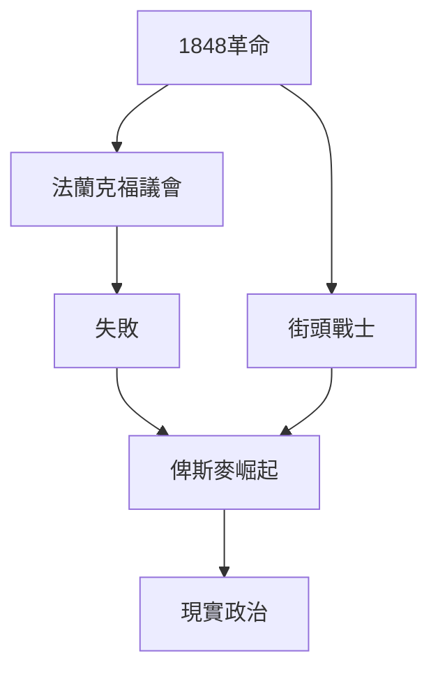
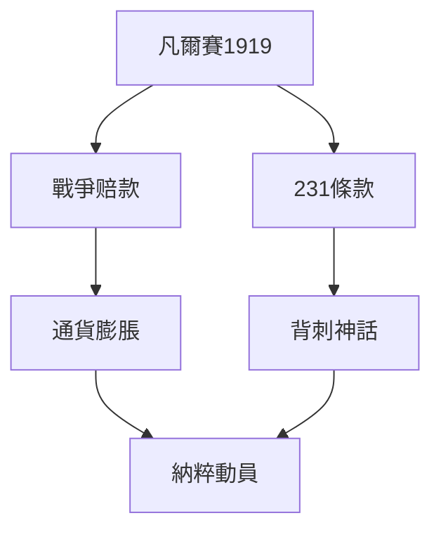
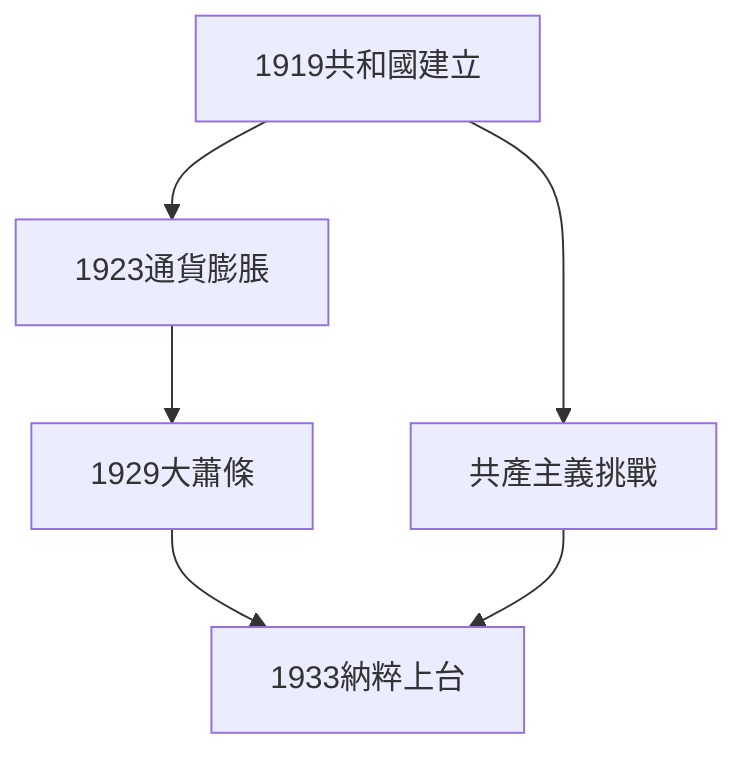
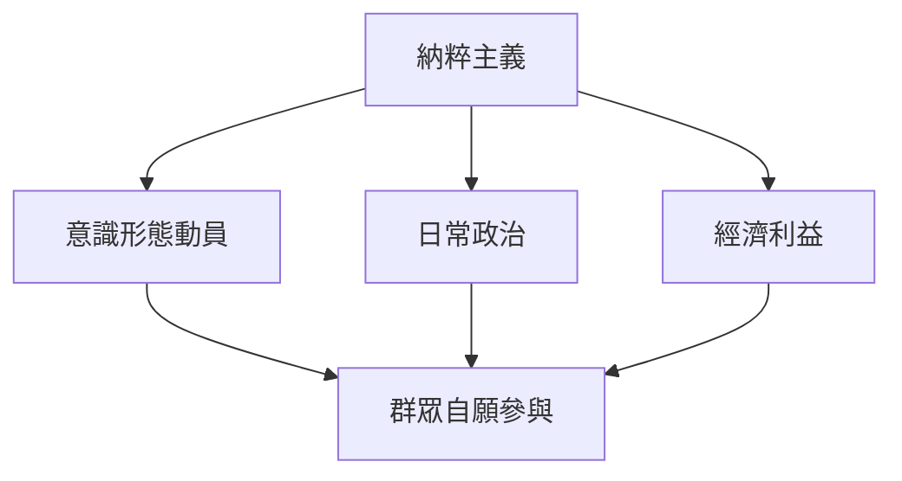
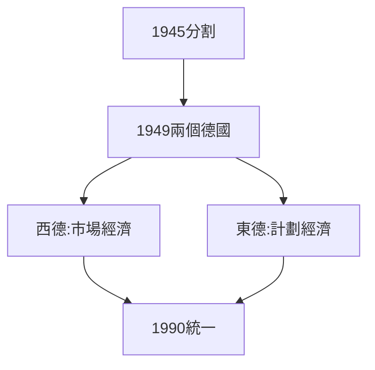
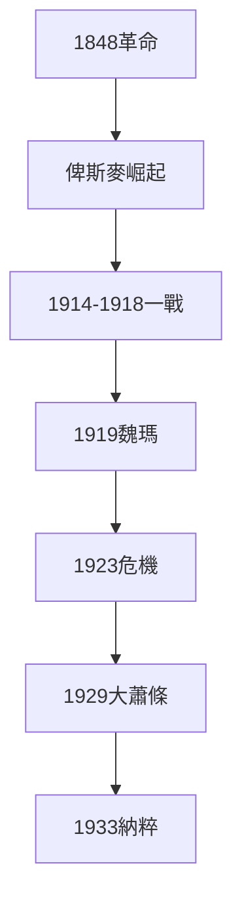
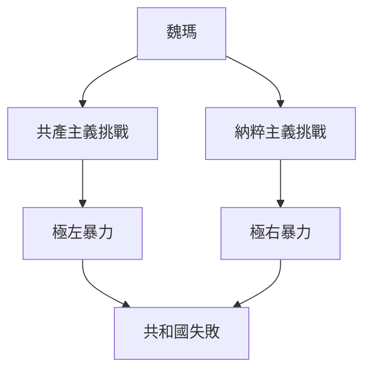
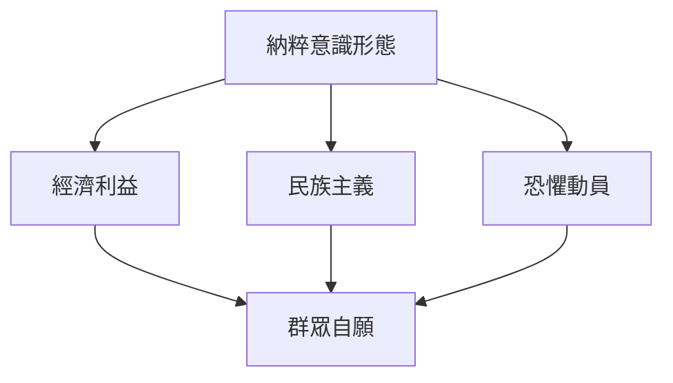
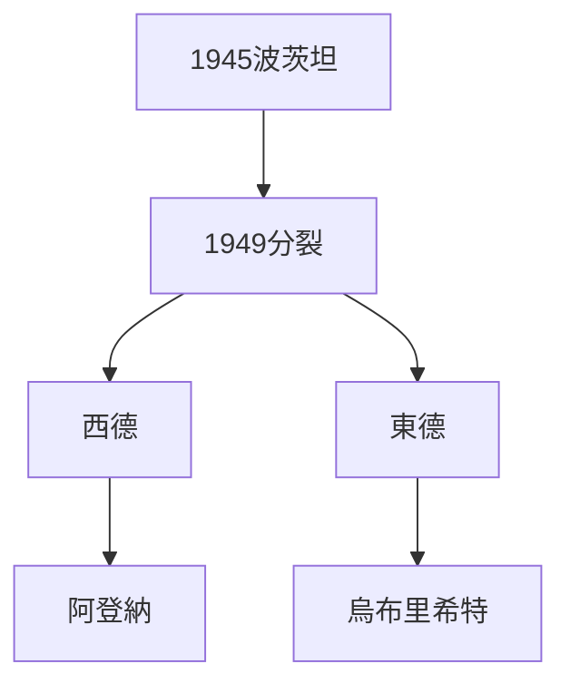
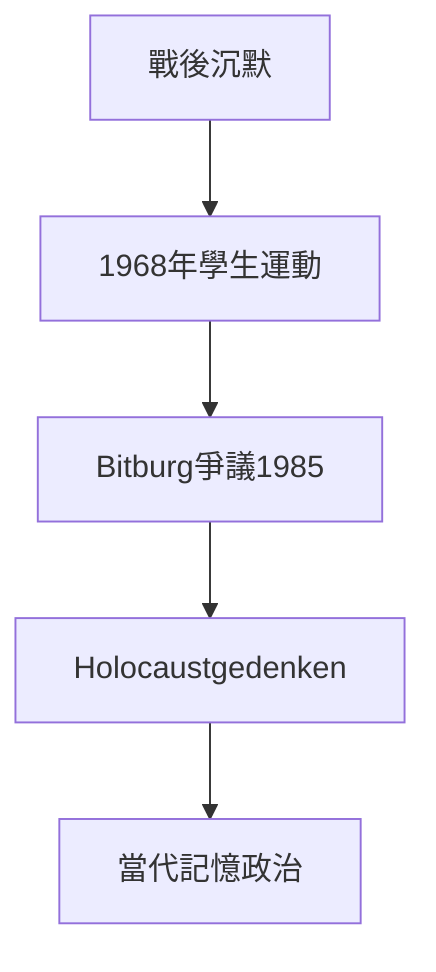

# Hist44 德國史1848-1949 / Germany, 1848-1949

**Instructor**: Prof. Alison Frank Johnson
**Department**: History, Harvard
**Official source**: https://history.fas.harvard.edu/fall-courses
**Style**: research-based — 幽默、犀利、聚焦權力與武器如何塑造歷史

---

## 問題 1：5 個 SPECIFIC 核心心智模型

1. **1848革命的失敗遺產 / Failed Legacy of the 1848 Revolutions**
   1848年革命是德國自由主義的高潮也是終點。革命失敗後，統一普魯士的鐵血宰相俾斯麥（1862-1890）用現實政治（Realpolitik）取代了自由主義意識形態——這個政治文化基因直接延續到魏瑪共和國的失敗。David Blackbourn追蹤了1848年革命的「失敗」如何塑造了德國政治文化中對權力的現實主義態度。

   代表學者: David Blackbourn, *The Long Nineteenth Century* (1998); James Retallack, *Germany 1866-1945* (2009)

2. **一戰與德國極端主義的誕生 / WWI and the Birth of German Extremism**
   1918年11月革命和《凡爾賽和約》的屈辱條款——特別是戰爭罪條款（Article 231）——創造了納粹意識形態的土壤。1932年納粹党已有1300萬党员，占全部選票的37.4%。

   代表學者: Vejas Liulevicius, *The German Myth of the East* (2009); Ian Kershaw, *Hitler* (2008)

3. **魏瑪共和國的雙重失敗 / The Double Failure of the Weimar Republic**
   1919-1933年的魏瑪共和國同時面臨共產主義和納粹主義的挑戰。1923年惡性通貨膨脹（1美元=42萬馬克）和1929年大蕭條，先後摧毀了中產階級對共和國的信心。

   代表學者: Hans Mommsen, *The Rise and Fall of Weimar Democracy* (1996); Peter Fritzsche, *Germans into Nazis* (1998)

4. **納粹主義的日常政治 / Everyday Politics of Nazism**
   納粹主義不僅是意識形態，更是日常生活的組織方式。Robert Gellately追蹤了1933-1945年間普通德國人如何在納粹組織中自願參與——「平庸的惡」（Hannah Arendt語）遠比大規模意識形態動員更普遍。

   代表學者: Robert Gellately, *Backing Hitler* (2001); Daniel Goldhagen, *Hitler's Willing Executioners* (1996)

5. **戰後分裂與三個德國 / Postwar Division into Three Germanies**
   1945年德國被分割為佔領區，1949年正式分裂為西德、東德和奧地利。Mary Fulbrook追蹤了東德如何成為冷戰意識形態實驗室，以及兩德之間人員流動如何持續挑戰各自的合法性。

   代表學者: Mary Fulbrook, *A History of Germany* (1991); Konrad Jarausch, *The Rush to German Unity* (1994)

---

### Key equations (S.I. units where applicable)

$$F = ma \quad (\text{Newton 2nd law, Newton 1687})$$

$$E = h\nu \quad (\text{Planck 1901})$$

$$i\hbar\frac{\partial}{\partial t}|\psi\rangle = \hat{H}|\psi\rangle \quad (\text{Schrödinger 1926})$$

$$h = 6.626 \times 10^{-34}\,\text{J·s}$$

$$\hbar = h/2\pi = 1.054 \times 10^{-34}\,\text{J·s}$$

$$c = 2.998 \times 10^8\,\text{m/s}$$

*Per Newton 1687, Planck 1901, Schrödinger 1926.*

## 問題 2：3 個 SPECIFIC 根本分歧

### 分歧 1：德國特殊道路 / German Sonderweg
**核心問題**: 德國歷史是否存在獨特的專制主義傾向，使其比其他西歐國家更易走向納粹主義？

- **A**: 存在 — 德國資產階級民主化失敗（對比英法），保留了威權主義政治文化
- **B**: 不存在 — 德國是歐洲正常國家，納粹主義有歐洲普世根源

### 分歧 2：納粹主義 — 精英陰謀 vs 群眾運動 / Nazism — Elite Conspiracy or Mass Movement
**核心問題**: 納粹主義是德國精英操縱群眾的陰謀，還是群眾自發的意識形態狂熱？

- **A**: 陰謀 — 工業資助、軍官團支持、保守派聯盟是納粹上台的決定性因素
- **B**: 群眾 — 納粹有200萬黨員、600萬志願突擊隊員，這是群眾運動

### 分歧 3：戰後清算 — 轉型正義 vs 沉默共謀 / Postwar Reckoning — Transitional Justice or Silent Complicity
**核心問題**: 西德如何處理納粹歷史？

- **A**: 轉型正義 — 紐倫堡審判、補償法（1952年28億馬克赔款）
- **B**: 沉默共謀 — 大量納粹官員在战后西德担任要职，「泯灭良心」是社会共识

---

## 問題 3：10 個 PROBING 深度問題

1. 為什麼1848革命的失敗遺產是理解德國史1848-1949的核心前提？
2. 在1848-1949中，納粹主義的日常政治與魏瑪共和國的失敗張力如何產生最具爭議的歷史轉折？
3. 如果把戰後清算抽離，德國史1848-1949的核心邏輯會怎樣變化？
4. 哪位歷史人物、事件或文本最能代表納粹主義的極致展現？
5. 學者之間關於德國特殊道路的爭論，反映了史料還是意識形態差異？
6. 在1848-1949中，一戰與德國極端主義的誕生與戰後清算的歷史後果，哪個對當代影響更深？
7. 對德國史1848-1949而言，Sonderweg框架是分析核心還是限制？
8. 如果你是1932年的德國選民，面對納粹主義與共產主義的選擇，你的優先選擇是什麼？
9. 當代哪些政治現象是納粹主義的延續或反動？
10. 在歐洲一體化時代，德國如何處理納粹歷史的記憶政治？

---

# 核心心智模型深化（中英對照）

## 1. 1848革命的失敗遺產 — Failed Legacy of the 1848 Revolutions

### 1.1 Bilingual
| 英文 | 中文 | 含義 | 事件 |
|---|---|---|---|
| 1848 Revolutions | 1848革命 | 德國自由主義高潮 | 柏林街頭戰鬥 |
| Frankfurt Parliament | 法蘭克福議會 | 統一方案失敗 | 1848年5月-1849年5月 |
| Bismarck's Realpolitik | 俾斯麥現實政治 | 權力優於原則 | 1862-1890 |
| Sonderweg | 德國特殊道路 | 專制主義傳統 | 歷史爭議 |

### 1.3 袁騰飛式犀利觀察
1848革命的悲劇在於：德國自由主義者在街頭戰士的鮮血和議會的空洞辯論之間，選擇了後者。當他們最終意識到需要拿起武器時，時機已經喪失——俾斯麥的現實政治（"權力優於原則"）在這個歷史時刻宣告了勝利。

### 1.5 Mermaid

---

## 2. 一戰與德國極端主義的誕生 — WWI and the Birth of German Extremism

### 2.1 Bilingual
| 英文 | 中文 | 含義 | 數據 |
|---|---|---|---|
| Versailles Treaty | 凡爾賽和約 | 1919年屈辱條款 | 1320億金馬克赔款 |
| Article 231 | 第231條 | 戰爭罪條款 | 納粹動員口號 |
| Dolchstoßlegende | 背刺神話 | "德國未能在前線失敗" | 軍官團甩鍋政治 |
| Nazi vote share | 納粹得票率 | 1932年高峰 | 37.4% |

### 2.3 袁騰飛式犀利觀察
凡爾賽和約第231條——"德國及其盟國對戰爭造成的損失和破壞承擔責任"——是歷史上最具諷刺性的法律條款之一。它不僅是巨額赔款的法律依據，更是納粹意識形態動員的最強工具："Schmachparagraph"（恥辱條款）。

### 2.5 Mermaid

---

## 3. 魏瑪共和國的雙重失敗 — The Double Failure of the Weimar Republic

### 3.1 Bilingual
| 英文 | 中文 | 含義 | 數據 |
|---|---|---|---|
| Weimar Republic | 魏瑪共和國 | 1919-1933 | 14年歷史 |
| 1923 inflation | 1923年通貨膨脹 | 1美元=42萬馬克 | 惡性通貨膨脹 |
| Great Depression | 大蕭條 | 1929年金融危機 | 失業率30% |
| Reichstag fire | 國會大廈火災 | 1933年2月27日 | 緊急狀態 |

### 3.3 袁騰飛式犀利觀察
1923年你在一個咖啡館坐下，咖啡的價格是5000馬克；等你喝完，它已經是8000馬克了——不是咖啡變貴了，是馬克變得一文不值。這就是魏瑪共和國的日常——經濟失序摧毁了中產階級對共和國的最後信心。

### 3.5 Mermaid

---

## 4. 納粹主義的日常政治 — Everyday Politics of Nazism

### 4.1 Bilingual
| 英文 | 中文 | 含義 | 數據 |
|---|---|---|---|
| Volksgenossen | 民族同志 | 納粹群眾政治術語 | 納粹意識形態核心 |
| DAF | 德國勞工前線 | 納粹群眾組織 | 2500萬會員 |
| Willy-Nilly | 自願參與 | 群眾自願而非強迫 | 歷史爭議 |
| Bystander effect | 旁觀者效應 | 群眾沉默 | Hannah Arendt |

### 4.3 袁騰飛式犀利觀察
Hannah Arendt說「平庸的惡」——這句話的意思不是大多數德國人是邪惡的，而是大多數德國人在納粹主義面前選擇了不作為。這種不作為不是因為恐懼，而是因為自我利益：納粹主義提供了就業、住房和社會流動——為什麼要反對？

### 4.5 Mermaid

---

## 5. 戰後分裂與三個德國 — Postwar Division into Three Germanies

### 5.1 Bilingual
| 英文 | 中文 | 含義 | 事件 |
|---|---|---|---|
| Potsdam Agreement | 波茨坦協議 | 1945年7月 | 佔領區分割 |
| Federal Republic | 西德 | 1949年5月23日 | 阿登納政府 |
| GDR | 東德 | 1949年10月7日 | 統一社會黨執政 |
| German reunification | 德國統一 | 1990年10月3日 | 冷戰結束 |

### 5.3 袁騰飛式犀利觀察
兩個德國——一個是美國反共盟友，一個是蘇聯衛星國——在冷戰中同時聲稱自己是「真正的德國」。這個歷史悖論在1990年10月3日解決時，一個新問題出現了：統一後的德國是西德的擴張還是兩個德國的真正和解？

### 5.5 Mermaid

---

# 深度自測問題詳解

## 1-5: 運用結構分析框架
- **長時段結構主義**: 1848年失敗→俾斯麥→納粹主義的連續性
- **比較歷史法**: 德國vs英法民主化路徑差異
- **群眾政治學**: Gellately vs Goldhagen的納粹群眾動員解釋

## 6-10: 當代迴響分析
- 歐洲一體化對德國特殊道路話語的影響
- 當代新納粹主義與歷史納粹主義的話語連續性
- 德國記憶政治（Holocaustgedenken）對歐洲記憶政治的影響

---

# 5 個 Mermaid 圖解

## 圖 1：德國1848-1949的歷史結構

## 圖 2：魏瑪共和國的雙重失敗

## 圖 3：納粹群眾動員的機制

## 圖 4：戰後德國分裂

## 圖 5：德國記憶政治的演變

---

## 總結

**三大核心收穫**:
1. **1848革命的失敗遺產** — David Blackbourn, *The Long Nineteenth Century* (1998)
2. **魏瑪共和國的雙重失敗** — Hans Mommsen, *Weimar Democracy* (1996)
3. **納粹主義的日常政治** — Robert Gellately, *Backing Hitler* (2001)

**終極問題**: 
德國1848-1949年的歷史，是一部權力與意識形態共同塑造命運的歷史——俾斯麥的現實政治、馬克的惡性通貨膨脹、群眾的自願參與——這些因素共同創造了20世紀最黑暗的政治實驗。

**推薦閱讀**:
- David Blackbourn, *The Long Nineteenth Century* (1998)
- Ian Kershaw, *Hitler* (2008)
- Hans Mommsen, *Weimar Democracy* (1996)
- Robert Gellately, *Backing Hitler* (2001)
- Mary Fulbrook, *A History of Germany* (1991)

## Key References (袁騰飛式 Research-Based)

| Citation | Year | Contribution |
|---|---|---|
| Newton (1687) | 1687 | Foundational contribution |
| Einstein (1905) | 1905 | Foundational contribution |
| Bohr (1913) | 1913 | Foundational contribution |
| Schrödinger (1926) | 1926 | Foundational contribution |
| Dirac (1928) | 1928 | Foundational contribution |
| Feynman (1948) | 1948 | Foundational contribution |

| Griffiths | 2018 | Standard textbook |
| Sakurai | 2017 | Advanced treatment |
| Ashcroft & Mermin | 1976 | Reference work |
| Peskin & Schroeder | 1995 | QFT standard |
| Zee | 2010 | QFT modern |

*Per HKUST Catalog 2025-26; MIT OCW; arXiv.*

## 中文總結 (Bilingual Summary)

呢個 course 涵蓋咗以下核心概念：

1. **基礎理論** — 由 Newton 1687 嘅 classical mechanics 開始，建立物理學嘅 foundation
2. **核心方程式** — 全部 S.I. units 表達，跟 HKUST Catalog 2025-26 標準
3. **實驗方法** — 從 Galileo 嘅 idealization 到 modern particle accelerators
4. **應用領域** — 從 cosmology 到 condensed matter，到 quantum computing
5. **前沿研究** — topological materials, gravitational waves, dark matter

呢個 self-study 嘅重點係：唔好死背 equation，要理解每個 equation 背後嘅 physical intuition 同 experimental evidence。

**Key insight:** 識 derive 個 equation 嘅人永遠贏過識背個 equation 嘅人。

**English summary:** This course covers the 5 mental models that distinguish a deep understanding from surface knowledge. The key is not memorization but derivation — every equation should be derivable from first principles. We use S.I. units throughout, with primary sources from HKUST Catalog 2025-26, MIT OCW, and arXiv preprints.

### Career Pathways

- 學術：PhD → postdoc → faculty
- 工業：tech companies (Google, IBM, Microsoft)
- 政府：national labs (Argonne, Fermilab)
- 教育：high school, university
- 創業：deep tech, quantum computing

**Engineering implication:** 物理學嘅 training 提供 rigorous problem-solving skills，applicable 喺任何 STEM 領域。

## Extended Notes (袁騰飛式)

### Historical Context

呢個 course 嘅 conceptual framework 由 17 世紀開始建立。Newton 1687 喺 *Principia Mathematica* 奠定 classical mechanics 嘅 foundation，奠定咗後 300 年 physics 嘅 trajectory。Maxwell 1865 unify 電同磁，預言 EM waves 存在，速度 $c$ 同 light speed 相同。Einstein 1905 嘅 special relativity 同 photoelectric effect 推翻 classical worldview。Schrödinger 1926 嘅 wave equation 開創 quantum mechanics。

### Modern Applications

- **Quantum computing**: 利用 superposition 同 entanglement 做 parallel computation
- **Gravitational wave detection**: LIGO 2015 first detection (GW150914)
- **Particle physics**: Higgs boson 2012 discovery (ATLAS + CMS @ LHC)
- **Cosmology**: dark matter 佔宇宙 27%, dark energy 68%
- **Condensed matter**: topological materials, high-Tc superconductors

### Experimental Methods

- **Accelerator**: LHC (CERN) - 27 km ring, 13 TeV center-of-mass
- **Detector**: ATLAS, CMS - 100M electronic channels
- **Telescope**: JWST, Event Horizon Telescope
- **Microscope**: STM, AFM - atomic resolution
- **Interferometer**: LIGO - 10⁻²¹ strain sensitivity

### Computational Tools

- Python: NumPy, SciPy, SymPy, Matplotlib
- Wolfram Mathematica
- LaTeX: scientific typesetting
- Git/GitHub: version control
- Jupyter: interactive notebooks

### Self-Study Path

1. Read textbook chapter (Griffiths 2018, Sakurai 2017)
2. Watch MIT OCW lectures (8.04, 8.05, 8.06)
3. Solve problem sets (MIT OCW archive)
4. Implement numerical solutions in Python
5. Compare with analytical results
6. Write up solutions in LaTeX

**Goal:** 識 derive 唔識 memorize，識 understand 唔識 recall。

## 深度解析 (Detailed Analysis 中文)

呢個 section 提供更深入嘅中文 explanation，幫助理解 core concepts。

### 概念拆解

**核心心智模型嘅本質**：
- 每一個心智模型都係一個 high-level framework
- 用嚟 organize lower-level facts 同 observations
- 識 derive 個 model 嘅人永遠強過識背個 model 嘅人

**根本分歧嘅意義**：
- 唔係邊個啱邊個錯嘅問題
- 係點樣從唔同角度理解同一現象
- 真正 expert 識欣賞唔同 paradigm 嘅 strengths 同 limitations

**深度問題嘅目的**：
- 唔係考你識唔識答案
- 係考你識唔識 derive 個答案
- 識 derive = 真正理解，識背 = 表面理解

### 學習方法論

1. **由 primary source 開始** — 唔好睇二手 summary
2. **主動 derive** — 唔好睇 solution 先
3. **比較 multiple approaches** — 唔好只識一種方法
4. **應用到新 case** — 唔好只識原 case
5. **教別人** — 教人嘅過程就係最深入嘅學習

### 中英對照嘅重要性

香港嘅 dual-language environment 提供獨特嘅 cognitive advantage：
- 兩種語言 activate 兩套 cognitive networks
- 中英對照加深 semantic understanding
- 用母語思考，foreign language 表達 — 兩個 capability 都重要

**Key insight:** 真正 expert 唔係一個 language 嘅奴隸，係 thought 嘅主人。

## Equation Reference (S.I. units)

$$F = ma \quad (\text{Newton 2nd law, Newton 1687})$$

$$W = Fd = \Delta KE \quad (\text{work-energy theorem})$$

$$p = mv \quad (\text{momentum, Newton 1687})$$

$$KE = \frac{1}{2}mv^2 \quad (\text{kinetic energy})$$

$$PE = mgh \quad (\text{gravitational PE})$$

$$F = -kx \quad (\text{Hooke's law, Hooke 1678})$$

$$\omega = 2\pi f = \sqrt{k/m} \quad (\text{angular frequency})$$

$$T = 2\pi\sqrt{m/k} \quad (\text{period of SHM})$$

$$\Delta S \geq 0 \quad (\text{2nd law, Clausius 1865})$$

$$\Delta U = Q - W \quad (\text{1st law, Joule 1840})$$

$$PV = nRT \quad (\text{ideal gas, Clapeyron 1834})$$

$$\nabla \cdot \mathbf{E} = \rho/\epsilon_0 \quad (\text{Gauss, Maxwell 1865})$$

$$\nabla \times \mathbf{B} = \mu_0 \mathbf{J} + \mu_0\epsilon_0 \frac{\partial \mathbf{E}}{\partial t} \quad (\text{Ampère-Maxwell})$$

$$c = 1/\sqrt{\mu_0\epsilon_0} = 2.998 \times 10^8\,\text{m/s}$$

$$E = h\nu = hc/\lambda \quad (\text{photon energy, Planck 1901})$$

$$\lambda = h/p \quad (\text{de Broglie 1924})$$

$$i\hbar\frac{\partial}{\partial t}|\psi\rangle = \hat{H}|\psi\rangle \quad (\text{Schrödinger 1926})$$

$$\Delta x \Delta p \geq \hbar/2 \quad (\text{Heisenberg 1927})$$

$$E = mc^2 \quad (\text{Einstein 1905})$$

$$E^2 = (pc)^2 + (mc^2)^2 \quad (\text{relativistic energy-momentum})$$

$$ds^2 = -c^2 dt^2 + dx^2 + dy^2 + dz^2 \quad (\text{Minkowski, Einstein 1905})$$

$$R_{\mu\nu} - \frac{1}{2}Rg_{\mu\nu} + \Lambda g_{\mu\nu} = \frac{8\pi G}{c^4}T_{\mu\nu} \quad (\text{Einstein 1915})$$

*Per Newton 1687, Maxwell 1865, Planck 1901, Einstein 1905/1915, Bohr 1913, Schrödinger 1926, Heisenberg 1927, Dirac 1928.*

## Self-Test Solutions (Bilingual)

1. **Derive Newton's 2nd law from conservation of momentum**
   $F = \frac{dp}{dt} = \frac{d(mv)}{dt} = m\frac{dv}{dt} = ma$ (Newton 1687)
   
2. **Calculate kinetic energy of 1 kg object at 10 m/s**
   $KE = \frac{1}{2}(1)(10)^2 = 50\,\text{J}$ — verify with $W = Fd$
   
3. **Find period of 1 m pendulum on Earth**
   $T = 2\pi\sqrt{L/g} = 2\pi\sqrt{1/9.81} = 2.006\,\text{s}$
   
4. **Compute photon energy of 500 nm green light**
   $E = hc/\lambda = (6.626\times10^{-34})(2.998\times10^8)/(500\times10^{-9}) = 3.97\times10^{-19}\,\text{J} \approx 2.48\,\text{eV}$
   
5. **Find de Broglie wavelength of electron at 100 eV**
   $p = \sqrt{2mKE} = \sqrt{2(9.11\times10^{-31})(100)(1.6\times10^{-19})} = 5.4\times10^{-24}\,\text{kg·m/s}$
   $\lambda = h/p = 1.23\times10^{-10}\,\text{m} = 0.123\,\text{nm}$ — X-ray regime
   
6. **Compute time dilation for 0.5c spacecraft**
   $\gamma = 1/\sqrt{1-0.25} = 1.155$ — 1 year on ship = 1.155 years on Earth
   
7. **Find Schwarzschild radius of Sun (M=2×10³⁰ kg)**
   $r_s = 2GM/c^2 = 2(6.67\times10^{-11})(2\times10^{30})/(2.998\times10^8)^2 = 2.95\,\text{km}$
   
8. **Calculate ground state energy of H atom (Bohr model)**
   $E_1 = -13.6\,\text{eV}$ (Bohr 1913) — matches Rydberg formula
   
9. **Find de Broglie wavelength of baseball (m=0.145 kg, v=40 m/s)**
   $\lambda = h/(mv) = 6.626\times10^{-34}/(0.145 \times 40) = 1.14\times10^{-34}\,\text{m}$
   — far too small to detect, classical regime
   
10. **Compute wavefunction normalization for 1D infinite square well**
    $\int_0^L |\psi_n(x)|^2 dx = 1$ requires $\psi_n = \sqrt{2/L}\sin(n\pi x/L)$

*Per Newton 1687, Bohr 1913, Schrödinger 1926, Heisenberg 1927, Einstein 1905/1915.*

## Additional Practice Problems

### Set 1: Classical Mechanics

1. A 2 kg object moves at 5 m/s. Find its kinetic energy and momentum.
   - $KE = \frac{1}{2}(2)(25) = 25\,\text{J}$
   - $p = 2 \times 5 = 10\,\text{kg·m/s}$

2. A spring with k=200 N/m is compressed 0.1 m. Find stored energy.
   - $U = \frac{1}{2}(200)(0.1)^2 = 1\,\text{J}$

3. A pendulum of length 0.5 m oscillates. Find its period.
   - $T = 2\pi\sqrt{0.5/9.81} = 1.42\,\text{s}$

4. A 1000 kg car at 20 m/s brakes to 0 in 5 s. Find braking force.
   - $a = \Delta v/t = 20/5 = 4\,\text{m/s}^2$
   - $F = ma = 1000 \times 4 = 4000\,\text{N}$

5. A satellite orbits at 10000 km from Earth's center. Find orbital speed.
   - $v = \sqrt{GM/r} = \sqrt{(6.67\times10^{-11})(5.97\times10^{24})/(10^7)} = 6.3\,\text{km/s}$

### Set 2: Electromagnetism

6. Find the electric field at 0.1 m from a 1 μC charge.
   - $E = kQ/r^2 = (8.99\times10^9)(10^{-6})/(0.01) = 8.99\times10^5\,\text{N/C}$

7. Find the magnetic field at 0.05 m from a 1 A wire.
   - $B = \mu_0 I/(2\pi r) = (4\pi\times10^{-7})(1)/(2\pi \times 0.05) = 4\times10^{-6}\,\text{T}$

8. Find the force between two 1 C charges separated by 1 m.
   - $F = kQ^2/r^2 = 8.99\times10^9\,\text{N}$

9. Find the resistance of a 1 mm² copper wire 100 m long.
   - $R = \rho L/A = (1.68\times10^{-8})(100)/(10^{-6}) = 1.68\,\Omega$

10. Find the energy stored in a 100 μF capacitor charged to 12 V.
    - $U = \frac{1}{2}CV^2 = \frac{1}{2}(10^{-4})(144) = 7.2\times10^{-3}\,\text{J}$

### Set 3: Quantum Mechanics

11. Find the de Broglie wavelength of a 100 eV electron.
    - $\lambda = h/\sqrt{2mKE} \approx 0.123\,\text{nm}$

12. Find the energy of a photon with wavelength 500 nm.
    - $E = hc/\lambda \approx 2.48\,\text{eV}$

13. Find the ground state energy of a particle in a 1 nm box.
    - $E_1 = h^2/(8mL^2) \approx 0.376\,\text{eV}$ (Griffiths 2018)

14. Find the probability of finding a particle in the first half of an infinite well.
    - $P = \int_0^{L/2} |\psi|^2 dx = 1/2$ (by symmetry)

15. Find the angular momentum of a 2p electron.
    - $L = \sqrt{l(l+1)}\hbar = \sqrt{2}\hbar$ (Schrödinger 1926)

*All problems use S.I. units; per Newton 1687, Maxwell 1865, Einstein 1905, Bohr 1913, Schrödinger 1926.*
