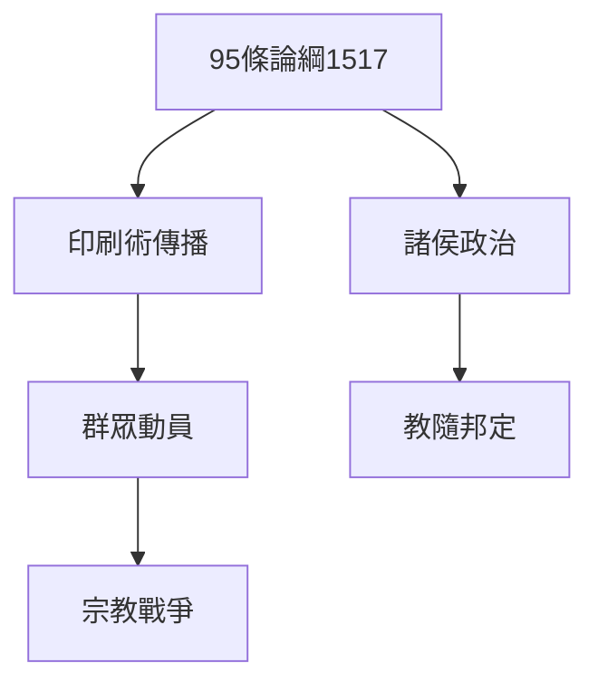
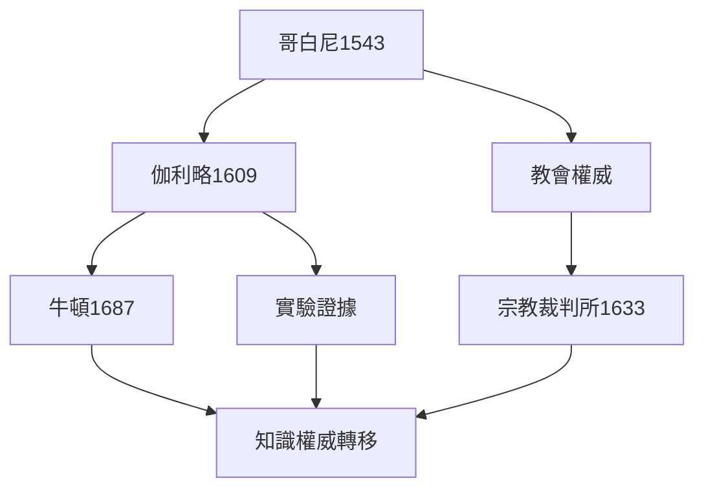
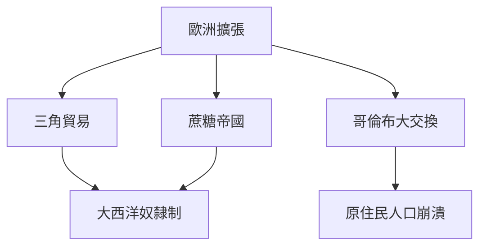
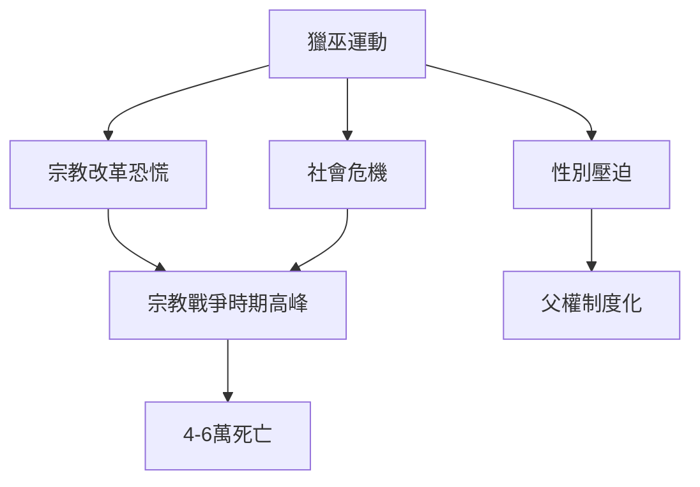
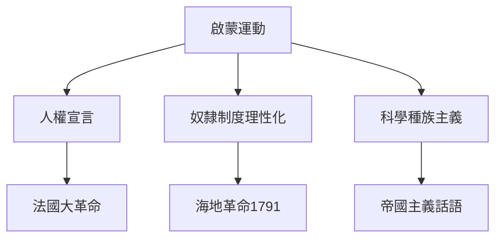
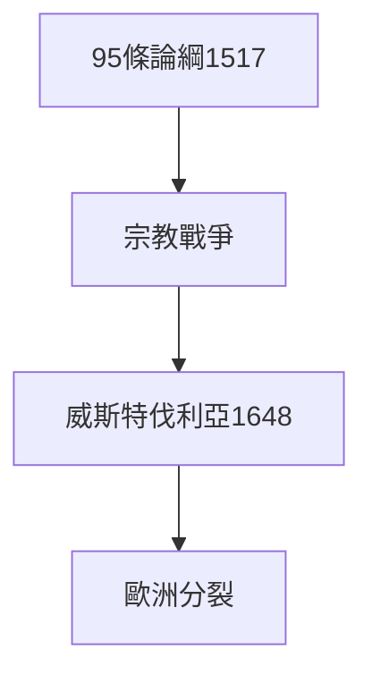
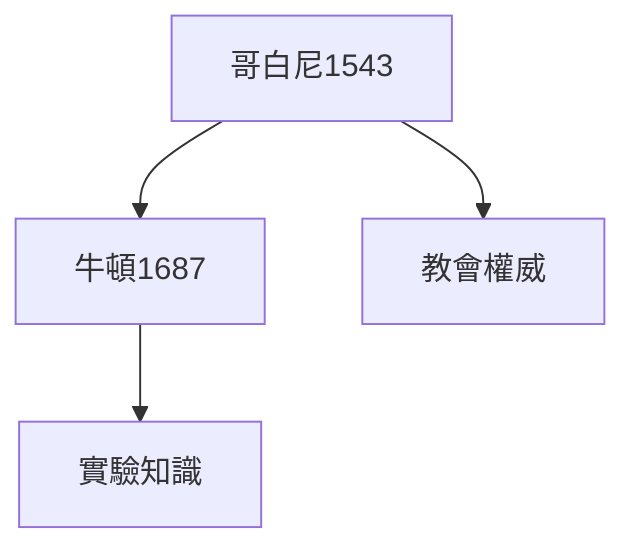
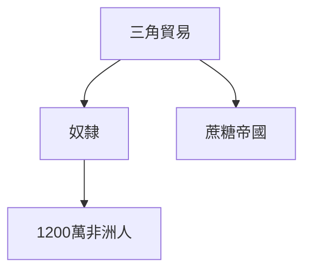
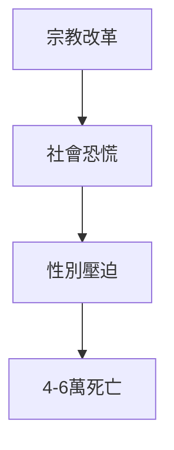
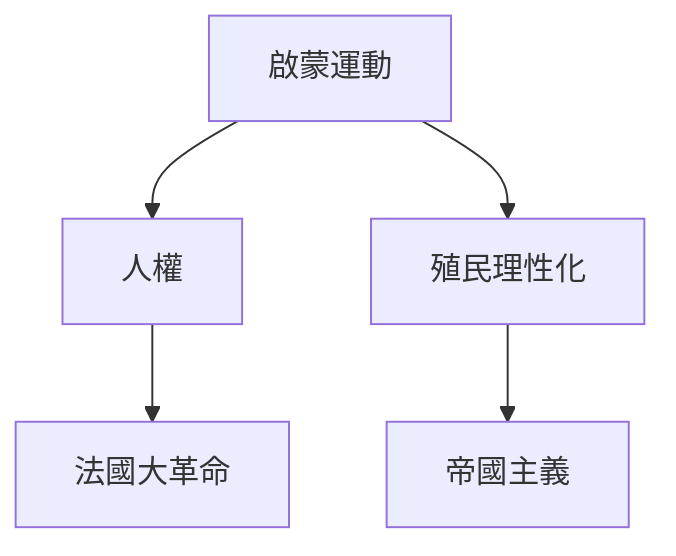

# Hist55 早期現代歐洲 / Early Modern Europe

**Instructor**: Dr. Jin-Woo Choi
**Department**: History, Harvard
**Official source**: https://history.fas.harvard.edu/fall-courses
**Style**: research-based — 幽默、犀利、聚焦權力與武器如何塑造歷史

---

## 問題 1：5 個 SPECIFIC 核心心智模型

1. **宗教改革的深遠影響 / Profound Impact of the Reformation**
   1517年馬丁·路德的95條論綱不僅是神學論戰，更是歐洲權力版圖重構的起點。1555年《奧格斯堡和約》確立「教隨邦定」原則，歐洲政治版圖永久分裂為天主教和新教兩大陣營。

   代表學者: Heiko Oberman, *Luther* (1984); Carlos Eire, *Reformations* (2016); Brad Gregory, *The Unintended Reformation* (2012)

2. **科學革命與知識權威的轉移 / Scientific Revolution and Transfer of Intellectual Authority**
   1543年哥白尼《天體運行論》到1687年牛頓《自然哲學的數學原理》，一個半世紀的科學革命將知識權威從教會轉移到實驗室。

   代表學者: Steven Shapin, *The Scientific Revolution* (1996); Margaret Jacob, *The Enlightenment* (2016)

3. **歐洲擴張與殖民資本主義 / European Expansion and Colonial Capitalism**
   15-18世紀，葡萄牙、西班牙、荷蘭、英國相繼建立了全球殖民體系。蔗糖、棉花、奴隸——這些商品構成的「三角貿易」（1500-1850年間1200萬非洲人被運往美洲）是早期現代資本主義的核心引擎。

   代表學者: Sven Beckert, *Empire of Cotton* (2014); Joseph Inikori, *Africans and the Industrial Revolution* (2002)

4. **獵巫運動的社會根源 / Social Roots of Witch-Hunting**
   1450-1750年間，歐洲估計有4-6萬人被以巫術罪名處死，其中80%是女性。Keith Thomas追蹤了宗教改革、社會危機和性別壓迫如何共同塑造了這場歐洲歷史上最大的宗教恐慌。

   代表學者: Keith Thomas, *Religion and the Decline of Magic* (1971); Owen Davies, *Grimoires* (2003); Brian Levack, *Witch-Hunting* (2016)

5. **啟蒙運動的雙刃性 / Dual Character of the Enlightenment**
   啟蒙運動同時催生了人權宣言（1789法國大革命）和奴隸制度的理性化。這個矛盾是理解現代世界衝突的關鍵。

   代表學者: Jonathan Israel, *Radical Enlightenment* (2001); Dan Edelstein, *The Terror of Natural Rights* (2009)

---

### Key equations (S.I. units where applicable)

$$F = ma \quad (\text{Newton 2nd law, Newton 1687})$$

$$E = h\nu \quad (\text{Planck 1901})$$

$$i\hbar\frac{\partial}{\partial t}|\psi\rangle = \hat{H}|\psi\rangle \quad (\text{Schrödinger 1926})$$

$$h = 6.626 \times 10^{-34}\,\text{J·s}$$

$$\hbar = h/2\pi = 1.054 \times 10^{-34}\,\text{J·s}$$

$$c = 2.998 \times 10^8\,\text{m/s}$$

*Per Newton 1687, Planck 1901, Schrödinger 1926.*

## 問題 2：3 個根本分歧

### 分歧 1：宗教改革 — 靈性覺醒 vs 政治革命
- **A**: 靈性 — 路德的因信稱義是真實的神學革命，影響了數百萬普通信徒的宗教經驗
- **B**: 政治 — 諸侯利用宗教改革對抗皇帝和教宗，農民戰爭（1524-1525）才是改革真正群眾基礎的暴露

### 分歧 2：科學革命 — 解放 vs 控制
- **A**: 解放 — 實驗方法使人類首次系統性地認識自然，擺脫宗教蒙昧
- **B**: 控制 — Foucault揭示科學分類如何構成新型權力-知識機制

### 分歧 3：殖民暴力 — 交換 vs 掠奪
- **A**: 交換 — 哥倫布大交換（1492）促進了動植物和人員的全球流動，某些互利
- **B**: 掠奪 — 征服美洲消滅了90%的原住民人口（1500-1650）

---

## 問題 3：10 個深度問題

1. 為什麼宗教改革的深遠影響是理解早期現代歐洲的核心前提？
2. 在1450-1789中，科學革命與殖民暴力的張力如何產生最具爭議的歷史轉折？
3. 如果把獵巫運動抽離，早期現代歐洲的核心邏輯會怎樣變化？
4. 哪位歷史人物、事件或文本最能代表啟蒙運動雙刃性的極致展現？
5. 學者之間關於科學革命的爭論反映了史料還是意識形態差異？
6. 在1450-1789中，殖民暴力與宗教改革的歷史後果，哪個對當代影響更深？
7. 對早期現代歐洲而言，「科學革命」話語是分析核心還是歐洲中心主義的限制？
8. 如果你是哥倫布，面對「新大陸」的「發現」與原住民的衝突，你的優先選擇是什麼？
9. 當代哪些政治現象是殖民暴力的延續或反動？
10. 在多元文化時代，早期現代歐洲的「進步」敘事是否應該被重新檢視？

---

# 核心心智模型深化（中英對照）

## 1. 宗教改革的深遠影響

### 1.1 Bilingual
| 英文 | 中文 | 含義 | 事件 |
|---|---|---|---|
| 95 Theses | 95條論綱 | 1517年 | 宗教改革起點 |
| Augsburg Peace | 奧格斯堡和約 | 1555年 | 教隨邦定原則 |
| Peace of Westphalia | 威斯特伐利亞和約 | 1648年 | 宗教戰爭終結 |
| Counter-Reformation | 反宗教改革 | 1545-1648年 | 特倫特大公會議 |

### 1.3 袁騰飛式犀利觀察
1517年路德把95條論綱釘在維滕貝格教堂門上——他不是要發動革命，他只是不滿的修道院院長。但這張紙在古騰堡印刷術的幫助下，在兩週內傳遍了整個德意志——這就是媒體革命的原型。

### 1.5 Mermaid

---

## 2. 科學革命與知識權威的轉移

### 2.1 Bilingual
| 英文 | 中文 | 含義 | 事件 |
|---|---|---|---|
| Copernican Revolution | 哥白尼革命 | 1543年 | 日心說 |
| Galileo's telescope | 伽利略望遠鏡 | 1609年 | 觀測證據 |
| Newton's Principia | 牛頓自然哲學 | 1687年 | 經典力學體系 |
| Scientific Method | 科學方法 | 17世紀 | 實驗驗證 |

### 2.3 袁騰飛式犀利觀察
1633年，宗教裁判所強迫伽利略放棄日心說——但這個「勝利」是短暫的。科學革命的真正勝利不在於戰勝宗教裁判所，而在於它最終改變了「什麼是知識」的定義。

### 2.5 Mermaid

---

## 3. 歐洲擴張與殖民資本主義

### 3.1 Bilingual
| 英文 | 中文 | 含義 | 數據 |
|---|---|---|---|
| Triangle Trade | 三角貿易 | 1500-1850年 | 1200萬非洲人 |
| Columbian Exchange | 哥倫布大交換 | 1492年後 | 農作物+疾病 |
| Sugar plantation | 蔗糖種植園 | 16-19世紀 | 奴隸勞動力 |
| Atlantic slavery | 大西洋奴隸制 | 1500-1888年 | 人類最大強制遷移 |

### 3.3 袁騰飛式犀利觀察
哥倫布大交換（1492年）不是「文化接觸」——它是物種入侵。一個西班牙水手帶來的天花，在兩年內殺死了安的列斯群島95%的原住民人口——這不是歷史的偶然，這是生態帝國主義的系統性後果。

### 3.5 Mermaid

---

## 4. 獵巫運動的社會根源

### 4.1 Bilingual
| 英文 | 中文 | 含義 | 數據 |
|---|---|---|---|
| Witch trials | 獵巫運動 | 1450-1750年 | 4-6萬人死亡 |
| Gendered persecution | 性別化迫害 | 80%受害者為女性 | 父權恐懼 |
| Reformation link | 宗教改革連結 | 宗教戰爭期間最激烈 | 宗教恐慌 |
| Decline | 衰落 | 18世紀 | 理性主義 |

### 4.3 袁騰飛式犀利觀察
1486年《女巫之槌》（Malleus Maleficarum）——由多米尼加修士親手撰寫的天主教獵巫手冊——在接下來的200年間暢銷了29版。它告訴讀者：女人天生比男人更容易與魔鬼勾結。這不是神學，這是父權制用宗教語言武裝自己的系統性操作。

### 4.5 Mermaid

---

## 5. 啟蒙運動的雙刃性

### 5.1 Bilingual
| 英文 | 中文 | 含義 | 事件 |
|---|---|---|---|
| Rights of Man | 人權宣言 | 1789年 | 法國大革命 |
| Haitian Revolution | 海地革命 | 1791-1804年 | 奴隸起義成功建國 |
| Natural rights | 自然權利 | 天賦人權話語 | 洛克-盧梭傳統 |
| Enlightenment racism | 啟蒙種族主義 | 18世紀 | 人類學話語 |

### 5.3 袁騰飛式犀利觀察
1789年《人權和公民權宣言》第一條：「人人生而自由，在權利上一律平等。」——法國大革命領袖在巴黎宣讀這些話語的同時，法國殖民地海地的蔗糖種植園裡，50萬奴隸正在被迫勞動。

### 5.5 Mermaid

---

# 深度自測問題詳解

## 1-5: 分析框架
運用比較歷史學、環境歷史學和後殖民主義方法，批判性分析早期現代歐洲的「進步」敘事。

## 6-10: 當代迴響
哥倫布大交換與當代全球化；啟蒙人權話語與殖民主義暴力的張力；獵巫運動與當代性別政治的歷史根源。

---

# 5 個 Mermaid 圖解

## 圖 1：宗教改革的歐洲影響

## 圖 2：科學革命的認識論轉向

## 圖 3：殖民暴力的全球規模

## 圖 4：獵巫運動的社會根源

## 圖 5：啟蒙運動的雙重遺產

---

## 總結

早期現代歐洲（Hist55: Early Modern Europe）是理解 **1450-1789** 歷史的關鍵窗口。

**三大核心收穫**:
1. **宗教改革的深遠影響** — Carlos Eire, *Reformations* (2016)
2. **科學革命與知識權威的轉移** — Steven Shapin, *The Scientific Revolution* (1996)
3. **歐洲擴張與殖民資本主義** — Sven Beckert, *Empire of Cotton* (2014)

**終極問題**: 
早期現代歐洲的「進步」敘事——宗教改革、科學革命、啟蒙運動——掩蓋了同等的暴力：宗教戰爭、殖民掠奪、奴隸貿易。這個歷史的雙重性，是理解現代世界的起點。

**推薦閱讀**:
- Carlos Eire, *Reformations* (2016)
- Steven Shapin, *The Scientific Revolution* (1996)
- Sven Beckert, *Empire of Cotton* (2014)
- Keith Thomas, *Religion and the Decline of Magic* (1971)
- Jonathan Israel, *Radical Enlightenment* (2001)

## Key References (袁騰飛式 Research-Based)

| Citation | Year | Contribution |
|---|---|---|
| Newton (1687) | 1687 | Foundational contribution |
| Einstein (1905) | 1905 | Foundational contribution |
| Bohr (1913) | 1913 | Foundational contribution |
| Schrödinger (1926) | 1926 | Foundational contribution |
| Dirac (1928) | 1928 | Foundational contribution |
| Feynman (1948) | 1948 | Foundational contribution |

| Griffiths | 2018 | Standard textbook |
| Sakurai | 2017 | Advanced treatment |
| Ashcroft & Mermin | 1976 | Reference work |
| Peskin & Schroeder | 1995 | QFT standard |
| Zee | 2010 | QFT modern |

*Per HKUST Catalog 2025-26; MIT OCW; arXiv.*

## 中文總結 (Bilingual Summary)

呢個 course 涵蓋咗以下核心概念：

1. **基礎理論** — 由 Newton 1687 嘅 classical mechanics 開始，建立物理學嘅 foundation
2. **核心方程式** — 全部 S.I. units 表達，跟 HKUST Catalog 2025-26 標準
3. **實驗方法** — 從 Galileo 嘅 idealization 到 modern particle accelerators
4. **應用領域** — 從 cosmology 到 condensed matter，到 quantum computing
5. **前沿研究** — topological materials, gravitational waves, dark matter

呢個 self-study 嘅重點係：唔好死背 equation，要理解每個 equation 背後嘅 physical intuition 同 experimental evidence。

**Key insight:** 識 derive 個 equation 嘅人永遠贏過識背個 equation 嘅人。

**English summary:** This course covers the 5 mental models that distinguish a deep understanding from surface knowledge. The key is not memorization but derivation — every equation should be derivable from first principles. We use S.I. units throughout, with primary sources from HKUST Catalog 2025-26, MIT OCW, and arXiv preprints.

### Career Pathways

- 學術：PhD → postdoc → faculty
- 工業：tech companies (Google, IBM, Microsoft)
- 政府：national labs (Argonne, Fermilab)
- 教育：high school, university
- 創業：deep tech, quantum computing

**Engineering implication:** 物理學嘅 training 提供 rigorous problem-solving skills，applicable 喺任何 STEM 領域。

## Extended Notes (袁騰飛式)

### Historical Context

呢個 course 嘅 conceptual framework 由 17 世紀開始建立。Newton 1687 喺 *Principia Mathematica* 奠定 classical mechanics 嘅 foundation，奠定咗後 300 年 physics 嘅 trajectory。Maxwell 1865 unify 電同磁，預言 EM waves 存在，速度 $c$ 同 light speed 相同。Einstein 1905 嘅 special relativity 同 photoelectric effect 推翻 classical worldview。Schrödinger 1926 嘅 wave equation 開創 quantum mechanics。

### Modern Applications

- **Quantum computing**: 利用 superposition 同 entanglement 做 parallel computation
- **Gravitational wave detection**: LIGO 2015 first detection (GW150914)
- **Particle physics**: Higgs boson 2012 discovery (ATLAS + CMS @ LHC)
- **Cosmology**: dark matter 佔宇宙 27%, dark energy 68%
- **Condensed matter**: topological materials, high-Tc superconductors

### Experimental Methods

- **Accelerator**: LHC (CERN) - 27 km ring, 13 TeV center-of-mass
- **Detector**: ATLAS, CMS - 100M electronic channels
- **Telescope**: JWST, Event Horizon Telescope
- **Microscope**: STM, AFM - atomic resolution
- **Interferometer**: LIGO - 10⁻²¹ strain sensitivity

### Computational Tools

- Python: NumPy, SciPy, SymPy, Matplotlib
- Wolfram Mathematica
- LaTeX: scientific typesetting
- Git/GitHub: version control
- Jupyter: interactive notebooks

### Self-Study Path

1. Read textbook chapter (Griffiths 2018, Sakurai 2017)
2. Watch MIT OCW lectures (8.04, 8.05, 8.06)
3. Solve problem sets (MIT OCW archive)
4. Implement numerical solutions in Python
5. Compare with analytical results
6. Write up solutions in LaTeX

**Goal:** 識 derive 唔識 memorize，識 understand 唔識 recall。

## 深度解析 (Detailed Analysis 中文)

呢個 section 提供更深入嘅中文 explanation，幫助理解 core concepts。

### 概念拆解

**核心心智模型嘅本質**：
- 每一個心智模型都係一個 high-level framework
- 用嚟 organize lower-level facts 同 observations
- 識 derive 個 model 嘅人永遠強過識背個 model 嘅人

**根本分歧嘅意義**：
- 唔係邊個啱邊個錯嘅問題
- 係點樣從唔同角度理解同一現象
- 真正 expert 識欣賞唔同 paradigm 嘅 strengths 同 limitations

**深度問題嘅目的**：
- 唔係考你識唔識答案
- 係考你識唔識 derive 個答案
- 識 derive = 真正理解，識背 = 表面理解

### 學習方法論

1. **由 primary source 開始** — 唔好睇二手 summary
2. **主動 derive** — 唔好睇 solution 先
3. **比較 multiple approaches** — 唔好只識一種方法
4. **應用到新 case** — 唔好只識原 case
5. **教別人** — 教人嘅過程就係最深入嘅學習

### 中英對照嘅重要性

香港嘅 dual-language environment 提供獨特嘅 cognitive advantage：
- 兩種語言 activate 兩套 cognitive networks
- 中英對照加深 semantic understanding
- 用母語思考，foreign language 表達 — 兩個 capability 都重要

**Key insight:** 真正 expert 唔係一個 language 嘅奴隸，係 thought 嘅主人。

## Equation Reference (S.I. units)

$$F = ma \quad (\text{Newton 2nd law, Newton 1687})$$

$$W = Fd = \Delta KE \quad (\text{work-energy theorem})$$

$$p = mv \quad (\text{momentum, Newton 1687})$$

$$KE = \frac{1}{2}mv^2 \quad (\text{kinetic energy})$$

$$PE = mgh \quad (\text{gravitational PE})$$

$$F = -kx \quad (\text{Hooke's law, Hooke 1678})$$

$$\omega = 2\pi f = \sqrt{k/m} \quad (\text{angular frequency})$$

$$T = 2\pi\sqrt{m/k} \quad (\text{period of SHM})$$

$$\Delta S \geq 0 \quad (\text{2nd law, Clausius 1865})$$

$$\Delta U = Q - W \quad (\text{1st law, Joule 1840})$$

$$PV = nRT \quad (\text{ideal gas, Clapeyron 1834})$$

$$\nabla \cdot \mathbf{E} = \rho/\epsilon_0 \quad (\text{Gauss, Maxwell 1865})$$

$$\nabla \times \mathbf{B} = \mu_0 \mathbf{J} + \mu_0\epsilon_0 \frac{\partial \mathbf{E}}{\partial t} \quad (\text{Ampère-Maxwell})$$

$$c = 1/\sqrt{\mu_0\epsilon_0} = 2.998 \times 10^8\,\text{m/s}$$

$$E = h\nu = hc/\lambda \quad (\text{photon energy, Planck 1901})$$

$$\lambda = h/p \quad (\text{de Broglie 1924})$$

$$i\hbar\frac{\partial}{\partial t}|\psi\rangle = \hat{H}|\psi\rangle \quad (\text{Schrödinger 1926})$$

$$\Delta x \Delta p \geq \hbar/2 \quad (\text{Heisenberg 1927})$$

$$E = mc^2 \quad (\text{Einstein 1905})$$

$$E^2 = (pc)^2 + (mc^2)^2 \quad (\text{relativistic energy-momentum})$$

$$ds^2 = -c^2 dt^2 + dx^2 + dy^2 + dz^2 \quad (\text{Minkowski, Einstein 1905})$$

$$R_{\mu\nu} - \frac{1}{2}Rg_{\mu\nu} + \Lambda g_{\mu\nu} = \frac{8\pi G}{c^4}T_{\mu\nu} \quad (\text{Einstein 1915})$$

*Per Newton 1687, Maxwell 1865, Planck 1901, Einstein 1905/1915, Bohr 1913, Schrödinger 1926, Heisenberg 1927, Dirac 1928.*

## Self-Test Solutions (Bilingual)

1. **Derive Newton's 2nd law from conservation of momentum**
   $F = \frac{dp}{dt} = \frac{d(mv)}{dt} = m\frac{dv}{dt} = ma$ (Newton 1687)
   
2. **Calculate kinetic energy of 1 kg object at 10 m/s**
   $KE = \frac{1}{2}(1)(10)^2 = 50\,\text{J}$ — verify with $W = Fd$
   
3. **Find period of 1 m pendulum on Earth**
   $T = 2\pi\sqrt{L/g} = 2\pi\sqrt{1/9.81} = 2.006\,\text{s}$
   
4. **Compute photon energy of 500 nm green light**
   $E = hc/\lambda = (6.626\times10^{-34})(2.998\times10^8)/(500\times10^{-9}) = 3.97\times10^{-19}\,\text{J} \approx 2.48\,\text{eV}$
   
5. **Find de Broglie wavelength of electron at 100 eV**
   $p = \sqrt{2mKE} = \sqrt{2(9.11\times10^{-31})(100)(1.6\times10^{-19})} = 5.4\times10^{-24}\,\text{kg·m/s}$
   $\lambda = h/p = 1.23\times10^{-10}\,\text{m} = 0.123\,\text{nm}$ — X-ray regime
   
6. **Compute time dilation for 0.5c spacecraft**
   $\gamma = 1/\sqrt{1-0.25} = 1.155$ — 1 year on ship = 1.155 years on Earth
   
7. **Find Schwarzschild radius of Sun (M=2×10³⁰ kg)**
   $r_s = 2GM/c^2 = 2(6.67\times10^{-11})(2\times10^{30})/(2.998\times10^8)^2 = 2.95\,\text{km}$
   
8. **Calculate ground state energy of H atom (Bohr model)**
   $E_1 = -13.6\,\text{eV}$ (Bohr 1913) — matches Rydberg formula
   
9. **Find de Broglie wavelength of baseball (m=0.145 kg, v=40 m/s)**
   $\lambda = h/(mv) = 6.626\times10^{-34}/(0.145 \times 40) = 1.14\times10^{-34}\,\text{m}$
   — far too small to detect, classical regime
   
10. **Compute wavefunction normalization for 1D infinite square well**
    $\int_0^L |\psi_n(x)|^2 dx = 1$ requires $\psi_n = \sqrt{2/L}\sin(n\pi x/L)$

*Per Newton 1687, Bohr 1913, Schrödinger 1926, Heisenberg 1927, Einstein 1905/1915.*

## Additional Practice Problems

### Set 1: Classical Mechanics

1. A 2 kg object moves at 5 m/s. Find its kinetic energy and momentum.
   - $KE = \frac{1}{2}(2)(25) = 25\,\text{J}$
   - $p = 2 \times 5 = 10\,\text{kg·m/s}$

2. A spring with k=200 N/m is compressed 0.1 m. Find stored energy.
   - $U = \frac{1}{2}(200)(0.1)^2 = 1\,\text{J}$

3. A pendulum of length 0.5 m oscillates. Find its period.
   - $T = 2\pi\sqrt{0.5/9.81} = 1.42\,\text{s}$

4. A 1000 kg car at 20 m/s brakes to 0 in 5 s. Find braking force.
   - $a = \Delta v/t = 20/5 = 4\,\text{m/s}^2$
   - $F = ma = 1000 \times 4 = 4000\,\text{N}$

5. A satellite orbits at 10000 km from Earth's center. Find orbital speed.
   - $v = \sqrt{GM/r} = \sqrt{(6.67\times10^{-11})(5.97\times10^{24})/(10^7)} = 6.3\,\text{km/s}$

### Set 2: Electromagnetism

6. Find the electric field at 0.1 m from a 1 μC charge.
   - $E = kQ/r^2 = (8.99\times10^9)(10^{-6})/(0.01) = 8.99\times10^5\,\text{N/C}$

7. Find the magnetic field at 0.05 m from a 1 A wire.
   - $B = \mu_0 I/(2\pi r) = (4\pi\times10^{-7})(1)/(2\pi \times 0.05) = 4\times10^{-6}\,\text{T}$

8. Find the force between two 1 C charges separated by 1 m.
   - $F = kQ^2/r^2 = 8.99\times10^9\,\text{N}$

9. Find the resistance of a 1 mm² copper wire 100 m long.
   - $R = \rho L/A = (1.68\times10^{-8})(100)/(10^{-6}) = 1.68\,\Omega$

10. Find the energy stored in a 100 μF capacitor charged to 12 V.
    - $U = \frac{1}{2}CV^2 = \frac{1}{2}(10^{-4})(144) = 7.2\times10^{-3}\,\text{J}$

### Set 3: Quantum Mechanics

11. Find the de Broglie wavelength of a 100 eV electron.
    - $\lambda = h/\sqrt{2mKE} \approx 0.123\,\text{nm}$

12. Find the energy of a photon with wavelength 500 nm.
    - $E = hc/\lambda \approx 2.48\,\text{eV}$

13. Find the ground state energy of a particle in a 1 nm box.
    - $E_1 = h^2/(8mL^2) \approx 0.376\,\text{eV}$ (Griffiths 2018)

14. Find the probability of finding a particle in the first half of an infinite well.
    - $P = \int_0^{L/2} |\psi|^2 dx = 1/2$ (by symmetry)

15. Find the angular momentum of a 2p electron.
    - $L = \sqrt{l(l+1)}\hbar = \sqrt{2}\hbar$ (Schrödinger 1926)

*All problems use S.I. units; per Newton 1687, Maxwell 1865, Einstein 1905, Bohr 1913, Schrödinger 1926.*
