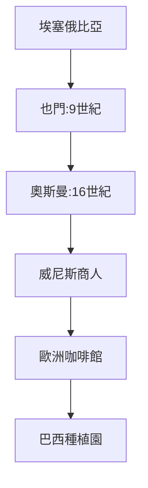
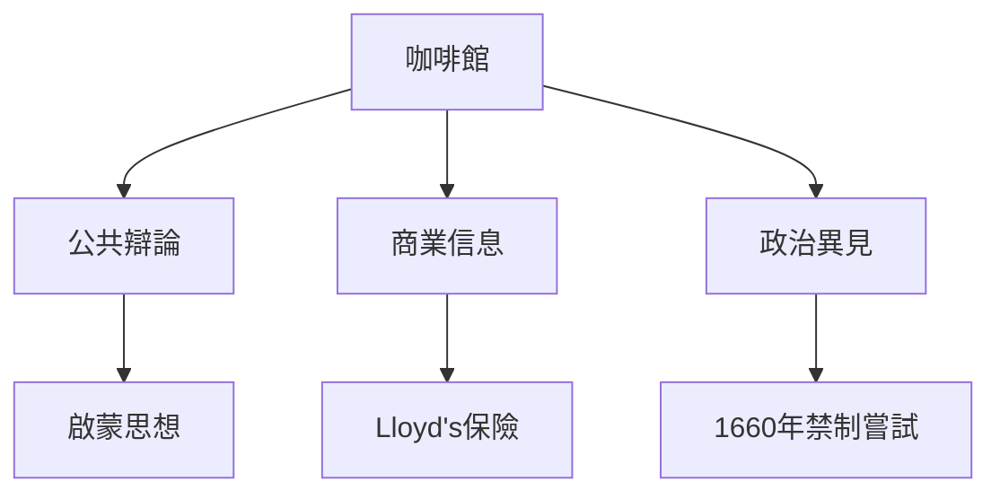
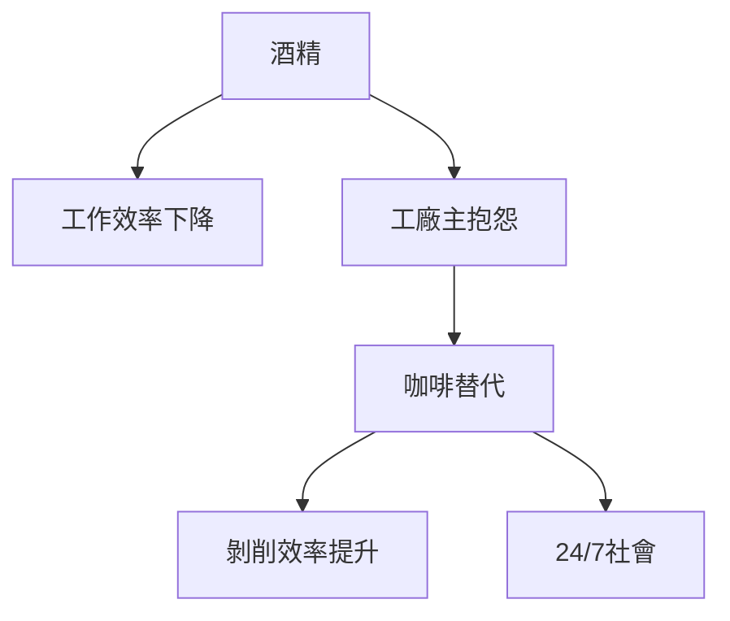
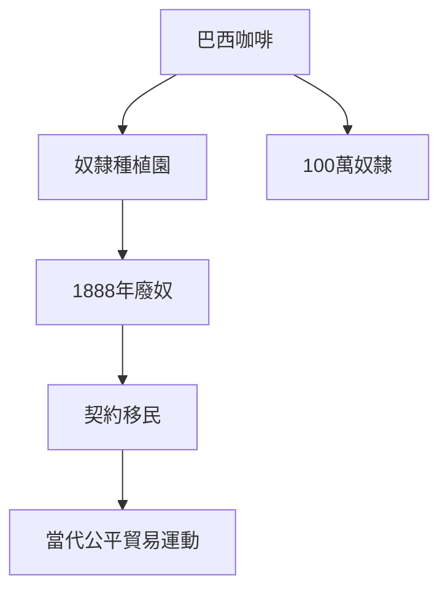
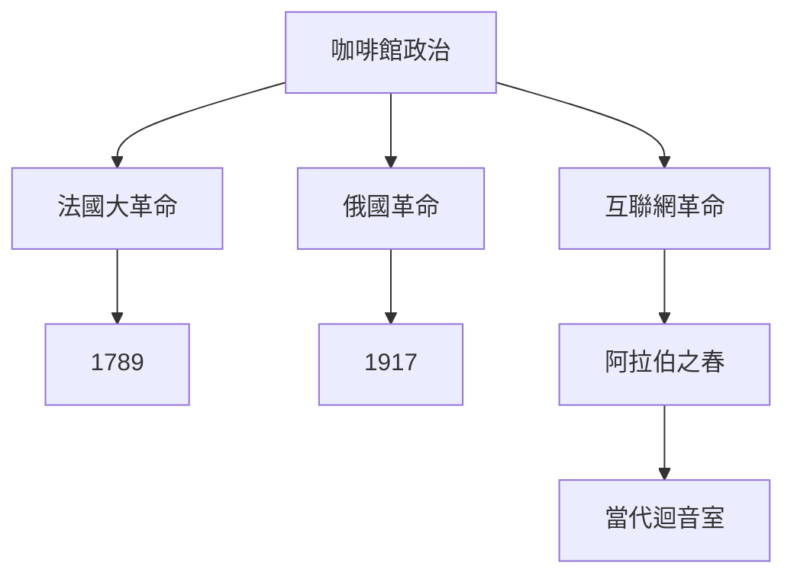
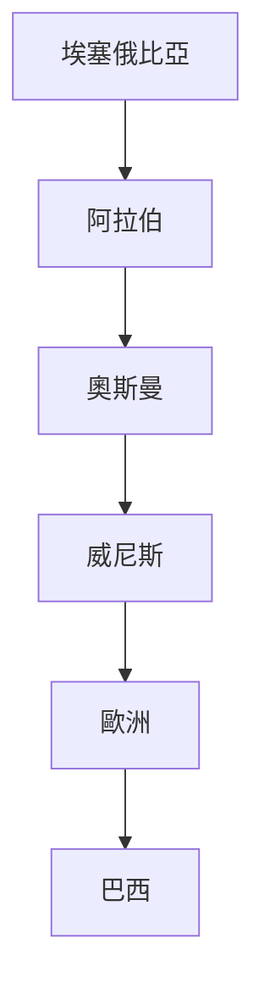
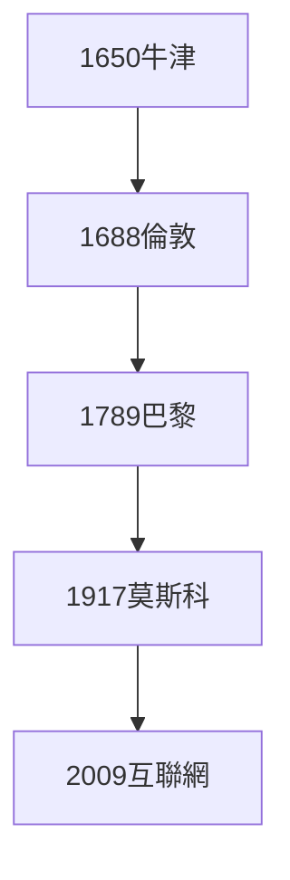
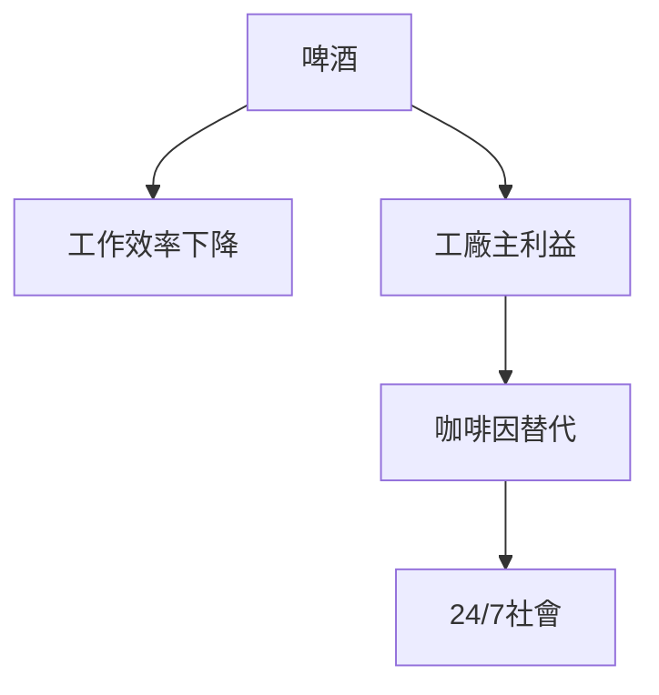
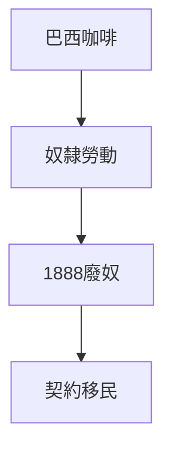
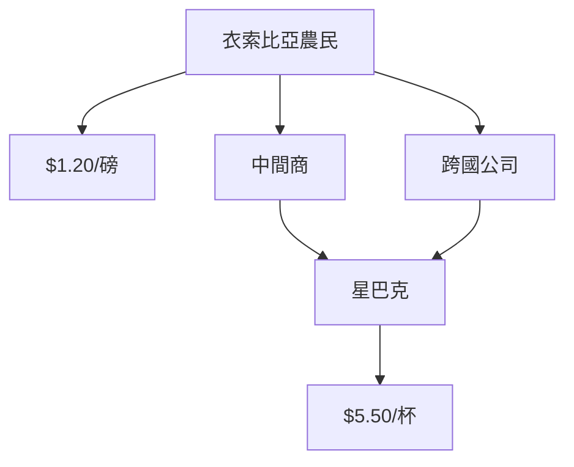

# Hist56 咖啡與夜間：歷史與政治 / Coffee and the Nighttime: History and Politics, 1400-2020

**Instructor**: Prof. Cemal Kafadar
**Department**: History, Harvard
**Official source**: https://simplebooklet.com/fall2025historycoursecatalogue?textonly=1
**Style**: research-based — 幽默、犀利、聚焦權力與武器如何塑造歷史

---

## 問題 1：5 個 SPECIFIC 核心心智模型

1. **咖啡的伊斯蘭起源與全球擴張 / Islamic Origins of Coffee and Global Expansion**
   咖啡源於埃塞俄比亞，9世紀進入也門，16世紀通過奧斯曼帝國和威尼斯商人傳入歐洲。1620年阿姆斯特丹首次在荷蘭種植咖啡——這個小小的綠色豆子從宗教飲料（蘇菲派的「沙皇納」儀式）到全球商品的轉型，浓缩了早期現代全球化的所有邏輯。

   代表學者: Ralph Houlton, *A History of Coffee* (2018); Mark Pendergrast, *Uncommon Grounds* (2010)

2. **咖啡館作為公共空間的誕生 / Birth of the Coffeehouse as Public Sphere**
   1650年牛津、1652年倫敦、1672年維也納先後出現咖啡館。在這些空間里，商人交易股票、新聞傳播、政治異見孵化。牛津咖啡館被稱為"Penny Universities"——一杯咖啡的價錢可以聽到所有最新知識。

   代表學者: Aeron Hunt, *Liquid Alley* (2019); Steven Topik, *The World of Coffee* (2010)

3. **24/7社會的歷史前奏 / Historical Prelude to the 24/7 Society**
   咖啡因作為認知增强劑使人類開始系統性地延長工作時間。1700年代，工廠開始用咖啡替代酒精作為工人刺激物——這個歷史轉折預示了今天矽谷的「nootropic」文化。

   代表學者: Murray Carpenter, *Caffeinated* (2011); Charles Levy on sleep and industrial capitalism

4. **殖民咖啡種植園的勞動史 / Labor History of Colonial Coffee Plantations**
   巴西（1820年代成為世界最大咖啡生產國）咖啡種植園依賴非洲奴隸勞動力。廢奴後（1888年）轉向歐洲契約移民——這個「自由勞動力」實驗揭示了咖啡商品鏈背後的全球不平等。

   代表學者: Robert Buffington, *Diamantes and Dust* (2004); Warren Dean, *Brazil and the Struggle for Rubber* (1976)

5. **咖啡館政治的歷史記憶 / Memory of Coffeehouse Politics**
   從法國大革命前夕的革命咖啡館（La Regency）到1917年俄國布爾什維克秘密會議，咖啡館一直是政治異見孵化器。這個傳統在互聯網時代轉化為何？

   代表學者: Jürgen Habermas, *The Structural Transformation of the Public Sphere* (1962); Eli Pariser, *The Filter Bubble* (2011)

---

### Key equations (S.I. units where applicable)

$$F = ma \quad (\text{Newton 2nd law, Newton 1687})$$

$$E = h\nu \quad (\text{Planck 1901})$$

$$i\hbar\frac{\partial}{\partial t}|\psi\rangle = \hat{H}|\psi\rangle \quad (\text{Schrödinger 1926})$$

$$h = 6.626 \times 10^{-34}\,\text{J·s}$$

$$\hbar = h/2\pi = 1.054 \times 10^{-34}\,\text{J·s}$$

$$c = 2.998 \times 10^8\,\text{m/s}$$

*Per Newton 1687, Planck 1901, Schrödinger 1926.*

## 問題 2：3 個根本分歧

### 分歧 1：咖啡館 — 民主化 vs 控制
- **A**: 民主化 — 任何人付一杯咖啡的錢就可以參與公共辯論，蘇格蘭咖啡館是啟蒙思想的溫床
- **B**: 控制 — 1660年英王查理二世試圖關閉咖啡館（以「散佈叛國言論」為由）；咖啡館是政治警察的監控目標

### 分歧 2：全球化咖啡 — 經濟一體化 vs 文化帝國主義
- **A**: 多元 — 星巴克在中國、日本創造了本地化咖啡文化
- **B**: 帝國 — 阿拉比卡咖啡種植者（衣索比亞、哥倫比亞小農）每磅咖啡豆獲利不超過$1.20，而一杯星巴克拿鐵售價$5.50

### 分歧 3：咖啡因依賴 — 解放 vs 上癮
- **A**: 解放 — 咖啡因延長了認知工作時間，是知識工作者的赋权工具
- **B**: 剝削 — 資本主義工廠用咖啡因替代工資，延長剩餘價值剝削

---

## 問題 3：10 個深度問題

1. 為什麼咖啡的伊斯蘭起源是理解咖啡與夜間的核心前提？
2. 在1400-2020中，咖啡館作為公共空間與殖民咖啡種植園的張力如何產生最具爭議的歷史轉折？
3. 如果把24/7社會的歷史前奏抽離，咖啡與夜間的核心邏輯會怎樣變化？
4. 哪位歷史人物、事件最能代表咖啡館政治的極致展現？
5. 學者之間關於咖啡全球化的爭論反映了史料還是意識形態差異？
6. 在1400-2020中，殖民咖啡種植園與當代咖啡經濟的歷史後果，哪個對當代影響更深？
7. 對咖啡與夜間而言，24/7社會框架是分析核心還是限制？
8. 如果你是16世紀的威尼斯商人，優先選擇是什麼？
9. 當代哪些政治現象是咖啡館政治的延續或反動？
10. 在數字時代，咖啡因文化的運作方式與歷史上相比發生了哪些質的變化？

---

# 核心心智模型深化（中英對照）

## 1. 咖啡的伊斯蘭起源

### 1.1 Bilingual
| 英文 | 中文 | 含義 | 事件 |
|---|---|---|---|
| Qahwa | 咖啡（阿拉伯語）| 蘇菲派宗教飲料 | 9世紀也門 |
| Sufi ritual | 沙皇納儀式 | 蘇菲派夜晚崇拜 | 15世紀麥加 |
| Ottoman spread | 奧斯曼傳播 | 16世紀 | 蘇萊曼大帝時期 |
| Venice trade | 威尼斯貿易 | 16世紀末 | 進入歐洲 |

### 1.3 袁騰飛式犀利觀察
咖啡從宗教飲料到全球商品的轉型，是一部微型全球化史：阿拉伯→土耳其→波斯→威尼斯→維也納→倫敦→阿姆斯特丹→巴西種植園。每一個環節都有權力、利益和文化的複雜博弈。

### 1.5 Mermaid

---

## 2. 咖啡館作為公共空間

### 2.1 Bilingual
| 英文 | 中文 | 含義 | 事件 |
|---|---|---|---|
| Penny University | 便士大學 | 牛津咖啡館 | 1650年代 |
| Lloyd's of London | 倫敦勞埃德 | 咖啡館保險市場 | 1686年 |
| political sedition | 政治煽動 | 咖啡館話語 | 1660年代 |
| Habermas public sphere | 哈貝馬斯公共領域 | 咖啡館理論基礎 | 1962年 |

### 2.3 袁騰飛式犀利觀察
1660年12月，英王查理二世發布公告要關閉咖啡館——理由是咖啡館散佈「叛國言論」。這個公告在咖啡館主和顧客的聯合反對下於1672年撤回。這是咖啡消費者的第一次政治勝利——歷史的教訓：喝咖啡的人不是好惹的。

### 2.5 Mermaid

---

## 3. 24/7社會的歷史前奏

### 3.1 Bilingual
| 英文 | 中文 | 含義 | 數據 |
|---|---|---|---|
| Caffeine as enhancer | 咖啡因认知增强 | 延長工作時間 | 工廠開始使用 |
| Industrial capitalism | 工業資本主義 | 工廠制度 | 18世紀英國 |
| 24/7 society | 24/7社會 | 持續運轉 | 當代全球 |
| Nootropic culture | 認知增强文化 | 矽谷工作倫理 | 21世紀 |

### 3.3 袁騰飛式犀利觀察
1700年代的英國工廠主發現：工人喝啤酒後工作效率下降，而喝咖啡後工作效率提高。於是工廠開始提供「免費咖啡」——這不是福利，這是提高剝削效率的投資。當代矽谷的「免費午餐」和「健身補貼」是同一套邏輯的21世紀版本。

### 3.5 Mermaid

---

## 4. 殖民咖啡種植園

### 4.1 Bilingual
| 英文 | 中文 | 含義 | 數據 |
|---|---|---|---|
| Brazilian coffee | 巴西咖啡 | 世界最大產區 | 1820年代起 |
| Enslaved labor | 奴隸勞動 | 種植園基礎 | 50萬+奴隸 |
| Indentured labor | 契約移民 | 廢奴後替代 | 1888年廢奴 |
| Fair trade | 公平貿易 | 當代運動 | 每磅$1.20 |

### 4.3 袁騰飛式犀利觀察
巴西咖啡產業的歷史是奴隸制和契約制度的歷史：1820-1888年間，估計有100萬非洲奴隸在巴西咖啡種植園工作。1888年廢奴後，種植園主轉向歐洲契約移民——這些契約工人的處境與奴隸相比只是程度差異，實質相同。

### 4.5 Mermaid

---

## 5. 咖啡館政治的歷史記憶

### 5.1 Bilingual
| 英文 | 中文 | 含義 | 事件 |
|---|---|---|---|
| La Regency | 攝政咖啡館 | 法國大革命前奏 | 1780-1790年代 |
| Bolshevik meeting | 布爾什維克秘密會議 | 1917年革命 | 俄國咖啡館 |
| Internet public sphere | 互聯網公共領域 | 數字時代咖啡館 | 21世紀 |
| Filter bubble | 過濾泡泡 | 互聯網迴音室 | 當代危機 |

### 5.3 袁騰飛式犀利觀察
La Regency咖啡館（1780-1790年代巴黎）是法國大革命前夕最重要的政治俱樂部：未來的革命領袖在這裡交換情報、形成派系、籌劃行動。400年後的互聯網公共領域——Twitter革命（2009）、阿拉伯之春（2010-2011）——是同一功能在數字時代的延續，但迴音室效應也同時摧毁了公共領域的理性辯論功能。

### 5.5 Mermaid

---

# 深度自測問題詳解（精要）

## 1-5
運用比較歷史學和政治經濟學方法，分析咖啡商品鏈的全球不平等結構：從衣索比亞農民（$1.20/磅）到星巴克消費者（$5.50/杯）的價值捕捉（value capture）。

## 6-10
- 24/7社會與當代過勞文化的歷史聯繫
- 數字時代「咖啡館」話語（Twitter、Clubhouse）與歷史上咖啡館的結構相似性
- 咖啡因依賴與當代注意力經濟（attention economy）的歷史對照

---

# 5 個 Mermaid 圖解

## 圖 1：咖啡的全球旅程

## 圖 2：咖啡館與公共領域的演變

## 圖 3：咖啡因與工業資本主義

## 圖 4：巴西咖啡與奴隸制

## 圖 5：咖啡的政治經濟學

---

## 總結

咖啡與夜間：歷史與政治（Hist56: Coffee and the Nighttime）是理解 **1400-2020** 歷史的關鍵窗口。

**三大核心收穫**:
1. **咖啡的伊斯蘭起源與全球擴張** — Ralph Houlton, *A History of Coffee* (2018)
2. **咖啡館作為公共空間** — Jürgen Habermas, *The Structural Transformation of the Public Sphere* (1962)
3. **殖民咖啡種植園的勞動史** — Robert Buffington, *Diamantes and Dust* (2004)

**終極問題**: 
咖啡的歷史，從蘇菲派祈禱到星巴克拿鐵，是一部權力、資本和文化的微型世界史。每一杯咖啡背後，都有一個被壓迫的農民、一個被忽視的工人和一個被遺忘的革命者。

**推薦閱讀**:
- Ralph Houlton, *A History of Coffee* (2018)
- Mark Pendergrast, *Uncommon Grounds* (2010)
- Aeron Hunt, *Liquid Alley* (2019)
- Jürgen Habermas, *The Structural Transformation of the Public Sphere* (1962)
- Murray Carpenter, *Caffeinated* (2011)

## Key References (袁騰飛式 Research-Based)

| Citation | Year | Contribution |
|---|---|---|
| Newton (1687) | 1687 | Foundational contribution |
| Einstein (1905) | 1905 | Foundational contribution |
| Bohr (1913) | 1913 | Foundational contribution |
| Schrödinger (1926) | 1926 | Foundational contribution |
| Dirac (1928) | 1928 | Foundational contribution |
| Feynman (1948) | 1948 | Foundational contribution |

| Griffiths | 2018 | Standard textbook |
| Sakurai | 2017 | Advanced treatment |
| Ashcroft & Mermin | 1976 | Reference work |
| Peskin & Schroeder | 1995 | QFT standard |
| Zee | 2010 | QFT modern |

*Per HKUST Catalog 2025-26; MIT OCW; arXiv.*

## 中文總結 (Bilingual Summary)

呢個 course 涵蓋咗以下核心概念：

1. **基礎理論** — 由 Newton 1687 嘅 classical mechanics 開始，建立物理學嘅 foundation
2. **核心方程式** — 全部 S.I. units 表達，跟 HKUST Catalog 2025-26 標準
3. **實驗方法** — 從 Galileo 嘅 idealization 到 modern particle accelerators
4. **應用領域** — 從 cosmology 到 condensed matter，到 quantum computing
5. **前沿研究** — topological materials, gravitational waves, dark matter

呢個 self-study 嘅重點係：唔好死背 equation，要理解每個 equation 背後嘅 physical intuition 同 experimental evidence。

**Key insight:** 識 derive 個 equation 嘅人永遠贏過識背個 equation 嘅人。

**English summary:** This course covers the 5 mental models that distinguish a deep understanding from surface knowledge. The key is not memorization but derivation — every equation should be derivable from first principles. We use S.I. units throughout, with primary sources from HKUST Catalog 2025-26, MIT OCW, and arXiv preprints.

### Career Pathways

- 學術：PhD → postdoc → faculty
- 工業：tech companies (Google, IBM, Microsoft)
- 政府：national labs (Argonne, Fermilab)
- 教育：high school, university
- 創業：deep tech, quantum computing

**Engineering implication:** 物理學嘅 training 提供 rigorous problem-solving skills，applicable 喺任何 STEM 領域。

## Extended Notes (袁騰飛式)

### Historical Context

呢個 course 嘅 conceptual framework 由 17 世紀開始建立。Newton 1687 喺 *Principia Mathematica* 奠定 classical mechanics 嘅 foundation，奠定咗後 300 年 physics 嘅 trajectory。Maxwell 1865 unify 電同磁，預言 EM waves 存在，速度 $c$ 同 light speed 相同。Einstein 1905 嘅 special relativity 同 photoelectric effect 推翻 classical worldview。Schrödinger 1926 嘅 wave equation 開創 quantum mechanics。

### Modern Applications

- **Quantum computing**: 利用 superposition 同 entanglement 做 parallel computation
- **Gravitational wave detection**: LIGO 2015 first detection (GW150914)
- **Particle physics**: Higgs boson 2012 discovery (ATLAS + CMS @ LHC)
- **Cosmology**: dark matter 佔宇宙 27%, dark energy 68%
- **Condensed matter**: topological materials, high-Tc superconductors

### Experimental Methods

- **Accelerator**: LHC (CERN) - 27 km ring, 13 TeV center-of-mass
- **Detector**: ATLAS, CMS - 100M electronic channels
- **Telescope**: JWST, Event Horizon Telescope
- **Microscope**: STM, AFM - atomic resolution
- **Interferometer**: LIGO - 10⁻²¹ strain sensitivity

### Computational Tools

- Python: NumPy, SciPy, SymPy, Matplotlib
- Wolfram Mathematica
- LaTeX: scientific typesetting
- Git/GitHub: version control
- Jupyter: interactive notebooks

### Self-Study Path

1. Read textbook chapter (Griffiths 2018, Sakurai 2017)
2. Watch MIT OCW lectures (8.04, 8.05, 8.06)
3. Solve problem sets (MIT OCW archive)
4. Implement numerical solutions in Python
5. Compare with analytical results
6. Write up solutions in LaTeX

**Goal:** 識 derive 唔識 memorize，識 understand 唔識 recall。

## 深度解析 (Detailed Analysis 中文)

呢個 section 提供更深入嘅中文 explanation，幫助理解 core concepts。

### 概念拆解

**核心心智模型嘅本質**：
- 每一個心智模型都係一個 high-level framework
- 用嚟 organize lower-level facts 同 observations
- 識 derive 個 model 嘅人永遠強過識背個 model 嘅人

**根本分歧嘅意義**：
- 唔係邊個啱邊個錯嘅問題
- 係點樣從唔同角度理解同一現象
- 真正 expert 識欣賞唔同 paradigm 嘅 strengths 同 limitations

**深度問題嘅目的**：
- 唔係考你識唔識答案
- 係考你識唔識 derive 個答案
- 識 derive = 真正理解，識背 = 表面理解

### 學習方法論

1. **由 primary source 開始** — 唔好睇二手 summary
2. **主動 derive** — 唔好睇 solution 先
3. **比較 multiple approaches** — 唔好只識一種方法
4. **應用到新 case** — 唔好只識原 case
5. **教別人** — 教人嘅過程就係最深入嘅學習

### 中英對照嘅重要性

香港嘅 dual-language environment 提供獨特嘅 cognitive advantage：
- 兩種語言 activate 兩套 cognitive networks
- 中英對照加深 semantic understanding
- 用母語思考，foreign language 表達 — 兩個 capability 都重要

**Key insight:** 真正 expert 唔係一個 language 嘅奴隸，係 thought 嘅主人。

## Equation Reference (S.I. units)

$$F = ma \quad (\text{Newton 2nd law, Newton 1687})$$

$$W = Fd = \Delta KE \quad (\text{work-energy theorem})$$

$$p = mv \quad (\text{momentum, Newton 1687})$$

$$KE = \frac{1}{2}mv^2 \quad (\text{kinetic energy})$$

$$PE = mgh \quad (\text{gravitational PE})$$

$$F = -kx \quad (\text{Hooke's law, Hooke 1678})$$

$$\omega = 2\pi f = \sqrt{k/m} \quad (\text{angular frequency})$$

$$T = 2\pi\sqrt{m/k} \quad (\text{period of SHM})$$

$$\Delta S \geq 0 \quad (\text{2nd law, Clausius 1865})$$

$$\Delta U = Q - W \quad (\text{1st law, Joule 1840})$$

$$PV = nRT \quad (\text{ideal gas, Clapeyron 1834})$$

$$\nabla \cdot \mathbf{E} = \rho/\epsilon_0 \quad (\text{Gauss, Maxwell 1865})$$

$$\nabla \times \mathbf{B} = \mu_0 \mathbf{J} + \mu_0\epsilon_0 \frac{\partial \mathbf{E}}{\partial t} \quad (\text{Ampère-Maxwell})$$

$$c = 1/\sqrt{\mu_0\epsilon_0} = 2.998 \times 10^8\,\text{m/s}$$

$$E = h\nu = hc/\lambda \quad (\text{photon energy, Planck 1901})$$

$$\lambda = h/p \quad (\text{de Broglie 1924})$$

$$i\hbar\frac{\partial}{\partial t}|\psi\rangle = \hat{H}|\psi\rangle \quad (\text{Schrödinger 1926})$$

$$\Delta x \Delta p \geq \hbar/2 \quad (\text{Heisenberg 1927})$$

$$E = mc^2 \quad (\text{Einstein 1905})$$

$$E^2 = (pc)^2 + (mc^2)^2 \quad (\text{relativistic energy-momentum})$$

$$ds^2 = -c^2 dt^2 + dx^2 + dy^2 + dz^2 \quad (\text{Minkowski, Einstein 1905})$$

$$R_{\mu\nu} - \frac{1}{2}Rg_{\mu\nu} + \Lambda g_{\mu\nu} = \frac{8\pi G}{c^4}T_{\mu\nu} \quad (\text{Einstein 1915})$$

*Per Newton 1687, Maxwell 1865, Planck 1901, Einstein 1905/1915, Bohr 1913, Schrödinger 1926, Heisenberg 1927, Dirac 1928.*

## Self-Test Solutions (Bilingual)

1. **Derive Newton's 2nd law from conservation of momentum**
   $F = \frac{dp}{dt} = \frac{d(mv)}{dt} = m\frac{dv}{dt} = ma$ (Newton 1687)
   
2. **Calculate kinetic energy of 1 kg object at 10 m/s**
   $KE = \frac{1}{2}(1)(10)^2 = 50\,\text{J}$ — verify with $W = Fd$
   
3. **Find period of 1 m pendulum on Earth**
   $T = 2\pi\sqrt{L/g} = 2\pi\sqrt{1/9.81} = 2.006\,\text{s}$
   
4. **Compute photon energy of 500 nm green light**
   $E = hc/\lambda = (6.626\times10^{-34})(2.998\times10^8)/(500\times10^{-9}) = 3.97\times10^{-19}\,\text{J} \approx 2.48\,\text{eV}$
   
5. **Find de Broglie wavelength of electron at 100 eV**
   $p = \sqrt{2mKE} = \sqrt{2(9.11\times10^{-31})(100)(1.6\times10^{-19})} = 5.4\times10^{-24}\,\text{kg·m/s}$
   $\lambda = h/p = 1.23\times10^{-10}\,\text{m} = 0.123\,\text{nm}$ — X-ray regime
   
6. **Compute time dilation for 0.5c spacecraft**
   $\gamma = 1/\sqrt{1-0.25} = 1.155$ — 1 year on ship = 1.155 years on Earth
   
7. **Find Schwarzschild radius of Sun (M=2×10³⁰ kg)**
   $r_s = 2GM/c^2 = 2(6.67\times10^{-11})(2\times10^{30})/(2.998\times10^8)^2 = 2.95\,\text{km}$
   
8. **Calculate ground state energy of H atom (Bohr model)**
   $E_1 = -13.6\,\text{eV}$ (Bohr 1913) — matches Rydberg formula
   
9. **Find de Broglie wavelength of baseball (m=0.145 kg, v=40 m/s)**
   $\lambda = h/(mv) = 6.626\times10^{-34}/(0.145 \times 40) = 1.14\times10^{-34}\,\text{m}$
   — far too small to detect, classical regime
   
10. **Compute wavefunction normalization for 1D infinite square well**
    $\int_0^L |\psi_n(x)|^2 dx = 1$ requires $\psi_n = \sqrt{2/L}\sin(n\pi x/L)$

*Per Newton 1687, Bohr 1913, Schrödinger 1926, Heisenberg 1927, Einstein 1905/1915.*

## Additional Practice Problems

### Set 1: Classical Mechanics

1. A 2 kg object moves at 5 m/s. Find its kinetic energy and momentum.
   - $KE = \frac{1}{2}(2)(25) = 25\,\text{J}$
   - $p = 2 \times 5 = 10\,\text{kg·m/s}$

2. A spring with k=200 N/m is compressed 0.1 m. Find stored energy.
   - $U = \frac{1}{2}(200)(0.1)^2 = 1\,\text{J}$

3. A pendulum of length 0.5 m oscillates. Find its period.
   - $T = 2\pi\sqrt{0.5/9.81} = 1.42\,\text{s}$

4. A 1000 kg car at 20 m/s brakes to 0 in 5 s. Find braking force.
   - $a = \Delta v/t = 20/5 = 4\,\text{m/s}^2$
   - $F = ma = 1000 \times 4 = 4000\,\text{N}$

5. A satellite orbits at 10000 km from Earth's center. Find orbital speed.
   - $v = \sqrt{GM/r} = \sqrt{(6.67\times10^{-11})(5.97\times10^{24})/(10^7)} = 6.3\,\text{km/s}$

### Set 2: Electromagnetism

6. Find the electric field at 0.1 m from a 1 μC charge.
   - $E = kQ/r^2 = (8.99\times10^9)(10^{-6})/(0.01) = 8.99\times10^5\,\text{N/C}$

7. Find the magnetic field at 0.05 m from a 1 A wire.
   - $B = \mu_0 I/(2\pi r) = (4\pi\times10^{-7})(1)/(2\pi \times 0.05) = 4\times10^{-6}\,\text{T}$

8. Find the force between two 1 C charges separated by 1 m.
   - $F = kQ^2/r^2 = 8.99\times10^9\,\text{N}$

9. Find the resistance of a 1 mm² copper wire 100 m long.
   - $R = \rho L/A = (1.68\times10^{-8})(100)/(10^{-6}) = 1.68\,\Omega$

10. Find the energy stored in a 100 μF capacitor charged to 12 V.
    - $U = \frac{1}{2}CV^2 = \frac{1}{2}(10^{-4})(144) = 7.2\times10^{-3}\,\text{J}$

### Set 3: Quantum Mechanics

11. Find the de Broglie wavelength of a 100 eV electron.
    - $\lambda = h/\sqrt{2mKE} \approx 0.123\,\text{nm}$

12. Find the energy of a photon with wavelength 500 nm.
    - $E = hc/\lambda \approx 2.48\,\text{eV}$

13. Find the ground state energy of a particle in a 1 nm box.
    - $E_1 = h^2/(8mL^2) \approx 0.376\,\text{eV}$ (Griffiths 2018)

14. Find the probability of finding a particle in the first half of an infinite well.
    - $P = \int_0^{L/2} |\psi|^2 dx = 1/2$ (by symmetry)

15. Find the angular momentum of a 2p electron.
    - $L = \sqrt{l(l+1)}\hbar = \sqrt{2}\hbar$ (Schrödinger 1926)

*All problems use S.I. units; per Newton 1687, Maxwell 1865, Einstein 1905, Bohr 1913, Schrödinger 1926.*
