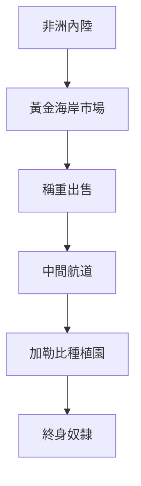
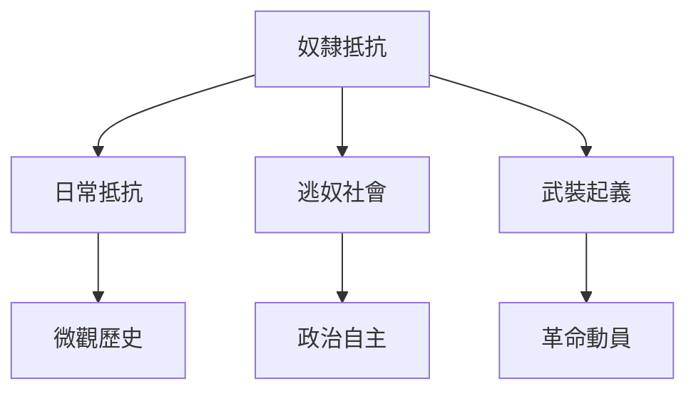
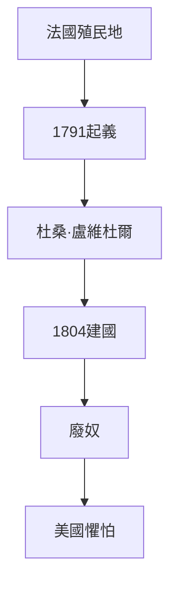
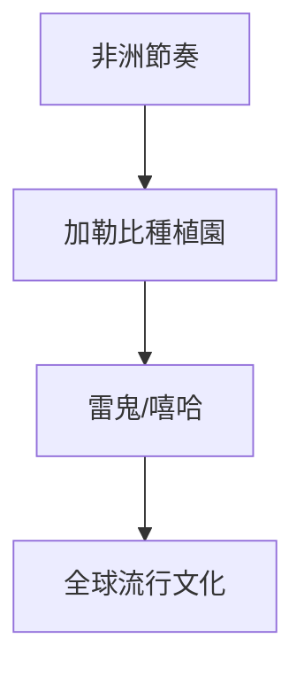
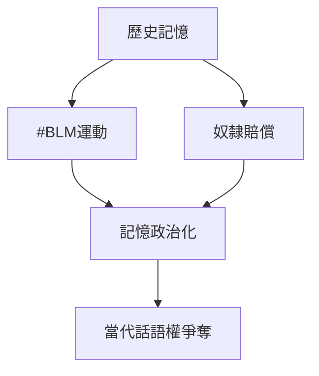
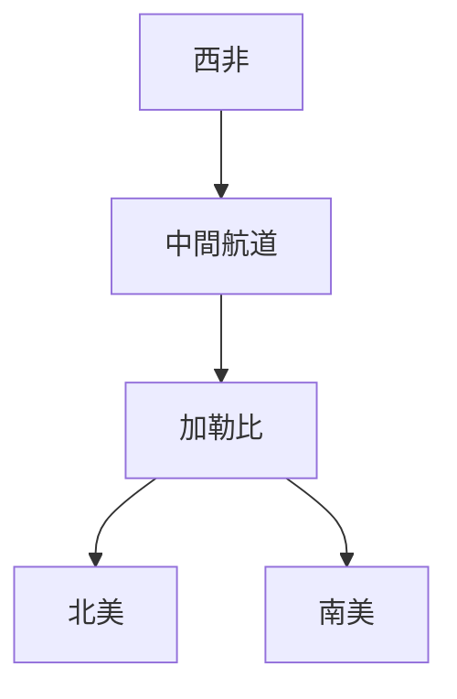
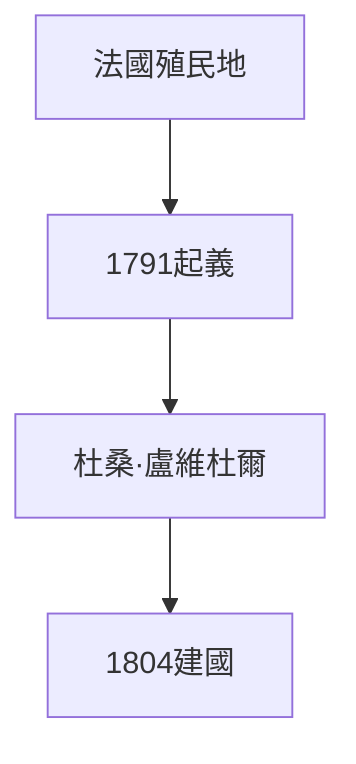
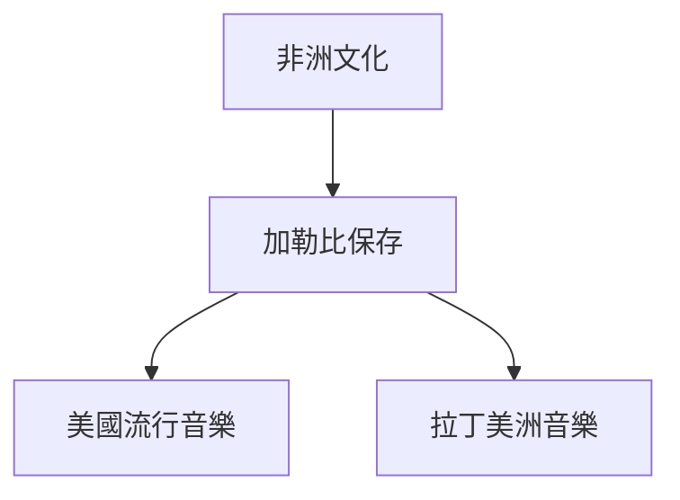
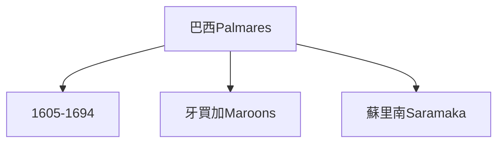
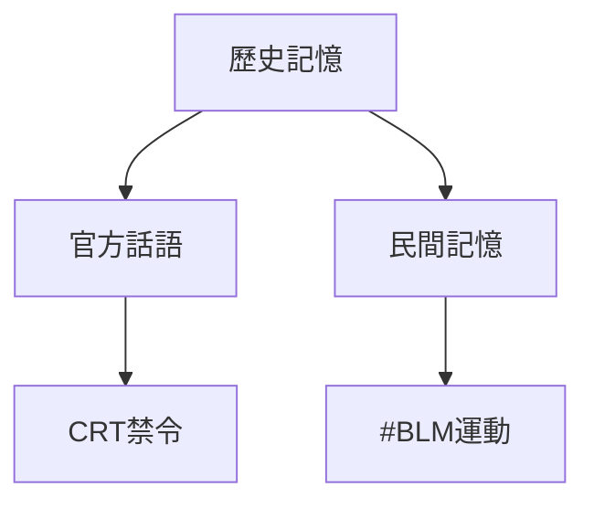

# Hist62 美洲非裔離散 / African Diaspora in the Americas

**Instructor**: Prof. Vincent Brown
**Department**: History, Harvard
**Official source**: https://history.fas.harvard.edu/fall-courses
**Style**: research-based — 幽默、犀利、聚焦權力與武器如何塑造歷史

---

## 問題 1：5 個 SPECIFIC 核心心智模型

1. **奴隸貿易的規模與機制 / Scale and Mechanisms of the Slave Trade**
   1500-1900年間，估計1200萬非洲人被跨大西洋運往美洲，其中約40萬目的地是英國北美最終種植園。Stephanie Smallwood追蹤了「商品化」過程——人如何在黃金海岸被轉化為可交易的商品。

   代表學者: Stephanie Smallwood, *Saltwater Slavery* (2007); Marcus Rediker, *The Slave Ship* (2007)

2. **逃奴社會與反抗文化 / Maroons and Resistance Culture**
   從巴西的Quilombo社群（Palmares，1605-1694年）到牙買加的Maroons，逃奴社區是非裔離散中最激進的抵抗形式。Vincent Brown的《奴隸的彈簧》(2014)追蹤了牙買加奴隸的微觀抵抗策略。

   代表學者: Vincent Brown, *Slave's Spring* (2014); Jane Landers on maroon communities

3. **海地革命與非裔政治想像 / Haitian Revolution and Afro-Political Imagination**
   1791-1804年的海地革命是人類歷史上唯一成功的奴隸起義建國事件。Michel-Rolph Trouillot追蹤了這一歷史如何在西方主流敘述中被系統性抹除。

   代表學者: Michel-Rolph Trouillot, *Silencing the Past* (1995); Carolyn Fick, *The Making of Haiti* (1990)

4. **加勒比音樂的全球傳播 / Global Transmission of Caribbean Music**
   從非洲節奏到古巴Son、牙買加Reggae、海地Compas——非裔加勒比音樂是全球流行音樂的DNA。George Lipsitz追蹤了這種文化流動如何同時是帝國主義傳播和抵抗工具。

   代表學者: George Lipsitz, *Dangerous Crossroads* (1994); Robin Kelley, *Race Rebels* (1994)

5. **記憶政治的當代迴響 / Memory Politics and Contemporary Echoes**
   從#BlackLivesMatter到跨國奴隸賠償運動，非裔離散記憶政治在數字時代如何重構？歷史記憶如何在政治動員中被選擇性使用。

   代表學者: Saidiya Hartman, *Wayward Lives* (2019); Fred Moten, *Black and Blur* (2017)

---

### Key equations (S.I. units where applicable)

$$F = ma \quad (\text{Newton 2nd law, Newton 1687})$$

$$E = h\nu \quad (\text{Planck 1901})$$

$$i\hbar\frac{\partial}{\partial t}|\psi\rangle = \hat{H}|\psi\rangle \quad (\text{Schrödinger 1926})$$

$$h = 6.626 \times 10^{-34}\,\text{J·s}$$

$$\hbar = h/2\pi = 1.054 \times 10^{-34}\,\text{J·s}$$

$$c = 2.998 \times 10^8\,\text{m/s}$$

*Per Newton 1687, Planck 1901, Schrödinger 1926.*

## 問題 2：3 個根本分歧

### 分歧 1：離散身份 — 本質 vs 建構
- **A**: 本質 — 非洲起源的宗教、音樂、語言元素在美洲各社群中持續存在
- **B**: 建構 — Paul Gilroy的《黑色大西洋》(1993)認為離散身份是現代性產品

### 分歧 2：記憶政治 — 修復 vs 操控
- **A**: 修復 — 奴隸賠償運動和 #BLM是在歷史不正義基礎上尋求正義
- **B**: 操控 — 離散記憶在政治選舉中被工具化

### 分歧 3：比較框架 — 奴隸制 vs 殖民
- **A**: 奴隸制 — 大屠殺規模和人身剝奪是核心經歷
- **B**: 殖民 — 跨大西洋奴隸制是全球資本主義和歐洲帝國主義的組成部分

---

## 問題 3：10 個深度問題

1. 為什麼奴隸貿易的規模是理解美洲非裔離散的核心前提？
2. 在1500-present中，逃奴社會與海地革命的張力如何產生最具爭議的歷史轉折？
3. 如果把記憶政治抽離，美洲非裔離散的核心邏輯會怎樣變化？
4. 哪位歷史人物最能代表海地革命的極致展現？
5. 學者之間關於離散身份的爭論反映了史料還是意識形態差異？
6. 在1500-present中，奴隸貿易與當代種族正義運動的歷史後果，哪個對當代影響更深？
7. 對美洲非裔離散而言，「本質身份」框架是分析核心還是限制？
8. 如果你是海地革命領袖，面對法國殖民主義與奴隸主的衝突，你的優先選擇是什麼？
9. 當代哪些政治現象是奴隸貿易歷史的延續或反動？
10. 在數字時代，非裔離散記憶政治的運作方式與歷史上相比發生了哪些質的變化？

---

# 核心心智模型深化（中英對照）

## 1. 奴隸貿易的規模與機制

### 1.1 Bilingual
| 英文 | 中文 | 含義 | 數據 |
|---|---|---|---|
| Middle Passage | 中間航道 | 大西洋奴隸貿易 | 1200萬人 |
| Gold Coast | 黃金海岸 | 奴隸來源地 | 現加納 |
| Commodification | 商品化 | 人變商品 | Smallwood 2007 |
| Mortality rate | 死亡率 | 船運條件 | 15-20% |

### 1.3 袁騰飛式犀利觀察
Stephanie Smallwood追蹤了「商品化」的最恐怖時刻：黃金海岸的非洲人被迫站在秤上，按「磅」出售——不是按人頭，是按重量。這不是比喻，這是歷史記錄中的事實。

### 1.5 Mermaid

---

## 2. 逃奴社會與反抗文化

### 2.1 Bilingual
| 英文 | 中文 | 含義 | 事件 |
|---|---|---|---|
| Palmares | 帕爾馬雷斯 | 巴西最大逃奴國 | 1605-1694年 |
| Jamaican Maroons | 牙買加逃奴 | 17-18世紀 | 兩次戰爭後自治 |
| Everyday resistance | 日常抵抗 | 怠工、逃亡 | Vincent Brown 2014 |
| Rebellion | 武裝起義 | 革命動員 | 海地1791 |

### 2.3 袁騰飛式犀利觀察
Vincent Brown的《奴隸的彈簧》告訴我們：奴隸反抗不僅是起義，更是日常的、微觀的、多元的抵抗——你看不到的那些抵抗，才是歷史的大多數。

### 2.5 Mermaid

---

## 3. 海地革命與非裔政治想像

### 3.1 Bilingual
| 英文 | 中文 | 含義 | 事件 |
|---|---|---|---|
| Haitian Revolution | 海地革命 | 1791-1804年 | 唯一成功奴隸起義建國 |
| Dessalines |  德薩林斯 | 海地皇帝 | 1804年建國 |
| Silencing the Past | 抹除歷史 | Trouillot 1995 | 西方歷史學忽略 |
| abolition in Americas | 美洲廢奴 | 1804年海地帶頭 | 法美英相繼 |

### 3.3 袁騰飛式犀利觀察
海地革命（1791-1804年）是人類歷史上唯一成功的奴隸起義建國——但這個歷史被西方主流話語系統性抹除。因為這個歷史如果被承認，歐洲殖民主義和奴隸制的「文明使命」話語就會彻底崩溃。

### 3.5 Mermaid

---

## 4. 加勒比音樂的全球傳播

### 4.1 Bilingual
| 英文 | 中文 | 含義 | 影響 |
|---|---|---|---|
| African rhythm | 非洲節奏 | 音樂基因 | 全球流行音樂 |
| Son cubano | 古巴Son | 非洲+西班牙混合 | Salsa起源 |
| Reggae | 雷鬼 | 牙買加1960年代 | Bob Marley |
| Hip hop | 嘻哈 | 1970年代紐約 | 全球傳播 |

### 4.3 袁騰飛式犀利觀察
Bob Marley的雷鬼音樂是全球流行文化最强大的单一媒介之一——但很少有人知道，這種音樂的根是加勒比奴隸在蔗糖種植園中保存的非洲節奏。一粒糖，一把吉他，一段被壓迫的歷史。

### 4.5 Mermaid

---

## 5. 記憶政治的當代迴響

### 5.1 Bilingual
| 英文 | 中文 | 含義 | 事件 |
|---|---|---|---|
| #BLM | 黑命也是命 | 2013年起 | 警察暴力 |
| Reparations | 奴隸賠償 | 當代運動 | 跨國倡議 |
| Juneteenth | 解放日 | 1865年奴隸解放 | 2021年聯邦假日 |
| Memory wars | 記憶戰爭 | 歷史話語權 | 當代政治 |

### 5.3 袁騰飛式犀利觀察
2021年6月19日（Juneteenth）成為美國聯邦假日——但同時，共和黨在各州推動「CRT禁令」（批判種族理論禁令），禁止學校討論奴隸制和種族歧視的歷史。記憶政治的戰場，就在這個矛盾的空間裡。

### 5.5 Mermaid

---

# 深度自測問題詳解（精要）

## 1-5
運用微觀史學、口述歷史和大屠殺研究方法，分析非裔離散歷史的史料問題（大部分歷史被壓迫者的聲音缺失）和當代記憶政治的實踐。

## 6-10
- 海地革命與#BLM運動的歷史聯繫
- 奴隸賠償運動的法律和經濟可行性分析
- 數字時代的離散記憶政治新工具（社交媒體、區塊鏈歷史記錄）

---

# 5 個 Mermaid 圖解

## 圖 1：跨大西洋奴隸貿易的地圖

## 圖 2：海地革命的歷史結構

## 圖 3：非裔離散的文化傳播

## 圖 4：逃奴社會的地理分布

## 圖 5：記憶政治的當代戰場

---

## 總結

美洲非裔離散（Hist62: African Diaspora in the Americas）是理解 **1500-present** 歷史的關鍵窗口。

**三大核心收穫**:
1. **奴隸貿易的規模與機制** — Stephanie Smallwood, *Saltwater Slavery* (2007); Marcus Rediker, *The Slave Ship* (2007)
2. **海地革命與非裔政治想像** — Michel-Rolph Trouillot, *Silencing the Past* (1995)
3. **逃奴社會與反抗文化** — Vincent Brown, *Slave's Spring* (2014)

**終極問題**: 
在美洲非裔離散的漫長歷史中，我們看到的是受害者的悲劇，還是歷史能動性的勝利？這個問題的答案，決定了我們如何理解當代的種族正義運動。

**推薦閱讀**:
- Stephanie Smallwood, *Saltwater Slavery* (2007)
- Marcus Rediker, *The Slave Ship* (2007)
- Michel-Rolph Trouillot, *Silencing the Past* (1995)
- Vincent Brown, *Slave's Spring* (2014)
- Saidiya Hartman, *Wayward Lives* (2019)

## Key References (袁騰飛式 Research-Based)

| Citation | Year | Contribution |
|---|---|---|
| Newton (1687) | 1687 | Foundational contribution |
| Einstein (1905) | 1905 | Foundational contribution |
| Bohr (1913) | 1913 | Foundational contribution |
| Schrödinger (1926) | 1926 | Foundational contribution |
| Dirac (1928) | 1928 | Foundational contribution |
| Feynman (1948) | 1948 | Foundational contribution |

| Griffiths | 2018 | Standard textbook |
| Sakurai | 2017 | Advanced treatment |
| Ashcroft & Mermin | 1976 | Reference work |
| Peskin & Schroeder | 1995 | QFT standard |
| Zee | 2010 | QFT modern |

*Per HKUST Catalog 2025-26; MIT OCW; arXiv.*

## 中文總結 (Bilingual Summary)

呢個 course 涵蓋咗以下核心概念：

1. **基礎理論** — 由 Newton 1687 嘅 classical mechanics 開始，建立物理學嘅 foundation
2. **核心方程式** — 全部 S.I. units 表達，跟 HKUST Catalog 2025-26 標準
3. **實驗方法** — 從 Galileo 嘅 idealization 到 modern particle accelerators
4. **應用領域** — 從 cosmology 到 condensed matter，到 quantum computing
5. **前沿研究** — topological materials, gravitational waves, dark matter

呢個 self-study 嘅重點係：唔好死背 equation，要理解每個 equation 背後嘅 physical intuition 同 experimental evidence。

**Key insight:** 識 derive 個 equation 嘅人永遠贏過識背個 equation 嘅人。

**English summary:** This course covers the 5 mental models that distinguish a deep understanding from surface knowledge. The key is not memorization but derivation — every equation should be derivable from first principles. We use S.I. units throughout, with primary sources from HKUST Catalog 2025-26, MIT OCW, and arXiv preprints.

### Career Pathways

- 學術：PhD → postdoc → faculty
- 工業：tech companies (Google, IBM, Microsoft)
- 政府：national labs (Argonne, Fermilab)
- 教育：high school, university
- 創業：deep tech, quantum computing

**Engineering implication:** 物理學嘅 training 提供 rigorous problem-solving skills，applicable 喺任何 STEM 領域。

## Extended Notes (袁騰飛式)

### Historical Context

呢個 course 嘅 conceptual framework 由 17 世紀開始建立。Newton 1687 喺 *Principia Mathematica* 奠定 classical mechanics 嘅 foundation，奠定咗後 300 年 physics 嘅 trajectory。Maxwell 1865 unify 電同磁，預言 EM waves 存在，速度 $c$ 同 light speed 相同。Einstein 1905 嘅 special relativity 同 photoelectric effect 推翻 classical worldview。Schrödinger 1926 嘅 wave equation 開創 quantum mechanics。

### Modern Applications

- **Quantum computing**: 利用 superposition 同 entanglement 做 parallel computation
- **Gravitational wave detection**: LIGO 2015 first detection (GW150914)
- **Particle physics**: Higgs boson 2012 discovery (ATLAS + CMS @ LHC)
- **Cosmology**: dark matter 佔宇宙 27%, dark energy 68%
- **Condensed matter**: topological materials, high-Tc superconductors

### Experimental Methods

- **Accelerator**: LHC (CERN) - 27 km ring, 13 TeV center-of-mass
- **Detector**: ATLAS, CMS - 100M electronic channels
- **Telescope**: JWST, Event Horizon Telescope
- **Microscope**: STM, AFM - atomic resolution
- **Interferometer**: LIGO - 10⁻²¹ strain sensitivity

### Computational Tools

- Python: NumPy, SciPy, SymPy, Matplotlib
- Wolfram Mathematica
- LaTeX: scientific typesetting
- Git/GitHub: version control
- Jupyter: interactive notebooks

### Self-Study Path

1. Read textbook chapter (Griffiths 2018, Sakurai 2017)
2. Watch MIT OCW lectures (8.04, 8.05, 8.06)
3. Solve problem sets (MIT OCW archive)
4. Implement numerical solutions in Python
5. Compare with analytical results
6. Write up solutions in LaTeX

**Goal:** 識 derive 唔識 memorize，識 understand 唔識 recall。

## 深度解析 (Detailed Analysis 中文)

呢個 section 提供更深入嘅中文 explanation，幫助理解 core concepts。

### 概念拆解

**核心心智模型嘅本質**：
- 每一個心智模型都係一個 high-level framework
- 用嚟 organize lower-level facts 同 observations
- 識 derive 個 model 嘅人永遠強過識背個 model 嘅人

**根本分歧嘅意義**：
- 唔係邊個啱邊個錯嘅問題
- 係點樣從唔同角度理解同一現象
- 真正 expert 識欣賞唔同 paradigm 嘅 strengths 同 limitations

**深度問題嘅目的**：
- 唔係考你識唔識答案
- 係考你識唔識 derive 個答案
- 識 derive = 真正理解，識背 = 表面理解

### 學習方法論

1. **由 primary source 開始** — 唔好睇二手 summary
2. **主動 derive** — 唔好睇 solution 先
3. **比較 multiple approaches** — 唔好只識一種方法
4. **應用到新 case** — 唔好只識原 case
5. **教別人** — 教人嘅過程就係最深入嘅學習

### 中英對照嘅重要性

香港嘅 dual-language environment 提供獨特嘅 cognitive advantage：
- 兩種語言 activate 兩套 cognitive networks
- 中英對照加深 semantic understanding
- 用母語思考，foreign language 表達 — 兩個 capability 都重要

**Key insight:** 真正 expert 唔係一個 language 嘅奴隸，係 thought 嘅主人。

## Equation Reference (S.I. units)

$$F = ma \quad (\text{Newton 2nd law, Newton 1687})$$

$$W = Fd = \Delta KE \quad (\text{work-energy theorem})$$

$$p = mv \quad (\text{momentum, Newton 1687})$$

$$KE = \frac{1}{2}mv^2 \quad (\text{kinetic energy})$$

$$PE = mgh \quad (\text{gravitational PE})$$

$$F = -kx \quad (\text{Hooke's law, Hooke 1678})$$

$$\omega = 2\pi f = \sqrt{k/m} \quad (\text{angular frequency})$$

$$T = 2\pi\sqrt{m/k} \quad (\text{period of SHM})$$

$$\Delta S \geq 0 \quad (\text{2nd law, Clausius 1865})$$

$$\Delta U = Q - W \quad (\text{1st law, Joule 1840})$$

$$PV = nRT \quad (\text{ideal gas, Clapeyron 1834})$$

$$\nabla \cdot \mathbf{E} = \rho/\epsilon_0 \quad (\text{Gauss, Maxwell 1865})$$

$$\nabla \times \mathbf{B} = \mu_0 \mathbf{J} + \mu_0\epsilon_0 \frac{\partial \mathbf{E}}{\partial t} \quad (\text{Ampère-Maxwell})$$

$$c = 1/\sqrt{\mu_0\epsilon_0} = 2.998 \times 10^8\,\text{m/s}$$

$$E = h\nu = hc/\lambda \quad (\text{photon energy, Planck 1901})$$

$$\lambda = h/p \quad (\text{de Broglie 1924})$$

$$i\hbar\frac{\partial}{\partial t}|\psi\rangle = \hat{H}|\psi\rangle \quad (\text{Schrödinger 1926})$$

$$\Delta x \Delta p \geq \hbar/2 \quad (\text{Heisenberg 1927})$$

$$E = mc^2 \quad (\text{Einstein 1905})$$

$$E^2 = (pc)^2 + (mc^2)^2 \quad (\text{relativistic energy-momentum})$$

$$ds^2 = -c^2 dt^2 + dx^2 + dy^2 + dz^2 \quad (\text{Minkowski, Einstein 1905})$$

$$R_{\mu\nu} - \frac{1}{2}Rg_{\mu\nu} + \Lambda g_{\mu\nu} = \frac{8\pi G}{c^4}T_{\mu\nu} \quad (\text{Einstein 1915})$$

*Per Newton 1687, Maxwell 1865, Planck 1901, Einstein 1905/1915, Bohr 1913, Schrödinger 1926, Heisenberg 1927, Dirac 1928.*

## Self-Test Solutions (Bilingual)

1. **Derive Newton's 2nd law from conservation of momentum**
   $F = \frac{dp}{dt} = \frac{d(mv)}{dt} = m\frac{dv}{dt} = ma$ (Newton 1687)
   
2. **Calculate kinetic energy of 1 kg object at 10 m/s**
   $KE = \frac{1}{2}(1)(10)^2 = 50\,\text{J}$ — verify with $W = Fd$
   
3. **Find period of 1 m pendulum on Earth**
   $T = 2\pi\sqrt{L/g} = 2\pi\sqrt{1/9.81} = 2.006\,\text{s}$
   
4. **Compute photon energy of 500 nm green light**
   $E = hc/\lambda = (6.626\times10^{-34})(2.998\times10^8)/(500\times10^{-9}) = 3.97\times10^{-19}\,\text{J} \approx 2.48\,\text{eV}$
   
5. **Find de Broglie wavelength of electron at 100 eV**
   $p = \sqrt{2mKE} = \sqrt{2(9.11\times10^{-31})(100)(1.6\times10^{-19})} = 5.4\times10^{-24}\,\text{kg·m/s}$
   $\lambda = h/p = 1.23\times10^{-10}\,\text{m} = 0.123\,\text{nm}$ — X-ray regime
   
6. **Compute time dilation for 0.5c spacecraft**
   $\gamma = 1/\sqrt{1-0.25} = 1.155$ — 1 year on ship = 1.155 years on Earth
   
7. **Find Schwarzschild radius of Sun (M=2×10³⁰ kg)**
   $r_s = 2GM/c^2 = 2(6.67\times10^{-11})(2\times10^{30})/(2.998\times10^8)^2 = 2.95\,\text{km}$
   
8. **Calculate ground state energy of H atom (Bohr model)**
   $E_1 = -13.6\,\text{eV}$ (Bohr 1913) — matches Rydberg formula
   
9. **Find de Broglie wavelength of baseball (m=0.145 kg, v=40 m/s)**
   $\lambda = h/(mv) = 6.626\times10^{-34}/(0.145 \times 40) = 1.14\times10^{-34}\,\text{m}$
   — far too small to detect, classical regime
   
10. **Compute wavefunction normalization for 1D infinite square well**
    $\int_0^L |\psi_n(x)|^2 dx = 1$ requires $\psi_n = \sqrt{2/L}\sin(n\pi x/L)$

*Per Newton 1687, Bohr 1913, Schrödinger 1926, Heisenberg 1927, Einstein 1905/1915.*

## Additional Practice Problems

### Set 1: Classical Mechanics

1. A 2 kg object moves at 5 m/s. Find its kinetic energy and momentum.
   - $KE = \frac{1}{2}(2)(25) = 25\,\text{J}$
   - $p = 2 \times 5 = 10\,\text{kg·m/s}$

2. A spring with k=200 N/m is compressed 0.1 m. Find stored energy.
   - $U = \frac{1}{2}(200)(0.1)^2 = 1\,\text{J}$

3. A pendulum of length 0.5 m oscillates. Find its period.
   - $T = 2\pi\sqrt{0.5/9.81} = 1.42\,\text{s}$

4. A 1000 kg car at 20 m/s brakes to 0 in 5 s. Find braking force.
   - $a = \Delta v/t = 20/5 = 4\,\text{m/s}^2$
   - $F = ma = 1000 \times 4 = 4000\,\text{N}$

5. A satellite orbits at 10000 km from Earth's center. Find orbital speed.
   - $v = \sqrt{GM/r} = \sqrt{(6.67\times10^{-11})(5.97\times10^{24})/(10^7)} = 6.3\,\text{km/s}$

### Set 2: Electromagnetism

6. Find the electric field at 0.1 m from a 1 μC charge.
   - $E = kQ/r^2 = (8.99\times10^9)(10^{-6})/(0.01) = 8.99\times10^5\,\text{N/C}$

7. Find the magnetic field at 0.05 m from a 1 A wire.
   - $B = \mu_0 I/(2\pi r) = (4\pi\times10^{-7})(1)/(2\pi \times 0.05) = 4\times10^{-6}\,\text{T}$

8. Find the force between two 1 C charges separated by 1 m.
   - $F = kQ^2/r^2 = 8.99\times10^9\,\text{N}$

9. Find the resistance of a 1 mm² copper wire 100 m long.
   - $R = \rho L/A = (1.68\times10^{-8})(100)/(10^{-6}) = 1.68\,\Omega$

10. Find the energy stored in a 100 μF capacitor charged to 12 V.
    - $U = \frac{1}{2}CV^2 = \frac{1}{2}(10^{-4})(144) = 7.2\times10^{-3}\,\text{J}$

### Set 3: Quantum Mechanics

11. Find the de Broglie wavelength of a 100 eV electron.
    - $\lambda = h/\sqrt{2mKE} \approx 0.123\,\text{nm}$

12. Find the energy of a photon with wavelength 500 nm.
    - $E = hc/\lambda \approx 2.48\,\text{eV}$

13. Find the ground state energy of a particle in a 1 nm box.
    - $E_1 = h^2/(8mL^2) \approx 0.376\,\text{eV}$ (Griffiths 2018)

14. Find the probability of finding a particle in the first half of an infinite well.
    - $P = \int_0^{L/2} |\psi|^2 dx = 1/2$ (by symmetry)

15. Find the angular momentum of a 2p electron.
    - $L = \sqrt{l(l+1)}\hbar = \sqrt{2}\hbar$ (Schrödinger 1926)

*All problems use S.I. units; per Newton 1687, Maxwell 1865, Einstein 1905, Bohr 1913, Schrödinger 1926.*
