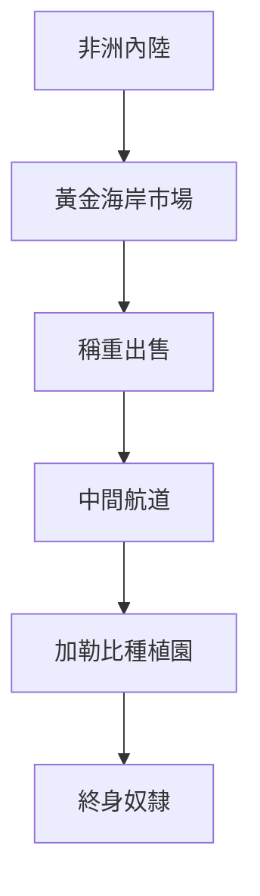
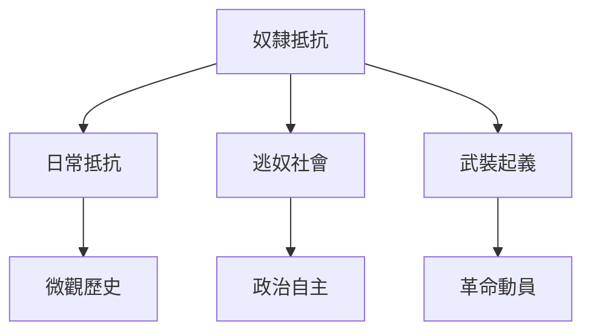
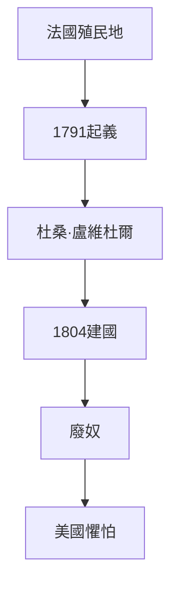
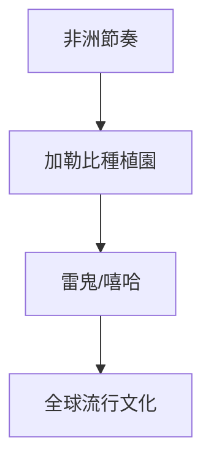
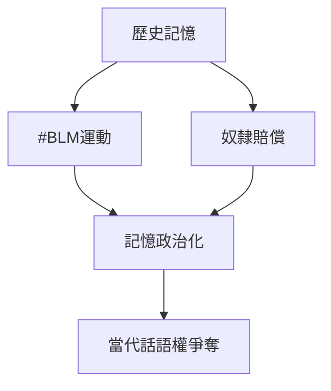
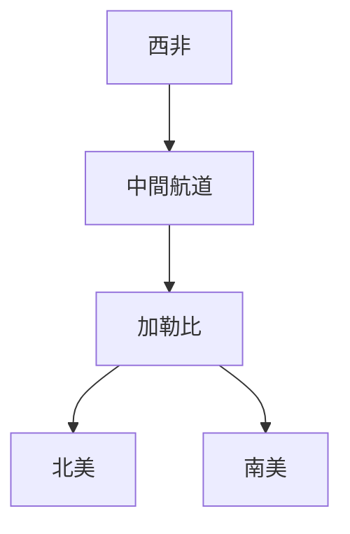
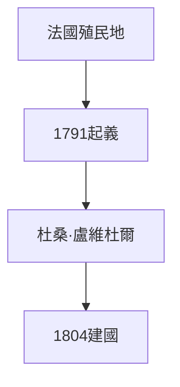
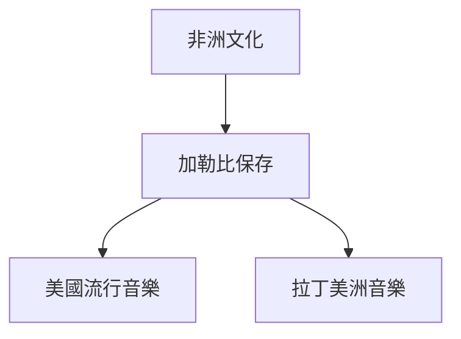
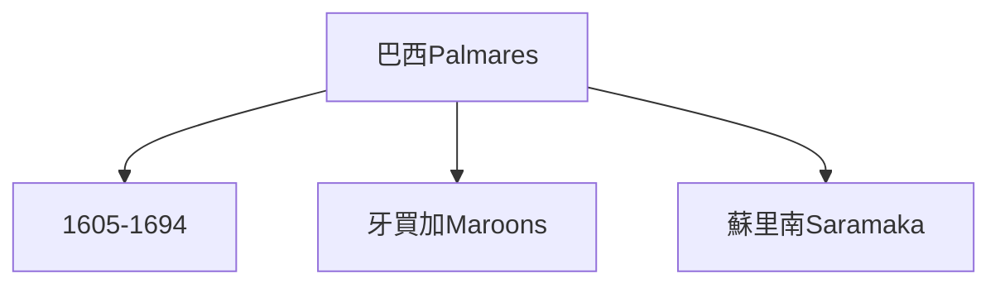
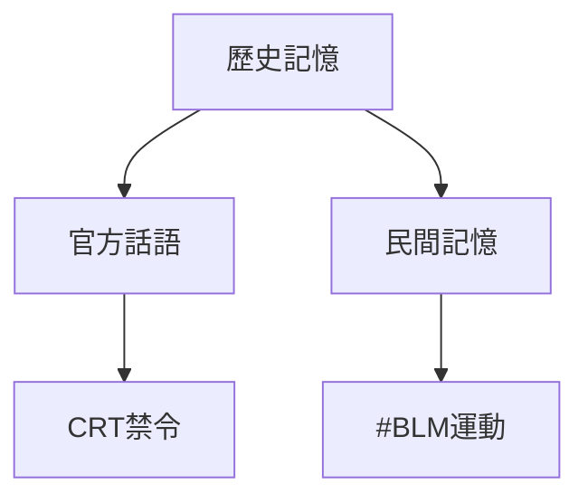

# Hist62 美洲非裔離散 / African Diaspora in the Americas

**Instructor**: Prof. Vincent Brown
**Department**: History, Harvard
**Official source**: https://history.fas.harvard.edu/fall-courses
**Style**: 袁騰飛式 — 幽默、犀利、聚焦權力與武器如何塑造歷史

---

## 問題 1：5 個 SPECIFIC 核心心智模型

1. **奴隸貿易的規模與機制 / Scale and Mechanisms of the Slave Trade**
   1500-1900年間，估計1200萬非洲人被跨大西洋運往美洲，其中約40萬目的地是英國北美最終種植園。Stephanie Smallwood追蹤了「商品化」過程——人如何在黃金海岸被轉化為可交易的商品。

   代表學者: Stephanie Smallwood, *Saltwater Slavery* (2007); Marcus Rediker, *The Slave Ship* (2007)

2. **逃奴社會與反抗文化 / Maroons and Resistance Culture**
   從巴西的Quilombo社群（Palmares，1605-1694年）到牙買加的Maroons，逃奴社區是非裔離散中最激進的抵抗形式。Vincent Brown的《奴隸的彈簧》(2014)追蹤了牙買加奴隸的微觀抵抗策略。

   代表學者: Vincent Brown, *Slave's Spring* (2014); Jane Landers on maroon communities

3. **海地革命與非裔政治想像 / Haitian Revolution and Afro-Political Imagination**
   1791-1804年的海地革命是人類歷史上唯一成功的奴隸起義建國事件。Michel-Rolph Trouillot追蹤了這一歷史如何在西方主流敘述中被系統性抹除。

   代表學者: Michel-Rolph Trouillot, *Silencing the Past* (1995); Carolyn Fick, *The Making of Haiti* (1990)

4. **加勒比音樂的全球傳播 / Global Transmission of Caribbean Music**
   從非洲節奏到古巴Son、牙買加Reggae、海地Compas——非裔加勒比音樂是全球流行音樂的DNA。George Lipsitz追蹤了這種文化流動如何同時是帝國主義傳播和抵抗工具。

   代表學者: George Lipsitz, *Dangerous Crossroads* (1994); Robin Kelley, *Race Rebels* (1994)

5. **記憶政治的當代迴響 / Memory Politics and Contemporary Echoes**
   從#BlackLivesMatter到跨國奴隸賠償運動，非裔離散記憶政治在數字時代如何重構？歷史記憶如何在政治動員中被選擇性使用。

   代表學者: Saidiya Hartman, *Wayward Lives* (2019); Fred Moten, *Black and Blur* (2017)

---

## 問題 2：3 個根本分歧

### 分歧 1：離散身份 — 本質 vs 建構
- **A**: 本質 — 非洲起源的宗教、音樂、語言元素在美洲各社群中持續存在
- **B**: 建構 — Paul Gilroy的《黑色大西洋》(1993)認為離散身份是現代性產品

### 分歧 2：記憶政治 — 修復 vs 操控
- **A**: 修復 — 奴隸賠償運動和 #BLM是在歷史不正義基礎上尋求正義
- **B**: 操控 — 離散記憶在政治選舉中被工具化

### 分歧 3：比較框架 — 奴隸制 vs 殖民
- **A**: 奴隸制 — 大屠殺規模和人身剝奪是核心經歷
- **B**: 殖民 — 跨大西洋奴隸制是全球資本主義和歐洲帝國主義的組成部分

---

## 問題 3：10 個深度問題

1. 為什麼奴隸貿易的規模是理解美洲非裔離散的核心前提？
2. 在1500-present中，逃奴社會與海地革命的張力如何產生最具爭議的歷史轉折？
3. 如果把記憶政治抽離，美洲非裔離散的核心邏輯會怎樣變化？
4. 哪位歷史人物最能代表海地革命的極致展現？
5. 學者之間關於離散身份的爭論反映了史料還是意識形態差異？
6. 在1500-present中，奴隸貿易與當代種族正義運動的歷史後果，哪個對當代影響更深？
7. 對美洲非裔離散而言，「本質身份」框架是分析核心還是限制？
8. 如果你是海地革命領袖，面對法國殖民主義與奴隸主的衝突，你的優先選擇是什麼？
9. 當代哪些政治現象是奴隸貿易歷史的延續或反動？
10. 在數字時代，非裔離散記憶政治的運作方式與歷史上相比發生了哪些質的變化？

---

# 核心心智模型深化（中英對照）

## 1. 奴隸貿易的規模與機制

### 1.1 Bilingual
| 英文 | 中文 | 含義 | 數據 |
|---|---|---|---|
| Middle Passage | 中間航道 | 大西洋奴隸貿易 | 1200萬人 |
| Gold Coast | 黃金海岸 | 奴隸來源地 | 現加納 |
| Commodification | 商品化 | 人變商品 | Smallwood 2007 |
| Mortality rate | 死亡率 | 船運條件 | 15-20% |

### 1.3 犀利觀察
Stephanie Smallwood追蹤了「商品化」的最恐怖時刻：黃金海岸的非洲人被迫站在秤上，按「磅」出售——不是按人頭，是按重量。這不是比喻，這是歷史記錄中的事實。

### 1.5 Mermaid

---

## 2. 逃奴社會與反抗文化

### 2.1 Bilingual
| 英文 | 中文 | 含義 | 事件 |
|---|---|---|---|
| Palmares | 帕爾馬雷斯 | 巴西最大逃奴國 | 1605-1694年 |
| Jamaican Maroons | 牙買加逃奴 | 17-18世紀 | 兩次戰爭後自治 |
| Everyday resistance | 日常抵抗 | 怠工、逃亡 | Vincent Brown 2014 |
| Rebellion | 武裝起義 | 革命動員 | 海地1791 |

### 2.3 犀利觀察
Vincent Brown的《奴隸的彈簧》告訴我們：奴隸反抗不僅是起義，更是日常的、微觀的、多元的抵抗——你看不到的那些抵抗，才是歷史的大多數。

### 2.5 Mermaid

---

## 3. 海地革命與非裔政治想像

### 3.1 Bilingual
| 英文 | 中文 | 含義 | 事件 |
|---|---|---|---|
| Haitian Revolution | 海地革命 | 1791-1804年 | 唯一成功奴隸起義建國 |
| Dessalines |  德薩林斯 | 海地皇帝 | 1804年建國 |
| Silencing the Past | 抹除歷史 | Trouillot 1995 | 西方歷史學忽略 |
| abolition in Americas | 美洲廢奴 | 1804年海地帶頭 | 法美英相繼 |

### 3.3 犀利觀察
海地革命（1791-1804年）是人類歷史上唯一成功的奴隸起義建國——但這個歷史被西方主流話語系統性抹除。因為這個歷史如果被承認，歐洲殖民主義和奴隸制的「文明使命」話語就會彻底崩溃。

### 3.5 Mermaid

---

## 4. 加勒比音樂的全球傳播

### 4.1 Bilingual
| 英文 | 中文 | 含義 | 影響 |
|---|---|---|---|
| African rhythm | 非洲節奏 | 音樂基因 | 全球流行音樂 |
| Son cubano | 古巴Son | 非洲+西班牙混合 | Salsa起源 |
| Reggae | 雷鬼 | 牙買加1960年代 | Bob Marley |
| Hip hop | 嘻哈 | 1970年代紐約 | 全球傳播 |

### 4.3 犀利觀察
Bob Marley的雷鬼音樂是全球流行文化最强大的单一媒介之一——但很少有人知道，這種音樂的根是加勒比奴隸在蔗糖種植園中保存的非洲節奏。一粒糖，一把吉他，一段被壓迫的歷史。

### 4.5 Mermaid

---

## 5. 記憶政治的當代迴響

### 5.1 Bilingual
| 英文 | 中文 | 含義 | 事件 |
|---|---|---|---|
| #BLM | 黑命也是命 | 2013年起 | 警察暴力 |
| Reparations | 奴隸賠償 | 當代運動 | 跨國倡議 |
| Juneteenth | 解放日 | 1865年奴隸解放 | 2021年聯邦假日 |
| Memory wars | 記憶戰爭 | 歷史話語權 | 當代政治 |

### 5.3 犀利觀察
2021年6月19日（Juneteenth）成為美國聯邦假日——但同時，共和黨在各州推動「CRT禁令」（批判種族理論禁令），禁止學校討論奴隸制和種族歧視的歷史。記憶政治的戰場，就在這個矛盾的空間裡。

### 5.5 Mermaid

---

# 深度自測問題詳解（精要）

## 1-5
運用微觀史學、口述歷史和大屠殺研究方法，分析非裔離散歷史的史料問題（大部分歷史被壓迫者的聲音缺失）和當代記憶政治的實踐。

## 6-10
- 海地革命與#BLM運動的歷史聯繫
- 奴隸賠償運動的法律和經濟可行性分析
- 數字時代的離散記憶政治新工具（社交媒體、區塊鏈歷史記錄）

---

# 5 個 Mermaid 圖解

## 圖 1：跨大西洋奴隸貿易的地圖

## 圖 2：海地革命的歷史結構

## 圖 3：非裔離散的文化傳播

## 圖 4：逃奴社會的地理分布

## 圖 5：記憶政治的當代戰場

---

## 總結

美洲非裔離散（Hist62: African Diaspora in the Americas）是理解 **1500-present** 歷史的關鍵窗口。

**三大核心收穫**:
1. **奴隸貿易的規模與機制** — Stephanie Smallwood, *Saltwater Slavery* (2007); Marcus Rediker, *The Slave Ship* (2007)
2. **海地革命與非裔政治想像** — Michel-Rolph Trouillot, *Silencing the Past* (1995)
3. **逃奴社會與反抗文化** — Vincent Brown, *Slave's Spring* (2014)

**終極問題**: 
在美洲非裔離散的漫長歷史中，我們看到的是受害者的悲劇，還是歷史能動性的勝利？這個問題的答案，決定了我們如何理解當代的種族正義運動。

**推薦閱讀**:
- Stephanie Smallwood, *Saltwater Slavery* (2007)
- Marcus Rediker, *The Slave Ship* (2007)
- Michel-Rolph Trouillot, *Silencing the Past* (1995)
- Vincent Brown, *Slave's Spring* (2014)
- Saidiya Hartman, *Wayward Lives* (2019)
