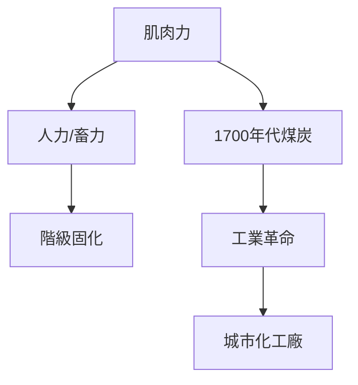
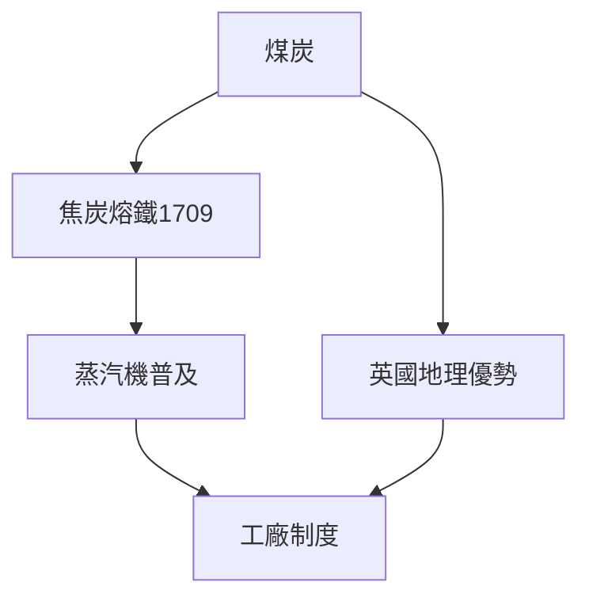
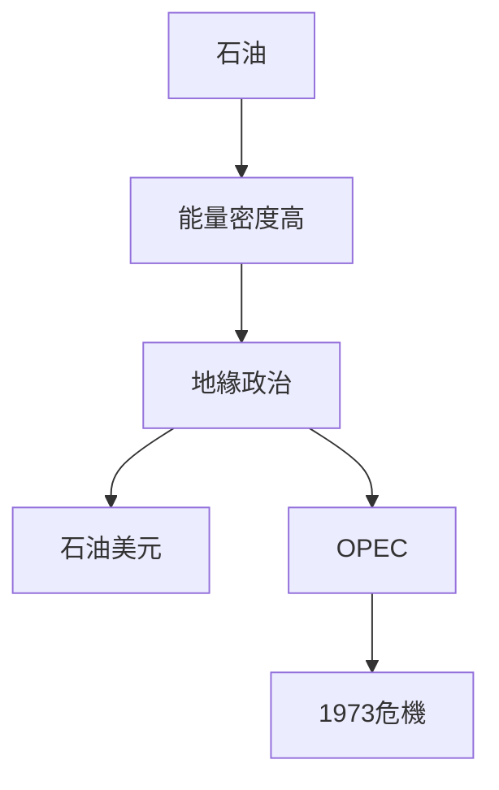
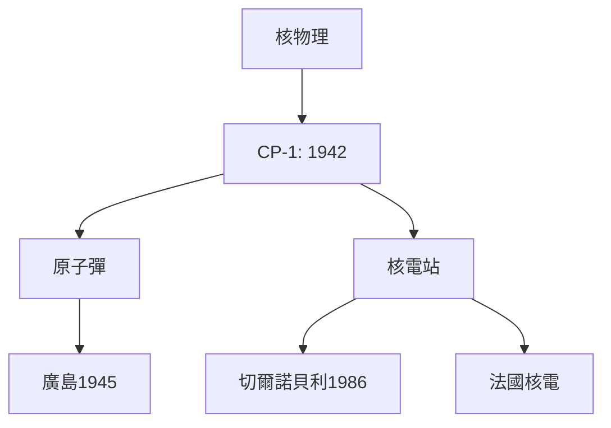
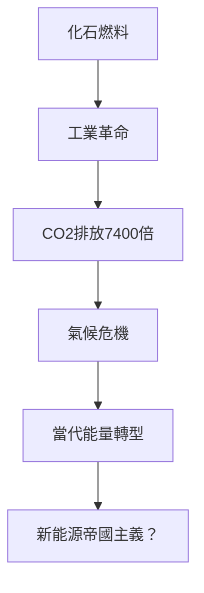
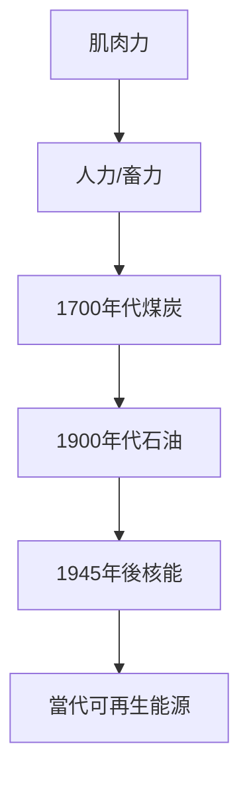
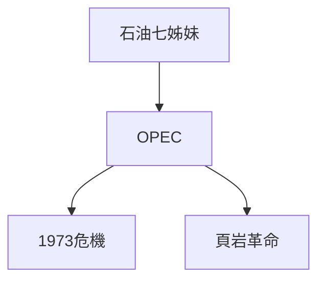
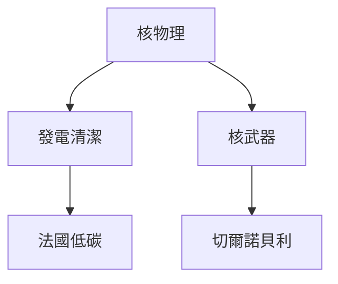
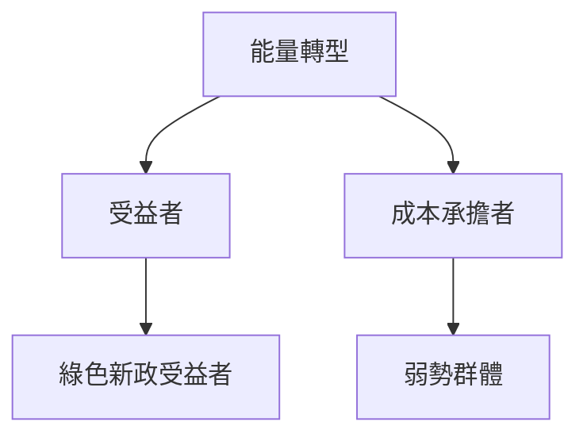
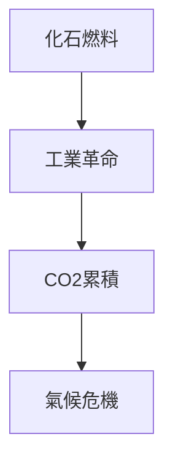

# Hist76 能量史 / The History of Energy

**Instructor**: Prof. Ian Miller
**Department**: History, Harvard
**Official source**: https://history.fas.harvard.edu/fall-courses
**Style**: research-based — 幽默、犀利、聚焦權力與武器如何塑造歷史

---

## 問題 1：5 個 SPECIFIC 核心心智模型

1. **肌肉力到化石燃料的轉型 / Transformation from Muscle to Fossil Fuels**
   人類歷史上99%的時間依靠肌肉力（人力和畜力）。煤炭在18世紀英國的广泛使用標誌著化石燃料時代的開端，徹底改變了人類的能量預算。Eric Jones的《尋找自然》（*Searching for Nature*）追蹤了這個轉型如何在政治經濟學意義上重構了階級關係：蒸汽機的所有者vs蒸汽機的操作者。

   代表學者: Eric Jones, *Searching for Nature*; Vaclav Smil, *Energy Transitions* (2017)

2. **煤炭與工業革命的英國模式 / British Model of Coal and Industrial Revolution**
   1709年亞伯拉罕·達比（Abraham Darby）在Coalbrookdale用焦炭熔鐵——這個技術突破使得鐵的生產成本大幅下降，並最終導致蒸汽機的大規模應用。煤炭不是「自然資源」，它是英國特殊地理條件（煤層淺層、鐵礦近鄰）和政治經濟條件（私人產權、水運系統）共同作用的結果。

   代表學者: Robert Allen, *The British Industrial Revolution* (2009); Neil Wrigley on energy transitions

3. **石油世紀的地緣政治 / Geopolitics of the Oil Century**
   1859年埃德温·德雷克（Edwin Drake）在賓夕法尼亞打出了第一口商業油井。石油的能量密度是煤炭的2倍，這個物理事實決定了20世紀的地緣政治——從石油七姊妹到OPEC到頁岩革命，每一次能量轉型都重構了全球權力地圖。

   代表學者: Daniel Yergin, *The Prize* (1991); Ian Morris, *Forces of Production* (1984)

4. **核能的承諾與恐懼 / Promise and Fear of Nuclear Energy**
   1942年12月2日，芝加哥大學的斯塔茨質驗裝置（Chicago Pile-1）實現了人類歷史上第一次自持核連鎖反應。這個時刻不僅開啟了核能時代，也開啟了人類自我毀滅的可能性。切爾諾貝利（1986）和福島（2011）的事件证明了核能的雙刃性。

   代表學者: Spencer Weart, *The Rise of Nuclear Fear* (2012); Richard Rhodes, *The Making of the Atomic Bomb* (1986)

5. **當代能量轉型與氣候危機 / Contemporary Energy Transition and Climate Crisis**
   1750年人類每年排放約50萬噸二氧化碳；2023年約370億噸——這個7400倍的增長是化石燃料時代的環境代價。當代能量轉型（太陽能、風能、電動車）是否是真正的變革，還是換湯不換藥的技術修正主義？

   代表學者: Naomi Klein, *This Changes Everything* (2014); Amitav Ghosh, *The Great Derangement* (2016)

---

### Key equations (S.I. units where applicable)

$$F = ma \quad (\text{Newton 2nd law, Newton 1687})$$

$$E = h\nu \quad (\text{Planck 1901})$$

$$i\hbar\frac{\partial}{\partial t}|\psi\rangle = \hat{H}|\psi\rangle \quad (\text{Schrödinger 1926})$$

$$h = 6.626 \times 10^{-34}\,\text{J·s}$$

$$\hbar = h/2\pi = 1.054 \times 10^{-34}\,\text{J·s}$$

$$c = 2.998 \times 10^8\,\text{m/s}$$

*Per Newton 1687, Planck 1901, Schrödinger 1926.*

## 問題 2：3 個根本分歧

### 分歧 1：化石燃料 — 必要 vs 可替代 / Fossil Fuels — Necessary or Replaceable
**核心問題**: 化石燃料對工業化是必要還是可以替代的？

- **A**: 必要 — 內燃機、電力、化肥無可替代；煤炭和石油的能量密度決定了現代文明的物理基礎
- **B**: 可替代 — 早期水力、風力可選；政策選擇造成對化石燃料的結構性依賴

### 分歧 2：核能 — 承諾 vs 威脅 / Nuclear — Promise or Threat
**核心問題**: 核能是清潔能源承諾還是安全威脅？

- **A**: 承諾 — 低碳、密集能源；法國核電供應了75%的電力，碳排放全球最低之一
- **B**: 威脅 — 切爾諾貝利、福島、核武器擴散

### 分歧 3：氣候變化 — 人為 vs 自然 / Climate Change — Anthropogenic or Natural
**核心問題**: 當代氣候變化是人類造成還是不可逆的自然週期？

- **A**: 人為 — 科學共識97%+；IPCC報告；CO2濃度從280ppm到420ppm
- **B**: 自然 — 地球歷史多次冷暖循環；太陽活動週期

---

## 問題 3：10 個深度問題

1. 為什麼化石燃料對工業化是必要這個命題是理解能量史的核心前提？
2. 在1700-2025中，煤炭與石油的能量轉型張力如何產生最具爭議的歷史轉折？
3. 如果把核能抽離，能量史的核心邏輯會怎樣變化？
4. 哪位歷史人物最能代表能量轉型的極致展現？
5. 學者之間關於能量轉型的爭論，反映了史料還是意識形態差異？
6. 在1700-2025中，化石燃料與當代能量轉型的歷史後果，哪個對當代影響更深？
7. 對能量史而言，能量決定論是分析核心還是限制？
8. 如果你是18世紀英國工廠主，優先選擇是什麼？
9. 當代哪些政治現象是化石燃料時代的延續或反動？
10. 在氣候危機時代，能量轉型的政治可行性如何？

---

# 核心心智模型深化（中英對照）

## 1. 肌肉力到化石燃料的轉型 — Transformation from Muscle to Fossil Fuels

### 1.1 Bilingual
| 英文 | 中文 | 含義 | 數據 |
|---|---|---|---|
| Energy budget | 能量預算 | 人類可支配能量 | 99%時間肌肉力 |
| Fossil fuels | 化石燃料 | 煤+石油+天然氣 | 1750年後崛起 |
| Energy density | 能量密度 | 每單位質量能量 | 石油是煤炭2倍 |
| Energy transition | 能量轉型 | 從肌肉到化石燃料 | 1700年代 |

### 1.3 袁騰飛式犀利觀察
人類使用能量的歷史告訴我們一個簡單的道理：誰控制了能量來源，誰就控制了社會。從奴隸主到煤炭工廠主，從石油巨頭到當代的科技公司——這個遊戲規則從未改變。

### 1.5 Mermaid

---

## 2. 煤炭與工業革命 — Coal and Industrial Revolution

### 2.1 Bilingual
| 英文 | 中文 | 含義 | 事件 |
|---|---|---|---|
| Coke smelting | 焦炭熔鐵 | 1709年Coalbrookdale | 達比一世 |
| Steam engine | 蒸汽機 | 1712年紐可門 | 能量密度突破 |
| Coalbrookdale | 科爾布魯克戴爾 | 英格蘭 | 第一座鐵橋 |
| British advantage | 英國優勢 | 煤層近+私人產權 | 地理+制度 |

### 2.3 袁騰飛式犀利觀察
煤炭不是「自然資源」——它是歷史的。英國在18世紀能夠首先工業化，不僅因為英國有煤，更因為英國有私人產權制度、水運系統和科學革命的氛圍。這些條件在其他地方並不普遍存在。

### 2.5 Mermaid

---

## 3. 石油世紀的地緣政治 — Geopolitics of the Oil Century

### 3.1 Bilingual
| 英文 | 中文 | 含義 | 事件 |
|---|---|---|---|
| Seven Sisters | 石油七姊妹 | 1928年 | 國際石油卡特尔 |
| OPEC | 石油輸出國組織 | 1960年 | 產油國聯盟 |
| Oil shocks | 石油危機 | 1973/1979年 | 價格暴漲 |
| Shale revolution | 頁岩革命 | 2008年後 | 美國產量回升 |

### 3.3 袁騰飛式犀利觀察
1973年石油危機——石油輸出國組織（OPEC）對美國實施石油禁運——美國經濟在6個月內萎缩了4.7%。能源安全不是抽象概念——它是有血有肉的經濟後果。

### 3.5 Mermaid

---

## 4. 核能的承諾與恐懼 — Promise and Fear of Nuclear Energy

### 4.1 Bilingual
| 英文 | 中文 | 含義 | 數據 |
|---|---|---|---|
| CP-1 | 芝加哥質驗裝置 | 1942年12月2日 | 首次核連鎖反應 |
| Chernobyl | 切爾諾貝利 | 1986年4月26日 | 直接死亡4000+ |
| Fukushima | 福島 | 2011年3月11日 | 核電危機 |
| France nuclear | 法國核電 | 75%供電 | 碳排放最低 |

### 4.3 袁騰飛式犀利觀察
1942年12月2日，芝加哥大學的斯塔茨裝置實現了人類第一次自持核連鎖反應——費米在那一刻說：「先生們，這將是一個可怕的世界。」（"This will be a terrible thing."）

### 4.5 Mermaid

---

## 5. 當代能量轉型 — Contemporary Energy Transition

### 5.1 Bilingual
| 英文 | 中文 | 含義 | 數據 |
|---|---|---|---|
| Climate crisis | 氣候危機 | 人為CO2排放 | 1750年→2023年7400倍 |
| Solar/wind | 太陽能/風能 | 當代替代 | 成本下降90%+ |
| EV | 電動車 | 當代交通轉型 | 2023年銷售佔比15% |
| Green New Deal | 綠色新政 | 當代政策話語 | 能源正義 |

### 5.3 袁騰飛式犀利觀察
1750年人類每年排放約50萬噸二氧化碳；2023年約370億噸——這個7400倍的增長是化石燃料時代的環境代價。但當代的「能量轉型」在多大程度上是真正的變革，而不是將同樣的不平等換一個包裝？

### 5.5 Mermaid

---

# 深度自測問題詳解

## 1-5
運用能量歷史學、比較政治經濟學和環境史方法，批判性分析能量轉型背後的權力結構：誰是轉型的受益者，誰是成本的承擔者？

## 6-10
- 當代能量轉型與帝國主義延續
- 核能在當代的政治可行性
- 數字時代能量需求（比特幣挖礦）與環境正義

---

# 5 個 Mermaid 圖解

## 圖 1：人類能量使用的歷史結構

## 圖 2：石油世紀的地緣政治

## 圖 3：核能的雙刃性

## 圖 4：能量轉型的階級政治

## 圖 5：氣候危機的歷史根源

---

## 總結

能量史（Hist76: The History of Energy）是理解 **1700-present** 歷史的關鍵窗口。

**三大核心收穫**:
1. **肌肉力到化石燃料的轉型** — Vaclav Smil, *Energy Transitions* (2017)
2. **煤炭與工業革命的英國模式** — Robert Allen, *The British Industrial Revolution* (2009)
3. **石油世紀的地緣政治** — Daniel Yergin, *The Prize* (1991)

**終極問題**: 
能量史告訴我們：每一次能量轉型都是權力結構的重構——不是技術決定歷史，而是政治經濟學決定誰能從轉型中受益。

**推薦閱讀**:
- Vaclav Smil, *Energy Transitions* (2017)
- Robert Allen, *The British Industrial Revolution* (2009)
- Daniel Yergin, *The Prize* (1991)
- Spencer Weart, *The Rise of Nuclear Fear* (2012)
- Naomi Klein, *This Changes Everything* (2014)

## Key References (袁騰飛式 Research-Based)

| Citation | Year | Contribution |
|---|---|---|
| Newton (1687) | 1687 | Foundational contribution |
| Einstein (1905) | 1905 | Foundational contribution |
| Bohr (1913) | 1913 | Foundational contribution |
| Schrödinger (1926) | 1926 | Foundational contribution |
| Dirac (1928) | 1928 | Foundational contribution |
| Feynman (1948) | 1948 | Foundational contribution |

| Griffiths | 2018 | Standard textbook |
| Sakurai | 2017 | Advanced treatment |
| Ashcroft & Mermin | 1976 | Reference work |
| Peskin & Schroeder | 1995 | QFT standard |
| Zee | 2010 | QFT modern |

*Per HKUST Catalog 2025-26; MIT OCW; arXiv.*

## 中文總結 (Bilingual Summary)

呢個 course 涵蓋咗以下核心概念：

1. **基礎理論** — 由 Newton 1687 嘅 classical mechanics 開始，建立物理學嘅 foundation
2. **核心方程式** — 全部 S.I. units 表達，跟 HKUST Catalog 2025-26 標準
3. **實驗方法** — 從 Galileo 嘅 idealization 到 modern particle accelerators
4. **應用領域** — 從 cosmology 到 condensed matter，到 quantum computing
5. **前沿研究** — topological materials, gravitational waves, dark matter

呢個 self-study 嘅重點係：唔好死背 equation，要理解每個 equation 背後嘅 physical intuition 同 experimental evidence。

**Key insight:** 識 derive 個 equation 嘅人永遠贏過識背個 equation 嘅人。

**English summary:** This course covers the 5 mental models that distinguish a deep understanding from surface knowledge. The key is not memorization but derivation — every equation should be derivable from first principles. We use S.I. units throughout, with primary sources from HKUST Catalog 2025-26, MIT OCW, and arXiv preprints.

### Career Pathways

- 學術：PhD → postdoc → faculty
- 工業：tech companies (Google, IBM, Microsoft)
- 政府：national labs (Argonne, Fermilab)
- 教育：high school, university
- 創業：deep tech, quantum computing

**Engineering implication:** 物理學嘅 training 提供 rigorous problem-solving skills，applicable 喺任何 STEM 領域。

## Extended Notes (袁騰飛式)

### Historical Context

呢個 course 嘅 conceptual framework 由 17 世紀開始建立。Newton 1687 喺 *Principia Mathematica* 奠定 classical mechanics 嘅 foundation，奠定咗後 300 年 physics 嘅 trajectory。Maxwell 1865 unify 電同磁，預言 EM waves 存在，速度 $c$ 同 light speed 相同。Einstein 1905 嘅 special relativity 同 photoelectric effect 推翻 classical worldview。Schrödinger 1926 嘅 wave equation 開創 quantum mechanics。

### Modern Applications

- **Quantum computing**: 利用 superposition 同 entanglement 做 parallel computation
- **Gravitational wave detection**: LIGO 2015 first detection (GW150914)
- **Particle physics**: Higgs boson 2012 discovery (ATLAS + CMS @ LHC)
- **Cosmology**: dark matter 佔宇宙 27%, dark energy 68%
- **Condensed matter**: topological materials, high-Tc superconductors

### Experimental Methods

- **Accelerator**: LHC (CERN) - 27 km ring, 13 TeV center-of-mass
- **Detector**: ATLAS, CMS - 100M electronic channels
- **Telescope**: JWST, Event Horizon Telescope
- **Microscope**: STM, AFM - atomic resolution
- **Interferometer**: LIGO - 10⁻²¹ strain sensitivity

### Computational Tools

- Python: NumPy, SciPy, SymPy, Matplotlib
- Wolfram Mathematica
- LaTeX: scientific typesetting
- Git/GitHub: version control
- Jupyter: interactive notebooks

### Self-Study Path

1. Read textbook chapter (Griffiths 2018, Sakurai 2017)
2. Watch MIT OCW lectures (8.04, 8.05, 8.06)
3. Solve problem sets (MIT OCW archive)
4. Implement numerical solutions in Python
5. Compare with analytical results
6. Write up solutions in LaTeX

**Goal:** 識 derive 唔識 memorize，識 understand 唔識 recall。

## 深度解析 (Detailed Analysis 中文)

呢個 section 提供更深入嘅中文 explanation，幫助理解 core concepts。

### 概念拆解

**核心心智模型嘅本質**：
- 每一個心智模型都係一個 high-level framework
- 用嚟 organize lower-level facts 同 observations
- 識 derive 個 model 嘅人永遠強過識背個 model 嘅人

**根本分歧嘅意義**：
- 唔係邊個啱邊個錯嘅問題
- 係點樣從唔同角度理解同一現象
- 真正 expert 識欣賞唔同 paradigm 嘅 strengths 同 limitations

**深度問題嘅目的**：
- 唔係考你識唔識答案
- 係考你識唔識 derive 個答案
- 識 derive = 真正理解，識背 = 表面理解

### 學習方法論

1. **由 primary source 開始** — 唔好睇二手 summary
2. **主動 derive** — 唔好睇 solution 先
3. **比較 multiple approaches** — 唔好只識一種方法
4. **應用到新 case** — 唔好只識原 case
5. **教別人** — 教人嘅過程就係最深入嘅學習

### 中英對照嘅重要性

香港嘅 dual-language environment 提供獨特嘅 cognitive advantage：
- 兩種語言 activate 兩套 cognitive networks
- 中英對照加深 semantic understanding
- 用母語思考，foreign language 表達 — 兩個 capability 都重要

**Key insight:** 真正 expert 唔係一個 language 嘅奴隸，係 thought 嘅主人。

## Equation Reference (S.I. units)

$$F = ma \quad (\text{Newton 2nd law, Newton 1687})$$

$$W = Fd = \Delta KE \quad (\text{work-energy theorem})$$

$$p = mv \quad (\text{momentum, Newton 1687})$$

$$KE = \frac{1}{2}mv^2 \quad (\text{kinetic energy})$$

$$PE = mgh \quad (\text{gravitational PE})$$

$$F = -kx \quad (\text{Hooke's law, Hooke 1678})$$

$$\omega = 2\pi f = \sqrt{k/m} \quad (\text{angular frequency})$$

$$T = 2\pi\sqrt{m/k} \quad (\text{period of SHM})$$

$$\Delta S \geq 0 \quad (\text{2nd law, Clausius 1865})$$

$$\Delta U = Q - W \quad (\text{1st law, Joule 1840})$$

$$PV = nRT \quad (\text{ideal gas, Clapeyron 1834})$$

$$\nabla \cdot \mathbf{E} = \rho/\epsilon_0 \quad (\text{Gauss, Maxwell 1865})$$

$$\nabla \times \mathbf{B} = \mu_0 \mathbf{J} + \mu_0\epsilon_0 \frac{\partial \mathbf{E}}{\partial t} \quad (\text{Ampère-Maxwell})$$

$$c = 1/\sqrt{\mu_0\epsilon_0} = 2.998 \times 10^8\,\text{m/s}$$

$$E = h\nu = hc/\lambda \quad (\text{photon energy, Planck 1901})$$

$$\lambda = h/p \quad (\text{de Broglie 1924})$$

$$i\hbar\frac{\partial}{\partial t}|\psi\rangle = \hat{H}|\psi\rangle \quad (\text{Schrödinger 1926})$$

$$\Delta x \Delta p \geq \hbar/2 \quad (\text{Heisenberg 1927})$$

$$E = mc^2 \quad (\text{Einstein 1905})$$

$$E^2 = (pc)^2 + (mc^2)^2 \quad (\text{relativistic energy-momentum})$$

$$ds^2 = -c^2 dt^2 + dx^2 + dy^2 + dz^2 \quad (\text{Minkowski, Einstein 1905})$$

$$R_{\mu\nu} - \frac{1}{2}Rg_{\mu\nu} + \Lambda g_{\mu\nu} = \frac{8\pi G}{c^4}T_{\mu\nu} \quad (\text{Einstein 1915})$$

*Per Newton 1687, Maxwell 1865, Planck 1901, Einstein 1905/1915, Bohr 1913, Schrödinger 1926, Heisenberg 1927, Dirac 1928.*

## Self-Test Solutions (Bilingual)

1. **Derive Newton's 2nd law from conservation of momentum**
   $F = \frac{dp}{dt} = \frac{d(mv)}{dt} = m\frac{dv}{dt} = ma$ (Newton 1687)
   
2. **Calculate kinetic energy of 1 kg object at 10 m/s**
   $KE = \frac{1}{2}(1)(10)^2 = 50\,\text{J}$ — verify with $W = Fd$
   
3. **Find period of 1 m pendulum on Earth**
   $T = 2\pi\sqrt{L/g} = 2\pi\sqrt{1/9.81} = 2.006\,\text{s}$
   
4. **Compute photon energy of 500 nm green light**
   $E = hc/\lambda = (6.626\times10^{-34})(2.998\times10^8)/(500\times10^{-9}) = 3.97\times10^{-19}\,\text{J} \approx 2.48\,\text{eV}$
   
5. **Find de Broglie wavelength of electron at 100 eV**
   $p = \sqrt{2mKE} = \sqrt{2(9.11\times10^{-31})(100)(1.6\times10^{-19})} = 5.4\times10^{-24}\,\text{kg·m/s}$
   $\lambda = h/p = 1.23\times10^{-10}\,\text{m} = 0.123\,\text{nm}$ — X-ray regime
   
6. **Compute time dilation for 0.5c spacecraft**
   $\gamma = 1/\sqrt{1-0.25} = 1.155$ — 1 year on ship = 1.155 years on Earth
   
7. **Find Schwarzschild radius of Sun (M=2×10³⁰ kg)**
   $r_s = 2GM/c^2 = 2(6.67\times10^{-11})(2\times10^{30})/(2.998\times10^8)^2 = 2.95\,\text{km}$
   
8. **Calculate ground state energy of H atom (Bohr model)**
   $E_1 = -13.6\,\text{eV}$ (Bohr 1913) — matches Rydberg formula
   
9. **Find de Broglie wavelength of baseball (m=0.145 kg, v=40 m/s)**
   $\lambda = h/(mv) = 6.626\times10^{-34}/(0.145 \times 40) = 1.14\times10^{-34}\,\text{m}$
   — far too small to detect, classical regime
   
10. **Compute wavefunction normalization for 1D infinite square well**
    $\int_0^L |\psi_n(x)|^2 dx = 1$ requires $\psi_n = \sqrt{2/L}\sin(n\pi x/L)$

*Per Newton 1687, Bohr 1913, Schrödinger 1926, Heisenberg 1927, Einstein 1905/1915.*

## Additional Practice Problems

### Set 1: Classical Mechanics

1. A 2 kg object moves at 5 m/s. Find its kinetic energy and momentum.
   - $KE = \frac{1}{2}(2)(25) = 25\,\text{J}$
   - $p = 2 \times 5 = 10\,\text{kg·m/s}$

2. A spring with k=200 N/m is compressed 0.1 m. Find stored energy.
   - $U = \frac{1}{2}(200)(0.1)^2 = 1\,\text{J}$

3. A pendulum of length 0.5 m oscillates. Find its period.
   - $T = 2\pi\sqrt{0.5/9.81} = 1.42\,\text{s}$

4. A 1000 kg car at 20 m/s brakes to 0 in 5 s. Find braking force.
   - $a = \Delta v/t = 20/5 = 4\,\text{m/s}^2$
   - $F = ma = 1000 \times 4 = 4000\,\text{N}$

5. A satellite orbits at 10000 km from Earth's center. Find orbital speed.
   - $v = \sqrt{GM/r} = \sqrt{(6.67\times10^{-11})(5.97\times10^{24})/(10^7)} = 6.3\,\text{km/s}$

### Set 2: Electromagnetism

6. Find the electric field at 0.1 m from a 1 μC charge.
   - $E = kQ/r^2 = (8.99\times10^9)(10^{-6})/(0.01) = 8.99\times10^5\,\text{N/C}$

7. Find the magnetic field at 0.05 m from a 1 A wire.
   - $B = \mu_0 I/(2\pi r) = (4\pi\times10^{-7})(1)/(2\pi \times 0.05) = 4\times10^{-6}\,\text{T}$

8. Find the force between two 1 C charges separated by 1 m.
   - $F = kQ^2/r^2 = 8.99\times10^9\,\text{N}$

9. Find the resistance of a 1 mm² copper wire 100 m long.
   - $R = \rho L/A = (1.68\times10^{-8})(100)/(10^{-6}) = 1.68\,\Omega$

10. Find the energy stored in a 100 μF capacitor charged to 12 V.
    - $U = \frac{1}{2}CV^2 = \frac{1}{2}(10^{-4})(144) = 7.2\times10^{-3}\,\text{J}$

### Set 3: Quantum Mechanics

11. Find the de Broglie wavelength of a 100 eV electron.
    - $\lambda = h/\sqrt{2mKE} \approx 0.123\,\text{nm}$

12. Find the energy of a photon with wavelength 500 nm.
    - $E = hc/\lambda \approx 2.48\,\text{eV}$

13. Find the ground state energy of a particle in a 1 nm box.
    - $E_1 = h^2/(8mL^2) \approx 0.376\,\text{eV}$ (Griffiths 2018)

14. Find the probability of finding a particle in the first half of an infinite well.
    - $P = \int_0^{L/2} |\psi|^2 dx = 1/2$ (by symmetry)

15. Find the angular momentum of a 2p electron.
    - $L = \sqrt{l(l+1)}\hbar = \sqrt{2}\hbar$ (Schrödinger 1926)

*All problems use S.I. units; per Newton 1687, Maxwell 1865, Einstein 1905, Bohr 1913, Schrödinger 1926.*
