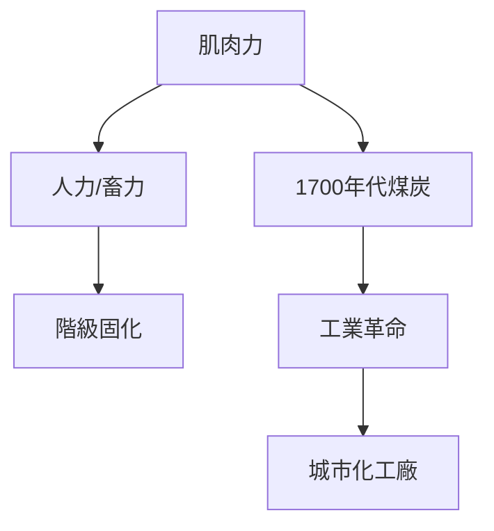
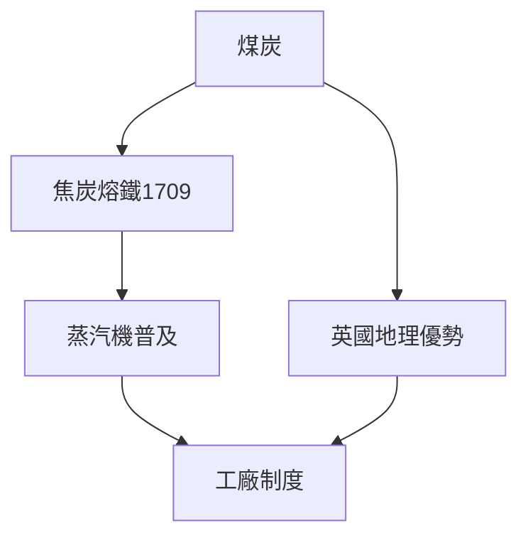
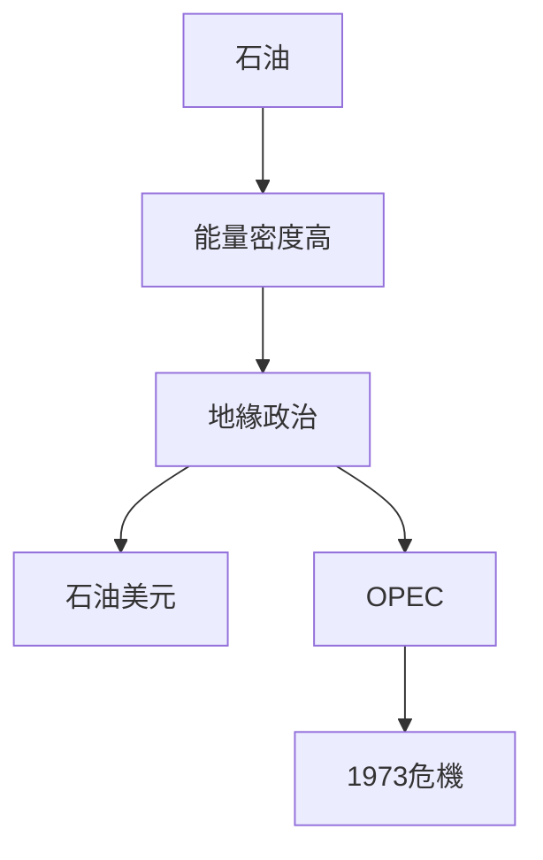
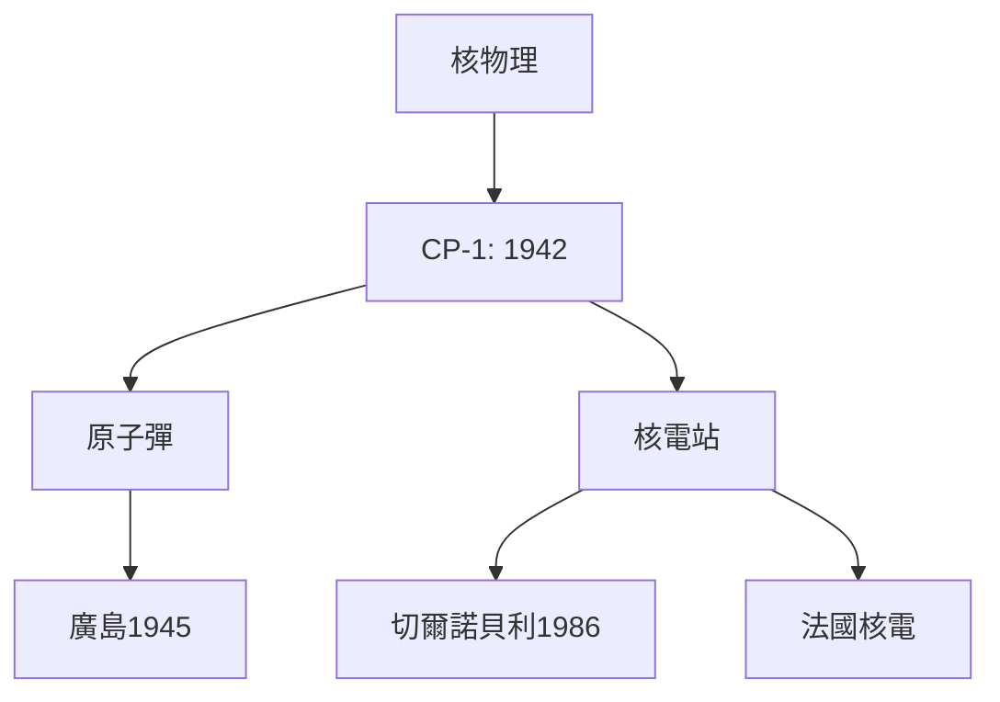
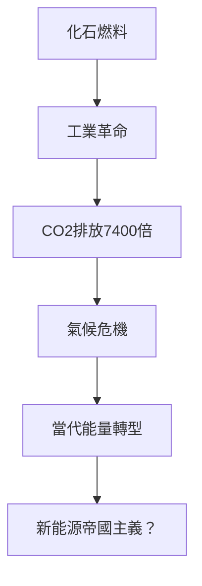
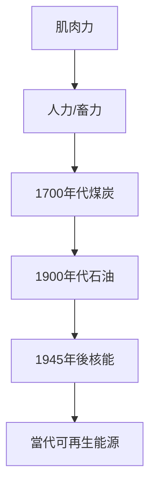
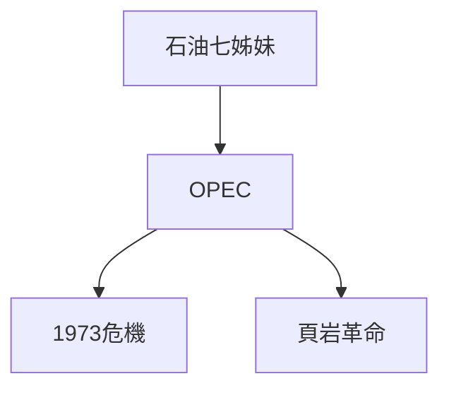
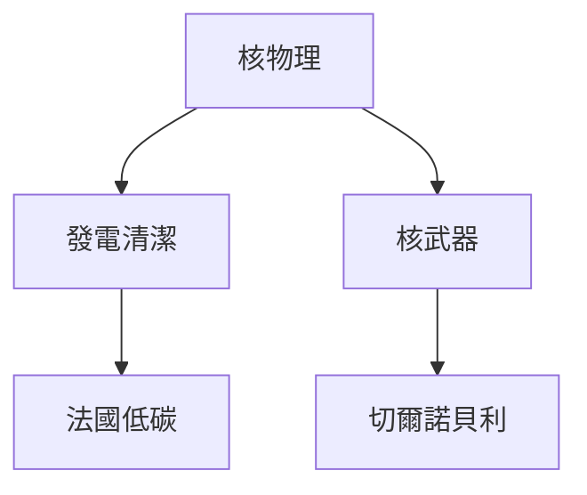
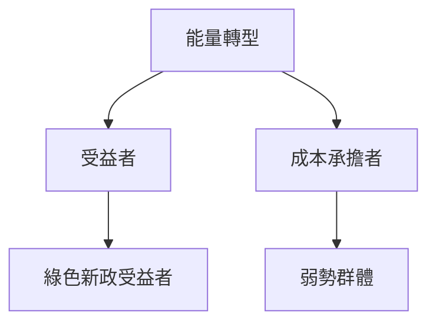
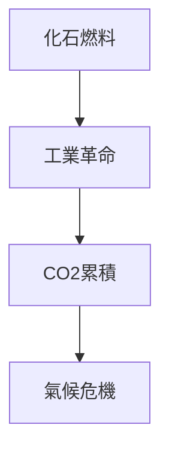

# Hist76 能量史 / The History of Energy

**Instructor**: Prof. Ian Miller
**Department**: History, Harvard
**Official source**: https://history.fas.harvard.edu/fall-courses
**Style**: 袁騰飛式 — 幽默、犀利、聚焦權力與武器如何塑造歷史

---

## 問題 1：5 個 SPECIFIC 核心心智模型

1. **肌肉力到化石燃料的轉型 / Transformation from Muscle to Fossil Fuels**
   人類歷史上99%的時間依靠肌肉力（人力和畜力）。煤炭在18世紀英國的广泛使用標誌著化石燃料時代的開端，徹底改變了人類的能量預算。Eric Jones的《尋找自然》（*Searching for Nature*）追蹤了這個轉型如何在政治經濟學意義上重構了階級關係：蒸汽機的所有者vs蒸汽機的操作者。

   代表學者: Eric Jones, *Searching for Nature*; Vaclav Smil, *Energy Transitions* (2017)

2. **煤炭與工業革命的英國模式 / British Model of Coal and Industrial Revolution**
   1709年亞伯拉罕·達比（Abraham Darby）在Coalbrookdale用焦炭熔鐵——這個技術突破使得鐵的生產成本大幅下降，並最終導致蒸汽機的大規模應用。煤炭不是「自然資源」，它是英國特殊地理條件（煤層淺層、鐵礦近鄰）和政治經濟條件（私人產權、水運系統）共同作用的結果。

   代表學者: Robert Allen, *The British Industrial Revolution* (2009); Neil Wrigley on energy transitions

3. **石油世紀的地緣政治 / Geopolitics of the Oil Century**
   1859年埃德温·德雷克（Edwin Drake）在賓夕法尼亞打出了第一口商業油井。石油的能量密度是煤炭的2倍，這個物理事實決定了20世紀的地緣政治——從石油七姊妹到OPEC到頁岩革命，每一次能量轉型都重構了全球權力地圖。

   代表學者: Daniel Yergin, *The Prize* (1991); Ian Morris, *Forces of Production* (1984)

4. **核能的承諾與恐懼 / Promise and Fear of Nuclear Energy**
   1942年12月2日，芝加哥大學的斯塔茨質驗裝置（Chicago Pile-1）實現了人類歷史上第一次自持核連鎖反應。這個時刻不僅開啟了核能時代，也開啟了人類自我毀滅的可能性。切爾諾貝利（1986）和福島（2011）的事件证明了核能的雙刃性。

   代表學者: Spencer Weart, *The Rise of Nuclear Fear* (2012); Richard Rhodes, *The Making of the Atomic Bomb* (1986)

5. **當代能量轉型與氣候危機 / Contemporary Energy Transition and Climate Crisis**
   1750年人類每年排放約50萬噸二氧化碳；2023年約370億噸——這個7400倍的增長是化石燃料時代的環境代價。當代能量轉型（太陽能、風能、電動車）是否是真正的變革，還是換湯不換藥的技術修正主義？

   代表學者: Naomi Klein, *This Changes Everything* (2014); Amitav Ghosh, *The Great Derangement* (2016)

---

## 問題 2：3 個根本分歧

### 分歧 1：化石燃料 — 必要 vs 可替代 / Fossil Fuels — Necessary or Replaceable
**核心問題**: 化石燃料對工業化是必要還是可以替代的？

- **A**: 必要 — 內燃機、電力、化肥無可替代；煤炭和石油的能量密度決定了現代文明的物理基礎
- **B**: 可替代 — 早期水力、風力可選；政策選擇造成對化石燃料的結構性依賴

### 分歧 2：核能 — 承諾 vs 威脅 / Nuclear — Promise or Threat
**核心問題**: 核能是清潔能源承諾還是安全威脅？

- **A**: 承諾 — 低碳、密集能源；法國核電供應了75%的電力，碳排放全球最低之一
- **B**: 威脅 — 切爾諾貝利、福島、核武器擴散

### 分歧 3：氣候變化 — 人為 vs 自然 / Climate Change — Anthropogenic or Natural
**核心問題**: 當代氣候變化是人類造成還是不可逆的自然週期？

- **A**: 人為 — 科學共識97%+；IPCC報告；CO2濃度從280ppm到420ppm
- **B**: 自然 — 地球歷史多次冷暖循環；太陽活動週期

---

## 問題 3：10 個深度問題

1. 為什麼化石燃料對工業化是必要這個命題是理解能量史的核心前提？
2. 在1700-2025中，煤炭與石油的能量轉型張力如何產生最具爭議的歷史轉折？
3. 如果把核能抽離，能量史的核心邏輯會怎樣變化？
4. 哪位歷史人物最能代表能量轉型的極致展現？
5. 學者之間關於能量轉型的爭論，反映了史料還是意識形態差異？
6. 在1700-2025中，化石燃料與當代能量轉型的歷史後果，哪個對當代影響更深？
7. 對能量史而言，能量決定論是分析核心還是限制？
8. 如果你是18世紀英國工廠主，優先選擇是什麼？
9. 當代哪些政治現象是化石燃料時代的延續或反動？
10. 在氣候危機時代，能量轉型的政治可行性如何？

---

# 核心心智模型深化（中英對照）

## 1. 肌肉力到化石燃料的轉型 — Transformation from Muscle to Fossil Fuels

### 1.1 Bilingual
| 英文 | 中文 | 含義 | 數據 |
|---|---|---|---|
| Energy budget | 能量預算 | 人類可支配能量 | 99%時間肌肉力 |
| Fossil fuels | 化石燃料 | 煤+石油+天然氣 | 1750年後崛起 |
| Energy density | 能量密度 | 每單位質量能量 | 石油是煤炭2倍 |
| Energy transition | 能量轉型 | 從肌肉到化石燃料 | 1700年代 |

### 1.3 犀利觀察
人類使用能量的歷史告訴我們一個簡單的道理：誰控制了能量來源，誰就控制了社會。從奴隸主到煤炭工廠主，從石油巨頭到當代的科技公司——這個遊戲規則從未改變。

### 1.5 Mermaid

---

## 2. 煤炭與工業革命 — Coal and Industrial Revolution

### 2.1 Bilingual
| 英文 | 中文 | 含義 | 事件 |
|---|---|---|---|
| Coke smelting | 焦炭熔鐵 | 1709年Coalbrookdale | 達比一世 |
| Steam engine | 蒸汽機 | 1712年紐可門 | 能量密度突破 |
| Coalbrookdale | 科爾布魯克戴爾 | 英格蘭 | 第一座鐵橋 |
| British advantage | 英國優勢 | 煤層近+私人產權 | 地理+制度 |

### 2.3 犀利觀察
煤炭不是「自然資源」——它是歷史的。英國在18世紀能夠首先工業化，不僅因為英國有煤，更因為英國有私人產權制度、水運系統和科學革命的氛圍。這些條件在其他地方並不普遍存在。

### 2.5 Mermaid

---

## 3. 石油世紀的地緣政治 — Geopolitics of the Oil Century

### 3.1 Bilingual
| 英文 | 中文 | 含義 | 事件 |
|---|---|---|---|
| Seven Sisters | 石油七姊妹 | 1928年 | 國際石油卡特尔 |
| OPEC | 石油輸出國組織 | 1960年 | 產油國聯盟 |
| Oil shocks | 石油危機 | 1973/1979年 | 價格暴漲 |
| Shale revolution | 頁岩革命 | 2008年後 | 美國產量回升 |

### 3.3 犀利觀察
1973年石油危機——石油輸出國組織（OPEC）對美國實施石油禁運——美國經濟在6個月內萎缩了4.7%。能源安全不是抽象概念——它是有血有肉的經濟後果。

### 3.5 Mermaid

---

## 4. 核能的承諾與恐懼 — Promise and Fear of Nuclear Energy

### 4.1 Bilingual
| 英文 | 中文 | 含義 | 數據 |
|---|---|---|---|
| CP-1 | 芝加哥質驗裝置 | 1942年12月2日 | 首次核連鎖反應 |
| Chernobyl | 切爾諾貝利 | 1986年4月26日 | 直接死亡4000+ |
| Fukushima | 福島 | 2011年3月11日 | 核電危機 |
| France nuclear | 法國核電 | 75%供電 | 碳排放最低 |

### 4.3 犀利觀察
1942年12月2日，芝加哥大學的斯塔茨裝置實現了人類第一次自持核連鎖反應——費米在那一刻說：「先生們，這將是一個可怕的世界。」（"This will be a terrible thing."）

### 4.5 Mermaid

---

## 5. 當代能量轉型 — Contemporary Energy Transition

### 5.1 Bilingual
| 英文 | 中文 | 含義 | 數據 |
|---|---|---|---|
| Climate crisis | 氣候危機 | 人為CO2排放 | 1750年→2023年7400倍 |
| Solar/wind | 太陽能/風能 | 當代替代 | 成本下降90%+ |
| EV | 電動車 | 當代交通轉型 | 2023年銷售佔比15% |
| Green New Deal | 綠色新政 | 當代政策話語 | 能源正義 |

### 5.3 犀利觀察
1750年人類每年排放約50萬噸二氧化碳；2023年約370億噸——這個7400倍的增長是化石燃料時代的環境代價。但當代的「能量轉型」在多大程度上是真正的變革，而不是將同樣的不平等換一個包裝？

### 5.5 Mermaid

---

# 深度自測問題詳解

## 1-5
運用能量歷史學、比較政治經濟學和環境史方法，批判性分析能量轉型背後的權力結構：誰是轉型的受益者，誰是成本的承擔者？

## 6-10
- 當代能量轉型與帝國主義延續
- 核能在當代的政治可行性
- 數字時代能量需求（比特幣挖礦）與環境正義

---

# 5 個 Mermaid 圖解

## 圖 1：人類能量使用的歷史結構

## 圖 2：石油世紀的地緣政治

## 圖 3：核能的雙刃性

## 圖 4：能量轉型的階級政治

## 圖 5：氣候危機的歷史根源

---

## 總結

能量史（Hist76: The History of Energy）是理解 **1700-present** 歷史的關鍵窗口。

**三大核心收穫**:
1. **肌肉力到化石燃料的轉型** — Vaclav Smil, *Energy Transitions* (2017)
2. **煤炭與工業革命的英國模式** — Robert Allen, *The British Industrial Revolution* (2009)
3. **石油世紀的地緣政治** — Daniel Yergin, *The Prize* (1991)

**終極問題**: 
能量史告訴我們：每一次能量轉型都是權力結構的重構——不是技術決定歷史，而是政治經濟學決定誰能從轉型中受益。

**推薦閱讀**:
- Vaclav Smil, *Energy Transitions* (2017)
- Robert Allen, *The British Industrial Revolution* (2009)
- Daniel Yergin, *The Prize* (1991)
- Spencer Weart, *The Rise of Nuclear Fear* (2012)
- Naomi Klein, *This Changes Everything* (2014)
