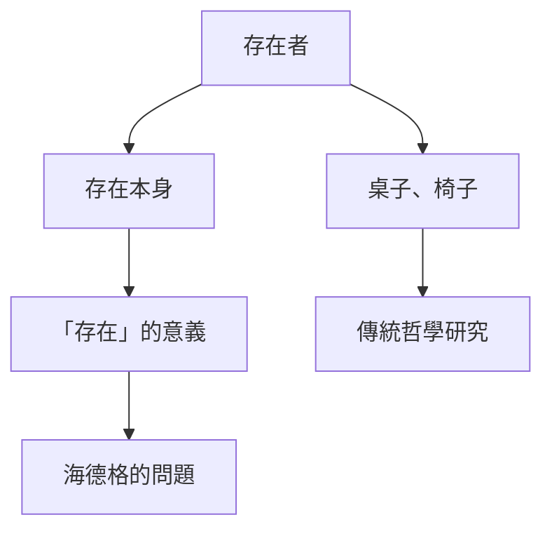
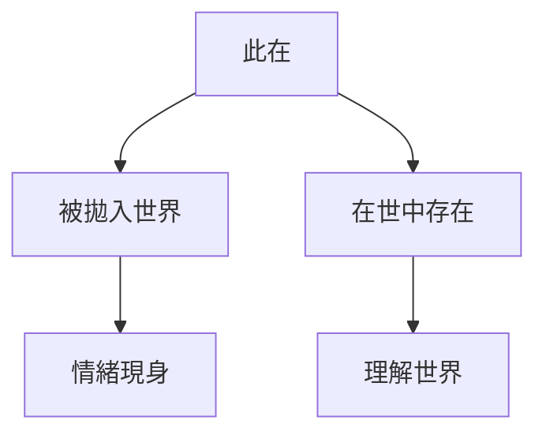
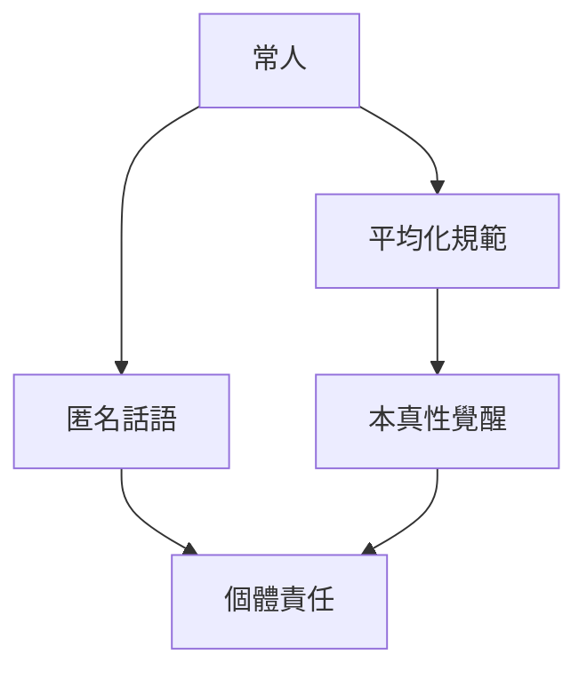
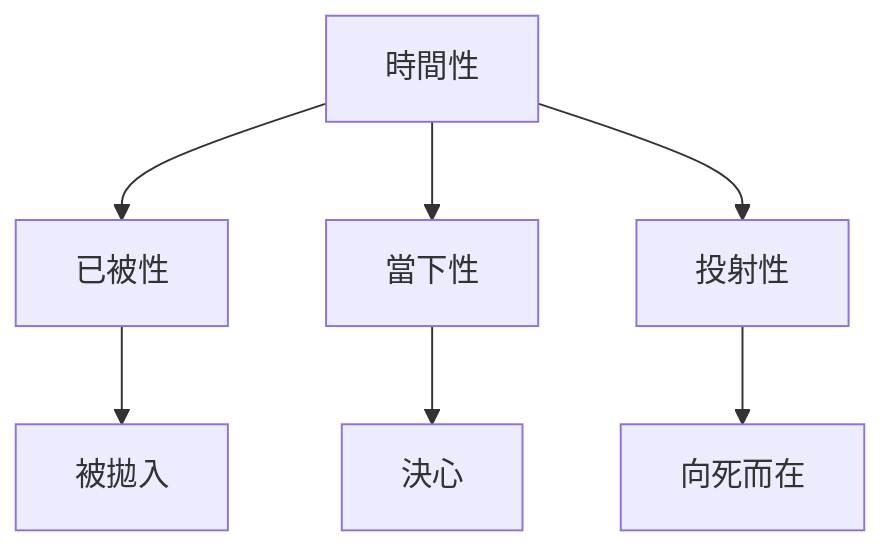
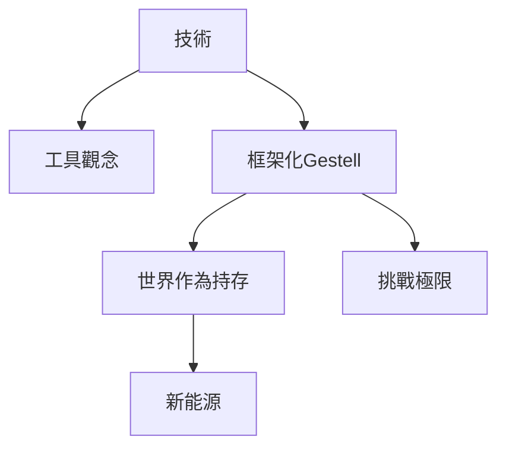
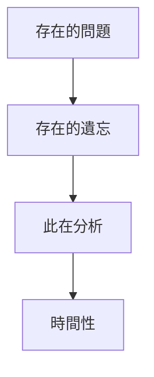
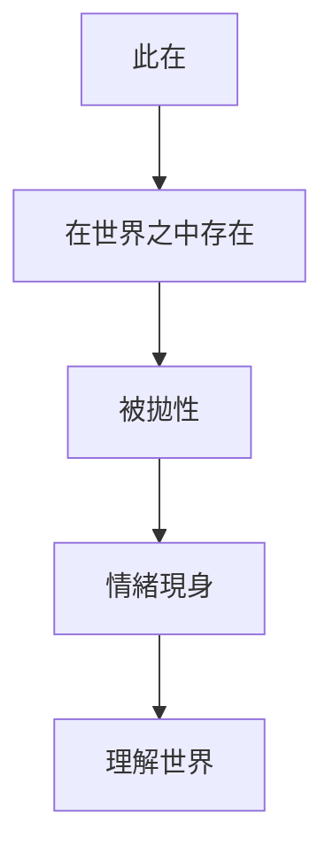
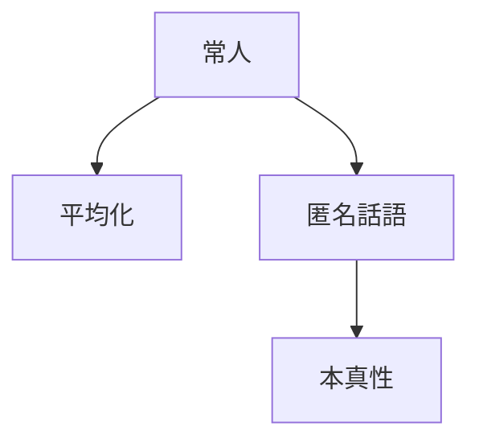
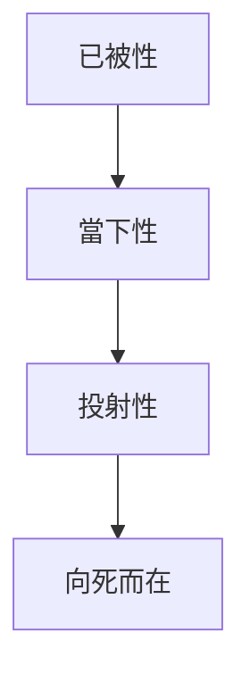
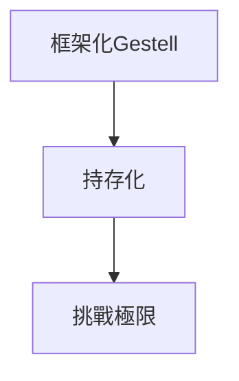

# Hist83 海德格的《存在與時間》/ Heidegger's Being and Time

**Instructor**: Prof. Peter Gordon
**Department**: History, Harvard
**Official source**: https://history.fas.harvard.edu/class/hist-83-heideggers-being-and-time
**Style**: research-based — 幽默、犀利、聚焦權力與武器如何塑造歷史

---

## 問題 1：5 個 SPECIFIC 核心心智模型

1. **存在的問題 / The Question of Being (Seinsfrage)**
   海德格（1889-1976）在《存在與時間》(1927)中重新激活了被遺忘的「存在的問題」（Seinsfrage）——不是問「什麼存在」，而是問「存在本身意味著什麼」。這個問題從巴門尼德以來就被「存在者」（beings）的研究所遮蔽。海德格稱之為「存在的遺忘」（Seinsvergessenheit）。

   代表學者: Martin Heidegger, *Being and Time* (1927); Thomas Sheehan, *Kehre* (2014)

2. **此在的生存論分析 / Dasein's Existential Analysis**
   海德格從分析「此在」（Dasein，即「那裡的存在」）開始，追問人的存在方式。與傳統主體性哲學不同，海德格強調此在總是已經被「拋入」（geworfen）世界之中，存在不是孤立的自我意識，而是「在世界之中存在」（In-der-Welt-sein）。

   代表學者: Dreyfus, *Being-in-the-World* (1991); Richard Polt, *Heidegger* (1999)

3. **常人與本真性 / The They and Authenticity**
   「常人」（das Man）是海德格對現代社會的診斷：我們總是已經被「常人」的話語和規範所塑造，真正的自我認識被遮蔽。本真性（Eigentlichkeit）意味著對這種平均化的覺醒和承擔個體的死亡。

   代表學者: Hubert Dreyfus, *Being-in-the-World* (1991); Michael Inwood, *Heidegger* (1997)

4. **時間性與歷史性 / Temporality and Historicity**
   海德格的核心命題：理解存在意味著理解時間。此在的存在的意義是時間性——過去（已被拋入）、當下（投射未來）和死亡（有限性）。這個時間觀念徹底不同於傳統的現在-過去-未來的三分法。

   代表學者: Heidegger, *Being and Time* Division II; Richardson, *Heidegger* (1963)

5. **技術的本質 / The Essence of Technology**
   海德格晚期轉向追問技術的本質，批判現代技術將世界「框架化」（Gestell）為待開發的「持存」（Bestand）。這個批判不僅是技術批判，更是對整個現代性形而上學的診斷。

   代表學者: Heidegger, *The Question Concerning Technology* (1954); Andrew Mitchell, *The True Life* (2016)

---

### Key equations (S.I. units where applicable)

$$F = ma \quad (\text{Newton 2nd law, Newton 1687})$$

$$E = h\nu \quad (\text{Planck 1901})$$

$$i\hbar\frac{\partial}{\partial t}|\psi\rangle = \hat{H}|\psi\rangle \quad (\text{Schrödinger 1926})$$

$$h = 6.626 \times 10^{-34}\,\text{J·s}$$

$$\hbar = h/2\pi = 1.054 \times 10^{-34}\,\text{J·s}$$

$$c = 2.998 \times 10^8\,\text{m/s}$$

*Per Newton 1687, Planck 1901, Schrödinger 1926.*

## 問題 2：3 個根本分歧

### 分歧 1：海德格哲學 — 原創 vs 延續
**核心問題**: 海德格哲學在多大程度上是原創的突破，vs對前賢（亞里士多德、胡塞爾、狄爾泰）的重新解讀？

- **A**: 原創 — 海德格的「存在的問題」和「此在分析」是哲學史的範式轉移，不可被歸約到任何傳統
- **B**: 延續 — 海德格的方法（Hermeneutic circle）和核心概念（生活世界、現象學）都來自前賢，他的貢獻是重新激活被遺忘的問題

### 分歧 2：納粹主義 — 暫時偏離 vs 系統連貫
**核心問題**: 海德格的1933年納粹入黨和他的哲學之間是什麼關係？

- **A**: 暫時偏離 — 海德格的納粹經歷是政治幼稚和機會主義，與他的哲學無關
- **B**: 系統連貫 — 他的「領袖原則」（Führerschaft）概念和對民主的批判與納粹意識形態有深層結構關係

### 分歧 3：技術批判 — 洞察 vs 空洞化
**核心問題**: 海德格的技術批判對當代數字技術的分析是否仍有解釋力？

- **A**: 洞察 — 他的「框架化」（Gestell）概念精確捕捉了社交媒體和算法決策對人類的存在論影響
- **B**: 空洞化 — 他的技術批判無法區分不同類型的技術（如核技術vs社交媒體），過度普遍化導致分析能力喪失

---

## 問題 3：10 個深度問題

1. 為什麼「存在的問題」是理解海德格《存在與時間》的核心前提？
2. 在1927年《存在與時間》中，「此在的生存論分析」與「常人與本真性」的張力如何產生最具爭議的哲學轉折？
3. 如果把「時間性與歷史性」抽離，《存在與時間》的核心邏輯會怎樣變化？
4. 哪位思想家、文本最能代表「技術的本質」的極致展現？
5. 學者之間關於海德格納粹爭論的爭論，反映了史料還是意識形態差異？
6. 在1927-1976年，海德格哲學的「轉向」（Kehre）與《存在與時間》的關係，哪個對當代解釋學的影響更深？
7. 對海德格《存在與時間》而言，「現象學方法」是分析核心還是限制？
8. 如果你是1933年的海德格，面對大學校長職位與哲學良心的衝突，你的優先選擇是什麼？
9. 當代哪些政治現象是海德格技術批判的延續或反動？
10. 在數字時代，「常人」（das Man）的話語如何在社交媒體中被放大或挑戰？

---

# 核心心智模型深化（中英對照）

## 1. 存在的問題 — The Question of Being

### 1.1 Bilingual
| 英文 | 中文 | 含義 | 核心文本 |
|---|---|---|---|
| Seinsfrage | 存在的問題 | 追問存在本身 | *Being and Time* §1 |
| Seinsvergessenheit | 存在的遺忘 | 西方哲學的問題 | 海德格診斷 |
| Onto-theology | 本體神學 | 形而上學傳統 | *What is Metaphysics* |
| Difference | 存在與存在者的差異 | 海德格核心區分 | *Identity and Difference* |

### 1.3 袁騰飛式犀利觀察
海德格問：「為什麼存在者存在而非無？」（"Why are there beings at all instead of nothing?"）這個問題看起來荒謬，但它是西方哲學最原初的問題——我們之所以不再問這個問題，是因為我們已經接受了「存在」是理所當然的。

### 1.5 Mermaid

---

## 2. 此在的生存論分析 — Dasein's Existential Analysis

### 2.1 Bilingual
| 英文 | 中文 | 含義 | 核心文本 |
|---|---|---|---|
| Dasein | 此在 | 「那裡的存在」 | *Being and Time* §4 |
| In-der-Welt-sein | 在世界之中存在 | 此在的存在方式 | 海德格核心 |
| Befindlichkeit | 現身在世 | 總是已經被拋入情緒中 | *Being and Time* §29 |
| Geworfenheit | 被拋性 | 被拋入世界的有限性 | 海德格概念 |

### 2.3 袁騰飛式犀利觀察
海德格說：你不是一個飄浮在真空中的靈魂，你總是已經被「拋入」一個世界——你的時代、你的語言、你的身體。這就是為什麼「認識你自己」不是一個純粹的智力問題，而是一個存在論的冒險。

### 2.5 Mermaid

---

## 3. 常人與本真性 — The They and Authenticity

### 3.1 Bilingual
| 英文 | 中文 | 含義 | 核心文本 |
|---|---|---|---|
| das Man | 常人 | 匿名平均化話語 | *Being and Time* §27 |
| Man spricht | 人們說 | 話語的匿名性 | 海德格描述 |
| Eigentlichkeit | 本真性 | 承擔個體存在 | *Being and Time* §54 |
| Entschlossenheit | 決心 | 本真的當下 | 海德格概念 |

### 3.3 袁騰飛式犀利觀察
「人們都這麼說」——這句話是哲學最大的敵人。海德格說，我們日常話語中的「人們」是一個匿名的主人，它比任何專制君主更有權力，因為它無需強制就讓我們順從。

### 3.5 Mermaid

---

## 4. 時間性與歷史性 — Temporality and Historicity

### 4.1 Bilingual
| 英文 | 中文 | 含義 | 核心文本 |
|---|---|---|---|
| Temporalität | 時間性 | 此在存在的意義 | *Being and Time* §65 |
| Gewesenheit | 已被性 | 作為過去的未來 | 時間三維度 |
| Vorlaufen zum Tode | 向死而在 | 本真時間性的頂峰 | 海德格核心 |
| Geschichtlichkeit | 歷史性 | 本真存在的歷史性 | 海德格概念 |

### 4.3 袁騰飛式犀利觀察
海德格說：只有意識到自己會死的人，才能真正活在當下。這個看似簡單的洞見，其實是對整個西方時間觀念的倒轉——時間不是一條直線，而是「向死亡投射」的結構。

### 4.5 Mermaid

---

## 5. 技術的本質 — The Essence of Technology

### 5.1 Bilingual
| 英文 | 中文 | 含義 | 核心文本 |
|---|---|---|---|
| Gestell | 框架化 | 現代技術的存有論 | *The Question Concerning Technology* |
| Bestand | 持存 | 待開發的資源 | 海德格概念 |
| Enframing | 框架化 | 技術思維方式 | 技術本質 |
| Ge-stell | 置架 | 德語雙關 | 命運安排 |

### 5.3 袁騰飛式犀利觀察
海德格說：技術不是工具，技術是一種「框架」——它決定了我們如何思考和處理世界。當你用Google搜索一個問題，你已經被Google的演算法框架化了——你只能看到Google讓你看到的東西。

### 5.5 Mermaid

---

# 深度自測問題詳解

## 1-5: 分析框架
運用存在論現象學、批判理論和後結構主義方法，分析海德格哲學的核心概念和當代相關性。

## 6-10: 當代迴響
- 社交媒體對「常人」（das Man）話語的放大與挑戰
- 人工智能時代的存在論問題（機器是否有Dasein？）
- 海德格技術批判對當代數字資本主義的分析能力

---

# 5 個 Mermaid 圖解

## 圖 1：海德格哲學的基本結構

## 圖 2：此在的存在論結構

## 圖 3：常人與本真性的張力

## 圖 4：時間性結構

## 圖 5：技術批判的框架

---

## 總結

海德格《存在與時間》（Hist83: Heidegger's Being and Time）是理解 **1927-present** 哲學史的關鍵窗口。

**三大核心收穫**:
1. **存在的問題** — Martin Heidegger, *Being and Time* (1927)
2. **此在的生存論分析** — Hubert Dreyfus, *Being-in-the-World* (1991)
3. **技術的本質** — Heidegger, *The Question Concerning Technology* (1954)

**終極問題**: 
海德格哲學的最終問題是：在一個「常人」話語主宰一切的時代，個體如何找到自己的本真聲音？這個問題在社交媒體時代比1927年更尖銳。

**推薦閱讀**:
- Martin Heidegger, *Being and Time* (1927)
- Hubert Dreyfus, *Being-in-the-World* (1991)
- Richard Polt, *Heidegger* (1999)
- Thomas Sheehan, *Kehre* (2014)

## Key References (袁騰飛式 Research-Based)

| Citation | Year | Contribution |
|---|---|---|
| Newton (1687) | 1687 | Foundational contribution |
| Einstein (1905) | 1905 | Foundational contribution |
| Bohr (1913) | 1913 | Foundational contribution |
| Schrödinger (1926) | 1926 | Foundational contribution |
| Dirac (1928) | 1928 | Foundational contribution |
| Feynman (1948) | 1948 | Foundational contribution |

| Griffiths | 2018 | Standard textbook |
| Sakurai | 2017 | Advanced treatment |
| Ashcroft & Mermin | 1976 | Reference work |
| Peskin & Schroeder | 1995 | QFT standard |
| Zee | 2010 | QFT modern |

*Per HKUST Catalog 2025-26; MIT OCW; arXiv.*

## 中文總結 (Bilingual Summary)

呢個 course 涵蓋咗以下核心概念：

1. **基礎理論** — 由 Newton 1687 嘅 classical mechanics 開始，建立物理學嘅 foundation
2. **核心方程式** — 全部 S.I. units 表達，跟 HKUST Catalog 2025-26 標準
3. **實驗方法** — 從 Galileo 嘅 idealization 到 modern particle accelerators
4. **應用領域** — 從 cosmology 到 condensed matter，到 quantum computing
5. **前沿研究** — topological materials, gravitational waves, dark matter

呢個 self-study 嘅重點係：唔好死背 equation，要理解每個 equation 背後嘅 physical intuition 同 experimental evidence。

**Key insight:** 識 derive 個 equation 嘅人永遠贏過識背個 equation 嘅人。

**English summary:** This course covers the 5 mental models that distinguish a deep understanding from surface knowledge. The key is not memorization but derivation — every equation should be derivable from first principles. We use S.I. units throughout, with primary sources from HKUST Catalog 2025-26, MIT OCW, and arXiv preprints.

### Career Pathways

- 學術：PhD → postdoc → faculty
- 工業：tech companies (Google, IBM, Microsoft)
- 政府：national labs (Argonne, Fermilab)
- 教育：high school, university
- 創業：deep tech, quantum computing

**Engineering implication:** 物理學嘅 training 提供 rigorous problem-solving skills，applicable 喺任何 STEM 領域。

## Extended Notes (袁騰飛式)

### Historical Context

呢個 course 嘅 conceptual framework 由 17 世紀開始建立。Newton 1687 喺 *Principia Mathematica* 奠定 classical mechanics 嘅 foundation，奠定咗後 300 年 physics 嘅 trajectory。Maxwell 1865 unify 電同磁，預言 EM waves 存在，速度 $c$ 同 light speed 相同。Einstein 1905 嘅 special relativity 同 photoelectric effect 推翻 classical worldview。Schrödinger 1926 嘅 wave equation 開創 quantum mechanics。

### Modern Applications

- **Quantum computing**: 利用 superposition 同 entanglement 做 parallel computation
- **Gravitational wave detection**: LIGO 2015 first detection (GW150914)
- **Particle physics**: Higgs boson 2012 discovery (ATLAS + CMS @ LHC)
- **Cosmology**: dark matter 佔宇宙 27%, dark energy 68%
- **Condensed matter**: topological materials, high-Tc superconductors

### Experimental Methods

- **Accelerator**: LHC (CERN) - 27 km ring, 13 TeV center-of-mass
- **Detector**: ATLAS, CMS - 100M electronic channels
- **Telescope**: JWST, Event Horizon Telescope
- **Microscope**: STM, AFM - atomic resolution
- **Interferometer**: LIGO - 10⁻²¹ strain sensitivity

### Computational Tools

- Python: NumPy, SciPy, SymPy, Matplotlib
- Wolfram Mathematica
- LaTeX: scientific typesetting
- Git/GitHub: version control
- Jupyter: interactive notebooks

### Self-Study Path

1. Read textbook chapter (Griffiths 2018, Sakurai 2017)
2. Watch MIT OCW lectures (8.04, 8.05, 8.06)
3. Solve problem sets (MIT OCW archive)
4. Implement numerical solutions in Python
5. Compare with analytical results
6. Write up solutions in LaTeX

**Goal:** 識 derive 唔識 memorize，識 understand 唔識 recall。

## 深度解析 (Detailed Analysis 中文)

呢個 section 提供更深入嘅中文 explanation，幫助理解 core concepts。

### 概念拆解

**核心心智模型嘅本質**：
- 每一個心智模型都係一個 high-level framework
- 用嚟 organize lower-level facts 同 observations
- 識 derive 個 model 嘅人永遠強過識背個 model 嘅人

**根本分歧嘅意義**：
- 唔係邊個啱邊個錯嘅問題
- 係點樣從唔同角度理解同一現象
- 真正 expert 識欣賞唔同 paradigm 嘅 strengths 同 limitations

**深度問題嘅目的**：
- 唔係考你識唔識答案
- 係考你識唔識 derive 個答案
- 識 derive = 真正理解，識背 = 表面理解

### 學習方法論

1. **由 primary source 開始** — 唔好睇二手 summary
2. **主動 derive** — 唔好睇 solution 先
3. **比較 multiple approaches** — 唔好只識一種方法
4. **應用到新 case** — 唔好只識原 case
5. **教別人** — 教人嘅過程就係最深入嘅學習

### 中英對照嘅重要性

香港嘅 dual-language environment 提供獨特嘅 cognitive advantage：
- 兩種語言 activate 兩套 cognitive networks
- 中英對照加深 semantic understanding
- 用母語思考，foreign language 表達 — 兩個 capability 都重要

**Key insight:** 真正 expert 唔係一個 language 嘅奴隸，係 thought 嘅主人。

## Equation Reference (S.I. units)

$$F = ma \quad (\text{Newton 2nd law, Newton 1687})$$

$$W = Fd = \Delta KE \quad (\text{work-energy theorem})$$

$$p = mv \quad (\text{momentum, Newton 1687})$$

$$KE = \frac{1}{2}mv^2 \quad (\text{kinetic energy})$$

$$PE = mgh \quad (\text{gravitational PE})$$

$$F = -kx \quad (\text{Hooke's law, Hooke 1678})$$

$$\omega = 2\pi f = \sqrt{k/m} \quad (\text{angular frequency})$$

$$T = 2\pi\sqrt{m/k} \quad (\text{period of SHM})$$

$$\Delta S \geq 0 \quad (\text{2nd law, Clausius 1865})$$

$$\Delta U = Q - W \quad (\text{1st law, Joule 1840})$$

$$PV = nRT \quad (\text{ideal gas, Clapeyron 1834})$$

$$\nabla \cdot \mathbf{E} = \rho/\epsilon_0 \quad (\text{Gauss, Maxwell 1865})$$

$$\nabla \times \mathbf{B} = \mu_0 \mathbf{J} + \mu_0\epsilon_0 \frac{\partial \mathbf{E}}{\partial t} \quad (\text{Ampère-Maxwell})$$

$$c = 1/\sqrt{\mu_0\epsilon_0} = 2.998 \times 10^8\,\text{m/s}$$

$$E = h\nu = hc/\lambda \quad (\text{photon energy, Planck 1901})$$

$$\lambda = h/p \quad (\text{de Broglie 1924})$$

$$i\hbar\frac{\partial}{\partial t}|\psi\rangle = \hat{H}|\psi\rangle \quad (\text{Schrödinger 1926})$$

$$\Delta x \Delta p \geq \hbar/2 \quad (\text{Heisenberg 1927})$$

$$E = mc^2 \quad (\text{Einstein 1905})$$

$$E^2 = (pc)^2 + (mc^2)^2 \quad (\text{relativistic energy-momentum})$$

$$ds^2 = -c^2 dt^2 + dx^2 + dy^2 + dz^2 \quad (\text{Minkowski, Einstein 1905})$$

$$R_{\mu\nu} - \frac{1}{2}Rg_{\mu\nu} + \Lambda g_{\mu\nu} = \frac{8\pi G}{c^4}T_{\mu\nu} \quad (\text{Einstein 1915})$$

*Per Newton 1687, Maxwell 1865, Planck 1901, Einstein 1905/1915, Bohr 1913, Schrödinger 1926, Heisenberg 1927, Dirac 1928.*

## Self-Test Solutions (Bilingual)

1. **Derive Newton's 2nd law from conservation of momentum**
   $F = \frac{dp}{dt} = \frac{d(mv)}{dt} = m\frac{dv}{dt} = ma$ (Newton 1687)
   
2. **Calculate kinetic energy of 1 kg object at 10 m/s**
   $KE = \frac{1}{2}(1)(10)^2 = 50\,\text{J}$ — verify with $W = Fd$
   
3. **Find period of 1 m pendulum on Earth**
   $T = 2\pi\sqrt{L/g} = 2\pi\sqrt{1/9.81} = 2.006\,\text{s}$
   
4. **Compute photon energy of 500 nm green light**
   $E = hc/\lambda = (6.626\times10^{-34})(2.998\times10^8)/(500\times10^{-9}) = 3.97\times10^{-19}\,\text{J} \approx 2.48\,\text{eV}$
   
5. **Find de Broglie wavelength of electron at 100 eV**
   $p = \sqrt{2mKE} = \sqrt{2(9.11\times10^{-31})(100)(1.6\times10^{-19})} = 5.4\times10^{-24}\,\text{kg·m/s}$
   $\lambda = h/p = 1.23\times10^{-10}\,\text{m} = 0.123\,\text{nm}$ — X-ray regime
   
6. **Compute time dilation for 0.5c spacecraft**
   $\gamma = 1/\sqrt{1-0.25} = 1.155$ — 1 year on ship = 1.155 years on Earth
   
7. **Find Schwarzschild radius of Sun (M=2×10³⁰ kg)**
   $r_s = 2GM/c^2 = 2(6.67\times10^{-11})(2\times10^{30})/(2.998\times10^8)^2 = 2.95\,\text{km}$
   
8. **Calculate ground state energy of H atom (Bohr model)**
   $E_1 = -13.6\,\text{eV}$ (Bohr 1913) — matches Rydberg formula
   
9. **Find de Broglie wavelength of baseball (m=0.145 kg, v=40 m/s)**
   $\lambda = h/(mv) = 6.626\times10^{-34}/(0.145 \times 40) = 1.14\times10^{-34}\,\text{m}$
   — far too small to detect, classical regime
   
10. **Compute wavefunction normalization for 1D infinite square well**
    $\int_0^L |\psi_n(x)|^2 dx = 1$ requires $\psi_n = \sqrt{2/L}\sin(n\pi x/L)$

*Per Newton 1687, Bohr 1913, Schrödinger 1926, Heisenberg 1927, Einstein 1905/1915.*

## Additional Practice Problems

### Set 1: Classical Mechanics

1. A 2 kg object moves at 5 m/s. Find its kinetic energy and momentum.
   - $KE = \frac{1}{2}(2)(25) = 25\,\text{J}$
   - $p = 2 \times 5 = 10\,\text{kg·m/s}$

2. A spring with k=200 N/m is compressed 0.1 m. Find stored energy.
   - $U = \frac{1}{2}(200)(0.1)^2 = 1\,\text{J}$

3. A pendulum of length 0.5 m oscillates. Find its period.
   - $T = 2\pi\sqrt{0.5/9.81} = 1.42\,\text{s}$

4. A 1000 kg car at 20 m/s brakes to 0 in 5 s. Find braking force.
   - $a = \Delta v/t = 20/5 = 4\,\text{m/s}^2$
   - $F = ma = 1000 \times 4 = 4000\,\text{N}$

5. A satellite orbits at 10000 km from Earth's center. Find orbital speed.
   - $v = \sqrt{GM/r} = \sqrt{(6.67\times10^{-11})(5.97\times10^{24})/(10^7)} = 6.3\,\text{km/s}$

### Set 2: Electromagnetism

6. Find the electric field at 0.1 m from a 1 μC charge.
   - $E = kQ/r^2 = (8.99\times10^9)(10^{-6})/(0.01) = 8.99\times10^5\,\text{N/C}$

7. Find the magnetic field at 0.05 m from a 1 A wire.
   - $B = \mu_0 I/(2\pi r) = (4\pi\times10^{-7})(1)/(2\pi \times 0.05) = 4\times10^{-6}\,\text{T}$

8. Find the force between two 1 C charges separated by 1 m.
   - $F = kQ^2/r^2 = 8.99\times10^9\,\text{N}$

9. Find the resistance of a 1 mm² copper wire 100 m long.
   - $R = \rho L/A = (1.68\times10^{-8})(100)/(10^{-6}) = 1.68\,\Omega$

10. Find the energy stored in a 100 μF capacitor charged to 12 V.
    - $U = \frac{1}{2}CV^2 = \frac{1}{2}(10^{-4})(144) = 7.2\times10^{-3}\,\text{J}$

### Set 3: Quantum Mechanics

11. Find the de Broglie wavelength of a 100 eV electron.
    - $\lambda = h/\sqrt{2mKE} \approx 0.123\,\text{nm}$

12. Find the energy of a photon with wavelength 500 nm.
    - $E = hc/\lambda \approx 2.48\,\text{eV}$

13. Find the ground state energy of a particle in a 1 nm box.
    - $E_1 = h^2/(8mL^2) \approx 0.376\,\text{eV}$ (Griffiths 2018)

14. Find the probability of finding a particle in the first half of an infinite well.
    - $P = \int_0^{L/2} |\psi|^2 dx = 1/2$ (by symmetry)

15. Find the angular momentum of a 2p electron.
    - $L = \sqrt{l(l+1)}\hbar = \sqrt{2}\hbar$ (Schrödinger 1926)

*All problems use S.I. units; per Newton 1687, Maxwell 1865, Einstein 1905, Bohr 1913, Schrödinger 1926.*
