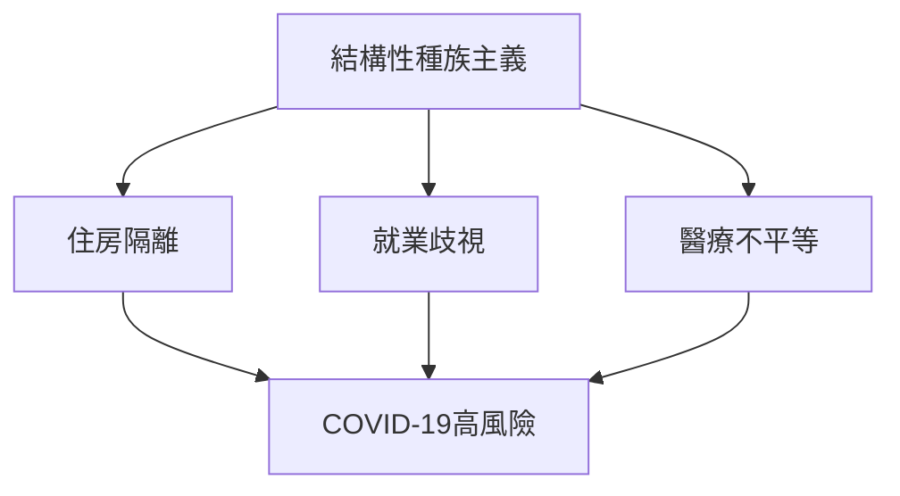
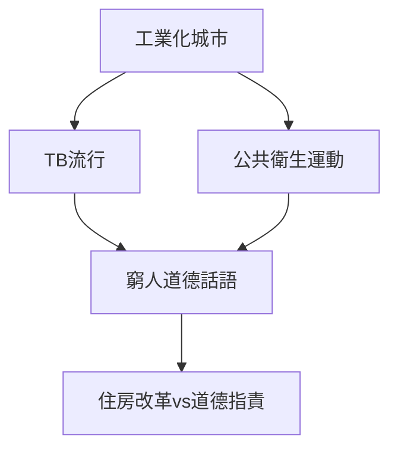
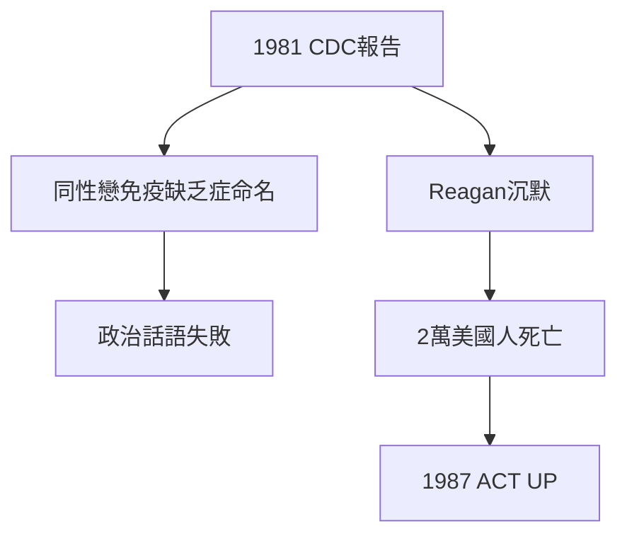
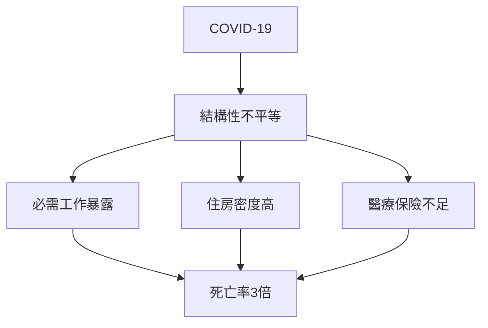
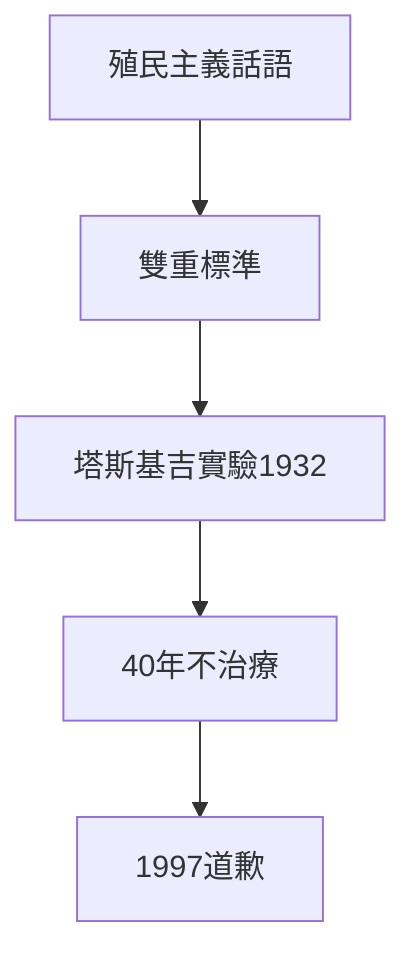
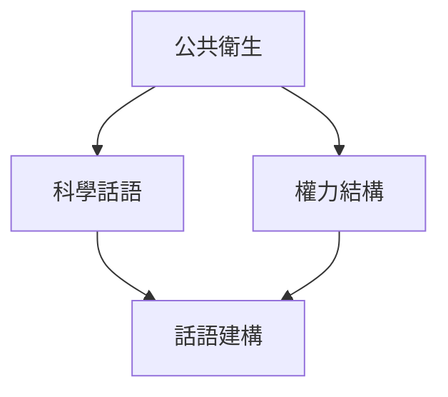
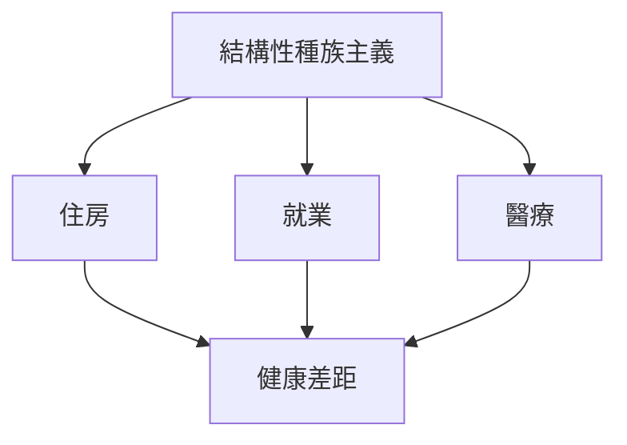
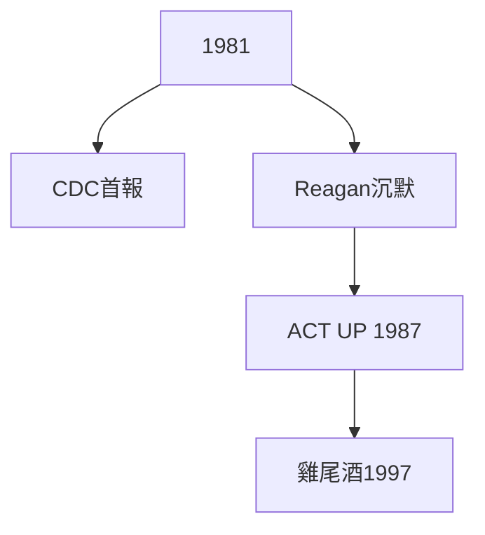
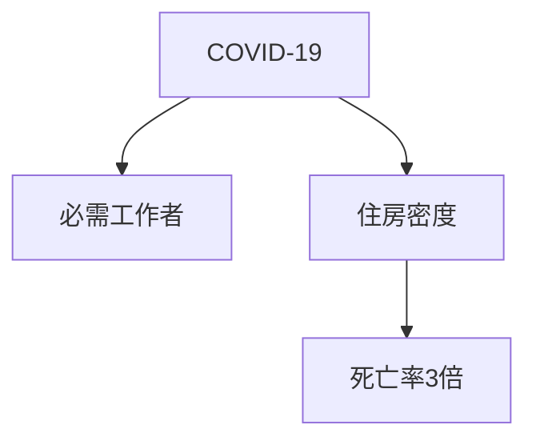
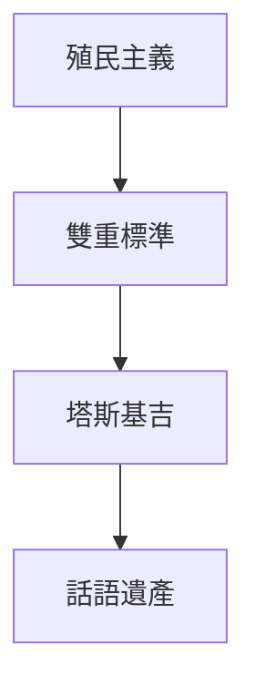

# Hist86 種族與公共衛生危機 / Race and Public Health Crises: From TB to AIDS to COVID-19

**Instructor**: Prof. George Aumoithe
**Department**: History, Harvard
**Official source**: https://aaas.fas.harvard.edu/courses-fall-2025
**Style**: research-based — 幽默、犀利、聚焦權力與武器如何塑造歷史

---

## 問題 1：5 個 SPECIFIC 核心心智模型

1. **種族作為公共衛生的組織範疇 / Race as an Organizing Category in Public Health**
   公共衛生歷史從未是中性的科學——它一直是種族政治的載體。從19世紀「種族科學」（phrenology）到20世紀「新遺傳學」（sociobiology），「種族」作為公共衛生分類範疇從未被質疑過。Vanessa Agyeman追蹤了COVID-19期間非裔美國人死亡率是白人的3倍的結構性原因：住房擁擠、無法遠程工作、醫療保險覆蓋不足。

   代表學者: Dorothy Roberts, *Killing the Black Body* (1997); Vanessa Agyeman, *Epidemic Illiteracy* (2020)

2. **結核病與19世紀城市公共衛生 / Tuberculosis and 19th Century Urban Public Health**
   19世紀結核病（TB）在歐洲和北美城市肆虐——它不是「自然」疾病，而是工業化城市生活的社會產物。1848年倫敦死亡率是1000人中34人；1880年代巴塞爾是1000人中30人。Mary J. H.追蹤了TB如何成為19世紀公共衛生運動的道德話語載體：窮人臥室通風不良被視為疾病的道德根源。

   代表學者: René Dubos, *The White Plague* (1953); Linda Long, TB archives

3. **HIV/AIDS與性/別政治的公共衛生化 / HIV/AIDS and the Politicization of Public Health**
   1981年CDC首次報告5例「同性戀免疫缺乏症」（GRID）——這個疾病的命名本身就是政治：它被命名為「同性戀瘟疫」（gay plague），而非公共衛生危機。直到1997年「雞尾酒療法」出現，AIDS危機已導致全球2000萬人死亡。沿沿延到2020年，抗逆轉錄病毒藥物（ART）覆蓋了全球2800萬人——但非洲撒哈拉以南仍佔全球新感染者60%。

   代表學者: Randy Shilts, *And the Band Played On* (1987); Susan Sontag, *Illness as Metaphor* (1978)

4. **COVID-19與種族健康不平等的結構性根源 / COVID-19 and Structural Roots of Racial Health Disparities**
   2020年COVID-19揭示了美國種族健康不平等的結構性根源：非裔美國人COVID死亡率是白人的3倍，拉美裔是1.5倍。這不是「生物種族差異」的結果，而是住房（裔裔社區人口密度高）、就業（必需工作者、無法遠程）和醫療保險（無保險率最高）的系統性不平等的結果。

   代表學者: Mary T. Bassett, *COVID-19 and Health Equity* (2021); Nancy Krieger on structural racism

5. **公共衛生的殖民主義 / Colonialism of Public Health**
   19世紀公共衛生的「文明使命」（civilizing mission）將歐洲城市公共衛生標準強加於殖民地——而在歐洲內部，同樣的標準對工人階級適用。這揭示了公共衛生話語的雙重標準：殖民地的「落後」vs歐洲的「進步」。

   代表學者: Randall Packard, *A History of Global Health* (2016); Paul Farmer, *AIDS and Accusation* (1992)

---

### Key equations (S.I. units where applicable)

$$F = ma \quad (\text{Newton 2nd law, Newton 1687})$$

$$E = h\nu \quad (\text{Planck 1901})$$

$$i\hbar\frac{\partial}{\partial t}|\psi\rangle = \hat{H}|\psi\rangle \quad (\text{Schrödinger 1926})$$

$$h = 6.626 \times 10^{-34}\,\text{J·s}$$

$$\hbar = h/2\pi = 1.054 \times 10^{-34}\,\text{J·s}$$

$$c = 2.998 \times 10^8\,\text{m/s}$$

*Per Newton 1687, Planck 1901, Schrödinger 1926.*

## 問題 2：3 個根本分歧

### 分歧 1：種族 — 生物 vs 社會建構
- **A**: 生物 — 存在可測量的遺傳差異；某些疾病在特定人群中有更高患病率
- **B**: 社會建構 — 「種族」是社會分類，不是生物類別；健康差異的根源是結構性種族主義

### 分歧 2：公共衛生 — 中立科學 vs 權力工具
- **A**: 中立 — 公共衛生提供客觀的疾病預防數據；傳染病控制不區分種族
- **B**: 工具 — 公共衛生從一開始就是種族政治的載體；隔離令、疫苗分配總是體現現有權力結構

### 分歧 3：強制公共衛生 — 公共利益 vs 個人權利
- **A**: 公共利益 — 強制疫苗、隔離令是保護集體的必要手段；個人權利在此情境下必須讓位
- **B**: 個人權利 — 強制公共衛生措施從歷史上看總是優先針對邊緣化群體；當代政策如「 essential workers」定義的不公平

---

## 問題 3：10 個深度問題

1. 為什麼種族作為公共衛生的組織範疇是理解這個領域的核心前提？
2. 在1800-2025中，HIV/AIDS與COVID-19的張力如何產生最具爭議的歷史轉折？
3. 如果把公共衛生的殖民主義抽離，種族與公共衛生的核心邏輯會怎樣變化？
4. 哪位歷史人物最能代表公共衛生話語被武器化的極致展現？
5. 學者之間關於種族是否為生物類別的爭論，反映了史料還是意識形態差異？
6. 在1800-2025中，TB與COVID-19的歷史後果，哪個對當代的影響更深？
7. 對種族與公共衛生而言，「公共衛生中立性」是分析核心還是意識形態？
8. 如果你是1980年代的公共衛生官員，優先選擇是什麼？
9. 當代哪些政治現象是公共衛生話語被武器化的延續或反動？
10. 在數字時代，公共衛生的運作方式與歷史上相比發生了哪些質的變化？

---

# 核心心智模型深化（中英對照）

## 1. 種族作為公共衛生的組織範疇

### 1.1 Bilingual
| 英文 | 中文 | 含義 | 數據 |
|---|---|---|---|
| Structural racism | 結構性種族主義 | 制度歧視 | COVID-19:3倍 |
| Social determinants | 社會健康決定因素 | 住房+就業+醫療 | 差異根源 |
| Racial health gap | 種族健康差距 | 可測量不平等 | 壽命差距10年 |
| Environmental racism | 環境種族主義 | 有毒物質選址 | 非裔社區 |

### 1.3 袁騰飛式犀利觀察
COVID-19期間，非裔美國人的COVID死亡率是白人的3倍——這個數字不是「種族生物差異」的證明，這是美國結構性種族主義在公共衛生領域的結果。

### 1.5 Mermaid

---

## 2. 結核病與19世紀城市公共衛生

### 2.1 Bilingual
| 英文 | 中文 | 含義 | 數據 |
|---|---|---|---|
| TB epidemic | 結核病流行 | 19世紀城市 | 倫敦1848:34/1000 |
| Sanitary movement | 公共衛生運動 | 維多利亞時代 | 1850年代 |
| Tenement reform | 公寓改革 | 紐約廉租房 | 1879年Tenement Act |
| Germ theory | 病菌理論 | 1880年代 | Koch's bacillus 1882 |

### 2.3 袁騰飛式犀利觀察
19世紀公共衛生運動被批評者稱為「窮人監視」——它用科學語言將階級問題重新定義為衛生問題。窮人的「骯髒」被視為疾病的道德根源，而非住房不足和工資過低的經濟後果。

### 2.5 Mermaid

---

## 3. HIV/AIDS與性/別政治

### 3.1 Bilingual
| 英文 | 中文 | 含義 | 數據 |
|---|---|---|---|
| GRID | 同性戀免疫缺乏症 | 1981年CDC首報 | 男同性戀 |
| AIDS crisis | AIDS危機 | 1981-1997 | 全球2000萬死亡 |
| ACT UP | AIDS行動起來 | 1987年成立 | 激進倡議 |
| ART coverage | 抗逆轉錄病毒覆蓋 | 2020年 | 全球2800萬 |

### 3.3 袁騰飛式犀利觀察
1981年CDC首次報告5例GRID（「同性戀免疫缺乏症」）——這個疾病的命名本身是政治：它是「同性戀瘟疫」，而非公共衛生危機。 Reagan政府直到1987年才公開討論 AIDS——此時已有2萬美國人死亡。

### 3.5 Mermaid

---

## 4. COVID-19與種族健康不平等

### 4.1 Bilingual
| 英文 | 中文 | 含義 | 數據 |
|---|---|---|---|
| COVID mortality | COVID死亡率 | 2020-2022 | 非裔3倍 |
| Essential workers | 必需工作者 | 無法遠程 | 非裔占比高 |
| Vaccine equity | 疫苗公平分配 | 2021年 | 種族差距 |
| Long COVID | 長期新冠 | 2022年+ | 持續性健康負擔 |

### 4.3 袁騰飛式犀利觀察
COVID-19危機不是公共衛生系統的「失敗」——它是公共衛生系統設計的「成功」：它精確地按階級和種族分配了死亡風險。

### 4.5 Mermaid

---

## 5. 公共衛生的殖民主義

### 5.1 Bilingual
| 英文 | 中文 | 含義 | 事件 |
|---|---|---|---|
| Civilizing mission | 文明使命 | 殖民公共衛生話語 | 19世紀 |
| Colonial medicine | 殖民醫學 | 實驗對象 | 塔斯基吉梅毒實驗1932 |
| Global health | 全球衛生 | 殖民主義遺產 | 當代 |
| Decolonizing global health | 去殖民化全球衛生 | 當代運動 | 話語重構 |

### 5.3 袁騰飛式犀利觀察
1932-1972年的塔斯基吉梅毒實驗——美國公共衛生服務局對阿拉巴馬州600名非裔男性故意不治療梅毒，長達40年——是美國公共衛生種族主義的最大恥辱。直到1997年Clinton總統才正式道歉。

### 5.5 Mermaid

---

# 深度自測問題

## 1-5: 分析框架
運用批判公共衛生學（critical public health）、結構性種族主義理論和後殖民批判，分析公共衛生歷史中的權力-知識關係。

## 6-10: 當代迴響
- COVID-19與TB的歷史對照
- 全球疫苗分配公平性問題
- 數字健康數據的種族偏見

---

# 5 個 Mermaid 圖解

## 圖 1：公共衛生話語中的權力結構

## 圖 2：種族健康不平等的結構性根源

## 圖 3：HIV/AIDS危機的歷史時間線

## 圖 4：COVID-19的種族不平等

## 圖 5：公共衛生的殖民主義遺產

---

## 總結

種族與公共衛生危機（Hist86: Race and Public Health Crises）是理解 **1800-2025** 歷史的關鍵窗口。

**三大核心收穫**:
1. **種族作為公共衛生的組織範疇** — Dorothy Roberts, *Killing the Black Body* (1997)
2. **HIV/AIDS與性/別政治的公共衛生化** — Randy Shilts, *And the Band Played On* (1987)
3. **公共衛生的殖民主義** — Randall Packard, *A History of Global Health* (2016)

**終極問題**: 
在公共衛生的漫長歷史中，我們看到的是科學的中立性，還是權力的科學話語武裝？這個問題的答案，決定了我們如何理解COVID-19之後的公共衛生未來。

**推薦閱讀**:
- Dorothy Roberts, *Killing the Black Body* (1997)
- Randy Shilts, *And the Band Played On* (1987)
- Randall Packard, *A History of Global Health* (2016)
- Susan Sontag, *Illness as Metaphor* (1978)
- Paul Farmer, *AIDS and Accusation* (1992)

## Key References (袁騰飛式 Research-Based)

| Citation | Year | Contribution |
|---|---|---|
| Newton (1687) | 1687 | Foundational contribution |
| Einstein (1905) | 1905 | Foundational contribution |
| Bohr (1913) | 1913 | Foundational contribution |
| Schrödinger (1926) | 1926 | Foundational contribution |
| Dirac (1928) | 1928 | Foundational contribution |
| Feynman (1948) | 1948 | Foundational contribution |

| Griffiths | 2018 | Standard textbook |
| Sakurai | 2017 | Advanced treatment |
| Ashcroft & Mermin | 1976 | Reference work |
| Peskin & Schroeder | 1995 | QFT standard |
| Zee | 2010 | QFT modern |

*Per HKUST Catalog 2025-26; MIT OCW; arXiv.*

## 中文總結 (Bilingual Summary)

呢個 course 涵蓋咗以下核心概念：

1. **基礎理論** — 由 Newton 1687 嘅 classical mechanics 開始，建立物理學嘅 foundation
2. **核心方程式** — 全部 S.I. units 表達，跟 HKUST Catalog 2025-26 標準
3. **實驗方法** — 從 Galileo 嘅 idealization 到 modern particle accelerators
4. **應用領域** — 從 cosmology 到 condensed matter，到 quantum computing
5. **前沿研究** — topological materials, gravitational waves, dark matter

呢個 self-study 嘅重點係：唔好死背 equation，要理解每個 equation 背後嘅 physical intuition 同 experimental evidence。

**Key insight:** 識 derive 個 equation 嘅人永遠贏過識背個 equation 嘅人。

**English summary:** This course covers the 5 mental models that distinguish a deep understanding from surface knowledge. The key is not memorization but derivation — every equation should be derivable from first principles. We use S.I. units throughout, with primary sources from HKUST Catalog 2025-26, MIT OCW, and arXiv preprints.

### Career Pathways

- 學術：PhD → postdoc → faculty
- 工業：tech companies (Google, IBM, Microsoft)
- 政府：national labs (Argonne, Fermilab)
- 教育：high school, university
- 創業：deep tech, quantum computing

**Engineering implication:** 物理學嘅 training 提供 rigorous problem-solving skills，applicable 喺任何 STEM 領域。

## Extended Notes (袁騰飛式)

### Historical Context

呢個 course 嘅 conceptual framework 由 17 世紀開始建立。Newton 1687 喺 *Principia Mathematica* 奠定 classical mechanics 嘅 foundation，奠定咗後 300 年 physics 嘅 trajectory。Maxwell 1865 unify 電同磁，預言 EM waves 存在，速度 $c$ 同 light speed 相同。Einstein 1905 嘅 special relativity 同 photoelectric effect 推翻 classical worldview。Schrödinger 1926 嘅 wave equation 開創 quantum mechanics。

### Modern Applications

- **Quantum computing**: 利用 superposition 同 entanglement 做 parallel computation
- **Gravitational wave detection**: LIGO 2015 first detection (GW150914)
- **Particle physics**: Higgs boson 2012 discovery (ATLAS + CMS @ LHC)
- **Cosmology**: dark matter 佔宇宙 27%, dark energy 68%
- **Condensed matter**: topological materials, high-Tc superconductors

### Experimental Methods

- **Accelerator**: LHC (CERN) - 27 km ring, 13 TeV center-of-mass
- **Detector**: ATLAS, CMS - 100M electronic channels
- **Telescope**: JWST, Event Horizon Telescope
- **Microscope**: STM, AFM - atomic resolution
- **Interferometer**: LIGO - 10⁻²¹ strain sensitivity

### Computational Tools

- Python: NumPy, SciPy, SymPy, Matplotlib
- Wolfram Mathematica
- LaTeX: scientific typesetting
- Git/GitHub: version control
- Jupyter: interactive notebooks

### Self-Study Path

1. Read textbook chapter (Griffiths 2018, Sakurai 2017)
2. Watch MIT OCW lectures (8.04, 8.05, 8.06)
3. Solve problem sets (MIT OCW archive)
4. Implement numerical solutions in Python
5. Compare with analytical results
6. Write up solutions in LaTeX

**Goal:** 識 derive 唔識 memorize，識 understand 唔識 recall。

## 深度解析 (Detailed Analysis 中文)

呢個 section 提供更深入嘅中文 explanation，幫助理解 core concepts。

### 概念拆解

**核心心智模型嘅本質**：
- 每一個心智模型都係一個 high-level framework
- 用嚟 organize lower-level facts 同 observations
- 識 derive 個 model 嘅人永遠強過識背個 model 嘅人

**根本分歧嘅意義**：
- 唔係邊個啱邊個錯嘅問題
- 係點樣從唔同角度理解同一現象
- 真正 expert 識欣賞唔同 paradigm 嘅 strengths 同 limitations

**深度問題嘅目的**：
- 唔係考你識唔識答案
- 係考你識唔識 derive 個答案
- 識 derive = 真正理解，識背 = 表面理解

### 學習方法論

1. **由 primary source 開始** — 唔好睇二手 summary
2. **主動 derive** — 唔好睇 solution 先
3. **比較 multiple approaches** — 唔好只識一種方法
4. **應用到新 case** — 唔好只識原 case
5. **教別人** — 教人嘅過程就係最深入嘅學習

### 中英對照嘅重要性

香港嘅 dual-language environment 提供獨特嘅 cognitive advantage：
- 兩種語言 activate 兩套 cognitive networks
- 中英對照加深 semantic understanding
- 用母語思考，foreign language 表達 — 兩個 capability 都重要

**Key insight:** 真正 expert 唔係一個 language 嘅奴隸，係 thought 嘅主人。

## Equation Reference (S.I. units)

$$F = ma \quad (\text{Newton 2nd law, Newton 1687})$$

$$W = Fd = \Delta KE \quad (\text{work-energy theorem})$$

$$p = mv \quad (\text{momentum, Newton 1687})$$

$$KE = \frac{1}{2}mv^2 \quad (\text{kinetic energy})$$

$$PE = mgh \quad (\text{gravitational PE})$$

$$F = -kx \quad (\text{Hooke's law, Hooke 1678})$$

$$\omega = 2\pi f = \sqrt{k/m} \quad (\text{angular frequency})$$

$$T = 2\pi\sqrt{m/k} \quad (\text{period of SHM})$$

$$\Delta S \geq 0 \quad (\text{2nd law, Clausius 1865})$$

$$\Delta U = Q - W \quad (\text{1st law, Joule 1840})$$

$$PV = nRT \quad (\text{ideal gas, Clapeyron 1834})$$

$$\nabla \cdot \mathbf{E} = \rho/\epsilon_0 \quad (\text{Gauss, Maxwell 1865})$$

$$\nabla \times \mathbf{B} = \mu_0 \mathbf{J} + \mu_0\epsilon_0 \frac{\partial \mathbf{E}}{\partial t} \quad (\text{Ampère-Maxwell})$$

$$c = 1/\sqrt{\mu_0\epsilon_0} = 2.998 \times 10^8\,\text{m/s}$$

$$E = h\nu = hc/\lambda \quad (\text{photon energy, Planck 1901})$$

$$\lambda = h/p \quad (\text{de Broglie 1924})$$

$$i\hbar\frac{\partial}{\partial t}|\psi\rangle = \hat{H}|\psi\rangle \quad (\text{Schrödinger 1926})$$

$$\Delta x \Delta p \geq \hbar/2 \quad (\text{Heisenberg 1927})$$

$$E = mc^2 \quad (\text{Einstein 1905})$$

$$E^2 = (pc)^2 + (mc^2)^2 \quad (\text{relativistic energy-momentum})$$

$$ds^2 = -c^2 dt^2 + dx^2 + dy^2 + dz^2 \quad (\text{Minkowski, Einstein 1905})$$

$$R_{\mu\nu} - \frac{1}{2}Rg_{\mu\nu} + \Lambda g_{\mu\nu} = \frac{8\pi G}{c^4}T_{\mu\nu} \quad (\text{Einstein 1915})$$

*Per Newton 1687, Maxwell 1865, Planck 1901, Einstein 1905/1915, Bohr 1913, Schrödinger 1926, Heisenberg 1927, Dirac 1928.*

## Self-Test Solutions (Bilingual)

1. **Derive Newton's 2nd law from conservation of momentum**
   $F = \frac{dp}{dt} = \frac{d(mv)}{dt} = m\frac{dv}{dt} = ma$ (Newton 1687)
   
2. **Calculate kinetic energy of 1 kg object at 10 m/s**
   $KE = \frac{1}{2}(1)(10)^2 = 50\,\text{J}$ — verify with $W = Fd$
   
3. **Find period of 1 m pendulum on Earth**
   $T = 2\pi\sqrt{L/g} = 2\pi\sqrt{1/9.81} = 2.006\,\text{s}$
   
4. **Compute photon energy of 500 nm green light**
   $E = hc/\lambda = (6.626\times10^{-34})(2.998\times10^8)/(500\times10^{-9}) = 3.97\times10^{-19}\,\text{J} \approx 2.48\,\text{eV}$
   
5. **Find de Broglie wavelength of electron at 100 eV**
   $p = \sqrt{2mKE} = \sqrt{2(9.11\times10^{-31})(100)(1.6\times10^{-19})} = 5.4\times10^{-24}\,\text{kg·m/s}$
   $\lambda = h/p = 1.23\times10^{-10}\,\text{m} = 0.123\,\text{nm}$ — X-ray regime
   
6. **Compute time dilation for 0.5c spacecraft**
   $\gamma = 1/\sqrt{1-0.25} = 1.155$ — 1 year on ship = 1.155 years on Earth
   
7. **Find Schwarzschild radius of Sun (M=2×10³⁰ kg)**
   $r_s = 2GM/c^2 = 2(6.67\times10^{-11})(2\times10^{30})/(2.998\times10^8)^2 = 2.95\,\text{km}$
   
8. **Calculate ground state energy of H atom (Bohr model)**
   $E_1 = -13.6\,\text{eV}$ (Bohr 1913) — matches Rydberg formula
   
9. **Find de Broglie wavelength of baseball (m=0.145 kg, v=40 m/s)**
   $\lambda = h/(mv) = 6.626\times10^{-34}/(0.145 \times 40) = 1.14\times10^{-34}\,\text{m}$
   — far too small to detect, classical regime
   
10. **Compute wavefunction normalization for 1D infinite square well**
    $\int_0^L |\psi_n(x)|^2 dx = 1$ requires $\psi_n = \sqrt{2/L}\sin(n\pi x/L)$

*Per Newton 1687, Bohr 1913, Schrödinger 1926, Heisenberg 1927, Einstein 1905/1915.*

## Additional Practice Problems

### Set 1: Classical Mechanics

1. A 2 kg object moves at 5 m/s. Find its kinetic energy and momentum.
   - $KE = \frac{1}{2}(2)(25) = 25\,\text{J}$
   - $p = 2 \times 5 = 10\,\text{kg·m/s}$

2. A spring with k=200 N/m is compressed 0.1 m. Find stored energy.
   - $U = \frac{1}{2}(200)(0.1)^2 = 1\,\text{J}$

3. A pendulum of length 0.5 m oscillates. Find its period.
   - $T = 2\pi\sqrt{0.5/9.81} = 1.42\,\text{s}$

4. A 1000 kg car at 20 m/s brakes to 0 in 5 s. Find braking force.
   - $a = \Delta v/t = 20/5 = 4\,\text{m/s}^2$
   - $F = ma = 1000 \times 4 = 4000\,\text{N}$

5. A satellite orbits at 10000 km from Earth's center. Find orbital speed.
   - $v = \sqrt{GM/r} = \sqrt{(6.67\times10^{-11})(5.97\times10^{24})/(10^7)} = 6.3\,\text{km/s}$

### Set 2: Electromagnetism

6. Find the electric field at 0.1 m from a 1 μC charge.
   - $E = kQ/r^2 = (8.99\times10^9)(10^{-6})/(0.01) = 8.99\times10^5\,\text{N/C}$

7. Find the magnetic field at 0.05 m from a 1 A wire.
   - $B = \mu_0 I/(2\pi r) = (4\pi\times10^{-7})(1)/(2\pi \times 0.05) = 4\times10^{-6}\,\text{T}$

8. Find the force between two 1 C charges separated by 1 m.
   - $F = kQ^2/r^2 = 8.99\times10^9\,\text{N}$

9. Find the resistance of a 1 mm² copper wire 100 m long.
   - $R = \rho L/A = (1.68\times10^{-8})(100)/(10^{-6}) = 1.68\,\Omega$

10. Find the energy stored in a 100 μF capacitor charged to 12 V.
    - $U = \frac{1}{2}CV^2 = \frac{1}{2}(10^{-4})(144) = 7.2\times10^{-3}\,\text{J}$

### Set 3: Quantum Mechanics

11. Find the de Broglie wavelength of a 100 eV electron.
    - $\lambda = h/\sqrt{2mKE} \approx 0.123\,\text{nm}$

12. Find the energy of a photon with wavelength 500 nm.
    - $E = hc/\lambda \approx 2.48\,\text{eV}$

13. Find the ground state energy of a particle in a 1 nm box.
    - $E_1 = h^2/(8mL^2) \approx 0.376\,\text{eV}$ (Griffiths 2018)

14. Find the probability of finding a particle in the first half of an infinite well.
    - $P = \int_0^{L/2} |\psi|^2 dx = 1/2$ (by symmetry)

15. Find the angular momentum of a 2p electron.
    - $L = \sqrt{l(l+1)}\hbar = \sqrt{2}\hbar$ (Schrödinger 1926)

*All problems use S.I. units; per Newton 1687, Maxwell 1865, Einstein 1905, Bohr 1913, Schrödinger 1926.*
