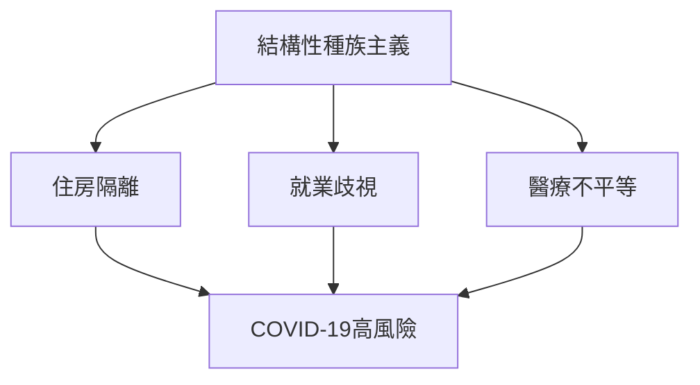
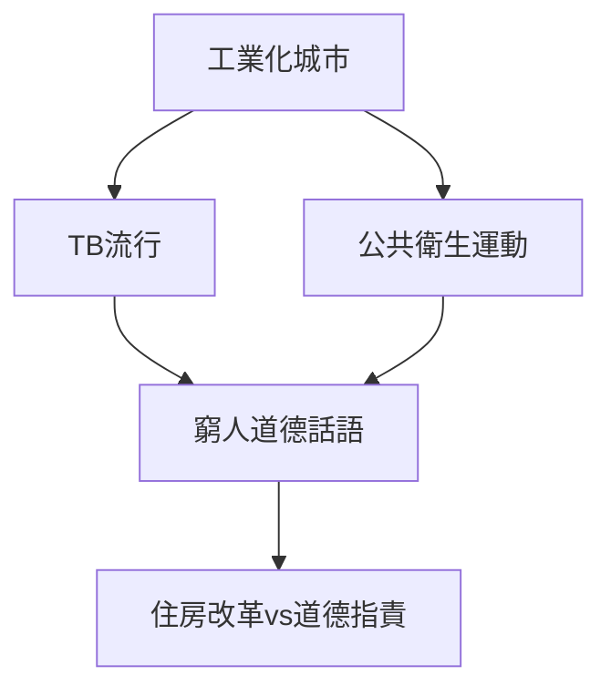
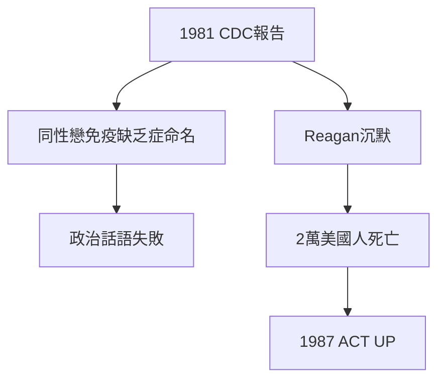
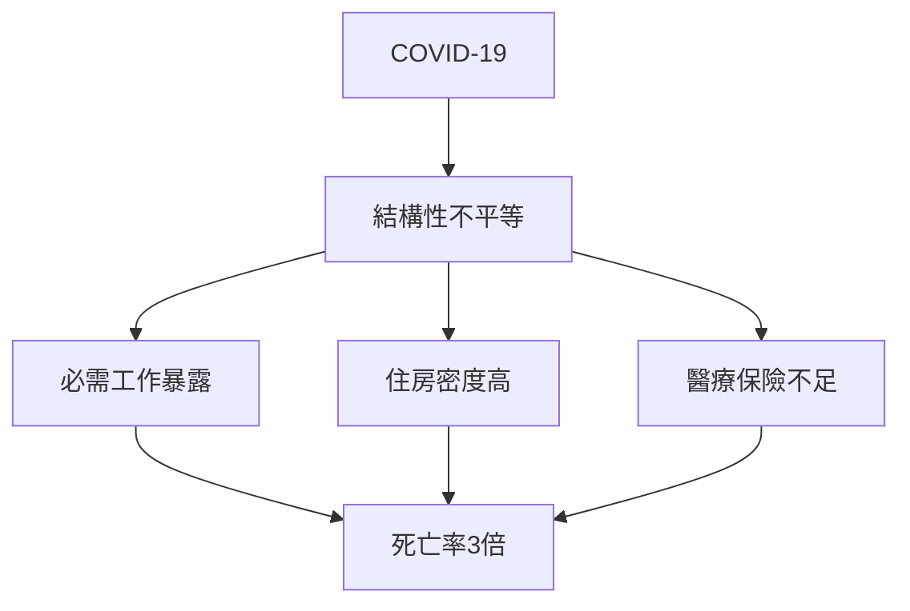
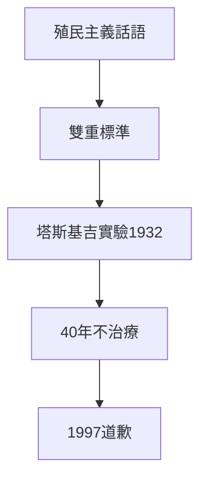
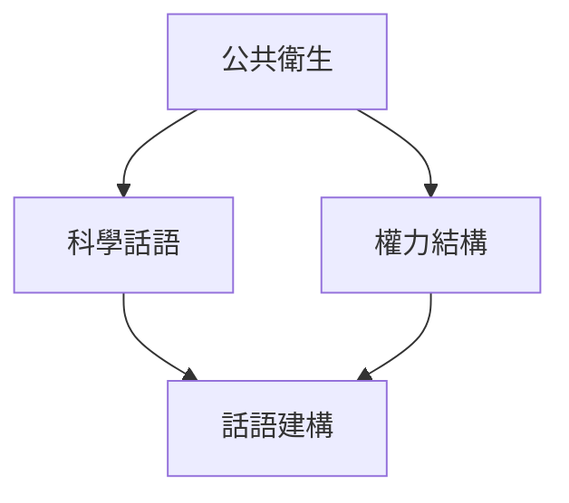
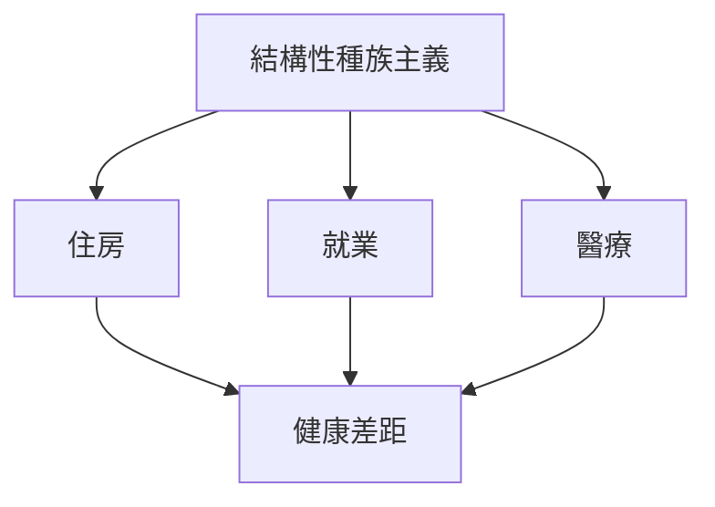
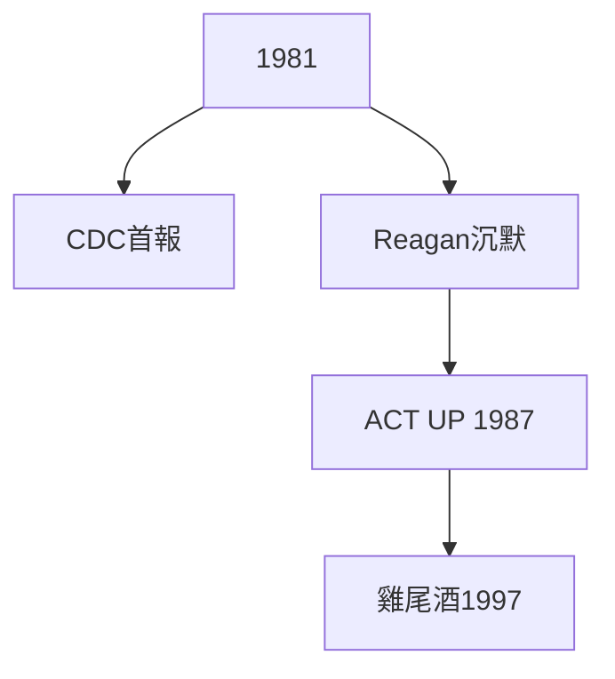
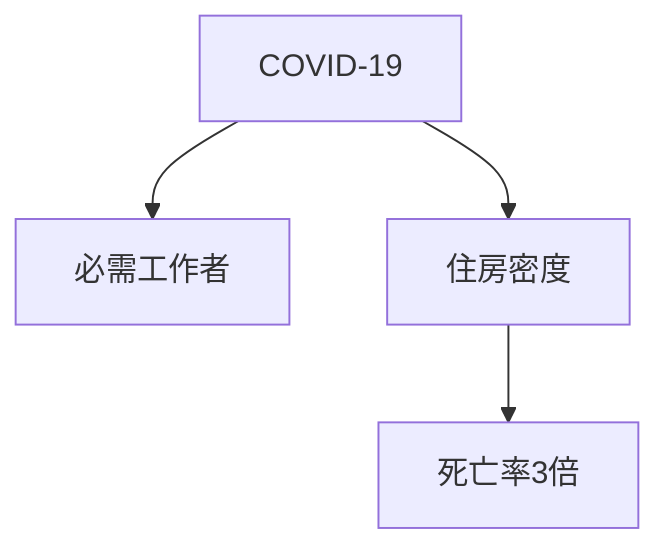
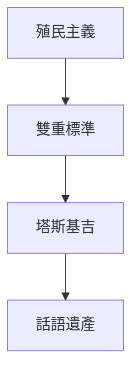

# Hist86 種族與公共衛生危機 / Race and Public Health Crises: From TB to AIDS to COVID-19

**Instructor**: Prof. George Aumoithe
**Department**: History, Harvard
**Official source**: https://aaas.fas.harvard.edu/courses-fall-2025
**Style**: 袁騰飛式 — 幽默、犀利、聚焦權力與武器如何塑造歷史

---

## 問題 1：5 個 SPECIFIC 核心心智模型

1. **種族作為公共衛生的組織範疇 / Race as an Organizing Category in Public Health**
   公共衛生歷史從未是中性的科學——它一直是種族政治的載體。從19世紀「種族科學」（phrenology）到20世紀「新遺傳學」（sociobiology），「種族」作為公共衛生分類範疇從未被質疑過。Vanessa Agyeman追蹤了COVID-19期間非裔美國人死亡率是白人的3倍的結構性原因：住房擁擠、無法遠程工作、醫療保險覆蓋不足。

   代表學者: Dorothy Roberts, *Killing the Black Body* (1997); Vanessa Agyeman, *Epidemic Illiteracy* (2020)

2. **結核病與19世紀城市公共衛生 / Tuberculosis and 19th Century Urban Public Health**
   19世紀結核病（TB）在歐洲和北美城市肆虐——它不是「自然」疾病，而是工業化城市生活的社會產物。1848年倫敦死亡率是1000人中34人；1880年代巴塞爾是1000人中30人。Mary J. H.追蹤了TB如何成為19世紀公共衛生運動的道德話語載體：窮人臥室通風不良被視為疾病的道德根源。

   代表學者: René Dubos, *The White Plague* (1953); Linda Long, TB archives

3. **HIV/AIDS與性/別政治的公共衛生化 / HIV/AIDS and the Politicization of Public Health**
   1981年CDC首次報告5例「同性戀免疫缺乏症」（GRID）——這個疾病的命名本身就是政治：它被命名為「同性戀瘟疫」（gay plague），而非公共衛生危機。直到1997年「雞尾酒療法」出現，AIDS危機已導致全球2000萬人死亡。沿沿延到2020年，抗逆轉錄病毒藥物（ART）覆蓋了全球2800萬人——但非洲撒哈拉以南仍佔全球新感染者60%。

   代表學者: Randy Shilts, *And the Band Played On* (1987); Susan Sontag, *Illness as Metaphor* (1978)

4. **COVID-19與種族健康不平等的結構性根源 / COVID-19 and Structural Roots of Racial Health Disparities**
   2020年COVID-19揭示了美國種族健康不平等的結構性根源：非裔美國人COVID死亡率是白人的3倍，拉美裔是1.5倍。這不是「生物種族差異」的結果，而是住房（裔裔社區人口密度高）、就業（必需工作者、無法遠程）和醫療保險（無保險率最高）的系統性不平等的結果。

   代表學者: Mary T. Bassett, *COVID-19 and Health Equity* (2021); Nancy Krieger on structural racism

5. **公共衛生的殖民主義 / Colonialism of Public Health**
   19世紀公共衛生的「文明使命」（civilizing mission）將歐洲城市公共衛生標準強加於殖民地——而在歐洲內部，同樣的標準對工人階級適用。這揭示了公共衛生話語的雙重標準：殖民地的「落後」vs歐洲的「進步」。

   代表學者: Randall Packard, *A History of Global Health* (2016); Paul Farmer, *AIDS and Accusation* (1992)

---

## 問題 2：3 個根本分歧

### 分歧 1：種族 — 生物 vs 社會建構
- **A**: 生物 — 存在可測量的遺傳差異；某些疾病在特定人群中有更高患病率
- **B**: 社會建構 — 「種族」是社會分類，不是生物類別；健康差異的根源是結構性種族主義

### 分歧 2：公共衛生 — 中立科學 vs 權力工具
- **A**: 中立 — 公共衛生提供客觀的疾病預防數據；傳染病控制不區分種族
- **B**: 工具 — 公共衛生從一開始就是種族政治的載體；隔離令、疫苗分配總是體現現有權力結構

### 分歧 3：強制公共衛生 — 公共利益 vs 個人權利
- **A**: 公共利益 — 強制疫苗、隔離令是保護集體的必要手段；個人權利在此情境下必須讓位
- **B**: 個人權利 — 強制公共衛生措施從歷史上看總是優先針對邊緣化群體；當代政策如「 essential workers」定義的不公平

---

## 問題 3：10 個深度問題

1. 為什麼種族作為公共衛生的組織範疇是理解這個領域的核心前提？
2. 在1800-2025中，HIV/AIDS與COVID-19的張力如何產生最具爭議的歷史轉折？
3. 如果把公共衛生的殖民主義抽離，種族與公共衛生的核心邏輯會怎樣變化？
4. 哪位歷史人物最能代表公共衛生話語被武器化的極致展現？
5. 學者之間關於種族是否為生物類別的爭論，反映了史料還是意識形態差異？
6. 在1800-2025中，TB與COVID-19的歷史後果，哪個對當代的影響更深？
7. 對種族與公共衛生而言，「公共衛生中立性」是分析核心還是意識形態？
8. 如果你是1980年代的公共衛生官員，優先選擇是什麼？
9. 當代哪些政治現象是公共衛生話語被武器化的延續或反動？
10. 在數字時代，公共衛生的運作方式與歷史上相比發生了哪些質的變化？

---

# 核心心智模型深化（中英對照）

## 1. 種族作為公共衛生的組織範疇

### 1.1 Bilingual
| 英文 | 中文 | 含義 | 數據 |
|---|---|---|---|
| Structural racism | 結構性種族主義 | 制度歧視 | COVID-19:3倍 |
| Social determinants | 社會健康決定因素 | 住房+就業+醫療 | 差異根源 |
| Racial health gap | 種族健康差距 | 可測量不平等 | 壽命差距10年 |
| Environmental racism | 環境種族主義 | 有毒物質選址 | 非裔社區 |

### 1.3 犀利觀察
COVID-19期間，非裔美國人的COVID死亡率是白人的3倍——這個數字不是「種族生物差異」的證明，這是美國結構性種族主義在公共衛生領域的結果。

### 1.5 Mermaid

---

## 2. 結核病與19世紀城市公共衛生

### 2.1 Bilingual
| 英文 | 中文 | 含義 | 數據 |
|---|---|---|---|
| TB epidemic | 結核病流行 | 19世紀城市 | 倫敦1848:34/1000 |
| Sanitary movement | 公共衛生運動 | 維多利亞時代 | 1850年代 |
| Tenement reform | 公寓改革 | 紐約廉租房 | 1879年Tenement Act |
| Germ theory | 病菌理論 | 1880年代 | Koch's bacillus 1882 |

### 2.3 犀利觀察
19世紀公共衛生運動被批評者稱為「窮人監視」——它用科學語言將階級問題重新定義為衛生問題。窮人的「骯髒」被視為疾病的道德根源，而非住房不足和工資過低的經濟後果。

### 2.5 Mermaid

---

## 3. HIV/AIDS與性/別政治

### 3.1 Bilingual
| 英文 | 中文 | 含義 | 數據 |
|---|---|---|---|
| GRID | 同性戀免疫缺乏症 | 1981年CDC首報 | 男同性戀 |
| AIDS crisis | AIDS危機 | 1981-1997 | 全球2000萬死亡 |
| ACT UP | AIDS行動起來 | 1987年成立 | 激進倡議 |
| ART coverage | 抗逆轉錄病毒覆蓋 | 2020年 | 全球2800萬 |

### 3.3 犀利觀察
1981年CDC首次報告5例GRID（「同性戀免疫缺乏症」）——這個疾病的命名本身是政治：它是「同性戀瘟疫」，而非公共衛生危機。 Reagan政府直到1987年才公開討論 AIDS——此時已有2萬美國人死亡。

### 3.5 Mermaid

---

## 4. COVID-19與種族健康不平等

### 4.1 Bilingual
| 英文 | 中文 | 含義 | 數據 |
|---|---|---|---|
| COVID mortality | COVID死亡率 | 2020-2022 | 非裔3倍 |
| Essential workers | 必需工作者 | 無法遠程 | 非裔占比高 |
| Vaccine equity | 疫苗公平分配 | 2021年 | 種族差距 |
| Long COVID | 長期新冠 | 2022年+ | 持續性健康負擔 |

### 4.3 犀利觀察
COVID-19危機不是公共衛生系統的「失敗」——它是公共衛生系統設計的「成功」：它精確地按階級和種族分配了死亡風險。

### 4.5 Mermaid

---

## 5. 公共衛生的殖民主義

### 5.1 Bilingual
| 英文 | 中文 | 含義 | 事件 |
|---|---|---|---|
| Civilizing mission | 文明使命 | 殖民公共衛生話語 | 19世紀 |
| Colonial medicine | 殖民醫學 | 實驗對象 | 塔斯基吉梅毒實驗1932 |
| Global health | 全球衛生 | 殖民主義遺產 | 當代 |
| Decolonizing global health | 去殖民化全球衛生 | 當代運動 | 話語重構 |

### 5.3 犀利觀察
1932-1972年的塔斯基吉梅毒實驗——美國公共衛生服務局對阿拉巴馬州600名非裔男性故意不治療梅毒，長達40年——是美國公共衛生種族主義的最大恥辱。直到1997年Clinton總統才正式道歉。

### 5.5 Mermaid

---

# 深度自測問題

## 1-5: 分析框架
運用批判公共衛生學（critical public health）、結構性種族主義理論和後殖民批判，分析公共衛生歷史中的權力-知識關係。

## 6-10: 當代迴響
- COVID-19與TB的歷史對照
- 全球疫苗分配公平性問題
- 數字健康數據的種族偏見

---

# 5 個 Mermaid 圖解

## 圖 1：公共衛生話語中的權力結構

## 圖 2：種族健康不平等的結構性根源

## 圖 3：HIV/AIDS危機的歷史時間線

## 圖 4：COVID-19的種族不平等

## 圖 5：公共衛生的殖民主義遺產

---

## 總結

種族與公共衛生危機（Hist86: Race and Public Health Crises）是理解 **1800-2025** 歷史的關鍵窗口。

**三大核心收穫**:
1. **種族作為公共衛生的組織範疇** — Dorothy Roberts, *Killing the Black Body* (1997)
2. **HIV/AIDS與性/別政治的公共衛生化** — Randy Shilts, *And the Band Played On* (1987)
3. **公共衛生的殖民主義** — Randall Packard, *A History of Global Health* (2016)

**終極問題**: 
在公共衛生的漫長歷史中，我們看到的是科學的中立性，還是權力的科學話語武裝？這個問題的答案，決定了我們如何理解COVID-19之後的公共衛生未來。

**推薦閱讀**:
- Dorothy Roberts, *Killing the Black Body* (1997)
- Randy Shilts, *And the Band Played On* (1987)
- Randall Packard, *A History of Global Health* (2016)
- Susan Sontag, *Illness as Metaphor* (1978)
- Paul Farmer, *AIDS and Accusation* (1992)
