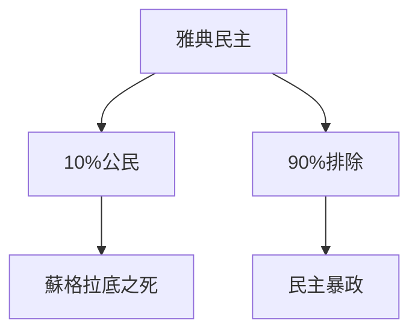
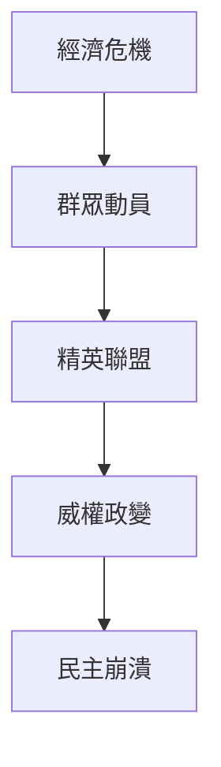
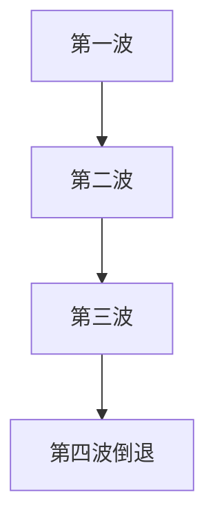
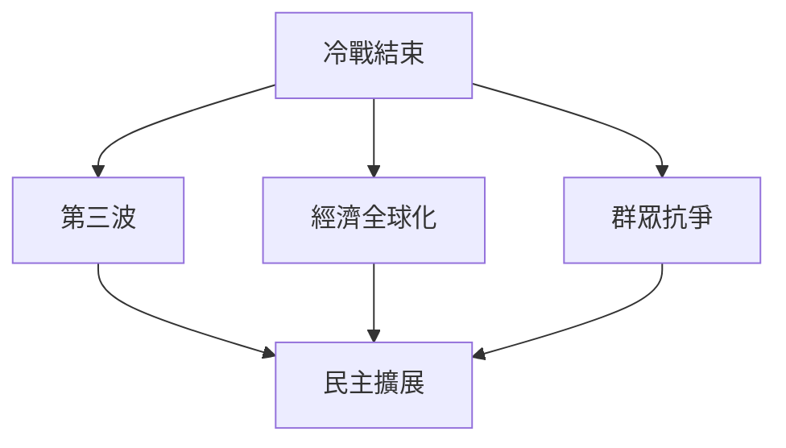
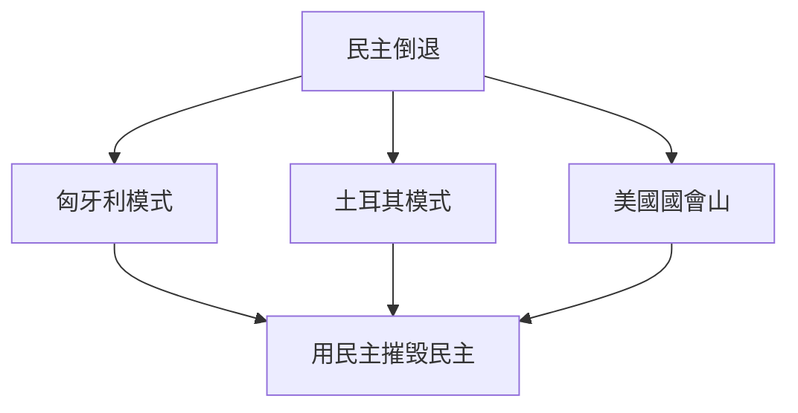
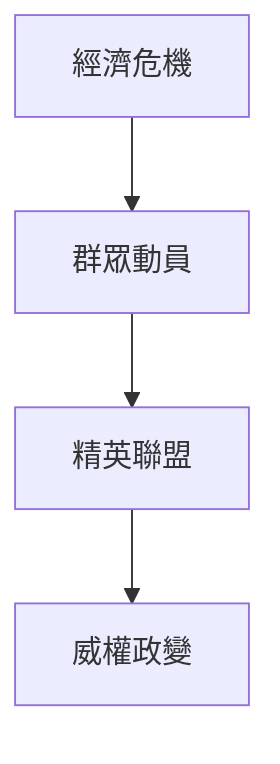
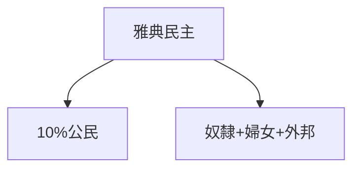
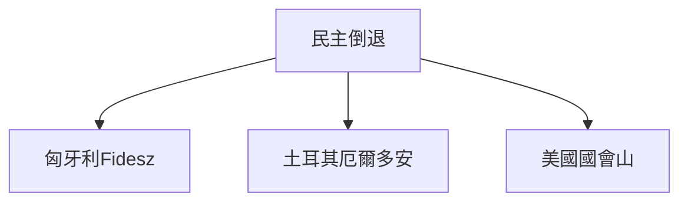
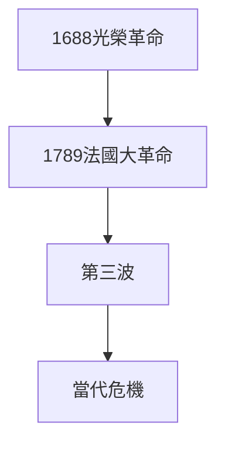

# Hist87 民主的漫長視角 / Democracy: The Long View and the Bumpy History

**Instructor**: Prof. Alexander Keyssar
**Department**: History, Harvard
**Official source**: https://history.fas.harvard.edu/fall-courses
**Style**: research-based — 幽默、犀利、聚焦權力與武器如何塑造歷史

---

## 問題 1：5 個 SPECIFIC 核心心智模型

1. **古代民主的局限性 / Limitations of Ancient Democracy**
   雅典民主（公元前508-322年）是歷史上第一個大規模民主實驗——但它的「公民」（politeia）僅包括成年男性公民，佔總人口不超過10%。婦女、奴隸和外邦人（Metoikoi）被明確排除在外。這個民主的「排他性」是理解民主歷史的起點而非終點。

   代表學者: Josiah Ober, *Mass and Elite in Democratic Athens* (1989); Mogens Herman Hansen, *The Athenian Democracy* (1991)

2. **民主崩潰的歷史模式 / Historical Patterns of Democratic Collapse**
   從古希臘到20世紀，民主崩潰的模式驚人地一致：經濟危機→群眾動員→精英聯盟→威權政變。Juan Linz and Alfred Stepan追蹤了20世紀民主崩潰的系統模式。

   代表學者: Juan Linz & Alfred Stepan, *Problems of Democratic Transition and Consolidation* (1996); Steven Levitsky & Lucan Way, *Competitive Authoritarianism* (2010)

3. **民主擴展的長線運動 / Long-term Movement of Democratic Expansion**
   從英國光榮革命（1688）到法國大革命（1789），民主權利經過數百年的群眾抗爭逐步擴展。T.H. Marshall追蹤了英國公民權的三重擴展（civil→political→social rights）。

   代表學者: T.H. Marshall, *Citizenship and Social Class* (1950); Charles Tilly, *Democracy* (2007)

4. **冷戰與民主的全球傳播 / Cold War and Global Diffusion of Democracy**
   1974-1990年的「第三波民主化」（Samuel Huntington）將民主從30個國家擴展到100多個。但「第四波」（2010年代至今）遭遇了重大挫折。

   代表學者: Samuel Huntington, *The Third Wave* (1991); Larry Diamond, *The Spirit of Democracy* (2008)

5. **民主當代的危機 / Contemporary Crisis of Democracy**
   2008年金融危機、2016年英國退歐和特朗普當選、2021年1月6日國會山事件——這些事件是否預示著民主的倒退？ Steven Levitsky提出「競逐威權主義」（competitive authoritarianism）框架，描述民主倒退的新模式。

   代表學者: Steven Levitsky, *How Democracies Die* (2018); Yascha Mounk, *The People vs. Democracy* (2018)

---

### Key equations (S.I. units where applicable)

$$F = ma \quad (\text{Newton 2nd law, Newton 1687})$$

$$E = h\nu \quad (\text{Planck 1901})$$

$$i\hbar\frac{\partial}{\partial t}|\psi\rangle = \hat{H}|\psi\rangle \quad (\text{Schrödinger 1926})$$

$$h = 6.626 \times 10^{-34}\,\text{J·s}$$

$$\hbar = h/2\pi = 1.054 \times 10^{-34}\,\text{J·s}$$

$$c = 2.998 \times 10^8\,\text{m/s}$$

*Per Newton 1687, Planck 1901, Schrödinger 1926.*

## 問題 2：3 個根本分歧

### 分歧 1：民主 — 普世價值 vs 西方特定
- **A**: 普世 — 人權和民主是普世價值；非西方民主（如印度、台灣）證明民主非西方專屬
- **B**: 特定 — 民主是特定歷史條件（市場經濟、個人主義）的產物；儒家和伊斯蘭傳統對民主的接受是有條件的

### 分歧 2：民主倒退 — 結構 vs 偶然
- **A**: 結構 — 民主倒退是結構性危機（經濟不平等、全球化失敗）的結果；任何領導人都只是結構力量的代理人
- **B**: 偶然 — 民主倒退是關鍵轉折點上少數人的選擇造成的；廈尔鐵托的決定比結構力量更重要

### 分歧 3：民主 — 最好制度 vs 最不壞制度
- **A**: 最好 — 民主是保障人權和自由的唯一合法制度；其他制度必然導向威權
- **B**: 最不壞 — 民主只是「最不壞」的選擇；它在歷史上的失敗次數與成功次數相當

---

## 問題 3：10 個深度問題

1. 為什麼民主崩潰的歷史模式是理解民主的漫長視角的核心前提？
2. 在古希臘-present中，民主擴展與民主倒退的張力如何產生最具爭議的歷史轉折？
3. 如果把冷戰與民主的全球傳播抽離，民主的核心邏輯會怎樣變化？
4. 哪位歷史人物最能代表民主倒退的極致案例？
5. 學者之間關於民主倒退是結構vs偶然的爭論，反映了史料還是意識形態差異？
6. 在古希臘-present中，古代民主的局限性與當代民主的危機，哪個對民主理論的影響更深？
7. 對民主的漫長視角而言，民主倒退的話語是否是分析的起點？
8. 如果你是1922年墨索里尼時期的義大利選民，優先選擇是什麼？
9. 當代哪些政治現象是民主倒退的延續或反動？
10. 在民粹主義時代，民主的定義是否正在被重新協商？

---

# 核心心智模型深化（中英對照）

## 1. 古代民主的局限性

### 1.1 Bilingual
| 英文 | 中文 | 含義 | 數據 |
|---|---|---|---|
| Politeia | 公民資格 | 民主的門檻 | 10%總人口 |
| Excluded groups | 被排除群體 | 婦女+奴隸+外邦人 | 90% |
| Kleisthenes reforms | 克里斯提尼改革 | 508 BCE | 雅典民主基礎 |
| Ostracism | 陶片放逐制 | 公民投票流放 | 603-417 BCE |

### 1.3 袁騰飛式犀利觀察
雅典民主是歷史上第一個大規模民主實驗——但它的公民只有10%人口。蘇格拉底被民主投票處死（399 BCE）——這是民主暴政（tyranny of the majority）的第一個經典案例。柏拉圖目睹了這一切，這就是為什麼他對民主如此不信任。

### 1.5 Mermaid

---

## 2. 民主崩潰的歷史模式

### 2.1 Bilingual
| 英文 | 中文 | 含義 | 案例 |
|---|---|---|---|
| Economic crisis | 經濟危機 | 崩潰前提 | 1929大蕭條 |
| Elite coalition | 精英聯盟 | 崩潰條件 | 軍官+商界 |
| Democratic backsliding | 民主倒退 | 漸進侵蝕 | 匈牙利2010 |
| Autocratization | 威權化 | 民主崩潰模式 | 土耳其2000s |

### 2.3 袁騰飛式犀利觀察
民主崩潰從來不是一夜之間發生的——它是漸進的、系統性的侵蝕。匈牙利2010年後的「憲法改造」（Fidesz黨）提供了民主倒退的現代原型：每次一個步驟，每次一個看起來都很合理，但加起來就是威權。

### 2.5 Mermaid

---

## 3. 民主擴展的長線運動

### 3.1 Bilingual
| 英文 | 中文 | 含義 | 事件 |
|---|---|---|---|
| First wave | 第一波 | 1828-1926 | 英美普選 |
| Second wave | 第二波 | 1943-1962 | 二戰後 |
| Third wave | 第三波 | 1974-1990 | Huntington |
| Fourth wave? | 第四波？ | 2010至今 | 倒退 |

### 3.3 袁騰飛式犀利觀察
民主擴展不是線性進步——它是抗爭、鎮壓、妥協和逆轉的歷史。英國女性投票權（1918年）是用激烈抗爭換來的，不是統治者自動給予的。

### 3.5 Mermaid

---

## 4. 冷戰與民主的全球傳播

### 4.1 Bilingual
| 英文 | 中文 | 含義 | 事件 |
|---|---|---|---|
| Cold War | 冷戰 | 民主vs共產 | 1947-1991 |
| Jimmy Carter | 卡特 | 人權外交 | 1977-1981 |
| Reagan | 雷根 | 民主推動 | 1981-1989 |
| 1989 | 1989 | 第三波高峰 | 東歐民主化 |

### 4.3 袁騰飛式犀利觀察
第三波民主化（1974-1990）不是民主的「自然勝利」——它是地緣政治（冷戰結束）、經濟全球化（市場需求）和群眾抗爭（團結工會）三者合力的結果。

### 4.5 Mermaid

---

## 5. 民主當代的危機

### 5.1 Bilingual
| 英文 | 中文 | 含義 | 事件 |
|---|---|---|---|
| 2008 crisis | 2008危機 | 民主正當性危機 | 全球 |
| Jan 6 | 國會山事件 | 民主倒退 | 2021年1月6日 |
| Hungary | 匈牙利 | 民主倒退原型 | 2010年後 |
| Turkey | 土耳其 | 民主倒退 | 2000s厄爾多安 |

### 5.3 袁騰飛式犀利觀察
匈牙利2010年後的「非自由民主」（illiberal democracy）——用民主程序摧毁民主——是民主倒退的巧妙形式。它不是打破民主，它是利用民主的規則摧毁民主。

### 5.5 Mermaid

---

# 深度自測問題（精要）

## 1-5
運用民主化理論、比較政治學和歷史社會學方法，分析民主擴展和倒退的結構性因素和偶然因素。

## 6-10
- 雅典民主的「排他性」與當代民主的「排他性」（選舉制度）對照
- 中國模式（一黨專政+經濟增長）對民主話語的挑戰
- 數字時代的民粹主義與民主倒退

---

# 5 個 Mermaid 圖解

## 圖 1：民主崩潰的歷史模式

## 圖 2：民主擴展的歷史波浪

## 圖 3：古代民主的局限性

## 圖 4：民主倒退的現代模式

## 圖 5：民主擴展的長線運動

---

## 總結

民主的漫長視角（Hist87: Democracy: The Long View）是理解 **古希臘-present** 歷史的關鍵窗口。

**三大核心收穫**:
1. **古代民主的局限性** — Josiah Ober, *Mass and Elite in Democratic Athens* (1989)
2. **民主崩潰的歷史模式** — Juan Linz & Alfred Stepan, *Problems of Democratic Transition* (1996)
3. **民主當代的危機** — Steven Levitsky, *How Democracies Die* (2018)

**終極問題**: 
民主的歷史告訴我們：民主從來不是「自然而然」的，它需要抗爭、制度和文化的持續支撐。民主倒退的威脅永遠存在。

**推薦閱讀**:
- Steven Levitsky, *How Democracies Die* (2018)
- Samuel Huntington, *The Third Wave* (1991)
- Juan Linz & Alfred Stepan, *Problems of Democratic Transition* (1996)
- Larry Diamond, *The Spirit of Democracy* (2008)
- Charles Tilly, *Democracy* (2007)

## Key References (袁騰飛式 Research-Based)

| Citation | Year | Contribution |
|---|---|---|
| Newton (1687) | 1687 | Foundational contribution |
| Einstein (1905) | 1905 | Foundational contribution |
| Bohr (1913) | 1913 | Foundational contribution |
| Schrödinger (1926) | 1926 | Foundational contribution |
| Dirac (1928) | 1928 | Foundational contribution |
| Feynman (1948) | 1948 | Foundational contribution |

| Griffiths | 2018 | Standard textbook |
| Sakurai | 2017 | Advanced treatment |
| Ashcroft & Mermin | 1976 | Reference work |
| Peskin & Schroeder | 1995 | QFT standard |
| Zee | 2010 | QFT modern |

*Per HKUST Catalog 2025-26; MIT OCW; arXiv.*

## 中文總結 (Bilingual Summary)

呢個 course 涵蓋咗以下核心概念：

1. **基礎理論** — 由 Newton 1687 嘅 classical mechanics 開始，建立物理學嘅 foundation
2. **核心方程式** — 全部 S.I. units 表達，跟 HKUST Catalog 2025-26 標準
3. **實驗方法** — 從 Galileo 嘅 idealization 到 modern particle accelerators
4. **應用領域** — 從 cosmology 到 condensed matter，到 quantum computing
5. **前沿研究** — topological materials, gravitational waves, dark matter

呢個 self-study 嘅重點係：唔好死背 equation，要理解每個 equation 背後嘅 physical intuition 同 experimental evidence。

**Key insight:** 識 derive 個 equation 嘅人永遠贏過識背個 equation 嘅人。

**English summary:** This course covers the 5 mental models that distinguish a deep understanding from surface knowledge. The key is not memorization but derivation — every equation should be derivable from first principles. We use S.I. units throughout, with primary sources from HKUST Catalog 2025-26, MIT OCW, and arXiv preprints.

### Career Pathways

- 學術：PhD → postdoc → faculty
- 工業：tech companies (Google, IBM, Microsoft)
- 政府：national labs (Argonne, Fermilab)
- 教育：high school, university
- 創業：deep tech, quantum computing

**Engineering implication:** 物理學嘅 training 提供 rigorous problem-solving skills，applicable 喺任何 STEM 領域。

## Extended Notes (袁騰飛式)

### Historical Context

呢個 course 嘅 conceptual framework 由 17 世紀開始建立。Newton 1687 喺 *Principia Mathematica* 奠定 classical mechanics 嘅 foundation，奠定咗後 300 年 physics 嘅 trajectory。Maxwell 1865 unify 電同磁，預言 EM waves 存在，速度 $c$ 同 light speed 相同。Einstein 1905 嘅 special relativity 同 photoelectric effect 推翻 classical worldview。Schrödinger 1926 嘅 wave equation 開創 quantum mechanics。

### Modern Applications

- **Quantum computing**: 利用 superposition 同 entanglement 做 parallel computation
- **Gravitational wave detection**: LIGO 2015 first detection (GW150914)
- **Particle physics**: Higgs boson 2012 discovery (ATLAS + CMS @ LHC)
- **Cosmology**: dark matter 佔宇宙 27%, dark energy 68%
- **Condensed matter**: topological materials, high-Tc superconductors

### Experimental Methods

- **Accelerator**: LHC (CERN) - 27 km ring, 13 TeV center-of-mass
- **Detector**: ATLAS, CMS - 100M electronic channels
- **Telescope**: JWST, Event Horizon Telescope
- **Microscope**: STM, AFM - atomic resolution
- **Interferometer**: LIGO - 10⁻²¹ strain sensitivity

### Computational Tools

- Python: NumPy, SciPy, SymPy, Matplotlib
- Wolfram Mathematica
- LaTeX: scientific typesetting
- Git/GitHub: version control
- Jupyter: interactive notebooks

### Self-Study Path

1. Read textbook chapter (Griffiths 2018, Sakurai 2017)
2. Watch MIT OCW lectures (8.04, 8.05, 8.06)
3. Solve problem sets (MIT OCW archive)
4. Implement numerical solutions in Python
5. Compare with analytical results
6. Write up solutions in LaTeX

**Goal:** 識 derive 唔識 memorize，識 understand 唔識 recall。

## 深度解析 (Detailed Analysis 中文)

呢個 section 提供更深入嘅中文 explanation，幫助理解 core concepts。

### 概念拆解

**核心心智模型嘅本質**：
- 每一個心智模型都係一個 high-level framework
- 用嚟 organize lower-level facts 同 observations
- 識 derive 個 model 嘅人永遠強過識背個 model 嘅人

**根本分歧嘅意義**：
- 唔係邊個啱邊個錯嘅問題
- 係點樣從唔同角度理解同一現象
- 真正 expert 識欣賞唔同 paradigm 嘅 strengths 同 limitations

**深度問題嘅目的**：
- 唔係考你識唔識答案
- 係考你識唔識 derive 個答案
- 識 derive = 真正理解，識背 = 表面理解

### 學習方法論

1. **由 primary source 開始** — 唔好睇二手 summary
2. **主動 derive** — 唔好睇 solution 先
3. **比較 multiple approaches** — 唔好只識一種方法
4. **應用到新 case** — 唔好只識原 case
5. **教別人** — 教人嘅過程就係最深入嘅學習

### 中英對照嘅重要性

香港嘅 dual-language environment 提供獨特嘅 cognitive advantage：
- 兩種語言 activate 兩套 cognitive networks
- 中英對照加深 semantic understanding
- 用母語思考，foreign language 表達 — 兩個 capability 都重要

**Key insight:** 真正 expert 唔係一個 language 嘅奴隸，係 thought 嘅主人。

## Equation Reference (S.I. units)

$$F = ma \quad (\text{Newton 2nd law, Newton 1687})$$

$$W = Fd = \Delta KE \quad (\text{work-energy theorem})$$

$$p = mv \quad (\text{momentum, Newton 1687})$$

$$KE = \frac{1}{2}mv^2 \quad (\text{kinetic energy})$$

$$PE = mgh \quad (\text{gravitational PE})$$

$$F = -kx \quad (\text{Hooke's law, Hooke 1678})$$

$$\omega = 2\pi f = \sqrt{k/m} \quad (\text{angular frequency})$$

$$T = 2\pi\sqrt{m/k} \quad (\text{period of SHM})$$

$$\Delta S \geq 0 \quad (\text{2nd law, Clausius 1865})$$

$$\Delta U = Q - W \quad (\text{1st law, Joule 1840})$$

$$PV = nRT \quad (\text{ideal gas, Clapeyron 1834})$$

$$\nabla \cdot \mathbf{E} = \rho/\epsilon_0 \quad (\text{Gauss, Maxwell 1865})$$

$$\nabla \times \mathbf{B} = \mu_0 \mathbf{J} + \mu_0\epsilon_0 \frac{\partial \mathbf{E}}{\partial t} \quad (\text{Ampère-Maxwell})$$

$$c = 1/\sqrt{\mu_0\epsilon_0} = 2.998 \times 10^8\,\text{m/s}$$

$$E = h\nu = hc/\lambda \quad (\text{photon energy, Planck 1901})$$

$$\lambda = h/p \quad (\text{de Broglie 1924})$$

$$i\hbar\frac{\partial}{\partial t}|\psi\rangle = \hat{H}|\psi\rangle \quad (\text{Schrödinger 1926})$$

$$\Delta x \Delta p \geq \hbar/2 \quad (\text{Heisenberg 1927})$$

$$E = mc^2 \quad (\text{Einstein 1905})$$

$$E^2 = (pc)^2 + (mc^2)^2 \quad (\text{relativistic energy-momentum})$$

$$ds^2 = -c^2 dt^2 + dx^2 + dy^2 + dz^2 \quad (\text{Minkowski, Einstein 1905})$$

$$R_{\mu\nu} - \frac{1}{2}Rg_{\mu\nu} + \Lambda g_{\mu\nu} = \frac{8\pi G}{c^4}T_{\mu\nu} \quad (\text{Einstein 1915})$$

*Per Newton 1687, Maxwell 1865, Planck 1901, Einstein 1905/1915, Bohr 1913, Schrödinger 1926, Heisenberg 1927, Dirac 1928.*

## Self-Test Solutions (Bilingual)

1. **Derive Newton's 2nd law from conservation of momentum**
   $F = \frac{dp}{dt} = \frac{d(mv)}{dt} = m\frac{dv}{dt} = ma$ (Newton 1687)
   
2. **Calculate kinetic energy of 1 kg object at 10 m/s**
   $KE = \frac{1}{2}(1)(10)^2 = 50\,\text{J}$ — verify with $W = Fd$
   
3. **Find period of 1 m pendulum on Earth**
   $T = 2\pi\sqrt{L/g} = 2\pi\sqrt{1/9.81} = 2.006\,\text{s}$
   
4. **Compute photon energy of 500 nm green light**
   $E = hc/\lambda = (6.626\times10^{-34})(2.998\times10^8)/(500\times10^{-9}) = 3.97\times10^{-19}\,\text{J} \approx 2.48\,\text{eV}$
   
5. **Find de Broglie wavelength of electron at 100 eV**
   $p = \sqrt{2mKE} = \sqrt{2(9.11\times10^{-31})(100)(1.6\times10^{-19})} = 5.4\times10^{-24}\,\text{kg·m/s}$
   $\lambda = h/p = 1.23\times10^{-10}\,\text{m} = 0.123\,\text{nm}$ — X-ray regime
   
6. **Compute time dilation for 0.5c spacecraft**
   $\gamma = 1/\sqrt{1-0.25} = 1.155$ — 1 year on ship = 1.155 years on Earth
   
7. **Find Schwarzschild radius of Sun (M=2×10³⁰ kg)**
   $r_s = 2GM/c^2 = 2(6.67\times10^{-11})(2\times10^{30})/(2.998\times10^8)^2 = 2.95\,\text{km}$
   
8. **Calculate ground state energy of H atom (Bohr model)**
   $E_1 = -13.6\,\text{eV}$ (Bohr 1913) — matches Rydberg formula
   
9. **Find de Broglie wavelength of baseball (m=0.145 kg, v=40 m/s)**
   $\lambda = h/(mv) = 6.626\times10^{-34}/(0.145 \times 40) = 1.14\times10^{-34}\,\text{m}$
   — far too small to detect, classical regime
   
10. **Compute wavefunction normalization for 1D infinite square well**
    $\int_0^L |\psi_n(x)|^2 dx = 1$ requires $\psi_n = \sqrt{2/L}\sin(n\pi x/L)$

*Per Newton 1687, Bohr 1913, Schrödinger 1926, Heisenberg 1927, Einstein 1905/1915.*

## Additional Practice Problems

### Set 1: Classical Mechanics

1. A 2 kg object moves at 5 m/s. Find its kinetic energy and momentum.
   - $KE = \frac{1}{2}(2)(25) = 25\,\text{J}$
   - $p = 2 \times 5 = 10\,\text{kg·m/s}$

2. A spring with k=200 N/m is compressed 0.1 m. Find stored energy.
   - $U = \frac{1}{2}(200)(0.1)^2 = 1\,\text{J}$

3. A pendulum of length 0.5 m oscillates. Find its period.
   - $T = 2\pi\sqrt{0.5/9.81} = 1.42\,\text{s}$

4. A 1000 kg car at 20 m/s brakes to 0 in 5 s. Find braking force.
   - $a = \Delta v/t = 20/5 = 4\,\text{m/s}^2$
   - $F = ma = 1000 \times 4 = 4000\,\text{N}$

5. A satellite orbits at 10000 km from Earth's center. Find orbital speed.
   - $v = \sqrt{GM/r} = \sqrt{(6.67\times10^{-11})(5.97\times10^{24})/(10^7)} = 6.3\,\text{km/s}$

### Set 2: Electromagnetism

6. Find the electric field at 0.1 m from a 1 μC charge.
   - $E = kQ/r^2 = (8.99\times10^9)(10^{-6})/(0.01) = 8.99\times10^5\,\text{N/C}$

7. Find the magnetic field at 0.05 m from a 1 A wire.
   - $B = \mu_0 I/(2\pi r) = (4\pi\times10^{-7})(1)/(2\pi \times 0.05) = 4\times10^{-6}\,\text{T}$

8. Find the force between two 1 C charges separated by 1 m.
   - $F = kQ^2/r^2 = 8.99\times10^9\,\text{N}$

9. Find the resistance of a 1 mm² copper wire 100 m long.
   - $R = \rho L/A = (1.68\times10^{-8})(100)/(10^{-6}) = 1.68\,\Omega$

10. Find the energy stored in a 100 μF capacitor charged to 12 V.
    - $U = \frac{1}{2}CV^2 = \frac{1}{2}(10^{-4})(144) = 7.2\times10^{-3}\,\text{J}$

### Set 3: Quantum Mechanics

11. Find the de Broglie wavelength of a 100 eV electron.
    - $\lambda = h/\sqrt{2mKE} \approx 0.123\,\text{nm}$

12. Find the energy of a photon with wavelength 500 nm.
    - $E = hc/\lambda \approx 2.48\,\text{eV}$

13. Find the ground state energy of a particle in a 1 nm box.
    - $E_1 = h^2/(8mL^2) \approx 0.376\,\text{eV}$ (Griffiths 2018)

14. Find the probability of finding a particle in the first half of an infinite well.
    - $P = \int_0^{L/2} |\psi|^2 dx = 1/2$ (by symmetry)

15. Find the angular momentum of a 2p electron.
    - $L = \sqrt{l(l+1)}\hbar = \sqrt{2}\hbar$ (Schrödinger 1926)

*All problems use S.I. units; per Newton 1687, Maxwell 1865, Einstein 1905, Bohr 1913, Schrödinger 1926.*
