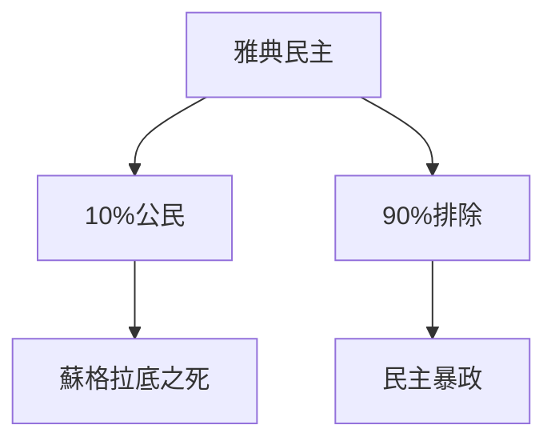
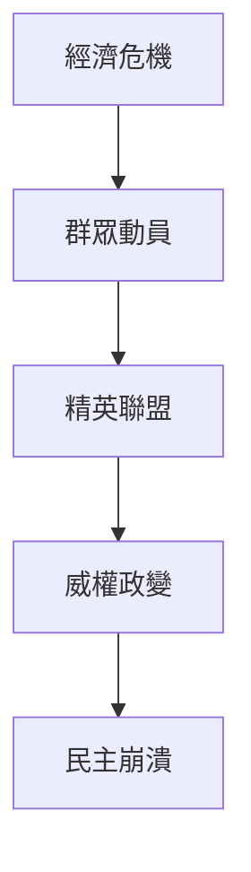
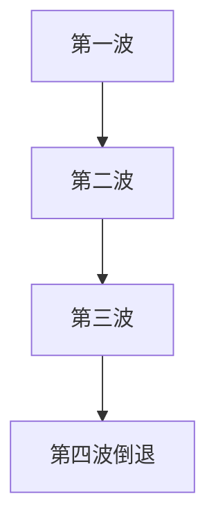
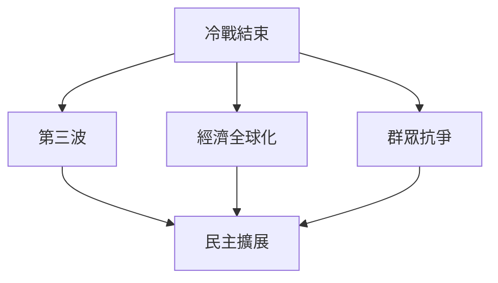
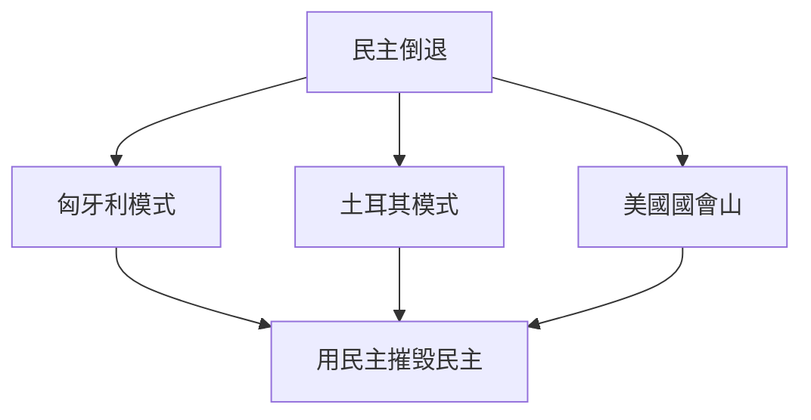
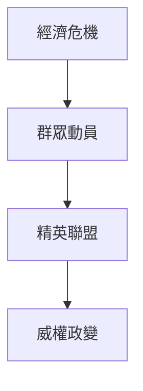
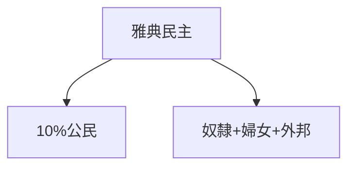
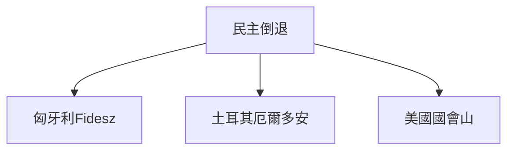
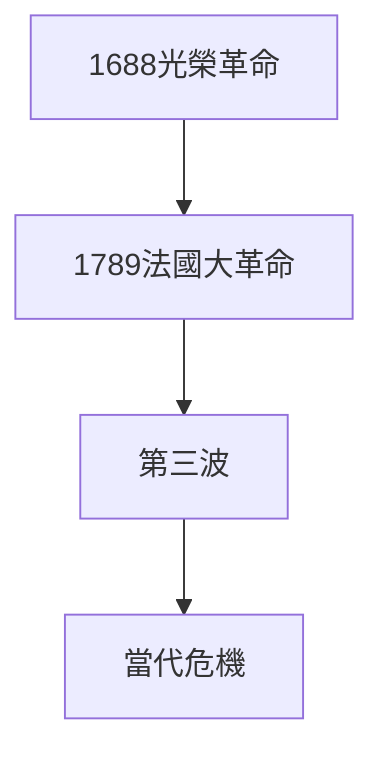

# Hist87 民主的漫長視角 / Democracy: The Long View and the Bumpy History

**Instructor**: Prof. Alexander Keyssar
**Department**: History, Harvard
**Official source**: https://history.fas.harvard.edu/fall-courses
**Style**: research-based — 幽默、犀利、聚焦權力與武器如何塑造歷史

---

## 問題 1：5 個 SPECIFIC 核心心智模型

1. **古代民主的局限性 / Limitations of Ancient Democracy**
   雅典民主（公元前508-322年）是歷史上第一個大規模民主實驗——但它的「公民」（politeia）僅包括成年男性公民，佔總人口不超過10%。婦女、奴隸和外邦人（Metoikoi）被明確排除在外。這個民主的「排他性」是理解民主歷史的起點而非終點。

   代表學者: Josiah Ober, *Mass and Elite in Democratic Athens* (1989); Mogens Herman Hansen, *The Athenian Democracy* (1991)

2. **民主崩潰的歷史模式 / Historical Patterns of Democratic Collapse**
   從古希臘到20世紀，民主崩潰的模式驚人地一致：經濟危機→群眾動員→精英聯盟→威權政變。Juan Linz and Alfred Stepan追蹤了20世紀民主崩潰的系統模式。

   代表學者: Juan Linz & Alfred Stepan, *Problems of Democratic Transition and Consolidation* (1996); Steven Levitsky & Lucan Way, *Competitive Authoritarianism* (2010)

3. **民主擴展的長線運動 / Long-term Movement of Democratic Expansion**
   從英國光榮革命（1688）到法國大革命（1789），民主權利經過數百年的群眾抗爭逐步擴展。T.H. Marshall追蹤了英國公民權的三重擴展（civil→political→social rights）。

   代表學者: T.H. Marshall, *Citizenship and Social Class* (1950); Charles Tilly, *Democracy* (2007)

4. **冷戰與民主的全球傳播 / Cold War and Global Diffusion of Democracy**
   1974-1990年的「第三波民主化」（Samuel Huntington）將民主從30個國家擴展到100多個。但「第四波」（2010年代至今）遭遇了重大挫折。

   代表學者: Samuel Huntington, *The Third Wave* (1991); Larry Diamond, *The Spirit of Democracy* (2008)

5. **民主當代的危機 / Contemporary Crisis of Democracy**
   2008年金融危機、2016年英國退歐和特朗普當選、2021年1月6日國會山事件——這些事件是否預示著民主的倒退？ Steven Levitsky提出「競逐威權主義」（competitive authoritarianism）框架，描述民主倒退的新模式。

   代表學者: Steven Levitsky, *How Democracies Die* (2018); Yascha Mounk, *The People vs. Democracy* (2018)

---

## 問題 2：3 個根本分歧

### 分歧 1：民主 — 普世價值 vs 西方特定
- **A**: 普世 — 人權和民主是普世價值；非西方民主（如印度、台灣）證明民主非西方專屬
- **B**: 特定 — 民主是特定歷史條件（市場經濟、個人主義）的產物；儒家和伊斯蘭傳統對民主的接受是有條件的

### 分歧 2：民主倒退 — 結構 vs 偶然
- **A**: 結構 — 民主倒退是結構性危機（經濟不平等、全球化失敗）的結果；任何領導人都只是結構力量的代理人
- **B**: 偶然 — 民主倒退是關鍵轉折點上少數人的選擇造成的；廈尔鐵托的決定比結構力量更重要

### 分歧 3：民主 — 最好制度 vs 最不壞制度
- **A**: 最好 — 民主是保障人權和自由的唯一合法制度；其他制度必然導向威權
- **B**: 最不壞 — 民主只是「最不壞」的選擇；它在歷史上的失敗次數與成功次數相當

---

## 問題 3：10 個深度問題

1. 為什麼民主崩潰的歷史模式是理解民主的漫長視角的核心前提？
2. 在古希臘-present中，民主擴展與民主倒退的張力如何產生最具爭議的歷史轉折？
3. 如果把冷戰與民主的全球傳播抽離，民主的核心邏輯會怎樣變化？
4. 哪位歷史人物最能代表民主倒退的極致案例？
5. 學者之間關於民主倒退是結構vs偶然的爭論，反映了史料還是意識形態差異？
6. 在古希臘-present中，古代民主的局限性與當代民主的危機，哪個對民主理論的影響更深？
7. 對民主的漫長視角而言，民主倒退的話語是否是分析的起點？
8. 如果你是1922年墨索里尼時期的義大利選民，優先選擇是什麼？
9. 當代哪些政治現象是民主倒退的延續或反動？
10. 在民粹主義時代，民主的定義是否正在被重新協商？

---

# 核心心智模型深化（中英對照）

## 1. 古代民主的局限性

### 1.1 Bilingual
| 英文 | 中文 | 含義 | 數據 |
|---|---|---|---|
| Politeia | 公民資格 | 民主的門檻 | 10%總人口 |
| Excluded groups | 被排除群體 | 婦女+奴隸+外邦人 | 90% |
| Kleisthenes reforms | 克里斯提尼改革 | 508 BCE | 雅典民主基礎 |
| Ostracism | 陶片放逐制 | 公民投票流放 | 603-417 BCE |

### 1.3 袁騰飛式犀利觀察
雅典民主是歷史上第一個大規模民主實驗——但它的公民只有10%人口。蘇格拉底被民主投票處死（399 BCE）——這是民主暴政（tyranny of the majority）的第一個經典案例。柏拉圖目睹了這一切，這就是為什麼他對民主如此不信任。

### 1.5 Mermaid

---

## 2. 民主崩潰的歷史模式

### 2.1 Bilingual
| 英文 | 中文 | 含義 | 案例 |
|---|---|---|---|
| Economic crisis | 經濟危機 | 崩潰前提 | 1929大蕭條 |
| Elite coalition | 精英聯盟 | 崩潰條件 | 軍官+商界 |
| Democratic backsliding | 民主倒退 | 漸進侵蝕 | 匈牙利2010 |
| Autocratization | 威權化 | 民主崩潰模式 | 土耳其2000s |

### 2.3 袁騰飛式犀利觀察
民主崩潰從來不是一夜之間發生的——它是漸進的、系統性的侵蝕。匈牙利2010年後的「憲法改造」（Fidesz黨）提供了民主倒退的現代原型：每次一個步驟，每次一個看起來都很合理，但加起來就是威權。

### 2.5 Mermaid

---

## 3. 民主擴展的長線運動

### 3.1 Bilingual
| 英文 | 中文 | 含義 | 事件 |
|---|---|---|---|
| First wave | 第一波 | 1828-1926 | 英美普選 |
| Second wave | 第二波 | 1943-1962 | 二戰後 |
| Third wave | 第三波 | 1974-1990 | Huntington |
| Fourth wave? | 第四波？ | 2010至今 | 倒退 |

### 3.3 袁騰飛式犀利觀察
民主擴展不是線性進步——它是抗爭、鎮壓、妥協和逆轉的歷史。英國女性投票權（1918年）是用激烈抗爭換來的，不是統治者自動給予的。

### 3.5 Mermaid

---

## 4. 冷戰與民主的全球傳播

### 4.1 Bilingual
| 英文 | 中文 | 含義 | 事件 |
|---|---|---|---|
| Cold War | 冷戰 | 民主vs共產 | 1947-1991 |
| Jimmy Carter | 卡特 | 人權外交 | 1977-1981 |
| Reagan | 雷根 | 民主推動 | 1981-1989 |
| 1989 | 1989 | 第三波高峰 | 東歐民主化 |

### 4.3 袁騰飛式犀利觀察
第三波民主化（1974-1990）不是民主的「自然勝利」——它是地緣政治（冷戰結束）、經濟全球化（市場需求）和群眾抗爭（團結工會）三者合力的結果。

### 4.5 Mermaid

---

## 5. 民主當代的危機

### 5.1 Bilingual
| 英文 | 中文 | 含義 | 事件 |
|---|---|---|---|
| 2008 crisis | 2008危機 | 民主正當性危機 | 全球 |
| Jan 6 | 國會山事件 | 民主倒退 | 2021年1月6日 |
| Hungary | 匈牙利 | 民主倒退原型 | 2010年後 |
| Turkey | 土耳其 | 民主倒退 | 2000s厄爾多安 |

### 5.3 袁騰飛式犀利觀察
匈牙利2010年後的「非自由民主」（illiberal democracy）——用民主程序摧毁民主——是民主倒退的巧妙形式。它不是打破民主，它是利用民主的規則摧毁民主。

### 5.5 Mermaid

---

# 深度自測問題（精要）

## 1-5
運用民主化理論、比較政治學和歷史社會學方法，分析民主擴展和倒退的結構性因素和偶然因素。

## 6-10
- 雅典民主的「排他性」與當代民主的「排他性」（選舉制度）對照
- 中國模式（一黨專政+經濟增長）對民主話語的挑戰
- 數字時代的民粹主義與民主倒退

---

# 5 個 Mermaid 圖解

## 圖 1：民主崩潰的歷史模式

## 圖 2：民主擴展的歷史波浪

## 圖 3：古代民主的局限性

## 圖 4：民主倒退的現代模式

## 圖 5：民主擴展的長線運動

---

## 總結

民主的漫長視角（Hist87: Democracy: The Long View）是理解 **古希臘-present** 歷史的關鍵窗口。

**三大核心收穫**:
1. **古代民主的局限性** — Josiah Ober, *Mass and Elite in Democratic Athens* (1989)
2. **民主崩潰的歷史模式** — Juan Linz & Alfred Stepan, *Problems of Democratic Transition* (1996)
3. **民主當代的危機** — Steven Levitsky, *How Democracies Die* (2018)

**終極問題**: 
民主的歷史告訴我們：民主從來不是「自然而然」的，它需要抗爭、制度和文化的持續支撐。民主倒退的威脅永遠存在。

**推薦閱讀**:
- Steven Levitsky, *How Democracies Die* (2018)
- Samuel Huntington, *The Third Wave* (1991)
- Juan Linz & Alfred Stepan, *Problems of Democratic Transition* (1996)
- Larry Diamond, *The Spirit of Democracy* (2008)
- Charles Tilly, *Democracy* (2007)
