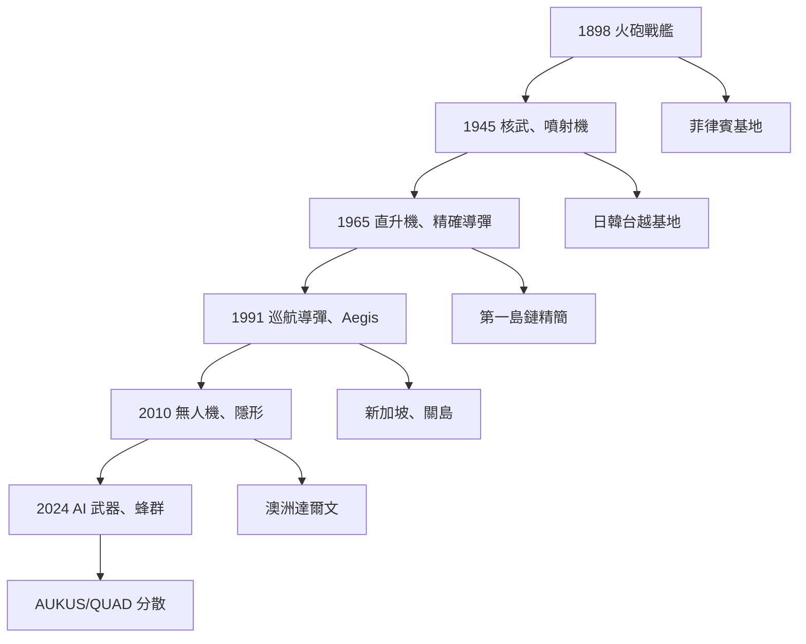

# 01_Timelines

**美軍亞洲部署主時間線 1898-2026**
**Master Timeline of US Military in Asia, 1898-2026**

> 130 年歷史,4 個 30 年週期,每個週期都有新嘅武器、基地、聯盟。

---

## 📅 4 個週期總覽 / 4 Periods Overview

| 週期 | 年代 | 核心特徵 | 關鍵武器 | 主要基地 | 戰爭 |
|------|------|----------|----------|----------|------|
| I | 1898-1930 | 帝國萌芽 | 火砲、戰艦 | 菲律賓 | 美西、美菲 |
| II | 1945-1975 | 冷戰高峰 | 核武、F-4、M16 | 日本、韓國、台灣、越南 | 韓戰、越戰 |
| III | 1975-2001 | 後越戰收縮 | F-16、F-18、Aegis | 第一島鏈精簡 | 冷戰結束 |
| IV | 2001-2026 | 反恐→大國競爭 | F-35、無人機、AI | 分散式、AUKUS/QUAD | 阿富汗→台海準備 |

---

## 🎯 重要節點 / Key Events

### 週期 I:帝國萌芽 (1898-1930)
- **1898** 美西戰爭 → 美國取得菲律賓、關島、波多黎各
- **1900** 美軍參與八國聯軍 (北京)
- **1917-1918** 一戰,亞洲無重大部署
- **1922** 五國海軍條約(華盛頓),美英日海軍比例 5:5:3
- **1930** 倫敦海軍條約

### 週期 II:冷戰高峰 (1945-1975)
- **1945-1952** 佔領日本 (麥克阿瑟)
- **1950-1953** 韓戰,美軍首次在亞洲大規模陸戰
- **1951** 美日安保條約
- **1953** 美韓共同防禦條約
- **1954-1975** 越南戰爭,最高峰 54 萬美軍
- **1954-1971** 台灣協防,美軍顧問團
- **1969** 尼克松關島主義(亞洲人打亞洲人)
- **1972** 上海公報,尼克松訪中

### 週期 III:後越戰收縮 (1975-2001)
- **1975** 西貢陷落,美軍撤出越南
- **1979** 美中建交;蘇聯入侵阿富汗
- **1980s** 里根「和平通過實力」,擴大第七艦隊
- **1987** 蘇聯導彈危機
- **1991** 蘇聯解體,冷戰結束
- **1991-1992** 菲律賓 Subic Bay、Clark 基地關閉
- **1997** 香港回歸,美軍失去維港補給
- **2001** 911,反恐戰爭開始

### 週期 IV:大國競爭 (2001-2026)
- **2001-2011** 阿富汗戰爭(亞洲外圍)
- **2010** 希拉蕊「重返亞洲」,Obama pivot
- **2011** 美軍在澳洲達爾文首次部署
- **2012** Obama 戰略重心轉向亞太
- **2014** 「再平衡」政策
- **2017** 印度-日本-美國 孟加拉灣馬拉巴爾演習
- **2021** AUKUS (澳英美) 成立,核潛艇技術轉移
- **2022** QUAD 升級為元首級
- **2023** 菲律賓新增 4 個基地使用權 (面向台灣)
- **2024** 中程導彈(MRBM)首次部署菲律賓
- **2025-2026** AI 武器、無人機蜂群部署印太

---

## 🔥 武器與部署嘅互動 / Weapons & Deployment Co-evolution

---

## 📚 對應 Courses / Related Courses

- **HKU:**
  - HIST1017 (Modern Hong Kong) - 維港補給
  - HIST1023 (Modern East Asia) - 冷戰東亞
  - HIST1025 (Intro US) - 美國史
  - HIST2063 (Europe & Modernity) - 帝國主義
  - HIST2076 (Germany & Cold War) - 冷戰結構
  - HIST2127 (Qing China) - 前現代東亞
  - HIST2152 (Late socialism & 1989) - 蘇聯解體
  - HIST2193 (History of Energy) - 能源與海軍
  - HIST2208 (Silk Roads) - 歐亞大陸
  - HIST2215 (Global Environmental) - 氣候 vs 部署

- **Harvard Foundations:**
  - GenEd1017 (Forced to Be Free) - 佔領案例
  - Hist14 (First World War) - 海軍條約起源
  - Hist33 (Holocaust) - 戰爭道德
  - Hist38 (Modern China) - 中美關係
  - Hist47 (Cold War) - 冷戰主軸
  - Hist68 (20th Century US) - 美國崛起
  - Hist66 (Coming of Civil War) - 國內動員

- **Harvard Fall:**
  - Hist1942 (Second World War) - 太平洋戰爭
  - Hist76 (History of Energy) - 能源武器
  - Hist29 (Fall of Rome) - 帝國衰亡對比
  - Hist20A (Western Intellect) - 意識形態

---

## 🔮 未來觀察點 / Future Watch Points

1. **2026-2028** AUKUS 核潛艇首次部署西澳
2. **2026-2030** 印太司令部是否重組為「中國司令部」
3. **AI 武器** 是否觸發新的軍備控制條約
4. **無人機蜂群** vs 傳統航母編隊嘅成本交換比
5. **台海衝突** 嘅時間窗口 (CSIS 24 scenarios)

---

**Status**: 4 個週期結構完成,個別子文件見 `01_Timelines/Period_I_*.md` 等
