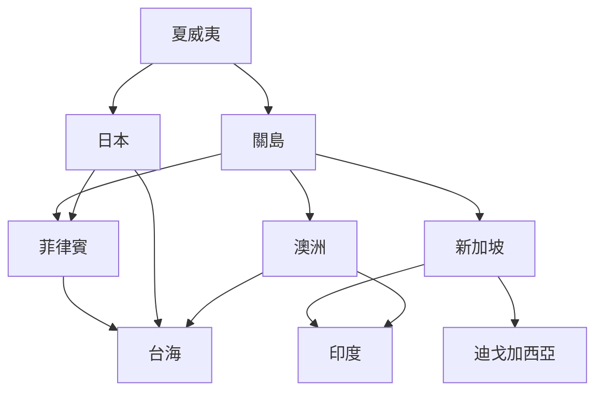

# 02_Bases_Networks

**美軍亞洲基地完整清單與網絡分析**
**Complete US Military Bases in Asia & Network Analysis**

> 130 年間由「菲律賓單一樞紐」演變為「多樞紐、分散式、智能化」嘅部署。

---

## 📊 當前基地總覽 (2026)

| 國家/地區 | 基地數 | 主要類型 | 駐軍/部署 | 重要性 |
|-----------|--------|----------|-----------|--------|
| 🇯🇵 日本 | 50+ | 海空 | 54,000 | ★★★★★ |
| 🇰🇷 韓國 | 28+ | 陸空 | 28,500 | ★★★★★ |
| 🇬🇺 關島 | 5+ | 海空戰略 | 11,000+ | ★★★★★ |
| 🇦🇺 澳洲 | 4+ | 陸(輪換) | 2,500+ | ★★★★ |
| 🇵🇭 菲律賓 | 9 (EDCA) | 訪問 | 輪換 | ★★★★ |
| 🇸🇬 新加坡 | 1+ | 海軍訪問 | 訪問 | ★★★ |
| 🇹🇭 泰國 | 1+ | 聯合演習 | 演習 | ★★ |
| 🇩🇪 迪戈加西亞 | 1+ | 海空戰略 | 1,700 | ★★★★ |
| 🇵🇬 巴布亞紐幾內亞 | 1+ | 機場 | 訪問 | ★★ |
| 🇹🇼 台灣 | 0 (非正式) | 訓練 | 訪問 | ★★ |

---

## 🇯🇵 日本駐軍 / Japan (54,000)

### 主要基地

#### 海軍 / Navy
- **橫須賀 (Yokosuka)** — 第七艦隊前進總部
  - 母港航母: 喬治·華盛頓號 (CVN-73)
  - 兩棲艦: 喬治亞號、托爾角號
- **佐世保 (Sasebo)** — 兩棲艦母港
- **厚木 (Atsugi)** — 海軍航空 MH-60
- **岩國 (Iwakuni)** — F/A-18 戰鬥攻擊機

#### 空軍 / Air Force
- **橫田 (Yokota)** — 第五航空隊司令部
  - C-130J、C-17、KC-135
- **三澤 (Misawa)** — F-16、F-35
- **嘉手納 (Kadena, 沖繩)** — 第 18 聯隊,F-15
- **那霸 (Naha, 沖繩)** — P-8 反潛

#### 陸軍 / Army
- **座間 (Camp Zama)** — 美陸軍日本司令部
- **沖繩** — 陸戰隊 18,000+

### 對應 Course
- **HKU HIST1023** (Modern East Asia)
- **HKU HIST2076** (Germany & Cold War) — 佔領比較
- **Harvard GenEd1017** (Forced to Be Free) — 沖繩案例

---

## 🇰🇷 韓國駐軍 / Korea (28,500)

### 主要基地

#### 陸軍 / Army
- **平澤 (Camp Humphreys)** — 第八軍司令部
  - 韓國最大美軍基地,3,400 公頃
  - 2018 從首爾龍山遷至
- **首爾龍山 (Yongsan)** — 已歸還
- **漢弗萊斯營** — 韓戰停戰以來最重要

#### 空軍 / Air Force
- **烏山 (Osan)** — 第七航空隊
  - F-16、F-35A
- **群山 (Kunsan)** — 第八戰鬥機聯隊
  - A-10、F-16

#### 海軍 / Navy
- **釜山 (Busan)** — 海軍設施
- **鎮海 (Jinhae)** — 海軍訪問

### 戰時指揮權
- 1978 移交計劃
- 2015 條件式延期
- 2022 李顯龍... (李在明?) 確認「適時協商」

### 對應 Course
- **HKU HIST1023** (Modern East Asia)
- **Harvard Hist47** (Cold War)
- **HKU HIST2152** (Late socialism & 1989) — 北韓問題

---

## 🇬🇺 關島 / Guam (11,000+)

### 主要設施

#### 海軍 / Navy
- **阿普拉港 (Apra Harbor)** — 核潛艇基地
  - SSN-688 洛杉磯級
  - 未來 SSN-774 維吉尼亞級
- **海軍基地關島 (NB Guam)**

#### 空軍 / Air Force
- **安德森空軍基地 (Andersen AFB)**
  - B-2 隱形轟炸機輪換
  - B-1B 轟炸機輪換
  - B-21 Raider 部署
  - KC-135、KC-46 加油機

#### 導彈防禦 / Missile Defense
- **THAAD** 系統 (2024)
- **Aegis BMD** 系統
- 高超音速導彈 (LRHW) 2024+

### 戰略價值
- 第二島鏈核心
- 距離台灣 2,700 公里
- 美國本土到亞洲嘅「中繼站」

### 對應 Course
- **HKU HIST2208** (Silk Roads) — 跨太平洋連接
- **Harvard Hist1942** (WWII) — 太平洋戰爭記憶

---

## 🇦🇺 澳洲 / Australia (2,500+)

### 主要設施
- **達爾文 (Robertson Barracks)** — 陸戰隊輪換
- **斯特林海軍基地 (HMAS Stirling)** — AUKUS 核潛艇基地
- **愛丁堡 (Edinburgh) RAAF** — P-8 反潛
- **安伯里 (RAAF Amberley)** — F/A-18F

### AUKUS 核潛艇計劃
- 2027 美國核潛艇首次訪澳
- 2030s 澳洲國產核潛艇服役
- **SSN-AUKUS** 級

### 對應 Course
- **HKU HIST2192** (Modern Southeast Asia)
- **HKU HIST2208** (Silk Roads)
- **Harvard Hist20A** (Western Intellectual History)

---

## 🇵🇭 菲律賓 / Philippines (EDCA 9 基地)

### EDCA 9 個基地 (2023 確認)
1. **Antonio Bautista Air Base** (巴拉望) — 面向南海
2. **Basa Air Base** (Pampanga) — 跑道擴建
3. **Benito Ebuen Air Base** (Cebu)
4. **Cesar Basa Air Base** (Pampanga)
5. **Clark International Airport** (Luzon)
6. **Fort Magsaysay** (Nueva Ecija) — 陸戰隊訓練
7. **Lumbia Air Base** (Cagayan de Oro)
8. **Mactan-Benito Ebuen Air Base**
9. **Naval Base Camilo Osias** (Santa Ana, Cagayan) — 面向台灣

### 2024-2025 部署
- **Typhon 中程導彈系統** 首次部署呂宋 (2024.4)
- 射程涵蓋中國東南沿海

### 歷史對比
- 1991 之前: Subic、Clark 為主
- 1991 關閉
- 2014 EDCA 簽署 (5 基地)
- 2023 擴至 9 基地

### 對應 Course
- **HKU HIST2192** (Modern Southeast Asia)
- **Harvard GenEd1017** (Forced to Be Free) — 1898-1946
- **Harvard Hist120** (Atlantic Slave Wars) — 帝國比較
- **HKU HIST2202** (Christianity in Asia)

---

## 🇸🇬 新加坡 / Singapore (訪問式)

### 主要設施
- **樟宜 (Changi Naval Base)** — 海軍訪問
  - 美海軍艦艇訪問使用
  - P-8 反潛機輪換
- **勿洛機場 (Paya Lebar)** — 過渡

### 戰略意義
- 馬六甲海峽監控
- 印度洋-太平洋連接

### 對應 Course
- **HKU HIST2208** (Silk Roads) — 馬六甲
- **HKU HIST1017** (Modern Hong Kong) — 港口比較

---

## 🇮🇳 印度 / India (日益重要)

### 部署
- 無永久基地
- **LEMOA** (Logistics Exchange Memorandum of Agreement, 2016)
  - 海軍後勤訪問使用印度港口
- **COMCASA** (Communications Compatibility and Security Agreement, 2018)
- **BECA** (Basic Exchange and Cooperation Agreement, 2020)
- 馬拉巴爾 (Malabar) 聯合演習

### 對應 Course
- **HKU HIST2188** (Making of Modern South Asia)
- **HKU HIST2208** (Silk Roads)
- **HKU HIST2170** (Making of Islamic World)

---

## 🇮🇩 印尼 / Indonesia

### 部署
- 無永久基地
- 通過訓練、演習
- 卡里姆海峽監控

---

## 🇻🇳 越南 / Vietnam

### 部署
- 2016 解除武器禁運
- 2018 航母首次訪越 (USS Carl Vinson)
- 港口訪問 (峴港、芽莊)
- **中越戰爭記憶嘅轉化**

### 對應 Course
- **HKU HIST2152** (Late socialism & 1989) — 越南改革
- **HKU HIST2192** (Modern Southeast Asia)
- **Harvard Hist47** (Cold War) — 越戰反思

---

## 🇩🇬 迪戈加西亞 / Diego Garcia

### 部署
- **第 1 遠征中隊 (1st ECES)** 輪換
- B-2、B-1B 轟炸機
- B-52 轟炸機
- 核潛艇訪問
- 美英聯合使用

### 戰略意義
- 印度洋樞紐
- 中東、非洲、南亞投射
- 對中國海上絲路嘅威懾

### 對應 Course
- **HKU HIST2170** (Islamic World)
- **HKU HIST2208** (Silk Roads)

---

## 📊 網絡分析 / Network Analysis

### 4 個 Hub (樞紐)
1. **日本 (橫須賀/橫田)** — 東北亞
2. **關島** — 中太平洋
3. **新加坡 (樟宜)** — 東南亞
4. **迪戈加西亞** — 印度洋

### 4 條主軸 (Spokes)
- 韓日軸 (東北亞)
- 菲日軸 (第一島鏈)
- 印太軸 (新加坡-迪戈加西亞)
- 澳英美軸 (AUKUS)

### 袁騰飛式點評
> 1991 失去菲律賓、1997 失去香港,等於 2 個關鍵節點失去。
> 但美國用咗 30 年重建:
> - 用關島頂替菲律賓嘅樞紐角色
> - 用新加坡-澳洲-迪戈加西亞頂替香港嘅港口功能
> - 結果 2020s 嘅網絡比 1990s 更分散、更強。
> **菲律賓 2023 EDCA 擴展,係收復失地嘅 30 年終點。**
