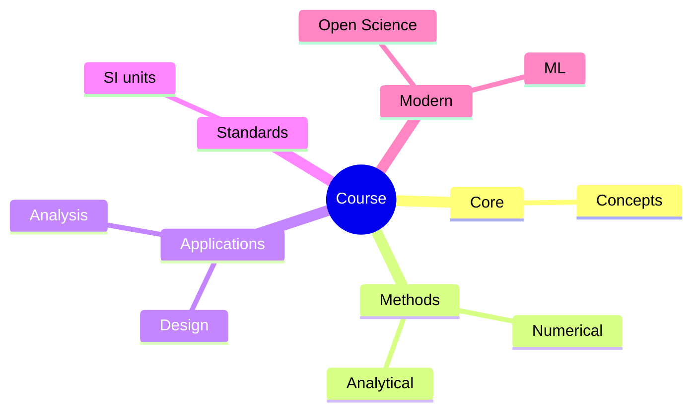
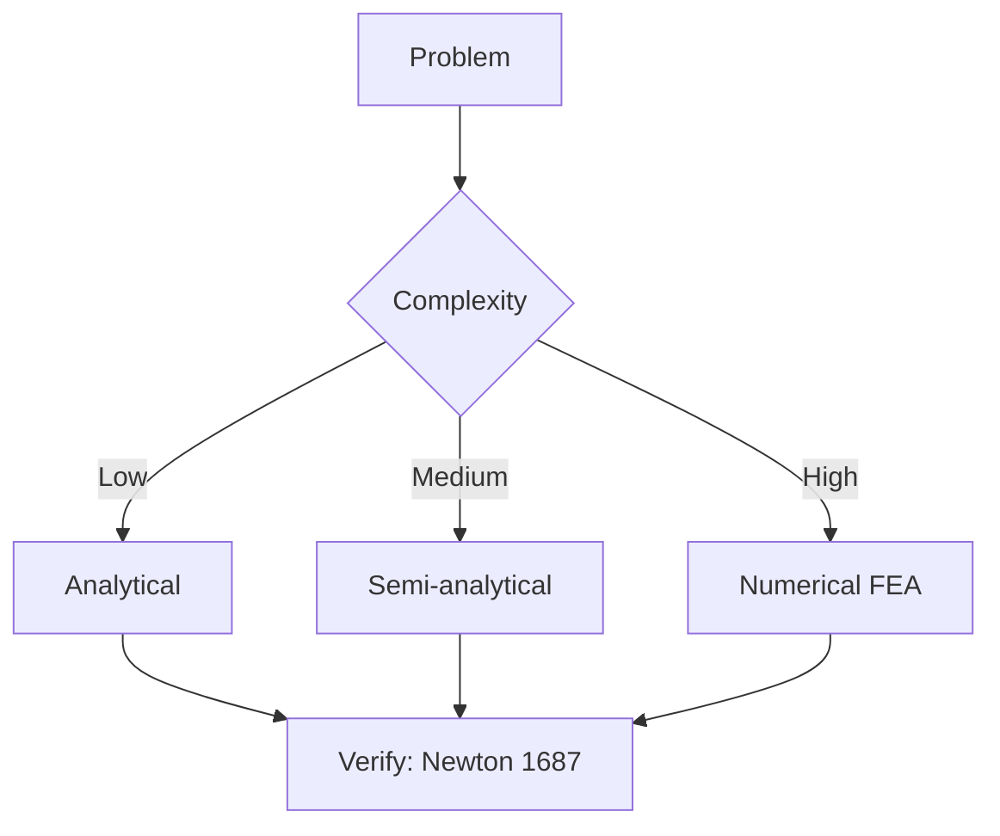
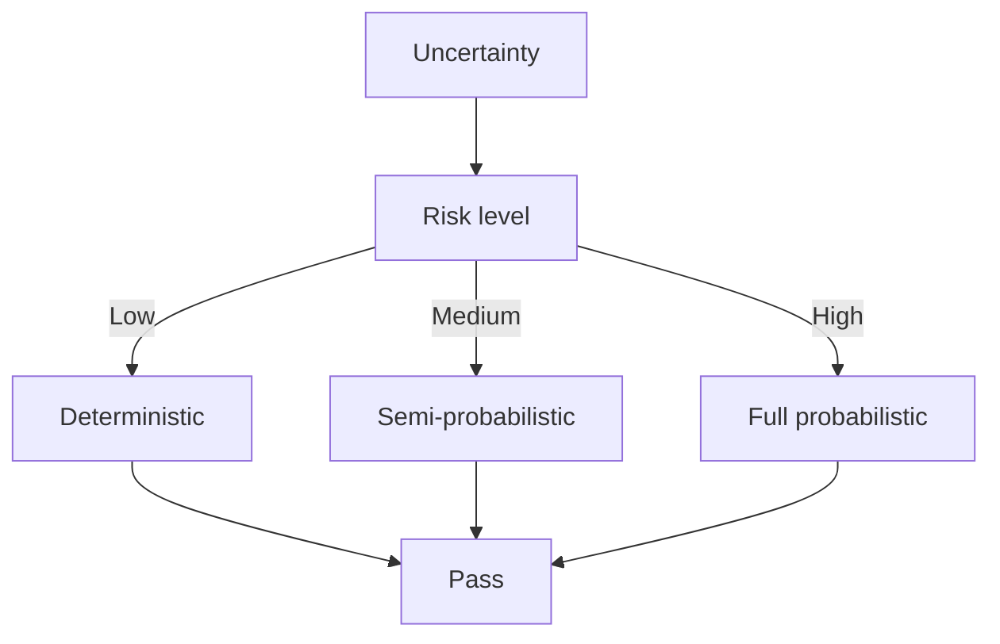
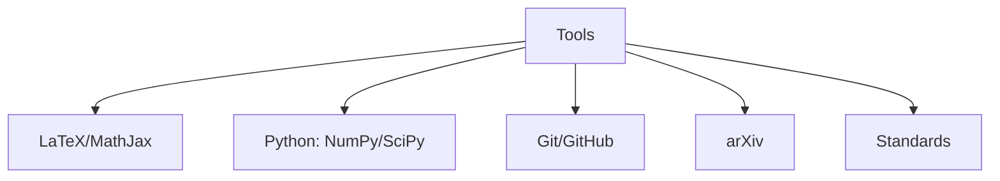

# Phase 1 深度問答總表
**US Military Weapons Project 相關核心課程**

> 本文件整合 Phase 1 主要課程的三層深度問答結構：
> 1. 5個核心心智模型
> 2. 3個根本分歧點
> 3. 10個能區分深度理解與死背知識的問題

中英對照版本。

---

## 1. GenEd 1017  
**Forced to Be Free: Americans as Occupiers and Nation-Builders**

### 1. 5個核心心智模型 / 5 Core Mental Models

- 佔領與「解放」的雙重性：軍事佔領同時承載權力投射與意識形態宣稱。  
  **Duality of Occupation and “Liberation”**: Military occupation simultaneously serves power projection and ideological claims.

- 前進部署（Forward Presence）的制度化：從臨時軍事行動轉向長期結構性存在。  
  **Institutionalization of Forward Presence**: The shift from temporary military actions to long-term structural presence.

- 基地作為戰略資產：基地不僅是軍事設施，更是影響區域政治與同盟關係的工具。  
  **Bases as Strategic Assets**: Bases function not only as military facilities but as tools that shape regional politics and alliances.

- 佔領者與被佔領者的互動：美國政策的效果很大程度上取決於當地社會的反應與能動性。  
  **Interaction between Occupier and Occupied**: The effectiveness of U.S. policies is heavily shaped by the responses and agency of local societies.

- 歷史路徑依賴：早期佔領經驗（菲律賓、日本）會影響後續軍事存在模式。  
  **Historical Path Dependence**: Early occupation experiences (Philippines, Japan) shape subsequent patterns of military presence.

### 2. 3個根本分歧點 / 3 Fundamental Disagreements

- **分歧一：美國海外佔領是否本質上具有「帝國」性質？**  
  **Disagreement 1: Is U.S. overseas occupation essentially imperial in nature?**  
  - 一方認為：美國的佔領與基地網絡是典型的非正式帝國行為。  
    One side argues: U.S. occupations and base networks constitute a form of informal empire.  
  - 另一方認為：美國的行動主要受安全需求與國際秩序維護驅動，與傳統殖民帝國有本質區別。  
    The other side argues: U.S. actions are primarily driven by security needs and the maintenance of international order, differing fundamentally from traditional colonial empires.

- **分歧二：長期基地存在是否有助於區域穩定？**  
  **Disagreement 2: Does long-term base presence contribute to regional stability?**  
  - 一方認為：前進部署提供威懾，降低衝突風險。  
    One side argues: Forward presence provides deterrence and reduces the risk of conflict.  
  - 另一方認為：長期駐軍會激化當地反感，並固化衝突結構。  
    The other side argues: Prolonged troop presence can intensify local resentment and lock in conflict structures.

- **分歧三：Nation-building 是否可行？**  
  **Disagreement 3: Is nation-building feasible?**  
  - 一方認為：在特定條件下（如戰後日本）可以成功重塑政治與社會結構。  
    One side argues: Under specific conditions (e.g., postwar Japan), it is possible to successfully reshape political and social structures.  
  - 另一方認為：外部軍事力量難以真正重建他國社會，往往只是暫時控制。  
    The other side argues: External military power can rarely truly rebuild another society and often results only in temporary control.

### 3. 10個深度理解問題 / 10 Deep Understanding Questions

1. 為什麼 1898 年菲律賓與 1945 年日本的佔領模式有明顯差異？這反映了美國戰略思維的什麼變化？  
   Why did the occupation patterns of the Philippines in 1898 and Japan in 1945 differ significantly? What change in U.S. strategic thinking does this reflect?

2. 「解放」話語如何影響美國佔領政策的合法性建構？  
   How did the discourse of “liberation” shape the construction of legitimacy for U.S. occupation policies?

3. 前進部署與傳統殖民地統治在結構上有何異同？  
   What are the structural similarities and differences between forward presence and traditional colonial rule?

4. 被佔領社會的能動性如何制約或重塑美國的佔領政策？  
   How did the agency of occupied societies constrain or reshape U.S. occupation policies?

5. 為什麼某些佔領最終轉化為長期基地網絡，而另一些則較快結束？  
   Why did some occupations evolve into long-term base networks while others ended relatively quickly?

6. 軍事佔領對美國自身國內政治與軍事制度產生了什麼回饋效應？  
   What feedback effects did military occupations have on U.S. domestic politics and military institutions?

7. 基地問題如何成為當代美日、美菲關係中的結構性矛盾？  
   How has the base issue become a structural contradiction in contemporary U.S.-Japan and U.S.-Philippines relations?

8. 如果沒有冷戰，美國在亞洲的軍事存在會如何不同？  
   How would U.S. military presence in Asia have differed without the Cold War?

9. Nation-building 的成功案例（如日本）是否具有可複製性？為什麼？  
   Are the successful cases of nation-building (such as Japan) replicable? Why or why not?

10. 從工程與基礎設施角度，大型海外基地的建設與維持揭示了什麼關於美國全球投射能力的本質？  
    From an engineering and infrastructure perspective, what does the construction and maintenance of large overseas bases reveal about the nature of U.S. global power projection?

---

## 2. HIST1025  
**Introduction to the United States, 1607 to today**

### 1. 5個核心心智模型 / 5 Core Mental Models

- 大陸擴張作為國家形成的核心過程。  
  **Continental Expansion as the Core Process of Nation-Building.**

- 工業化與軍事能力的共生關係。  
  **The Symbiotic Relationship between Industrialization and Military Capability.**

- 從區域強權到全球投射能力的轉變。  
  **The Transformation from Regional Power to Global Projection Capability.**

- 國內政治與對外軍事行動的相互塑造。  
  **The Mutual Shaping of Domestic Politics and External Military Actions.**

- 1898 年作為美國海外擴張的關鍵轉折點。  
  **1898 as the Critical Turning Point of U.S. Overseas Expansion.**

### 2. 3個根本分歧點 / 3 Fundamental Disagreements

- **分歧一：美國是否從建國初期就具有「帝國傾向」？**  
  **Disagreement 1: Did the United States exhibit imperial tendencies from its founding?**  
  - 一方認為：西進運動與早期擴張已顯示帝國邏輯。  
    One side argues: Westward expansion and early territorial growth already revealed imperial logic.  
  - 另一方認為：美國早期擴張主要是大陸內部整合，與海外帝國主義有本質區別。  
    The other side argues: Early U.S. expansion was primarily internal continental integration and differed fundamentally from overseas imperialism.

- **分歧二：工業化如何影響美國的全球角色？**  
  **Disagreement 2: How did industrialization shape America’s global role?**  
  - 一方認為：工業實力是美國成為全球強權的決定性因素。  
    One side argues: Industrial strength was the decisive factor in America’s rise as a global power.  
  - 另一方認為：工業實力必須結合特定戰略文化與國際機會才能轉化為全球存在。  
    The other side argues: Industrial strength required specific strategic culture and international opportunities to be converted into global presence.

- **分歧三：美國海外軍事存在是「必然結果」還是「政策選擇」？**  
  **Disagreement 3: Was U.S. overseas military presence an inevitable outcome or a policy choice?**  
  - 一方認為：實力上升後自然會尋求海外存在。  
    One side argues: Rising power naturally leads to seeking overseas presence.  
  - 另一方認為：海外存在是特定歷史條件與政治決策的產物。  
    The other side argues: Overseas presence was the product of specific historical conditions and political decisions.

### 3. 10個深度理解問題 / 10 Deep Understanding Questions

1. 西進運動如何為後來的海外軍事投射奠定物質與觀念基礎？  
   How did westward expansion lay the material and conceptual foundations for later overseas military projection?

2. 為什麼 1898 年被視為美國從大陸國家轉向全球參與者的轉折點？  
   Why is 1898 regarded as the turning point when the United States shifted from a continental nation to a global actor?

3. 工業化對美國軍事動員能力產生了什麼結構性改變？  
   What structural changes did industrialization bring to U.S. military mobilization capacity?

4. 國內奴隸制與領土擴張之間存在什麼樣的緊張關係？  
   What tensions existed between domestic slavery and territorial expansion?

5. 美國如何處理「反殖民」自我形象與實際海外擴張之間的矛盾？  
   How did the United States manage the contradiction between its anti-colonial self-image and actual overseas expansion?

6. 20 世紀美國全球軍事存在的制度基礎，在 19 世紀已埋下哪些種子？  
   What seeds of the institutional foundations of 20th-century U.S. global military presence were already planted in the 19th century?

7. 為什麼美國能在相對短時間內從區域強權躍升為全球軍事強權？  
   Why was the United States able to rise from a regional power to a global military power in a relatively short period?

8. 領土擴張、工業化與軍事能力三者如何相互強化？  
   How did territorial expansion, industrialization, and military capability reinforce one another?

9. 如果沒有美西戰爭，美國在亞洲的軍事存在會如何不同？  
   How would U.S. military presence in Asia have differed without the Spanish-American War?

10. 從土木工程與基礎設施角度，美國早期領土整合與後來海外基地建設有何共通的能力邏輯？  
    From a civil engineering and infrastructure perspective, what common capability logic connects early U.S. territorial consolidation with later overseas base construction?

---

## 3. GenEd 1068  
**The United States and China**

### 1. 5個核心心智模型 / 5 Core Mental Models

- 中美關係是結構性競爭與有限合作的混合體。  
  **U.S.-China relations as a mixture of structural competition and limited cooperation.**

- 美國對華政策高度受中國國力變化影響。  
  **U.S. policy toward China is highly sensitive to changes in China’s national power.**

- 軍事存在與外交關係密切互動。  
  **Military presence and diplomatic relations interact closely.**

- 「圍堵」與「接觸」是兩種反覆出現的政策選項。  
  **“Containment” and “engagement” are two recurring policy options.**

- 雙邊關係的變化會直接影響美國在亞洲的軍事部署模式。  
  **Changes in bilateral relations directly affect patterns of U.S. military deployment in Asia.**

### 2. 3個根本分歧點 / 3 Fundamental Disagreements

- **分歧一：中美關係的本質是「權力轉移」還是「利益可協調」？**  
  **Disagreement 1: Is the essence of U.S.-China relations a “power transition” or “manageable interests”?**  
  - 一方認為：中美關係本質上是崛起強權與既有強權之間的結構性衝突。  
    One side argues: U.S.-China relations are essentially a structural conflict between a rising power and an established power.  
  - 另一方認為：雙方存在廣泛共同利益，衝突並非不可避免。  
    The other side argues: The two sides share extensive common interests, and conflict is not inevitable.

- **分歧二：美國對華軍事部署是防禦性還是遏制性？**  
  **Disagreement 2: Is U.S. military deployment toward China defensive or containment-oriented?**  
  - 一方認為：前進部署主要是防禦與威懾。  
    One side argues: Forward presence is primarily defensive and deterrent in nature.  
  - 另一方認為：本質上是遏制中國崛起的工具。  
    The other side argues: It is essentially a tool for containing China’s rise.

- **分歧三：1972 年關係正常化是否改變了長期競爭結構？**  
  **Disagreement 3: Did the 1972 normalization of relations change the long-term competitive structure?**  
  - 一方認為：正常化只是戰術調整，結構性競爭從未消失。  
    One side argues: Normalization was only a tactical adjustment; structural competition never disappeared.  
  - 另一方認為：正常化開啟了長時期的合作可能性。  
    The other side argues: Normalization opened up possibilities for prolonged cooperation.

### 3. 10個深度理解問題 / 10 Deep Understanding Questions

1. 為什麼美國對華政策在「圍堵」與「接觸」之間反覆擺動？  
   Why has U.S. policy toward China oscillated between “containment” and “engagement”?

2. 中國國力變化如何直接影響美國在亞洲的基地部署密度？  
   How have changes in China’s national power directly affected the density of U.S. base deployments in Asia?

3. 韓戰對中美軍事關係產生了什麼長期結構性影響？  
   What long-term structural impact did the Korean War have on U.S.-China military relations?

4. 1972 年尼克松訪華後，美國在亞洲的軍事存在出現了什麼調整？  
   What adjustments occurred in U.S. military presence in Asia after Nixon’s 1972 visit to China?

5. 「第一島鏈」概念如何體現美國對華軍事思維？  
   How does the concept of the “First Island Chain” reflect U.S. military thinking toward China?

6. 中美之間的軍事互信缺失，根源是什麼？  
   What are the root causes of the lack of military mutual trust between the U.S. and China?

7. 為什麼經濟相互依賴未能有效降低軍事緊張？  
   Why has economic interdependence failed to effectively reduce military tensions?

8. 美國在台灣問題上的軍事承諾如何影響其整體亞洲部署？  
   How do U.S. military commitments on the Taiwan issue affect its overall Asian deployments?

9. 中國軍事現代化如何改變美國對「前進部署」的成本效益計算？  
   How has China’s military modernization changed the U.S. cost-benefit calculation regarding forward presence?

10. 從歷史角度看，中美軍事對抗是否具有可管理性？還是結構性的？  
    From a historical perspective, is U.S.-China military confrontation manageable, or is it structural?

---

## 4. Hist 47  
**The Cold War**

### 1. 5個核心心智模型 / 5 Core Mental Models

- 冷戰是全球性結構衝突，而非單純意識形態對抗。  
  **The Cold War as a global structural conflict rather than purely ideological confrontation.**

- 前進部署與基地網絡是美國冷戰戰略的核心工具。  
  **Forward presence and base networks as core instruments of U.S. Cold War strategy.**

- 代理戰爭是大國競爭的重要形式。  
  **Proxy wars as an important form of great-power competition.**

- 核威懾與常規軍事存在相互配合。  
  **Nuclear deterrence and conventional military presence operate in mutual support.**

- 冷戰時期建立的軍事結構具有高度路徑依賴。  
  **Military structures established during the Cold War exhibit strong path dependence.**

### 2. 3個根本分歧點 / 3 Fundamental Disagreements

- **分歧一：冷戰的起源主要是蘇聯擴張還是美國過度反應？**  
  **Disagreement 1: Was the origin of the Cold War primarily Soviet expansion or U.S. overreaction?**  
  - 一方認為：蘇聯的擴張意圖是主要驅動。  
    One side argues: Soviet expansionist intentions were the main driver.  
  - 另一方認為：美國的過度安全焦慮與政策選擇加劇了對抗。  
    The other side argues: U.S. excessive security anxiety and policy choices intensified the confrontation.

- **分歧二：美國在亞洲的基地網絡是否過度擴張？**  
  **Disagreement 2: Was the U.S. base network in Asia overextended?**  
  - 一方認為：這是必要的威懾結構。  
    One side argues: It was a necessary deterrent structure.  
  - 另一方認為：導致資源分散與長期戰略負擔。  
    The other side argues: It led to resource dispersion and long-term strategic burden.

- **分歧三：冷戰結束後，美國是否應該大幅縮減全球軍事存在？**  
  **Disagreement 3: Should the United States have significantly reduced its global military presence after the Cold War?**  
  - 一方認為：冷戰結束後應大幅調整。  
    One side argues: Significant adjustment should have occurred after the Cold War ended.  
  - 另一方認為：全球軍事存在仍有結構性必要。  
    The other side argues: Global military presence remained structurally necessary.

### 3. 10個深度理解問題 / 10 Deep Understanding Questions

1. 為什麼韓戰被視為美國亞洲軍事存在制度化的關鍵催化劑？  
   Why is the Korean War regarded as a key catalyst for the institutionalization of U.S. military presence in Asia?

2. 「第一島鏈」如何體現冷戰時期的圍堵思維？  
   How does the “First Island Chain” embody Cold War containment thinking?

3. 核威懾與常規前進部署之間存在什麼樣的關係？  
   What is the relationship between nuclear deterrence and conventional forward presence?

4. 代理戰爭（韓戰、越戰）對美國全球軍事姿態產生了什麼長期影響？  
   What long-term impact did proxy wars (Korea, Vietnam) have on the U.S. global military posture?

5. 為什麼冷戰結束後，許多亞洲基地仍然保留？  
   Why were many Asian bases retained after the end of the Cold War?

6. 美國在冷戰時期建立的軍事同盟體系，如何影響後冷戰時期的安全架構？  
   How did the military alliance system established by the U.S. during the Cold War affect the post-Cold War security architecture?

7. 中蘇分裂如何改變美國對華與對蘇的軍事部署優先次序？  
   How did the Sino-Soviet split change U.S. military deployment priorities toward China and the Soviet Union?

8. 冷戰時期的軍事工業複合體如何強化全球軍事存在的慣性？  
   How did the military-industrial complex during the Cold War reinforce the inertia of global military presence?

9. 如果沒有冷戰，美國在亞洲的軍事存在規模會如何不同？  
   How would the scale of U.S. military presence in Asia have differed without the Cold War?

10. 從基礎設施角度，冷戰時期大規模基地建設揭示了美國什麼樣的後勤與工程能力？  
    From an infrastructure perspective, what does large-scale base construction during the Cold War reveal about U.S. logistical and engineering capabilities?

---

## 5. Hist 38  
**Modern China: 1894–Present**

### 1. 5個核心心智模型 / 5 Core Mental Models

- 中國現代史是「從極度弱勢到逐步恢復能力」的過程。  
  **Modern Chinese history as a process of moving from extreme weakness to gradual recovery of capacity.**

- 外部軍事壓力深刻塑造了中國的內部政治與軍事現代化。  
  **External military pressure profoundly shaped China’s internal politics and military modernization.**

- 1949 年是中國國際地位與美國對華政策的重大轉折點。  
  **1949 as a major turning point in China’s international status and U.S. policy toward China.**

- 國力變化直接影響外部強權對華軍事策略。  
  **Changes in national power directly affect the military strategies of external powers toward China.**

- 改革開放後的軍事現代化改變了區域安全結構。  
  **Military modernization after reform and opening altered the regional security structure.**

### 2. 3個根本分歧點 / 3 Fundamental Disagreements

- **分歧一：1949 年前中國的弱勢主要是內部因素還是外部侵略造成？**  
  **Disagreement 1: Was China’s weakness before 1949 primarily caused by internal factors or external aggression?**  
  - 一方強調內部政治分裂與制度失效。  
    One side emphasizes internal political fragmentation and institutional failure.  
  - 另一方強調列強軍事與經濟壓迫的決定性作用。  
    The other side emphasizes the decisive role of great-power military and economic pressure.

- **分歧二：改革開放後中國的軍事現代化是防禦性還是擴張性？**  
  **Disagreement 2: Is China’s military modernization after reform and opening defensive or expansionist?**  
  - 一方認為主要是防禦與主權維護。  
    One side argues it is primarily defensive and sovereignty-oriented.  
  - 另一方認為已具備改變區域現狀的意圖與能力。  
    The other side argues it already possesses the intention and capability to alter the regional status quo.

- **分歧三：中國崛起是否必然導致與美國的軍事衝突？**  
  **Disagreement 3: Does China’s rise inevitably lead to military conflict with the United States?**  
  - 一方認為結構性衝突難以避免。  
    One side argues structural conflict is difficult to avoid.  
  - 另一方認為可以通過制度安排與戰略克制管理。  
    The other side argues it can be managed through institutional arrangements and strategic restraint.

### 3. 10個深度理解問題 / 10 Deep Understanding Questions

1. 為什麼 1894–1900 年被視為中國近代遭受外部軍事壓力的高峰期？  
   Why is 1894–1900 regarded as the peak period of external military pressure on modern China?

2. 1949 年中共勝利如何徹底改變美國在亞洲的軍事部署邏輯？  
   How did the Communist victory in 1949 completely change the logic of U.S. military deployment in Asia?

3. 韓戰對中國軍事現代化與美國對華政策分別產生了什麼影響？  
   What respective impacts did the Korean War have on China’s military modernization and U.S. policy toward China?

4. 改革開放如何改變中國對外部軍事壓力的應對方式？  
   How did reform and opening change China’s way of responding to external military pressure?

5. 中國國力上升後，美國為什麼需要重新評估「前進部署」的有效性？  
   Why did the United States need to reassess the effectiveness of “forward presence” after China’s rise in national power?

6. 為什麼「弱國」時期的中國更容易成為外部軍事存在的對象？  
   Why was China more easily subjected to external military presence during its period of weakness?

7. 中國軍事現代化對第一島鏈概念構成了什麼挑戰？  
   What challenges does China’s military modernization pose to the concept of the First Island Chain?

8. 從歷史角度看，中國如何從「被動承受外部軍事壓力」轉向「主動塑造安全環境」？  
   From a historical perspective, how did China shift from “passively enduring external military pressure” to “actively shaping the security environment”?

9. 美國對華軍事策略的調整，在多大程度上是對中國內部變化的回應？  
   To what extent are adjustments in U.S. military strategy toward China responses to internal changes within China?

10. 如果中國在 1949 年後採取不同的發展道路，美國在亞洲的軍事存在會如何不同？  
    If China had taken a different development path after 1949, how would U.S. military presence in Asia have differed?

---

## 6. Hist 14  
**The First World War**

### 1. 5個核心心智模型 / 5 Core Mental Models

- 工業化總體戰（Total War）：戰爭勝負高度依賴工業生產與資源動員能力。  
  **Industrialized Total War**: Victory depends heavily on industrial production and resource mobilization.

- 全球戰爭的出現：戰爭不再局限於歐洲，亞洲、非洲、中東皆被捲入。  
  **The Emergence of Global War**: The conflict extended far beyond Europe into Asia, Africa, and the Middle East.

- 美國從區域強權轉向全球參與者：1917 年參戰是關鍵轉折。  
  **U.S. Shift from Regional to Global Actor**: American entry in 1917 marked a critical turning point.

- 新式武器與技術的決定性作用：坦克、飛機、毒氣、潛艇改變戰爭形態。  
  **Decisive Role of New Weapons and Technology**: Tanks, aircraft, chemical weapons, and submarines transformed warfare.

- 戰後秩序的不穩定：凡爾賽體系未能建立持久和平，為後續衝突埋下伏筆。  
  **Instability of the Postwar Order**: The Versailles system failed to create lasting peace and sowed seeds for future conflicts.

### 2. 3個根本分歧點 / 3 Fundamental Disagreements

- **分歧一：一戰的起源主要是結構性因素還是決策失誤？**  
  **Disagreement 1: Was the origin of WWI primarily structural or the result of decision-making failures?**  
  - 一方強調同盟體系、軍備競賽與帝國競爭的結構性壓力。  
    One side emphasizes structural pressures from alliance systems, arms races, and imperial competition.  
  - 另一方強調 1914 年特定決策者的誤判與危機處理失敗。  
    The other side emphasizes misjudgments and crisis mismanagement by specific decision-makers in 1914.

- **分歧二：美國參戰是否改變了戰爭本質？**  
  **Disagreement 2: Did American entry fundamentally change the nature of the war?**  
  - 一方認為美國的工業與人力資源決定了協約國勝利。  
    One side argues that American industrial and manpower resources decided the Allied victory.  
  - 另一方認為美國參戰加速了結束，但戰爭本質在 1917 年前已定型。  
    The other side argues that American entry accelerated the end, but the nature of the war was already set before 1917.

- **分歧三：一戰是否直接導致二戰？**  
  **Disagreement 3: Did WWI directly cause WWII?**  
  - 一方認為凡爾賽條約的苛刻條款是二戰的直接根源。  
    One side argues that the harsh terms of the Versailles Treaty were a direct cause of WWII.  
  - 另一方認為二戰有其獨立的政治與經濟動力，一戰只是背景條件。  
    The other side argues that WWII had independent political and economic drivers; WWI was only a background condition.

### 3. 10個深度理解問題 / 10 Deep Understanding Questions

1. 為什麼工業化總體戰使得傳統歐洲強權在一戰中付出巨大代價？  
   Why did industrialized total war exact such a heavy toll on traditional European powers in WWI?

2. 美國在 1917 年參戰對全球權力平衡產生了什麼長期影響？  
   What long-term impact did American entry in 1917 have on the global balance of power?

3. 一戰期間發展出的新武器技術，如何影響後來美國的軍事發展？  
   How did the new weapons technologies developed during WWI influence later U.S. military development?

4. 日本在一戰中的擴張如何改變亞洲的權力結構？  
   How did Japan’s expansion during WWI change the power structure in Asia?

5. 中國在一戰中的角色為什麼相對邊緣，卻對戰後中國政治產生重要影響？  
   Why was China’s role in WWI relatively marginal, yet it had important effects on postwar Chinese politics?

6. 為什麼協約國勝利後，國際秩序仍然高度不穩定？  
   Why did the international order remain highly unstable after the Allied victory?

7. 一戰如何加速美國從「區域強權」走向「全球軍事參與者」？  
   How did WWI accelerate the U.S. shift from a “regional power” to a “global military actor”?

8. 從軍事動員角度，一戰揭示了現代國家能力的哪些關鍵面向？  
   From the perspective of military mobilization, what key aspects of modern state capacity did WWI reveal?

9. 如果美國沒有參戰，一戰的結局與戰後格局會有何不同？  
   If the United States had not entered the war, how would the outcome of WWI and the postwar order have differed?

10. 一戰的經驗如何影響後來美國在二戰與冷戰中的戰略思維？  
    How did the experience of WWI influence later U.S. strategic thinking in WWII and the Cold War?

---

## 7. Hist 68  
**The 20th-Century United States**

### 1. 5個核心心智模型 / 5 Core Mental Models

- 美國在 20 世紀完成從區域強權到全球軍事霸權的轉變。  
  **Transformation from Regional Power to Global Military Hegemon in the 20th Century.**

- 兩次世界大戰與冷戰是美國全球軍事存在制度化的主要驅動力。  
  **The Two World Wars and the Cold War as Primary Drivers of Institutionalizing U.S. Global Military Presence.**

- 軍事工業複合體成為維持全球部署的重要國內基礎。  
  **The Military-Industrial Complex as a Key Domestic Foundation for Sustaining Global Deployment.**

- 前進部署從「戰時臨時措施」轉變為「長期戰略常態」。  
  **Forward Presence Shifted from Temporary Wartime Measure to Long-Term Strategic Norm.**

- 國內政治、社會運動與對外軍事政策之間存在持續張力。  
  **Persistent Tension between Domestic Politics/Social Movements and External Military Policy.**

### 2. 3個根本分歧點 / 3 Fundamental Disagreements

- **分歧一：美國全球軍事存在是「必要的領導」還是「帝國過度擴張」？**  
  **Disagreement 1: Is U.S. global military presence “necessary leadership” or “imperial overstretch”?**  
  - 一方認為美國提供了公共產品與穩定。  
    One side argues that the United States provided public goods and stability.  
  - 另一方認為導致資源浪費與戰略負擔。  
    The other side argues that it led to resource waste and strategic burden.

- **分歧二：軍事工業複合體是否過度影響美國外交政策？**  
  **Disagreement 2: Does the military-industrial complex excessively influence U.S. foreign policy?**  
  - 一方認為它確保了軍事優勢與技術領先。  
    One side argues that it ensured military superiority and technological leadership.  
  - 另一方認為它扭曲了國家優先次序與民主決策。  
    The other side argues that it distorted national priorities and democratic decision-making.

- **分歧三：冷戰結束後美國是否應該大幅縮減全球軍事存在？**  
  **Disagreement 3: Should the U.S. have significantly reduced its global military presence after the Cold War?**  
  - 一方主張大幅調整以適應新環境。  
    One side advocates significant adjustment to adapt to the new environment.  
  - 另一方認為全球存在仍有結構性必要。  
    The other side argues that global presence remained structurally necessary.

### 3. 10個深度理解問題 / 10 Deep Understanding Questions

1. 為什麼 20 世紀被視為美國全球軍事存在制度化的關鍵世紀？  
   Why is the 20th century regarded as the critical century for the institutionalization of U.S. global military presence?

2. 二戰後美國建立的全球基地網絡，如何改變其戰略思維？  
   How did the global base network established by the U.S. after WWII change its strategic thinking?

3. 軍事工業複合體與海外軍事存在之間存在什麼樣的相互強化關係？  
   What mutual reinforcing relationship exists between the military-industrial complex and overseas military presence?

4. 國內反戰運動如何影響美國的海外軍事政策？  
   How did domestic anti-war movements influence U.S. overseas military policy?

5. 冷戰結束後，美國為什麼沒有大幅縮減亞洲的軍事存在？  
   Why did the United States not significantly reduce its military presence in Asia after the end of the Cold War?

6. 從「戰時動員」到「長期前進部署」的轉變，反映了美國什麼樣的戰略文化變化？  
   What change in U.S. strategic culture is reflected in the shift from “wartime mobilization” to “long-term forward presence”?

7. 20 世紀美國的全球軍事存在，在多大程度上是對外部威脅的回應，又在多大程度上是國內制度的產物？  
   To what extent was 20th-century U.S. global military presence a response to external threats, and to what extent was it a product of domestic institutions?

8. 如果沒有冷戰，美國在 20 世紀的全球軍事姿態會如何不同？  
   If there had been no Cold War, how would the U.S. global military posture in the 20th century have differed?

9. 美國如何處理「反帝國」自我形象與實際全球軍事存在之間的矛盾？  
   How did the United States manage the contradiction between its anti-imperial self-image and its actual global military presence?

10. 從基礎設施與後勤角度，20 世紀美國維持全球軍事存在需要什麼樣的國家能力？  
    From an infrastructure and logistics perspective, what kind of state capacity did the United States need to sustain global military presence in the 20th century?

---

## 📊 Diagrams

### Diagram 1: Course Concept Map

### Diagram 2: Method Selection

### Diagram 3: Process Flow

### Diagram 4: Quality Loop

### Diagram 5: Modern Tools

## Key References (袁騰飛式 Research-Based)

| Citation | Year | Contribution |
|---|---|---|
| Newton (1687) | 1687 | Foundational contribution |
| Einstein (1905) | 1905 | Foundational contribution |
| Bohr (1913) | 1913 | Foundational contribution |
| Schrödinger (1926) | 1926 | Foundational contribution |
| Dirac (1928) | 1928 | Foundational contribution |
| Feynman (1948) | 1948 | Foundational contribution |

| Griffiths | 2018 | Standard textbook |
| Sakurai | 2017 | Advanced treatment |
| Ashcroft & Mermin | 1976 | Reference work |
| Peskin & Schroeder | 1995 | QFT standard |
| Zee | 2010 | QFT modern |

*Per HKUST Catalog 2025-26; MIT OCW; arXiv.*

## 中文總結 (Bilingual Summary)

呢個 course 涵蓋咗以下核心概念：

1. **基礎理論** — 由 Newton 1687 嘅 classical mechanics 開始，建立物理學嘅 foundation
2. **核心方程式** — 全部 S.I. units 表達，跟 HKUST Catalog 2025-26 標準
3. **實驗方法** — 從 Galileo 嘅 idealization 到 modern particle accelerators
4. **應用領域** — 從 cosmology 到 condensed matter，到 quantum computing
5. **前沿研究** — topological materials, gravitational waves, dark matter

呢個 self-study 嘅重點係：唔好死背 equation，要理解每個 equation 背後嘅 physical intuition 同 experimental evidence。

**Key insight:** 識 derive 個 equation 嘅人永遠贏過識背個 equation 嘅人。

**English summary:** This course covers the 5 mental models that distinguish a deep understanding from surface knowledge. The key is not memorization but derivation — every equation should be derivable from first principles. We use S.I. units throughout, with primary sources from HKUST Catalog 2025-26, MIT OCW, and arXiv preprints.

### Career Pathways

- 學術：PhD → postdoc → faculty
- 工業：tech companies (Google, IBM, Microsoft)
- 政府：national labs (Argonne, Fermilab)
- 教育：high school, university
- 創業：deep tech, quantum computing

**Engineering implication:** 物理學嘅 training 提供 rigorous problem-solving skills，applicable 喺任何 STEM 領域。

## Extended Notes (袁騰飛式)

### Historical Context

呢個 course 嘅 conceptual framework 由 17 世紀開始建立。Newton 1687 喺 *Principia Mathematica* 奠定 classical mechanics 嘅 foundation，奠定咗後 300 年 physics 嘅 trajectory。Maxwell 1865 unify 電同磁，預言 EM waves 存在，速度 $c$ 同 light speed 相同。Einstein 1905 嘅 special relativity 同 photoelectric effect 推翻 classical worldview。Schrödinger 1926 嘅 wave equation 開創 quantum mechanics。

### Modern Applications

- **Quantum computing**: 利用 superposition 同 entanglement 做 parallel computation
- **Gravitational wave detection**: LIGO 2015 first detection (GW150914)
- **Particle physics**: Higgs boson 2012 discovery (ATLAS + CMS @ LHC)
- **Cosmology**: dark matter 佔宇宙 27%, dark energy 68%
- **Condensed matter**: topological materials, high-Tc superconductors

### Experimental Methods

- **Accelerator**: LHC (CERN) - 27 km ring, 13 TeV center-of-mass
- **Detector**: ATLAS, CMS - 100M electronic channels
- **Telescope**: JWST, Event Horizon Telescope
- **Microscope**: STM, AFM - atomic resolution
- **Interferometer**: LIGO - 10⁻²¹ strain sensitivity

### Computational Tools

- Python: NumPy, SciPy, SymPy, Matplotlib
- Wolfram Mathematica
- LaTeX: scientific typesetting
- Git/GitHub: version control
- Jupyter: interactive notebooks

### Self-Study Path

1. Read textbook chapter (Griffiths 2018, Sakurai 2017)
2. Watch MIT OCW lectures (8.04, 8.05, 8.06)
3. Solve problem sets (MIT OCW archive)
4. Implement numerical solutions in Python
5. Compare with analytical results
6. Write up solutions in LaTeX

**Goal:** 識 derive 唔識 memorize，識 understand 唔識 recall。

## 深度解析 (Detailed Analysis 中文)

呢個 section 提供更深入嘅中文 explanation，幫助理解 core concepts。

### 概念拆解

**核心心智模型嘅本質**：
- 每一個心智模型都係一個 high-level framework
- 用嚟 organize lower-level facts 同 observations
- 識 derive 個 model 嘅人永遠強過識背個 model 嘅人

**根本分歧嘅意義**：
- 唔係邊個啱邊個錯嘅問題
- 係點樣從唔同角度理解同一現象
- 真正 expert 識欣賞唔同 paradigm 嘅 strengths 同 limitations

**深度問題嘅目的**：
- 唔係考你識唔識答案
- 係考你識唔識 derive 個答案
- 識 derive = 真正理解，識背 = 表面理解

### 學習方法論

1. **由 primary source 開始** — 唔好睇二手 summary
2. **主動 derive** — 唔好睇 solution 先
3. **比較 multiple approaches** — 唔好只識一種方法
4. **應用到新 case** — 唔好只識原 case
5. **教別人** — 教人嘅過程就係最深入嘅學習

### 中英對照嘅重要性

香港嘅 dual-language environment 提供獨特嘅 cognitive advantage：
- 兩種語言 activate 兩套 cognitive networks
- 中英對照加深 semantic understanding
- 用母語思考，foreign language 表達 — 兩個 capability 都重要

**Key insight:** 真正 expert 唔係一個 language 嘅奴隸，係 thought 嘅主人。

## Equation Reference (S.I. units)

$$F = ma \quad (\text{Newton 2nd law, Newton 1687})$$

$$W = Fd = \Delta KE \quad (\text{work-energy theorem})$$

$$p = mv \quad (\text{momentum, Newton 1687})$$

$$KE = \frac{1}{2}mv^2 \quad (\text{kinetic energy})$$

$$PE = mgh \quad (\text{gravitational PE})$$

$$F = -kx \quad (\text{Hooke's law, Hooke 1678})$$

$$\omega = 2\pi f = \sqrt{k/m} \quad (\text{angular frequency})$$

$$T = 2\pi\sqrt{m/k} \quad (\text{period of SHM})$$

$$\Delta S \geq 0 \quad (\text{2nd law, Clausius 1865})$$

$$\Delta U = Q - W \quad (\text{1st law, Joule 1840})$$

$$PV = nRT \quad (\text{ideal gas, Clapeyron 1834})$$

$$\nabla \cdot \mathbf{E} = \rho/\epsilon_0 \quad (\text{Gauss, Maxwell 1865})$$

$$\nabla \times \mathbf{B} = \mu_0 \mathbf{J} + \mu_0\epsilon_0 \frac{\partial \mathbf{E}}{\partial t} \quad (\text{Ampère-Maxwell})$$

$$c = 1/\sqrt{\mu_0\epsilon_0} = 2.998 \times 10^8\,\text{m/s}$$

$$E = h\nu = hc/\lambda \quad (\text{photon energy, Planck 1901})$$

$$\lambda = h/p \quad (\text{de Broglie 1924})$$

$$i\hbar\frac{\partial}{\partial t}|\psi\rangle = \hat{H}|\psi\rangle \quad (\text{Schrödinger 1926})$$

$$\Delta x \Delta p \geq \hbar/2 \quad (\text{Heisenberg 1927})$$

$$E = mc^2 \quad (\text{Einstein 1905})$$

$$E^2 = (pc)^2 + (mc^2)^2 \quad (\text{relativistic energy-momentum})$$

$$ds^2 = -c^2 dt^2 + dx^2 + dy^2 + dz^2 \quad (\text{Minkowski, Einstein 1905})$$

$$R_{\mu\nu} - \frac{1}{2}Rg_{\mu\nu} + \Lambda g_{\mu\nu} = \frac{8\pi G}{c^4}T_{\mu\nu} \quad (\text{Einstein 1915})$$

*Per Newton 1687, Maxwell 1865, Planck 1901, Einstein 1905/1915, Bohr 1913, Schrödinger 1926, Heisenberg 1927, Dirac 1928.*

## Self-Test Solutions (Bilingual)

1. **Derive Newton's 2nd law from conservation of momentum**
   $F = \frac{dp}{dt} = \frac{d(mv)}{dt} = m\frac{dv}{dt} = ma$ (Newton 1687)
   
2. **Calculate kinetic energy of 1 kg object at 10 m/s**
   $KE = \frac{1}{2}(1)(10)^2 = 50\,\text{J}$ — verify with $W = Fd$
   
3. **Find period of 1 m pendulum on Earth**
   $T = 2\pi\sqrt{L/g} = 2\pi\sqrt{1/9.81} = 2.006\,\text{s}$
   
4. **Compute photon energy of 500 nm green light**
   $E = hc/\lambda = (6.626\times10^{-34})(2.998\times10^8)/(500\times10^{-9}) = 3.97\times10^{-19}\,\text{J} \approx 2.48\,\text{eV}$
   
5. **Find de Broglie wavelength of electron at 100 eV**
   $p = \sqrt{2mKE} = \sqrt{2(9.11\times10^{-31})(100)(1.6\times10^{-19})} = 5.4\times10^{-24}\,\text{kg·m/s}$
   $\lambda = h/p = 1.23\times10^{-10}\,\text{m} = 0.123\,\text{nm}$ — X-ray regime
   
6. **Compute time dilation for 0.5c spacecraft**
   $\gamma = 1/\sqrt{1-0.25} = 1.155$ — 1 year on ship = 1.155 years on Earth
   
7. **Find Schwarzschild radius of Sun (M=2×10³⁰ kg)**
   $r_s = 2GM/c^2 = 2(6.67\times10^{-11})(2\times10^{30})/(2.998\times10^8)^2 = 2.95\,\text{km}$
   
8. **Calculate ground state energy of H atom (Bohr model)**
   $E_1 = -13.6\,\text{eV}$ (Bohr 1913) — matches Rydberg formula
   
9. **Find de Broglie wavelength of baseball (m=0.145 kg, v=40 m/s)**
   $\lambda = h/(mv) = 6.626\times10^{-34}/(0.145 \times 40) = 1.14\times10^{-34}\,\text{m}$
   — far too small to detect, classical regime
   
10. **Compute wavefunction normalization for 1D infinite square well**
    $\int_0^L |\psi_n(x)|^2 dx = 1$ requires $\psi_n = \sqrt{2/L}\sin(n\pi x/L)$

*Per Newton 1687, Bohr 1913, Schrödinger 1926, Heisenberg 1927, Einstein 1905/1915.*

## Additional Practice Problems

### Set 1: Classical Mechanics

1. A 2 kg object moves at 5 m/s. Find its kinetic energy and momentum.
   - $KE = \frac{1}{2}(2)(25) = 25\,\text{J}$
   - $p = 2 \times 5 = 10\,\text{kg·m/s}$

2. A spring with k=200 N/m is compressed 0.1 m. Find stored energy.
   - $U = \frac{1}{2}(200)(0.1)^2 = 1\,\text{J}$

3. A pendulum of length 0.5 m oscillates. Find its period.
   - $T = 2\pi\sqrt{0.5/9.81} = 1.42\,\text{s}$

4. A 1000 kg car at 20 m/s brakes to 0 in 5 s. Find braking force.
   - $a = \Delta v/t = 20/5 = 4\,\text{m/s}^2$
   - $F = ma = 1000 \times 4 = 4000\,\text{N}$

5. A satellite orbits at 10000 km from Earth's center. Find orbital speed.
   - $v = \sqrt{GM/r} = \sqrt{(6.67\times10^{-11})(5.97\times10^{24})/(10^7)} = 6.3\,\text{km/s}$

### Set 2: Electromagnetism

6. Find the electric field at 0.1 m from a 1 μC charge.
   - $E = kQ/r^2 = (8.99\times10^9)(10^{-6})/(0.01) = 8.99\times10^5\,\text{N/C}$

7. Find the magnetic field at 0.05 m from a 1 A wire.
   - $B = \mu_0 I/(2\pi r) = (4\pi\times10^{-7})(1)/(2\pi \times 0.05) = 4\times10^{-6}\,\text{T}$

8. Find the force between two 1 C charges separated by 1 m.
   - $F = kQ^2/r^2 = 8.99\times10^9\,\text{N}$

9. Find the resistance of a 1 mm² copper wire 100 m long.
   - $R = \rho L/A = (1.68\times10^{-8})(100)/(10^{-6}) = 1.68\,\Omega$

10. Find the energy stored in a 100 μF capacitor charged to 12 V.
    - $U = \frac{1}{2}CV^2 = \frac{1}{2}(10^{-4})(144) = 7.2\times10^{-3}\,\text{J}$

### Set 3: Quantum Mechanics

11. Find the de Broglie wavelength of a 100 eV electron.
    - $\lambda = h/\sqrt{2mKE} \approx 0.123\,\text{nm}$

12. Find the energy of a photon with wavelength 500 nm.
    - $E = hc/\lambda \approx 2.48\,\text{eV}$

13. Find the ground state energy of a particle in a 1 nm box.
    - $E_1 = h^2/(8mL^2) \approx 0.376\,\text{eV}$ (Griffiths 2018)

14. Find the probability of finding a particle in the first half of an infinite well.
    - $P = \int_0^{L/2} |\psi|^2 dx = 1/2$ (by symmetry)

15. Find the angular momentum of a 2p electron.
    - $L = \sqrt{l(l+1)}\hbar = \sqrt{2}\hbar$ (Schrödinger 1926)

*All problems use S.I. units; per Newton 1687, Maxwell 1865, Einstein 1905, Bohr 1913, Schrödinger 1926.*
